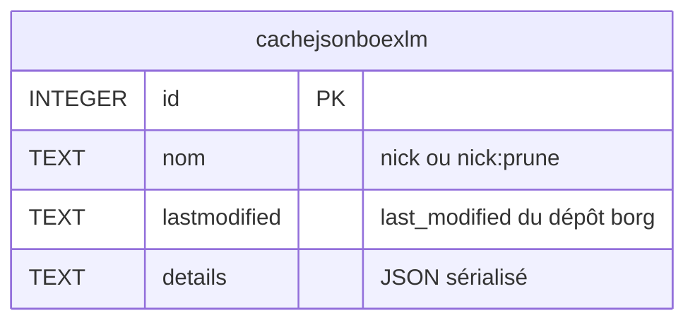
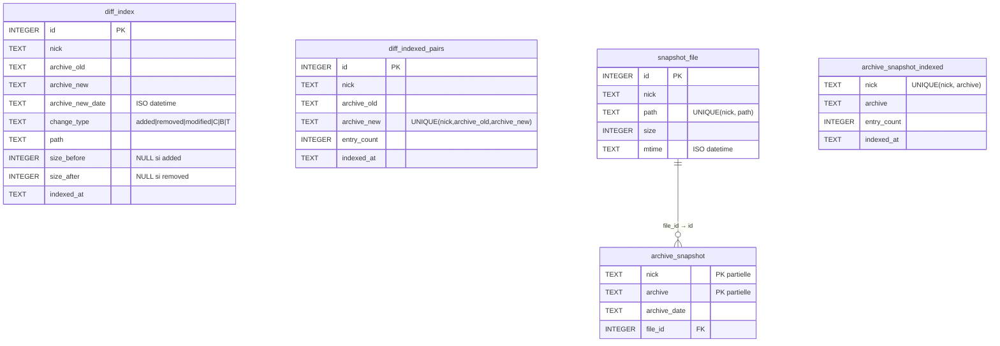

# borgHelper

Script Python 3 d'aide à la gestion des sauvegardes [BorgBackup](https://www.borgbackup.org/).  
Centralise la configuration de plusieurs dépôts/serveurs dans un fichier INI et expose des commandes haut niveau.

---

## Prérequis

- Python 3.8+
- `borg` dans le PATH
- `prettytable` (`pip install prettytable`) — requis pour `Report` et les commandes d'index

---

## Installation

```bash
cp borgHelper /usr/local/bin/borgHelper
chmod +x /usr/local/bin/borgHelper
```

---

## Fichier de configuration

Par défaut : `~/.borghelperrc`  
Surchargeable avec `-C /autre/chemin`.

Format INI — une section par dépôt enregistré :

```ini
[mon-serveur]
BORG_REPO        = user@repo01:/mnt/borg/mon-serveur
BORG_PASSPHRASE  = motdepasse-du-repo
SER_NAME         = mon-serveur.domaine.com
SER_LOGIN        = root
GLOB_ARCH        = mon-serveur-root-*
MOUNTPOINT       = /mnt/borg/mon-serveur

# Rétention (au moins une clef requise pour Prune)
KEEP_DAILY       = 7
KEEP_WEEKLY      = 4
KEEP_MONTHLY     = 6
KEEP_YEARLY      = 2

# Backup
EXCLUDE          = --exclude /proc --exclude /sys --exclude /dev --exclude /tmp --exclude /run
EXCLUDE_NEXT     = --exclude /var/cache          # exclusions complémentaires optionnelles
BORG_ARCHNAME    = root                          # partie centrale du nom d'archive
BORG_ROOTBKP     = /                             # répertoire racine sauvegardé

# Affichage rapport
MAX_AGE_BKP      = 25                            # alerte si dernière sauvegarde > N heures (défaut 25)
DISPLAY_BKP      = 5                             # nombre de sauvegardes affichées dans Report

# SSH avancé (backup distant)
SSH_REPO         = repo01:/mnt/borg/mon-serveur  # BORG_REPO côté serveur sauvegardé
SSH_REMFO        = 8022:localhost:22             # tunnel inverse SSH
SSH_KEY          = /root/.ssh/id_borg

# Identifiant SQLite (optionnel — surcharge le nick dans le nom des fichiers DB)
DB_NAME                  = mon-serveur-home   # → borghelperrc-mon-serveur-home-cache.db

# Désactiver l'indexation pour ce dépôt (Search/FileHist/DuIdx non disponibles)
NOIDX                    = 1

# Filtres d'indexation (chemins séparés par espaces, glob * et ? supportés)
IDX_INCLUDE              = /etc /home /root   # liste blanche — seuls ces chemins indexés
IDX_EXCLUDE              = /proc /sys /tmp /var/log  # liste noire — ces chemins ignorés

# Clef explicite (keyfile mode, utile si plusieurs nicks partagent le même dépôt)
BORG_KEY_FILE            = /root/.config/borg/keys/abcdef123456

# Borg divers
BORG_REMOTE_PATH            = borg1
BORG_RSH                    = ssh -p 2222
BORG_SHOW_SYSINFO           = no
BORG_RELOCATED_REPO_ACCESS_IS_OK = yes
```

Le nickname (nom de section) sert d'identifiant partout avec `-n`.

---

## Utilisation

```
borgHelper -c <commande> [options]
borgHelper -H <commande>    # aide détaillée d'une commande
borgHelper -h               # aide générale
borgHelper -v               # version
```

Options communes :

| Option | Description |
|--------|-------------|
| `-n <nickname>` | Dépôt cible (défaut : hostname) |
| `-n ALL` | Tous les dépôts du fichier de conf |
| `-d` | Mode debug (cumulable : `-dd`) |
| `-C <fichier>` | Fichier de conf alternatif |

---

## Commandes

### `Stats`
Affiche l'état de montage de chaque dépôt enregistré.

```bash
borgHelper -c Stats
borgHelper -c Stats -n mon-serveur
```

---

### `Login`
Enregistre un dépôt dans `~/.borghelperrc`. Importe optionnellement une clef borg.

```bash
borgHelper -c Login -n mon-serveur -s mon-serveur.domaine.com \
           -p motdepasse -r user@repo:/mnt/borg/srv
borgHelper -c Login -n mon-serveur -p motdepasse -r /mnt/borg/local -k /root/borg.key
```

| Option | Description |
|--------|-------------|
| `-n` | Nickname (section INI) |
| `-s` | Nom du serveur (SER_NAME) |
| `-p` | Passphrase |
| `-r` | Chemin du dépôt |
| `-m` | Mountpoint (défaut : `/mnt/borg/<nick>`) |
| `-k` | Fichier de clef à importer |

---

### `Bkp`
Lance une sauvegarde selon la configuration du dépôt.  
Par défaut, capture les fichiers modifiés pendant le backup (`--list`) et indexe automatiquement dans le SQLite (`diff_index` + snapshot).

```bash
borgHelper -c Bkp -n mon-serveur        # backup + indexation automatique
borgHelper -c Bkp -n mon-serveur -I     # backup seul, sans indexation
```

Nécessite : `EXCLUDE`, `SER_LOGIN`, `SER_NAME`.  
Code retour 0 si succès ou warnings, 2 si erreur borg.

> `-I` désactive `--list` et toute écriture SQLite — utile si l'indexation est gérée séparément via `Index`.

**Sortie stdout (JSON)** — si exit 0, le JSON borg est enrichi de deux clefs borgHelper :

```json
{
  "archive": {
    "name": "mon-serveur-root-2026-06-05T02:00:04",
    "start": "2026-06-05T02:00:04.000000",
    "duration": 42.3,
    "stats": { "nfiles": 183241, "original_size": 9871234560, "... ": "..." }
  },
  "cache": { "...": "..." },
  "borgHelper_messages": [
    "[INFO] Starting repository check",
    "[WARNING] /proc: [Errno 13] Permission denied"
  ],
  "borgHelper_file_counts": {
    "added": 12,
    "modified": 3,
    "removed": 1
  }
}
```

En mode debug (`-d`), `borgHelper_files` s'ajoute avec la liste complète des fichiers touchés :

```json
{
  "...": "...",
  "borgHelper_file_counts": { "added": 2, "modified": 1 },
  "borgHelper_files": [
    { "change_type": "added",    "path": "/etc/hosts",         "size_before": null, "size_after": null },
    { "change_type": "added",    "path": "/home/user/.bashrc", "size_before": null, "size_after": null },
    { "change_type": "modified", "path": "/var/log/syslog",    "size_before": null, "size_after": null }
  ]
}
```

---

### `Prune`
Supprime les anciennes archives selon les règles `KEEP_*`.  
**Opération destructive.**

```bash
borgHelper -c Prune -n mon-serveur
borgHelper -c Prune -n ALL
```

Requiert au moins une clef `KEEP_*` dans la conf.  
Enchaîne automatiquement `borg compact`, invalide le cache SQLite, et purge les entrées orphelines du `diff.db` (archives supprimées retirées de `diff_index`, `diff_indexed_pairs`, `snapshot_file` et `archive_snapshot`).

---

### `Report`
Rapport sur l'état des sauvegardes — texte (prettytable) ou HTML.

```bash
borgHelper -c Report -n mon-serveur
borgHelper -c Report -n ALL
borgHelper -c Report -n ALL -l              # sortie HTML
borgHelper -c Report -n mon-serveur -b 5   # afficher 5 dernières archives
borgHelper -c Report -n ALL -j             # sortie JSON
```

Code retour 1 si un dépôt dépasse `MAX_AGE_BKP` heures depuis la dernière sauvegarde.  
Code retour 2 si un dépôt est inaccessible (erreur borg).

Les données de rapport sont mises en cache par `last_modified` du dépôt (SQLite). Si le dépôt n'a pas changé depuis le dernier `Report`, un seul appel réseau est effectué (`borg info --json`) au lieu de trois.

En cas d'erreur sur un dépôt, le rapport continue avec les autres serveurs. Le dépôt en erreur apparaît en rouge (HTML) ou préfixé `*** ERREUR` (ASCII) avec le message d'erreur dans la colonne `reste`.

Colonnes résumé : nom, durée, depuis (heures), taille dernière, taille totale, récupérable, espace disque restant.

**Statistiques de mouvement** (si l'index SQLite est disponible) :
- **Tableau résumé** (1 ligne par serveur) : colonnes `+ajouté`, `-supprimé`, `=présent` du **dernier backup**
- **Tableau détail** (1 ligne par archive) : mêmes colonnes pour chaque backup listé
- Format : `N (P%) · SIZE` — nombre de fichiers, pourcentage relatif au backup précédent, et taille disque
- `—` si l'archive n'est pas encore indexée (`borgHelper -c Index -n <nick>` pour indexer)

**Sortie JSON** (`-j`) — structure :

```json
{
  "summary": {
    "mon-serveur": {
      "last_backup": "2026-06-05T02:00:04",
      "hours_since": 4.2,
      "total_size": 9871234560,
      "added": 12, "removed": 1, "modified": 3
    }
  },
  "backups": {
    "mon-serveur": [
      { "name": "mon-serveur-root-2026-06-05T02:00:04", "start": "...", "... ": "..." }
    ]
  }
}
```

---

### `LstBkp`
Liste les archives disponibles.

```bash
borgHelper -c LstBkp -n mon-serveur
```

---

### `LstBkpFls`
Liste les fichiers d'une archive.

```bash
borgHelper -c LstBkpFls -n mon-serveur
borgHelper -c LstBkpFls -n mon-serveur -b mon-serveur-root-2025-04-02T21:30:04
```

---

### `DiffBkp`
Différences entre deux archives (fichiers modifiés/ajoutés/supprimés).  
Repose sur `~/.borghelper-diff.db` — si la paire n'est pas encore indexée, le diff est calculé et stocké automatiquement.  
Affichage en tableau : colonnes type / chemin / taille avant / taille après.

```bash
borgHelper -c DiffBkp -n mon-serveur                          # 2 dernières archives
borgHelper -c DiffBkp -n mon-serveur -b archive-ancienne      # vs dernière
borgHelper -c DiffBkp -n mon-serveur -b archive-1,archive-2   # entre deux précises
```

> Pour des réponses instantanées, lancer `Index` après chaque `Bkp`.

---

### `Restore`
Restaure un fichier ou une arborescence depuis une archive.

```bash
borgHelper -c Restore -n mon-serveur -b archive-id \
           -f etc/nginx/nginx.conf -w /tmp/restauration
borgHelper -c Restore -n mon-serveur -f etc/nginx/nginx.conf \
           -w /tmp/restauration          # archive auto depuis SQLite
borgHelper -c Restore -n mon-serveur -f 'etc/nginx/*.conf' \
           -w /tmp/backup.tar            # glob → tar avec arborescence
borgHelper -c Restore -n mon-serveur -f 'home/user/*.log' \
           -W /tmp/logs.tgz             # glob → tgz plat (sans sous-répertoires)
borgHelper -c Restore -n mon-serveur -f home/user \
           -W /tmp/restauration         # répertoire plat
borgHelper -c Restore -n mon-serveur -f 'etc/nginx/*.conf' -L          # liste les droits
borgHelper -c Restore -n mon-serveur -f 'etc/nginx/*.conf' -L > droits.txt  # vers fichier texte
borgHelper -c Restore -n mon-serveur -f 'home/user' -w - | tar -tvf -  # tar vers stdout
borgHelper -c Restore -n mon-serveur -f 'home/user' -w - \
           | ssh autre "tar -xf - -C /restore"                          # pipe vers hôte distant
```

| Option | Description |
|--------|-------------|
| `-b` | Nom de l'archive — si absent : dernière archive SQLite contenant `-f` |
| `-f` | Chemin exact ou glob (`*`, `?`) — ex : `etc/nginx/*.conf` |
| `-w <dest>` | Restauration avec sous-répertoires (répertoire ou `.tar`/`.tgz`) |
| `-w -` | Tar non-compressé vers stdout (pipeable) |
| `-W <dest>` | Restauration plate — fichiers à la racine, sans sous-répertoires |
| `-W -` | Tar plat non-compressé vers stdout |
| `-L` | Affiche droits/propriétaires (format `ls -la`) sans restaurer — redirigeable vers un fichier texte |

Si la cible est un `.tar` : crée ou ajoute au fichier existant (append).  
Si la cible est un `.tgz` : crée uniquement — erreur (exit 3) si le fichier existe déjà (gzip ne supporte pas l'append).

**Droits d'origine préservés** : `borg extract` utilise `--numeric-owner` pour conserver uid/gid numériques ; `tarfile` capture ensuite `mode`, `uid`, `gid`, `mtime` depuis les fichiers extraits. Les droits d'origine sont donc présents dans le tar (quand borgHelper est lancé en root).

---

### `Mount` / `UMount`
Monte/démonte les archives via FUSE.  
**Le dépôt ne peut pas être sauvegardé tant qu'il est monté.**

```bash
borgHelper -c Mount -n mon-serveur               # toutes les archives (défaut)
borgHelper -c Mount -n mon-serveur -b last       # dernière archive uniquement
borgHelper -c Mount -n mon-serveur -b archive-id # archive précise
borgHelper -c UMount -n mon-serveur
```

Le répertoire `MOUNTPOINT` doit exister et être vide avant le montage.

---

### `Key`
Exporte la clef du dépôt en format papier (à stocker hors ligne).

```bash
borgHelper -c Key -n mon-serveur
borgHelper -c Key -n ALL
```

---

### `DelBkp`
Supprime une archive précise.  
**Opération destructive.** Invalide le cache automatiquement.

```bash
borgHelper -c DelBkp -n mon-serveur -b archive-id
```

---

### `Init`
Initialise un nouveau dépôt borg (chiffrement `repokey`).

```bash
borgHelper -c Init -n mon-serveur
```

---

### `Index`
Indexe les diffs entre archives consécutives dans `~/.borghelper-diff.db`.  
Incrémental : paires déjà traitées ignorées. Appelle automatiquement `IndexSnap` à la fin.  
À relancer après chaque `Bkp`.

```bash
borgHelper -c Index -n mon-serveur
borgHelper -c Index -n ALL
borgHelper -c Index -n mon-serveur -F   # force la réindexation même si déjà présent
```

`-F` : supprime et recalcule toutes les paires existantes (utile si des stats sont manquantes ou incohérentes).

Types d'événements stockés : `added`, `removed`, `modified`, `C` (permissions/proprio), `B` (lien cassé), `T` (type changé).

---

### `IndexSnap`
Indexe le listing complet de la dernière archive dans `~/.borghelper-diff.db`.  
Permet à `Search` et `FileHist` de trouver les fichiers stables (jamais modifiés, donc absents du diff index).  
Appelé automatiquement par `Index` — à lancer manuellement si les archives ont changé sans relancer `Index`.

```bash
borgHelper -c IndexSnap -n mon-serveur
borgHelper -c IndexSnap -n ALL
borgHelper -c IndexSnap -n mon-serveur -F   # force la réindexation du snapshot
```

`-F` : supprime le snapshot existant et le recalcule depuis borg.

---

### `Search`
Cherche par nom de fichier dans l'index des diffs **et** dans le snapshot de la dernière archive.  
Pattern libre (sous-chaîne) ou glob avec `*` et `?`.

```bash
borgHelper -c Search -f passwd -n mon-serveur         # sous-chaîne
borgHelper -c Search -f '*.conf' -n ALL               # glob
borgHelper -c Search -f '/etc/nginx*' -n mon-serveur  # préfixe
```

Colonnes : nick, date, archive, type, chemin, taille avant, taille après.  
Type `présent` : fichier stable dans le backup, sans historique de changement récent.  
Plage : `-b <archive>` (depuis X), `-B <archive>` (jusqu'à Y), `-b ALL` (tout), sans `-b`/`-B` (dernière paire).

---

### `FileHist`
Historique complet des changements pour un chemin **exact**, incluant la présence dans le snapshot.

```bash
borgHelper -c FileHist -f /etc/nginx/nginx.conf -n mon-serveur
borgHelper -c FileHist -f /var/lib/postgresql -n ALL
```

Colonnes : nick, date, archive avant, archive après, type, taille avant, taille après.  
Type `présent` : fichier trouvé dans le snapshot de la dernière archive (stable, non modifié récemment).

---

### `DuIdx`
Résumé `du -sh`-like depuis le SQLite : taille totale et nombre d'entrées par type de changement sur un pattern de chemin.

```bash
borgHelper -c DuIdx -n mon-serveur                         # résumé global par type
borgHelper -c DuIdx -f '*' -n mon-serveur                  # détail par répertoire racine
borgHelper -c DuIdx -f 'home/*' -n mon-serveur             # détail sous home/
borgHelper -c DuIdx -f '*.log' -n ALL                      # résumé global sur les .log
borgHelper -c DuIdx -f '*' -s présent:desc -n mon-serveur  # trié par taille présent desc
borgHelper -c DuIdx -f '*' -j -n mon-serveur               # sortie JSON
borgHelper -c DuIdx -f '*' -b ALL -n mon-serveur           # toutes les archives
borgHelper -c DuIdx -f '*' -b server-root-2026-01-01T02:00:00 -n mon-serveur  # depuis archive X
```

Sans `-f` ou avec pattern sans `/*` : résumé global (type / nb / taille totale).  
Avec `-f '*'` ou `-f 'path/*'` : vue pivotée par chemin — colonnes `added/modif` | `removed` | `présent`.  
Tri avec `-s <col>[:asc|desc]` — colonnes : `chemin`, `added`, `removed`, `present`.  
JSON avec `-j`.  
Plage d'archives : `-b <archive>` (depuis X), `-B <archive>` (jusqu'à Y), `-b ALL` (tout), sans `-b`/`-B` (dernière paire).

---

### `CacheInfo`
Affiche le contenu du cache SQLite (`~/.borghelper-cache.db`).

```bash
borgHelper -c CacheInfo
borgHelper -c CacheInfo -n mon-serveur
```

---

### `CacheClean`
Supprime les entrées périmées du cache en vérifiant le `last_modified` courant de chaque dépôt.  
Supprime aussi les entrées pour les nicks absents de la conf.

```bash
borgHelper -c CacheClean
borgHelper -c CacheClean -n mon-serveur
```

---

## Fichiers de données

| Fichier | Contenu |
|---------|---------|
| `~/.borghelperrc` | Configuration des dépôts (INI) |
| `~/.cache/borghelper/<conf>-<nick>-cache.db` | Cache des appels `borg info/list` (SQLite) |
| `~/.cache/borghelper/<conf>-<nick>-diff.db` | Index des diffs et snapshots d'archives (SQLite) |

`<conf>` = basename sanitisé du fichier de configuration (ex : `borghelperrc` pour `~/.borghelperrc`).  
`<nick>` = identifiant du dépôt (ou valeur de `DB_NAME` si définie dans la section) — un fichier par dépôt.

Le répertoire de stockage est configurable via la clé `CACHE_DIR` dans la section `[DEFAULT]` de `.borghelperrc` :

```ini
[DEFAULT]
CACHE_DIR = /data/borgcache
```

---

## Schéma relationnel des bases de données

### `cache.db`

Cache des résultats `borg info` / `borg list`, invalidé par `last_modified` du dépôt.  
Purge automatique après `DelBkp` et `Prune`. Nettoyage manuel : `CacheClean`.



Contrainte d'unicité : `UNIQUE(nom, lastmodified)`.

---

### `diff.db`

Index des diffs inter-archives et snapshots. Deux tables de sentinelle (`diff_indexed_pairs`, `archive_snapshot_indexed`) protègent l'idempotence des indexations.

`archive_snapshot` est une table mince qui référence `snapshot_file` par `file_id` — les chemins sont stockés une seule fois (déduplication). La vue `archive_snapshot_v` expose la jointure de façon transparente pour toutes les lectures.



**Vue** `archive_snapshot_v` : `archive_snapshot ⋈ snapshot_file` — utilisée par `Search`, `FileHist`, `DuIdx`, `Restore`.

**Indexes** :

| Table | Index | Colonnes | Requête cible |
|-------|-------|----------|---------------|
| `diff_index` | `idx_diff_nick_path` | `(nick, path)` | Search, FileHist |
| `diff_index` | `idx_diff_nick_archive` | `(nick, archive_new)` | DiffBkp, Report |
| `diff_index` | `idx_diff_nick_newtype` | `(nick, archive_new, change_type)` | stats Report |
| `diff_index` | `idx_diff_nick_date` | `(nick, archive_new_date)` | filtres plage `-b`/`-B` |
| `diff_indexed_pairs` | `idx_pairs_nick` | `(nick)` | suppressions Prune |
| `snapshot_file` | `idx_snapfile_nick_path` | `(nick, path)` | insertion / lookup |
| `archive_snapshot` | `idx_snap_nick_archive` | `(nick, archive)` | suppressions Prune |

---

## Sentry

Intégration optionnelle pour remonter les erreurs.  
DSN lu dans l'ordre :

1. Variable d'environnement `BORGHELPERC_SENTRY_DSN`
2. Fichier pointé par `BORGHELPERC_SENTRY_FILE`
3. Fichier `/usr/local/etc/borghelper-sentry`

---

## Codes retour

| Code | Signification |
|------|---------------|
| 0 | Succès |
| 1 | Avertissement (rapport : sauvegarde trop ancienne) |
| 2 | Erreur borg |
| 3 | État incohérent (déjà monté, serveur inconnu…) |

---

## Exemples de crontab

```cron
# Backup quotidien à 2h
0 2 * * *  borgHelper -c Bkp -n mon-serveur

# Index diff + snapshot après le backup (IndexSnap est appelé automatiquement par Index)
5 2 * * *  borgHelper -c Index -n mon-serveur

# Prune hebdomadaire le dimanche à 3h
0 3 * * 0  borgHelper -c Prune -n mon-serveur

# Rapport HTML envoyé par mail
30 6 * * *  borgHelper -c Report -n ALL -l | mail -s "Borg $(date +\%F)" admin@domaine.com
```
