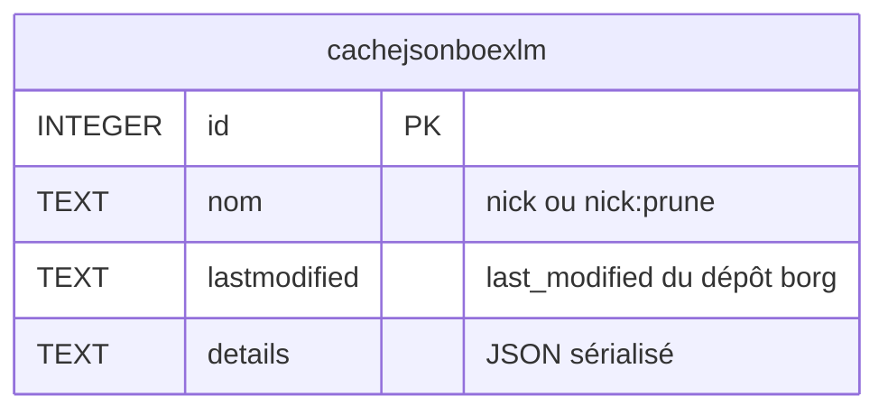
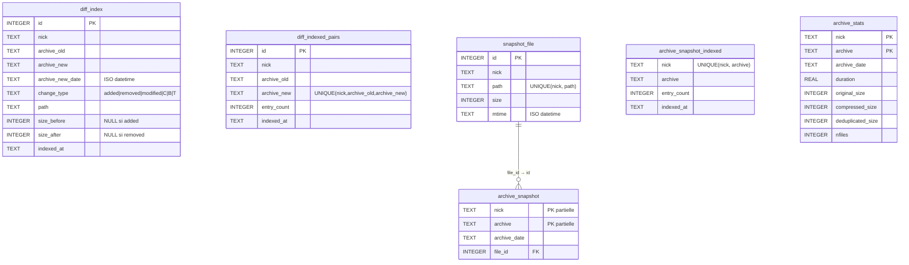

# borgHelper — Fonctionnement technique

Ce document décrit l'architecture interne de borgHelper : fichiers de données, schémas SQLite, indexes, et comportements internes.

→ Usage CLI : [README.md](README.md)  
→ Usage librairie : [LIBRARY.md](LIBRARY.md)

---

## Architecture

borgHelper est structuré en trois couches :

| Classe | Rôle |
|--------|------|
| `BorgHelperDB` | Toutes les opérations SQLite (cache.db + diff.db) |
| `BorgRunner` | Subprocess borg + lecture/écriture borghelperrc |
| `BorgHelper` | Services haut niveau — orchestre DB et Borg |

---

## Fichiers de données

| Fichier | Contenu |
|---------|---------|
| `~/.borghelperrc` | Configuration des dépôts (INI) |
| `~/.cache/borghelper/<conf>-<nick>-cache.db` | Cache des appels `borg info/list` (SQLite) |
| `~/.cache/borghelper/<conf>-<nick>-diff.db` | Index des diffs, snapshots et stats d'archives (SQLite) |

- `<conf>` = basename sanitisé du fichier de configuration (ex : `borghelperrc` pour `~/.borghelperrc`)
- `<nick>` = identifiant du dépôt (ou valeur de `DB_NAME` si définie dans la section) — un fichier par dépôt
- Répertoire configurable via `CACHE_DIR` dans la section `[DEFAULT]` du borghelperrc

---

## Base de données `cache.db`

Cache des résultats `borg info` et `borg prune --dry-run`, invalidé automatiquement par `last_modified` du dépôt.

- Purge automatique après `DelBkp` et `Prune`
- Nettoyage manuel : `CacheClean`
- Un seul appel `borg info` par commande grâce au cache partagé (`last_modified`)



Contrainte : `UNIQUE(nom, lastmodified)`.

**Entrées :**
- `nom = nick` → résultat de `borg info --json --glob-archives`
- `nom = nick:prune` → liste des archives à pruner (dry-run)

---

## Base de données `diff.db`

Index des diffs inter-archives, snapshots du dernier état, et métadonnées de taille par archive.

### Comportement WAL et auto-vacuum

- `PRAGMA journal_mode=WAL` : lectures non-bloquantes pendant les écritures (important pour les diff parallèles)
- `PRAGMA auto_vacuum=INCREMENTAL` : recupération progressive des pages supprimées
- `VACUUM` explicite après `Prune` pour récupérer l'espace immédiatement

### Tables

#### `diff_index`
Stocke chaque événement de fichier entre deux archives consécutives.

- Peuplée par `Index` (via `borg diff`) et par `Bkp` (via `--list`)
- `change_type` : `added`, `removed`, `modified`, `C` (permissions/proprio), `B` (lien cassé), `T` (type changé)
- `size_before` / `size_after` : `NULL` selon le type de changement

#### `diff_indexed_pairs`
Sentinelle d'idempotence pour les diffs — une ligne par paire (archive_old, archive_new) indexée.  
Empêche de ré-indexer une paire déjà traitée. Purge des lignes orphelines par `Prune`.

#### `snapshot_file`
Dictionnaire global des chemins de fichiers avec leur taille et mtime.  
Contrainte `UNIQUE(nick, path)` — le même chemin n'est stocké qu'une seule fois par nick (déduplication).

#### `archive_snapshot`
Table mince : associe une archive à ses fichiers via `file_id → snapshot_file.id`.  
Réduit la duplication des chaînes de chemin quand le même fichier apparaît dans plusieurs archives consécutives.

#### `archive_snapshot_indexed`
Sentinelle d'idempotence pour les snapshots — une ligne par archive dont le snapshot est complet.

#### `archive_stats`
Métadonnées de taille par archive (original, compressé, dédupliqué, nfiles, durée).  
Peuplée par `Bkp` (depuis le JSON borg) et par `Index` (via `borg info --json`).  
Utilisée par `Report -o` pour produire un rapport complet sans aucun appel borg.

### Vue `archive_snapshot_v`

```sql
CREATE VIEW archive_snapshot_v AS
    SELECT s.nick, s.archive, s.archive_date, sf.path, sf.size, sf.mtime
    FROM archive_snapshot s
    JOIN snapshot_file sf ON sf.id = s.file_id;
```

Utilisée par `Search`, `FileHist`, `DuIdx`, `Restore` — expose la jointure de façon transparente.

### Schéma complet



### Indexes

| Table | Index | Colonnes | Requête cible |
|-------|-------|----------|---------------|
| `diff_index` | `idx_diff_nick_path` | `(nick, path)` | Search, FileHist |
| `diff_index` | `idx_diff_nick_archive` | `(nick, archive_new)` | DiffBkp, Report |
| `diff_index` | `idx_diff_nick_newtype` | `(nick, archive_new, change_type)` | stats Report |
| `diff_index` | `idx_diff_nick_date` | `(nick, archive_new_date)` | filtres plage `-b`/`-B` |
| `diff_indexed_pairs` | `idx_pairs_nick` | `(nick)` | suppressions Prune |
| `snapshot_file` | `idx_snapfile_nick_path` | `(nick, path)` | insertion / lookup |
| `archive_snapshot` | `idx_snap_nick_archive` | `(nick, archive)` | suppressions Prune |
| `archive_stats` | `idx_astats_nick` | `(nick)` | Report -o, suppressions Prune |

---

## Flux d'indexation

### `Bkp` (indexation automatique)

```
borg create --list --filter AMCBTd
    ↓
stderr parsé → _bkp_parse_list() → entrées de type added/modified/removed/C/B/T
    ↓
store_diff_entries(nick, archive_old, archive_new, ...)  → diff_index + diff_indexed_pairs
store_archive_stats(nick, archive_new, ...)              → archive_stats
indexsnap(nick)                                          → snapshot_file + archive_snapshot
```

### `Index` (indexation manuelle, parallèle)

```
borg list --json
    ↓
Phase 1 : déterminer les paires manquantes (diff_indexed_pairs)
    ↓
Phase 2 : ThreadPoolExecutor(IDX_WORKERS) → borg diff par paire en parallèle
    ↓
Phase 3 : insert groupé (connexion SQLite unique) → diff_index + diff_indexed_pairs
    ↓
DIFF_KEEP : purge des paires au-delà de la limite
    ↓
borg info --json (seulement si archive_stats manquantes) → archive_stats
    ↓
indexsnap() → snapshot_file + archive_snapshot
```

---

## Gestion de la taille de `diff.db`

Pour les dépôts à fort volume (plusieurs GB de diff.db) :

| Levier | Paramètre | Effet |
|--------|-----------|-------|
| Purge automatique | `DIFF_KEEP = N` | Supprime les paires au-delà des N dernières après chaque Index |
| Filtre chemins | `IDX_INCLUDE` / `IDX_EXCLUDE` | Réduit le nombre d'entrées indexées |
| Vacuum post-prune | automatique | Récupère l'espace après suppression d'archives |
| Auto-vacuum | `PRAGMA auto_vacuum=INCREMENTAL` | Récupération progressive en continu |

---

## Migration de schéma

`ensure_diff_db()` détecte automatiquement l'ancien schéma de `archive_snapshot` (colonne `path` directe) et migre vers le schéma déduplication (`file_id → snapshot_file`) au premier lancement après mise à jour.

---

## Sentry

Intégration optionnelle pour remonter les erreurs.  
DSN lu dans l'ordre :

1. Variable d'environnement `BORGHELPERC_SENTRY_DSN`
2. Fichier pointé par `BORGHELPERC_SENTRY_FILE`
3. Fichier `/usr/local/etc/borghelper-sentry`
