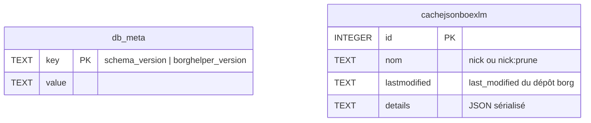
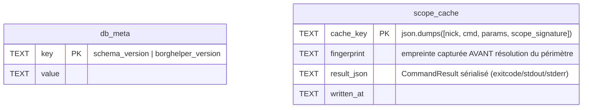

# borgHelper — Fonctionnement technique

Ce document décrit l'architecture interne de borgHelper : fichiers de données, schémas SQLite, indexes, et comportements internes.

→ Usage CLI : [README.md](README.md)  
→ Usage librairie : [LIBRARY.md](LIBRARY.md)

---

## Architecture

borgHelper est structuré en trois couches :

| Classe | Rôle |
|--------|------|
| `BorgHelperDB` | Toutes les opérations SQLite (cache.db + diff.db) |
| `BorgRunner` | Subprocess borg + lecture/écriture borghelperrc |
| `BorgHelper` | Services haut niveau — orchestre DB et Borg |

---

## Fichiers de données

| Fichier | Contenu |
|---------|---------|
| `~/.borghelperrc` | Configuration des dépôts (INI) |
| `~/.cache/borghelper/<conf>-<nick>-cache.db` | Cache des appels `borg info/list` (SQLite) |
| `~/.cache/borghelper/<conf>-<nick>-diff.db` | Index des diffs, snapshots et stats d'archives (SQLite) |
| `~/.cache/borghelper/<conf>-<repo_sanitisé>-priority.lock` | Lock PID posé par `Bkp`/`Restore` — signal d'interruption pour `Index` sur le même dépôt |
| `~/.cache/borghelper/<conf>-<repo_sanitisé>-index-running.lock` | Lock PID posé par `Index` pendant Phase 2 — `Bkp`/`Restore` attendent sa disparition avant `borg create`/`borg extract` |
| `~/.cache/borghelper/<conf>-<nick>-index-pending.lock` | Flag (vide) posé par `Index` quand interrompu par `Bkp`/`Restore` — `Bkp` le détecte en fin d'exécution et relance `Index` complet automatiquement |

- `<conf>` = basename sanitisé du fichier de configuration (ex : `borghelperrc` pour `~/.borghelperrc`)
- `<nick>` = identifiant du dépôt (ou valeur de `DB_NAME` si définie dans la section) — un fichier par dépôt
- Répertoire configurable via `CACHE_DIR` dans la section `[DEFAULT]` du borghelperrc

---

## Base de données `cache.db`

Cache des résultats `borg info` et `borg prune --dry-run`, invalidé automatiquement par `last_modified` du dépôt.

- Purge automatique après `DelBkp` et `Prune`
- Nettoyage manuel : `CacheClean`
- Un seul appel `borg info` par commande grâce au cache partagé (`last_modified`)



Contrainte : `UNIQUE(nom, lastmodified)`.

**Entrées :**
- `nom = nick` → résultat de `borg info --json --glob-archives`
- `nom = nick:prune` → liste des archives à pruner (dry-run)

---

## Base de données `diff.db`

Index des diffs inter-archives, snapshots du dernier état, métadonnées de taille et statistiques des fichiers exclus par les filtres d'indexation.

### Comportement WAL et auto-vacuum

- `PRAGMA journal_mode=WAL` : lectures non-bloquantes pendant les écritures (important pour les diff parallèles)
- `PRAGMA auto_vacuum=INCREMENTAL` : recupération progressive des pages supprimées
- `VACUUM` explicite après `Prune` pour récupérer l'espace immédiatement

### Tables

#### `db_meta`
Métadonnées de versionning du schéma — une ligne par clé.

| Clé | Valeur | Notes |
|-----|--------|-------|
| `schema_version` | entier (ex : `"1"`) | Incrémenté uniquement lors d'un changement de schéma |
| `borghelper_version` | chaîne (ex : `"1.0.41"`) | Écrite seulement si elle diffère de la valeur déjà stockée (Story 1.5, voir ci-dessous) |

Au démarrage : si `schema_version` stockée > constante attendue (`DIFF_DB_SCHEMA_VERSION` / `CACHE_DB_SCHEMA_VERSION`) → erreur + exit. Indique que la DB a été créée par une version plus récente incompatible.

**`_check_set_meta()` n'écrit `db_meta` que si la valeur change (Story 1.5)** : avant, les deux lignes
(`schema_version`, `borghelper_version`) étaient réécrites (`INSERT OR REPLACE`) à **chaque** ouverture
de la DB, même sans le moindre changement — chaque appel `borgHelper` étant un sous-processus distinct,
la fermeture de la connexion SQLite déclenche un checkpoint WAL qui avance la date de modification du
fichier `.db` **même pour un appel en lecture pure**. Désormais, chaque ligne n'est réécrite que si sa
valeur stockée diffère réellement de la nouvelle (la valeur est de toute façon déjà lue pour la
comparaison `stored>schema_version`, aucun coût supplémentaire). Un appel en lecture qui ne modifie
aucune donnée laisse maintenant `cache.db`/`diff.db` bit-pour-bit inchangés, y compris leur date de
modification — condition nécessaire (avec le correctif `ensure_diff_db()` ci-dessous) pour que le
cache SQLite par périmètre de `borgHelperWWW` (Story 1.5, voir README.md) puisse jamais produire un
hit : sa clé d'invalidation inclut ces dates de modification, capturées **avant** l'appel `borgHelper`.

#### `diff_index`
Stocke chaque événement de fichier entre deux archives consécutives.

- Peuplée par `Index` (via `borg diff`) et par `Bkp` (via `--list`)
- `change_type` : `added`, `removed`, `modified`, `C` (permissions/proprio), `B` (lien cassé), `T` (type changé)
- `size_before` / `size_after` : `NULL` selon le type de changement

**Source de vérité pour les chemins supprimés mais récupérables** (`TreeHist`/`TreeFind`, voir
Design Notes ci-dessous) : jamais `archive_snapshot_v`/`archive_snapshot`, purgées indépendamment
selon `IDX_SNAP_KEEP` (fenêtre glissante fixe, sans rapport avec l'existence réelle des archives),
alors qu'une ligne `diff_index` survivante référence toujours une archive encore restaurable
(`_cleanup_index_after_prune` ne la purge qu'au prune réel de l'archive référencée). Détection d'un
chemin « supprimé » : son événement `diff_index` le PLUS RÉCENT (`archive_new_date`/`id` max) a
`change_type='removed'` — un chemin réajouté depuis n'est jamais marqué. `size_before IS NULL` sur
la ligne de suppression sert d'heuristique `is_dir` (`diff_index` n'a pas de colonne de type ; `borg
diff` n'inclut pas de taille pour une entrée répertoire, voir `parse_diff_line_json()`) — limitation
connue : `borg diff` n'inclut pas non plus de taille pour un lien symbolique, donc un lien symbolique
supprimé est actuellement classé `répertoire`/`is_dir=true` par erreur (genre affiché `répertoire` au
lieu du vrai type). `genre` d'une entrée supprimée est toujours `fichier`/`répertoire` selon cette
heuristique, jamais le type réel détaillé (fifo/socket/périphérique) faute de colonne `type` dans
`diff_index`. Coût : la requête `TreeFind` sur les chemins supprimés n'est bornée par aucun préfixe
littéral à la racine (motif `%`) — elle balaie alors tout l'historique `diff_index` du nick ; acceptable
tant que ce n'est pas mesuré comme un problème réel (feature récente, pas encore observée en pratique
sur un historique volumineux).

#### `diff_indexed_pairs`
Sentinelle d'idempotence pour les diffs — une ligne par paire (archive_old, archive_new) indexée.  
Empêche de ré-indexer une paire déjà traitée. Purge des lignes orphelines par `Prune`.

#### `snapshot_file`
Dictionnaire global des chemins de fichiers avec leur taille, mtime, type, droits et propriétaire.  
Contrainte `UNIQUE(nick, path)` — le même chemin n'est stocké qu'une seule fois par nick (déduplication).  
`type` : code borg (`{type}` de `borg list --format`) — `d` répertoire, `-` fichier, `l` lien symbolique,
`p` fifo, `s` socket, `b`/`c` périphérique bloc/caractère.  
`mode` : droits unix ls-style (`{mode}` de `borg list --format`, ex. `drwxr-xr-x`) — dernier état connu.  
`owner` : propriétaire construit depuis `{user}:{group} ({uid}:{gid})` de `borg list --format` (ex.
`root:root (0:0)`) — dernier état connu.  
`NULL` pour les lignes écrites avant l'ajout de ces colonnes (migrations `ALTER TABLE` automatiques dans
`ensure_diff_db()`, ré-indexer pour peupler). Utilisées par `TreeHist` pour les colonnes « genre »/« droits »/« propriétaire ».

#### `archive_snapshot`
Table mince : associe une archive à ses fichiers via `file_id → snapshot_file.id`.  
Réduit la duplication des chaînes de chemin quand le même fichier apparaît dans plusieurs archives consécutives.

#### `archive_snapshot_indexed`
Sentinelle d'idempotence pour les snapshots — une ligne par archive dont le snapshot est complet.

#### `archive_stats`
Métadonnées de taille par archive (original, compressé, dédupliqué, nfiles, durée).  
Peuplée par `Bkp` (depuis le JSON borg) et par `Index` (via `borg info --json`).  
Utilisée par `Report -o` pour produire un rapport complet sans aucun appel borg.

#### `diff_excluded_stats`
Agrégat des fichiers filtrés par `IDX_INCLUDE`/`IDX_EXCLUDE` lors de l'indexation des diffs.  
Une ligne par (nick, archive_old, archive_new, change_type) : `file_count` + `total_size`.  
Peuplée par `Index` et `Bkp` (taille non disponible pour `Bkp` car `--list` ne retourne pas les tailles).  
Permet de savoir combien de fichiers ont été intentionnellement exclus de l'index et quelle taille ils représentent.

#### `snap_excluded_stats`
Agrégat des fichiers filtrés lors de l'indexation du snapshot de la dernière archive.  
Une ligne par (nick, archive) : `file_count` + `total_size`.  
Peuplée par `IndexSnap` (`-S`) et en fin d'`Index` normal.

#### `repo_stats`
Statistiques globales du dépôt borg (niveau cache, pas par archive).  
Une ligne par nick : `unique_csize` (taille dédupliquée totale du dépôt), `total_size`, `total_csize`, `updated_at`.  
Peuplée par `Bkp` depuis `cache.stats` du JSON `borg create --json`. `borg prune` ne supporte pas `--json` (borg 1.2.x), donc non mis à jour après `Prune`.  
Utilisée par `Report -o` pour alimenter la colonne `taille` sans appel borg.

### Vue `archive_snapshot_v`

```sql
CREATE VIEW archive_snapshot_v AS
    SELECT s.nick, s.archive, s.archive_date, sf.path, sf.size, sf.mtime, sf.type, sf.mode, sf.owner
    FROM archive_snapshot s
    JOIN snapshot_file sf ON sf.id = s.file_id;
```

Utilisée par `Search`, `FileHist`, `DuIdx`, `Restore` — expose la jointure de façon transparente.

**Recréation conditionnelle, pas systématique (Story 1.5)** : `ensure_diff_db()` exécutait avant
`DROP VIEW IF EXISTS archive_snapshot_v` + `CREATE VIEW archive_snapshot_v AS ...`
**inconditionnellement**, à chaque appel — un DDL qui, comme les écritures `db_meta` ci-dessus, avance
la date de modification de `diff.db` même sans le moindre changement de données. Désormais, ce bloc ne
s'exécute que si la vue n'existe pas déjà (`SELECT name FROM sqlite_master WHERE type='view' AND
name='archive_snapshot_v'` — un simple contrôle d'existence, jamais une comparaison textuelle du SQL
stocké, qui serait fragile face au reformatage propre de SQLite). Une future évolution du `SELECT` de
cette vue devra passer par une migration explicite gated sur `DIFF_DB_SCHEMA_VERSION` (voir
[Migration de schéma](#migration-de-schéma) ci-dessous), comme `_migrate_archive_snapshot` — ce
correctif ne réduit donc pas la garantie d'auto-réparation existante, il l'aligne sur la convention de
migration versionnée déjà suivie par le reste du schéma. Ce correctif est le second des deux
nécessaires (avec `_check_set_meta()` ci-dessus) pour que le cache SQLite par périmètre de
`borgHelperWWW` (Story 1.5) puisse produire un hit en pratique.

### Schéma complet

```mermaid
erDiagram
    db_meta {
        TEXT key PK "schema_version | borghelper_version"
        TEXT value
    }

    diff_index {
        INTEGER id PK
        TEXT nick
        TEXT archive_old
        TEXT archive_new
        TEXT archive_new_date "ISO datetime"
        TEXT change_type "added|removed|modified|C|B|T"
        TEXT path
        INTEGER size_before "NULL si added"
        INTEGER size_after "NULL si removed"
        TEXT indexed_at
    }

    diff_indexed_pairs {
        INTEGER id PK
        TEXT nick
        TEXT archive_old
        TEXT archive_new "UNIQUE(nick,archive_old,archive_new)"
        INTEGER entry_count
        TEXT indexed_at
    }

    snapshot_file {
        INTEGER id PK
        TEXT nick
        TEXT path "UNIQUE(nick, path)"
        INTEGER size
        TEXT mtime "ISO datetime"
        TEXT type "code borg d/-/l/p/s/b/c, NULL si non réindexé"
        TEXT mode "ls-style ex. drwxr-xr-x, NULL si non réindexé"
        TEXT owner "user:group (uid:gid), NULL si non réindexé"
    }

    archive_snapshot {
        TEXT nick "PK partielle"
        TEXT archive "PK partielle"
        TEXT archive_date
        INTEGER file_id FK
    }

    archive_snapshot_indexed {
        TEXT nick "UNIQUE(nick, archive)"
        TEXT archive
        INTEGER entry_count
        TEXT indexed_at
    }

    archive_stats {
        TEXT nick PK
        TEXT archive PK
        TEXT archive_date
        REAL duration
        INTEGER original_size
        INTEGER compressed_size
        INTEGER deduplicated_size
        INTEGER nfiles
    }

    diff_excluded_stats {
        TEXT nick PK
        TEXT archive_old PK
        TEXT archive_new PK
        TEXT change_type PK
        INTEGER file_count
        INTEGER total_size
    }

    snap_excluded_stats {
        TEXT nick PK
        TEXT archive PK
        INTEGER file_count
        INTEGER total_size
    }

    snapshot_file ||--o{ archive_snapshot : "file_id → id"
```



### Indexes

| Table | Index | Colonnes | Requête cible |
|-------|-------|----------|---------------|
| `diff_index` | `idx_diff_nick_path` | `(nick, path)` | Search, FileHist |
| `diff_index` | `idx_diff_nick_archive` | `(nick, archive_new)` | DiffBkp, Report |
| `diff_index` | `idx_diff_nick_newtype` | `(nick, archive_new, change_type)` | stats Report |
| `diff_index` | `idx_diff_nick_date` | `(nick, archive_new_date)` | filtres plage `-b`/`-B` |
| `diff_indexed_pairs` | `idx_pairs_nick` | `(nick)` | suppressions Prune |
| `snapshot_file` | `idx_snapfile_nick_path` | `(nick, path)` | insertion / lookup |
| `archive_snapshot` | `idx_snap_nick_archive` | `(nick, archive)` | suppressions Prune |
| `archive_stats` | `idx_astats_nick` | `(nick)` | Report -o, suppressions Prune |
| `diff_excluded_stats` | `idx_exclu_nick_arch` | `(nick, archive_new)` | consultation stats exclus |

---

## Flux d'indexation

### `Bkp` (indexation automatique)

```
set_priority_lock(nick)                                  → <nick>-priority.lock (PID)
    ↓
borg create --list --filter AMCBTd
    ↓
stderr parsé → _bkp_parse_list() → entrées de type added/modified/removed/C/B/T
    ↓
filtre IDX_INCLUDE/IDX_EXCLUDE par fichier (en RAM)
    ├── inclus  → store_diff_entries()       → diff_index + diff_indexed_pairs
    └── exclus  → store_excluded_diff_stats() → diff_excluded_stats (count seul, taille = 0)
store_archive_stats(nick, archive_new, ...)              → archive_stats
indexsnap(nick)                                          → voir flux IndexSnap ci-dessous
    ↓
clear_priority_lock(nick)                                → priority.lock supprimé (Bkp terminé)
    ↓
index(nick, target_archive=archive_new, set_pending=False) → borg diff pour remplir les tailles
    ↓
si index-pending.lock présent → clear + index(nick, set_pending=False)  ← reprise Index externe interrompu
    ↓
finally: clear_priority_lock(nick)                       → no-op (déjà supprimé)
```

### `Index` (indexation manuelle, parallèle)

```
borg list --json
    ↓
Phase 1 : déterminer les paires manquantes (diff_indexed_pairs)
          si force : purge diff_index + diff_indexed_pairs + diff_excluded_stats
    ↓
Phase 2 : ThreadPoolExecutor(IDX_WORKERS) → borg diff par paire en parallèle
          pour chaque ligne : filtre IDX_INCLUDE/IDX_EXCLUDE
          compteurs exclus accumulés en RAM jusqu'à fin du diff
    ↓
Phase 3 : insert groupé (connexion SQLite unique)
          → diff_index + diff_indexed_pairs
          → diff_excluded_stats (count + total_size par change_type)
    ↓
DIFF_KEEP : purge des paires au-delà de la limite
    ↓
borg info --json (seulement si archive_stats manquantes) → archive_stats
    ↓
indexsnap() → voir flux IndexSnap ci-dessous
```

### `IndexSnap` (snapshot de la dernière archive)

```
Tentative incrémentale (_indexsnap_incremental) — sauf si -F :
    ├── cherche snapshot précédent + diff_indexed_pairs pour la paire prev→new
    ├── si introuvable ou diff absent → fallback borg list complet
    ├── charge diffs (diff_index) : added / removed / modified
    ├── si > 5 000 ajouts → fallback borg list complet
    ├── clone archive_snapshot prev → new (INSERT OR IGNORE)
    ├── removed → DELETE archive_snapshot + _cleanup_snapshot_file_orphans
    ├── modified → UPDATE snapshot_file.size (mtime conservé)
    ├── added   → borg list --format '{size} {isomtime} {path}{NL}' ::<archive> [paths]
    │             → INSERT OR REPLACE snapshot_file + archive_snapshot
    └── INSERT archive_snapshot_indexed ; commit
    Affichage : "(+N -N ~N, incrémental)"

Fallback borg list complet (si force, ou si incrémental échoue) :
    borg list --format '{size} {isomtime} {path}{NL}' ::<archive>
        ↓
    filtre IDX_INCLUDE/IDX_EXCLUDE
        ├── inclus → snapshot_file + archive_snapshot + archive_snapshot_indexed
        └── exclus → snap_excluded_stats
        ↓
    INSERT archive_snapshot_indexed

Purge auto des snapshots anciens :
    _snapurge_check / _snapurge_exec → supprime archives au-delà de IDX_SNAP_KEEP
    IDX_SNAP_KEEP = config, ou sum(KEEP_*), ou 10
    Erreur non bloquante ([WARN])
```

---

## Gestion de la taille de `diff.db`

Pour les dépôts à fort volume (plusieurs GB de diff.db) :

| Levier | Paramètre | Effet |
|--------|-----------|-------|
| Purge automatique diffs | `DIFF_KEEP = N` | Supprime les paires au-delà des N dernières après chaque Index |
| Purge automatique snapshots | `IDX_SNAP_KEEP = N` | Conserve N snapshots max ; purge en fin d'IndexSnap et d'IdxPurge. Défaut : sum(KEEP_*) ou 10 |
| Filtre chemins | `IDX_INCLUDE` / `IDX_EXCLUDE` | Réduit le nombre d'entrées indexées ; stats des exclus dans `diff_excluded_stats` / `snap_excluded_stats` |
| IndexSnap incrémental | automatique | Applique les diffs SQL + `borg list` ciblé sur `added` — évite le `borg list` complet à chaque indexation |
| Vacuum post-prune | automatique | Récupère l'espace après suppression d'archives |
| Auto-vacuum | `PRAGMA auto_vacuum=INCREMENTAL` | Récupération progressive en continu |

---

## Filtres d'indexation : IDX_INCLUDE / IDX_EXCLUDE

### Syntaxe multi-valeurs

Plusieurs patterns sur une ligne séparés par espaces, ou multiligne avec indentation (syntaxe INI standard — continuation par leading whitespace) :

```ini
# Ligne unique
IDX_EXCLUDE = /tmp /proc /sys *.pyc *.o

# Multiligne (indentation obligatoire pour la continuation)
IDX_EXCLUDE = /tmp /proc /sys
    /var/lib/docker
    /home/*/.cache/*
    *.pyc *.o *.log *.bak
```

### Types de patterns

| Syntaxe | Exemple | Mécanisme |
|---------|---------|-----------|
| Préfixe plain | `/home/`, `/etc` | `path.startswith(pattern)` — tout chemin commençant par ce préfixe |
| Pattern glob | `*.bak`, `/home/*/.bash_history` | `fnmatch(path, pattern)` — `*` matche toute séquence **y compris** `/` |

Distinction automatique : présence de `*`, `?` ou `[` → fnmatch ; sinon startswith.

> `fnmatch` traite `*` comme "n'importe quelle séquence **incluant** `/`". `/home/*/.bash_history` matche `/home/user/.bash_history` ET `/home/user/subdir/.bash_history`.
>
> Ce comportement permet les patterns **depth-independent** : `*/.git/*` matche `/projet/.git/HEAD` ET `/srv/app/sous/repo/.git/objects/ab/cd` — quelle que soit la profondeur dans l'arborescence.

### Logique de filtrage

```
Un chemin est indexé si :
    (IDX_INCLUDE absent  OU  chemin matche au moins un INCLUDE)
 ET (IDX_EXCLUDE absent  OU  chemin ne matche aucun EXCLUDE)
```

Les deux clés sont cumulatives — INCLUDE whitelist d'abord, EXCLUDE blacklist ensuite.

### Exemples complets

```ini
# Indexer seulement /etc et /home, sauf les caches et fichiers temporaires
IDX_INCLUDE = /etc /home /root
IDX_EXCLUDE = /home/*/.cache /home/*/.local/share/Trash
    *.pyc *.o *.log *.bak *.tmp *.swp

# Dépôt système : tout sauf les arbo volatiles
IDX_EXCLUDE = /proc /sys /dev /run /tmp
    /var/lib/docker /var/lib/lxc
    /var/log /var/cache
    *.pyc *.o

# Patterns depth-independent : exclure les .git/ à n'importe quelle profondeur
# */.git/*  → tous les fichiers dans n'importe quel .git/
# */.git    → le répertoire .git lui-même s'il apparaît comme entrée
IDX_EXCLUDE = */.git/* */.git
    */__pycache__/* */.tox/*
    */node_modules/*
```

---

## Priorité Bkp/Restore sur Index

`Bkp` et `Restore` sont prioritaires sur `Index` à tout moment — quelle que soit l'étape en cours.

### Mécanisme — lock PID

Le lock est keyed sur `BORG_REPO` (sanitisé), pas sur le nick. Tous les nicks pointant le même dépôt borg partagent donc le même fichier de lock — `Bkp` sur `nick-A` interrompt `Index` sur `nick-B` si `BORG_REPO` identique.

```
Bkp / Restore démarre
    ↓
set_priority_lock(nick)    → <repo>-priority.lock (PID)  ← signal à Index de s'arrêter
    ↓
wait_index_idle(nick)      → poll 1s jusqu'à 120s
    ├── <repo>-index-running.lock absent / PID mort → continue
    └── PID vivant → attente... (Index en cours de s'arrêter)
    ↓
opération borg (create / extract)   ← plus de conflit de verrou borg
    ↓
finally: clear_priority_lock(nick)  → supprime priority.lock
```

```
Index — démarrage
    ↓
check_priority_lock(nick)
    ├── True (Bkp/Restore déjà actif) → set_index_pending_lock() + annulation immédiate
    └── False → continue
    ↓
set_index_running_lock(nick)  → <repo>-index-running.lock (PID)
    ↓
ThreadPoolExecutor — borg diff en parallèle (Popen direct, running_procs dict)
    thread moniteur daemon (_priority_monitor) — poll 0.5 s
    ├── priority lock absent  → continue à surveiller
    └── priority lock détecté → interrupted_event.set()
                                 cancel() futures en attente
                                 ps.kill() (SIGKILL) sur chaque Popen actif
                                 poll running_procs jusqu'à vide (zombies reapés, PIDs disparus)
                                 borg break-lock <BORG_REPO> → supprime les stale lock files
    as_completed() collecte les résultats (CancelledError ignoré)
    ↓
finally: interrupted_event.set() → arrête le moniteur
         monitor.join(timeout=2)
         clear_index_running_lock(nick)  → <repo>-index-running.lock supprimé
         ← Bkp/Restore débloqué ici (wait_index_idle retourne)
    ↓
si interrupted_event.is_set() → set_index_pending_lock() + return 1
                                 ← borg info et indexsnap sont sautés
```

### Reprise automatique après Bkp

Quand `Index` est interrompu (early-exit ou mid-run), `index-pending.lock` est posé. `Bkp` le détecte en fin d'exécution (après son `index` ciblé) et relance automatiquement un `Index` complet (`set_pending=False` pour éviter toute boucle récursive).

`Index` est incrémental : `diff_indexed_pairs` garde la sentinelle de chaque paire indexée. La reprise saute les paires déjà traitées et n'indexe que les suivantes.

---

## Gestion du volume de `diff_index`

### Diagnostic : `IdxTop`

`IdxTop` parcourt `diff_index` en streaming (batch 50 000 lignes) et regroupe les entrées par préfixe de répertoire en Python. Aucun `GROUP BY` en SQL — la profondeur configurable (-p) permet de voir à n'importe quel niveau d'arborescence.

```
IdxTop -n nick [-N top] [-p profondeur]
    ↓
stream diff_index WHERE nick=?  (fetchmany 50000)
    ↓
get_prefix(path, depth)
    chemin absolu   : '/var/lib/docker/overlay2/abc/diff/usr/...' → depth=3 → '/var/lib/docker'
    chemin relatif  : 'home/_Dockers/example/data/file.gz'        → depth=3 → 'home/_Dockers/example'
    chemin court    : '/etc/nginx/nginx.conf'                      → depth=3 → '/etc/nginx/nginx.conf' (inchangé)
    ↓
defaultdict accumule count + sum(size) par préfixe
    ↓
top N par count (nombre d'entrées, pas le poids) → prettytable
```


### Diagnostic par diff : `DiffTop`

`DiffTop` est comme `IdxTop` mais ciblé sur une seule paire d'archives plutôt que l'ensemble du `diff_index`. Utile pour savoir quelle arborescence a provoqué le plus de changements lors d'un backup précis.

```
DiffTop -n nick [-N top] [-p profondeur] [-b archive-old,archive-new]
    ↓
sans -b : dernière paire de diff_indexed_pairs (ORDER BY indexed_at DESC)
    ↓
stream diff_index WHERE nick=? AND archive_old=? AND archive_new=?  (fetchmany 50000)
    ↓
get_prefix(path, depth)  — même logique que IdxTop
    ↓
defaultdict accumule par préfixe :
    added_n / added_s (size_after)
    removed_n / removed_s (size_before)
    modified_n
    total = added_n + removed_n + modified_n
    ↓
top N par total → prettytable (colonnes : total, +nb, +taille, -nb, -taille, =nb, taille)
```

### Nettoyage rétroactif : `IdxPurge`

Supprime en masse les entrées `diff_index` correspondant à un préfixe ou un glob, puis recalcule `diff_indexed_pairs.entry_count` et compacte le fichier.

```
IdxPurge [-x <pattern>] -n nick [-D]
    ↓
sans -x : lit IDX_EXCLUDE/IDX_INCLUDE du borghelperrc → construit condition SQL
avec -x : pattern explicite (préfixe ou glob)
    ↓
COUNT + SUM sur diff_index (dry-run ou confirmation)
    si -D → affiche volume, s'arrête
    ↓
DELETE FROM diff_index WHERE nick=? AND (path=? OR path LIKE ?/%)   # préfixe
DELETE FROM diff_index WHERE nick=? AND path GLOB ?                  # glob
    ↓
UPDATE diff_indexed_pairs SET entry_count = (SELECT COUNT(*) ...)    # recalcul
    ↓
VACUUM INTO 'diff.db.vacuum_tmp'  (même répertoire → évite /tmp saturé)
os.replace('diff.db.vacuum_tmp', 'diff.db')
    └── si échec : entrées supprimées, message avec commande manuelle
```

**Pourquoi `VACUUM INTO` et pas `VACUUM` ?** `VACUUM` écrit son fichier temporaire dans `/tmp`, qui peut être sur une partition séparée et pleine même si le filesystem du `diff.db` a de l'espace. `VACUUM INTO chemin` crée la copie compacte dans le même répertoire, utilisant l'espace libre du bon filesystem.

**Préfixe vs glob :**
- Préfixe (pas de `*?[`) : `path = ? OR path LIKE préfixe/%` — correspondance exacte de répertoire, sans faux positifs
- Glob (`*?[` présents) : SQLite `GLOB` — `*` matche tout y compris `/`

**Modes de `IdxPurge` :**

| Invocation | Comportement |
|------------|--------------|
| `IdxPurge -x <pattern>` | Purge un pattern explicite (préfixe ou glob) |
| `IdxPurge` (sans `-x`) | Lit `IDX_EXCLUDE`/`IDX_INCLUDE` du borghelperrc, construit la condition SQL dynamiquement, purge tout ce qui serait exclu par les filtres actuels |

Sans `-x`, la condition SQL est construite à partir de tous les patterns de la config :
```
IDX_EXCLUDE seul  → DELETE WHERE nick=? AND (p1 OR p2 OR ...)
IDX_INCLUDE seul  → DELETE WHERE nick=? AND NOT (p1 OR p2 OR ...)
Les deux          → DELETE WHERE nick=? AND (NOT (includes) OR (excludes))
```

**Purge snapshots intégrée :** en fin d'opération (même s'il n'y avait rien à purger dans `diff_index`), `IdxPurge` appelle `_snapurge_check`/`_snapurge_exec` et supprime les snapshots (`archive_snapshot` + `archive_snapshot_indexed` + `snap_excluded_stats`) dont l'archive dépasse `IDX_SNAP_KEEP`. Un seul commit SQLite et un seul VACUUM pour les deux opérations.

**Workflow recommandé :**
```
IdxTop → identifier → modifier IDX_EXCLUDE dans borghelperrc → IdxPurge (sans -x)
```
`IDX_EXCLUDE` empêche les futures indexations d'ingérer ces chemins ; `IdxPurge` purge l'historique déjà en base.

---

## SQLite verrouillé pendant l'indexation

Si `Index` ou `Bkp` tente d'écrire dans `diff.db` alors qu'un autre processus (backup ou restauration sur le même dépôt) tient un verrou SQLite, l'opération attend automatiquement au lieu d'échouer.

```
store_diff_entries / store_archive_stats / store_archive_snapshot
_diff_keep_purge / store_excluded_diff_stats / store_excluded_snap_stats
    ↓
_with_lock_retry(fn, max_wait=300)
    ├── fn() réussit → retour immédiat
    └── OperationalError "database is locked"
            → message "SQLite verrouillé — attente déverrouillage (max 300s)..."  (une seule fois)
            → sleep 2 s → retry fn()
            → ... jusqu'à max_wait secondes
            └── si toujours bloqué après 300 s → re-raise → erreur normale
```

- Chaque tentative ouvre et ferme sa propre connexion (`try/finally conn.close()`) — aucune fuite de connexion entre deux essais
- La valeur `max_wait=300` couvre les backups longs sans attendre indéfiniment

## Report sur dépôt occupé

Si `Report` est lancé pendant un `Bkp`, `Restore` ou `Index`, borgHelper détecte le lock actif et bascule automatiquement en mode base uniquement pour ce nick.

```
Report démarre pour nick N
    ↓
check_priority_lock(N) || check_index_running(N)
    ├── False → prep_report() normal (appels borg)
    └── True  → message "dépôt occupé — rapport depuis la base uniquement"
                 prep_report_from_db() :
                   archive_stats → tailles, durées, dates
                   diff_index    → statistiques +/-/=
                 champs borg-only (taille/unique_csize, récupérable, reste) → vides
```

Chaque nick est évalué indépendamment — un rapport multi-nick peut mixer des données online et offline.

---

## Chiffrement des bases — fondations (1.0.100)

Règle : le code métier ne manipule que des chemins logiques, seul le chemin stocké entre en SQL, et le mode d'une base
(`plain`/`siv1`) est dicté par son `enc_header`, jamais par la config.

**Rien n'est chiffré dans cette version** : toute base reste `plain`, aucun `enc_header` n'est créé en production, et
`DB_ENCRYPT` (défaut activé) n'a aucun effet à l'exécution tant que `DbEncrypt` n'existe pas. La KEK sera dérivée de
`BORG_PASSPHRASE` : une fois le chiffrement en place, changer la passphrase borg exigera un `DbRekey`.

- **`_open_db(db_path, nick=None, role='read', passphrase=None, **kw)`** : seul point d'ouverture SQLite
  (`grep -c 'sqlite3.connect(' borgHelper` = 1). Crée le fichier en `0600` (`os.open`, pas d'`umask`) s'il n'existe
  pas, renvoie une `BhConnection` (`.codec`, `.mode`, `.role`, `.nick`). Si `nick` est fourni et la base non vide, lit
  `db_meta.enc_header` : absent → `plain` ; présent → `path_enc` doit être `siv1`/`migrating` (sinon `DbTamperError`),
  passphrase (argument, sinon config du nick via le lecteur enregistré par `BorgHelperDB` pour son répertoire de cache) → DEK (`DbKeyError` si absente
  ou fausse), mémorisée par processus/base. `nick=None` : jamais de codec (`scopecache.db`, `_vacuum_db` sans nick).
  Les créateurs de base (`ensure_*_db`, `ensure_scope_cache_db`) interceptent `sqlite3.OperationalError` et appellent
  `_db_open_fail` (diagnostic + `sys.exit(1)`, remplace l'ancien `BorgHelperDB._db_connect`, supprimé).
- **`PathCodec`** : chemin normalisé (sans `/` initial/final, segments non vides, UTF-8 `surrogateescape`), par segment
  `tag[i]=HMAC-SHA256(k_path, tag[i-1]‖seg[i])[:12]`, stocké `b64(tag ‖ seg ⊕ SHAKE-256(k_enc‖tag))`, segments joints
  par `/`. b64 sans padding, `+`→`.`, `/`→`-`. Décodage séquentiel strict (tag recalculé, forme canonique, longueur ≢ 1
  mod 4) → `DbCodecError`. `prefix_bounds(prefix)` → `(enc+'/', enc+'0')`.
- **`BlobCodec`** : nonce 16 o, keystream `SHAKE-256`, chiffrer puis `HMAC-SHA256` (clés dérivées de `k_blob`).
- **Enveloppe** : DEK 32 o aléatoire, KEK = KDF(passphrase, sel 16 o) ; `DB_KDF` `light` = PBKDF2 100 000,
  `standard` = scrypt n=2^14, `strong` = scrypt n=2^15 (repli PBKDF2 300 000 / 600 000 sans `hashlib.scrypt`) ;
  paramètres réels stockés dans l'en-tête. Sous-clés `k_path`, `k_enc`, `k_blob`, `k_hdr` = `HMAC(DEK, étiquette)`.
- **`enc_header`** : une ligne JSON `db_meta`, `INSERT … ON CONFLICT DO NOTHING` dans `BEGIN IMMEDIATE` (jamais
  `INSERT OR REPLACE`). Aucun chemin de production n'en crée encore.
- **Permissions** : rc `0600` à la création (`cfgwrite`), avertissement unique à la lecture si groupe/autres y ont accès,
  cache `0700`, `.db` `0600` ; l'existant n'est jamais chmodé.
- **Config** : `db_encrypt_enabled(nick)` (`DB_ENCRYPT`, défaut vrai) et `db_kdf_level(nick)` (`DB_KDF`).

---

## Migration de schéma

### Versionning (`db_meta`)

Chaque DB (`cache.db`, `diff.db`) contient une table `db_meta (key TEXT PK, value TEXT)` avec deux entrées permanentes :

- `schema_version` : entier correspondant aux constantes `DIFF_DB_SCHEMA_VERSION` / `CACHE_DB_SCHEMA_VERSION` du script
- `borghelper_version` : version de borgHelper qui a ouvert la DB en dernier

À chaque ouverture (`ensure_diff_db` / `ensure_cache_db`) :
1. Si `schema_version` DB > constante attendue → erreur + exit (DB d'une version future)
2. Sinon → mise à jour de `borghelper_version` et confirmation de `schema_version`

Depuis 1.0.100 il y a deux notions distinctes : la version **maximale comprise** (constantes `*_SCHEMA_VERSION`,
refus si la base est plus récente) et la version **de base écrite** dans une base `plain`
(`*_BASE_SCHEMA_VERSION`, inchangée). `_check_set_meta(conn, max, db_path, base)` refuse `stored > max`, remonte une
base plus ancienne à `base` et ne réécrit jamais une base `plain` à `max` : un ancien binaire continue de l'ouvrir.
Seule la future `DbEncrypt` écrira `max`, ce qui exclut les anciens binaires des seules bases chiffrées.

La `schema_version` ne change **pas** à chaque release — seulement lors d'un changement structurel du schéma (ajout/suppression de colonne, nouvelle table, etc.).

| Constante | Valeur actuelle |
|-----------|-----------------|
| `DIFF_DB_SCHEMA_VERSION` (maximale comprise) | `5` (base écrite : `DIFF_DB_BASE_SCHEMA_VERSION` = `4`) |
| `CACHE_DB_SCHEMA_VERSION` (maximale comprise) | `2` (base écrite : `CACHE_DB_BASE_SCHEMA_VERSION` = `1`) |
| `SCOPE_CACHE_DB_SCHEMA_VERSION` (borgHelperWWW, maximale comprise) | `2` (base écrite : `SCOPE_CACHE_DB_BASE_SCHEMA_VERSION` = `1`) |

### Migrations diff.db — table de correspondance version ↔ action

Chaque palier de `DIFF_DB_SCHEMA_VERSION` correspond à une ou plusieurs migrations, **auto-détectées par
introspection** (`PRAGMA table_info`, pas seulement par comparaison de `schema_version` — donc rejouables
sans risque même après une migration partielle ou un `schema_version` désynchronisé) et appliquées par
`ensure_diff_db()` avant toute autre opération :

| Version | Migration | Détection | Détail |
|---------|-----------|-----------|--------|
| 1 | — (schéma initial) | — | `diff_index`, `snapshot_file`, `archive_snapshot`, `archive_stats`, ... |
| 2 | Déduplication `archive_snapshot` | colonne `path` présente sur `archive_snapshot` | `_migrate_archive_snapshot()` : colonne `path` directe → `file_id → snapshot_file` |
| 2 | `snapshot_file.type` | colonne `type` absente sur `snapshot_file` | `ALTER TABLE snapshot_file ADD COLUMN type TEXT` — alimente la colonne « genre » de `TreeHist` |
| 3 | `snapshot_file.mode` | colonne `mode` absente sur `snapshot_file` | `ALTER TABLE snapshot_file ADD COLUMN mode TEXT` — droits unix ls-style (`{mode}` de `borg list`), colonne « droits » de `TreeHist` |
| 4 | `snapshot_file.owner` | colonne `owner` absente sur `snapshot_file` | `ALTER TABLE snapshot_file ADD COLUMN owner TEXT` — `{user}:{group} ({uid}:{gid})` de `borg list`, colonne « propriétaire » de `TreeHist` |

`ensure_diff_db()` est désormais garanti appelé (donc les migrations garanties appliquées) avant tout
accès à `diff.db`/`cache.db` depuis **Bkp**, **Index**, **Prune** et tous les autres consommateurs —
`prune()` ne passait par aucun `ensure_*_db()` avant 1.0.90, ce qui pouvait laisser `_cleanup_index_after_prune()`
et `clear_cache_nick()` opérer sur un schéma non migré.

Les lignes `snapshot_file` déjà écrites avant les migrations 2/3/4 gardent `type`/`mode`/`owner` à `NULL` jusqu'à
réindexation du snapshot — `indexsnap()` s'auto-répare au besoin (voir CHANGELOG 1.0.89/1.0.92/1.0.93) : un
`type IS NULL OR mode IS NULL OR owner IS NULL` détecté force un resnapshot complet une fois, sans
intervention manuelle.

---

## Sentry

Intégration optionnelle pour remonter les erreurs.  
DSN lu dans l'ordre :

1. Variable d'environnement `BORGHELPERC_SENTRY_DSN`
2. Fichier pointé par `BORGHELPERC_SENTRY_FILE`
3. Fichier `/usr/local/etc/borghelper-sentry`

`sentry_sdk.init()` est appelé avec `auto_enabling_integrations=False` : évite la découverte
automatique d'intégrations tierces (boto3, frameworks web, etc.) qui coûte ~100-180ms à elle seule
sur chaque invocation CLI, sans rapport avec cet outil. Les intégrations par défaut (`excepthook`,
`logging`, `dedupe`, `atexit`, `modules`, `argv`, `stdlib`, `threading`) restent actives — la capture
des exceptions non gérées n'est pas affectée. **Ne jamais ajouter `default_integrations=False`** à
côté : ça désactive aussi `excepthook`, qui est l'unique mécanisme de capture ici (`borgHelper`
n'appelle jamais `capture_exception()` explicitement).

---

## borgHelperWWW — résolution de la configuration (`BORGHELPERWWW_CONF`)

Trois couches, appliquées dans cet ordre (la première présente pour une clé donnée l'emporte, sans
écraser une couche déjà appliquée) :

1. **Options CLI** (`if __name__=='__main__':` — exécution directe uniquement) : chaque option
   fournie écrit directement la variable d'environnement `BORGHELPERWWW_*` correspondante
   (`os.environ[...]=...`), *avant* que quoi que ce soit d'autre ne s'exécute.
2. **Variables d'environnement déjà présentes** (positionnées par le shell/systemd avant le
   lancement du processus) : jamais écrasées par les couches suivantes.
3. **Fichier de conf** (`BORGHELPERWWW_CONF`, ini, section `[borgHelperWWW]` ou clés en `[DEFAULT]`) :
   lu par un bloc de code au niveau module (donc exécuté aussi bien en exécution directe que sous
   `uvicorn borgHelperWWW:app`, puisqu'il ne dépend que d'une variable d'environnement, pas de
   `sys.argv`). Pour chaque clé de `_CONF_KEYS` (`cfgfile`, `api_key`, `borghelper_bin`, `ui_file`,
   `timeout`, `host`, `port`, `trusted_proxies`), n'écrit `os.environ[BORGHELPERWWW_X]` que si cette
   variable n'existe **pas encore** — donc uniquement pour combler ce que les couches 1 et 2 n'ont pas
   déjà fourni.

Après ces trois couches, la résolution finale (`BORGHELPER_BIN=Path(os.environ.get(...))`,
`CFGFILE=os.environ.get(...)`, etc.) relit simplement `os.environ`, inchangée depuis avant
l'introduction du fichier de conf — la couche 3 n'est qu'un pré-remplissage de l'environnement, jamais
consultée directement par la suite du code.

`--host`/`--port`/`--trusted-proxies` (et leurs équivalents fichier de conf `host`/`port`/
`trusted_proxies`) ne sont consommés que par le bloc `uvicorn.run()` en exécution directe — sans effet
sous `uvicorn borgHelperWWW:app` externe (voir section suivante).

---

## borgHelperWWW — IP client réelle derrière un reverse proxy (`FORWARDED_ALLOW_IPS`)

`borgHelperWWW` se lance de deux façons, chacune avec sa propre mécanique pour faire remonter l'IP
client réelle (`X-Forwarded-For`) dans les logs d'accès et `Request.client.host` plutôt que l'IP TCP
brute du reverse proxy :

### Exécution directe (`python3 borgHelperWWW ...`)

Le code appelle explicitement `uvicorn.run(app, ..., proxy_headers=True, forwarded_allow_ips=...)` —
`forwarded_allow_ips` vient de `os.environ.get('BORGHELPERWWW_TRUSTED_PROXIES', '127.0.0.1')`, lui-même
alimenté par l'option CLI `--trusted-proxies` (voir README.md, section « Derrière un reverse proxy »).
Ce chemin ne lit **pas** la variable `FORWARDED_ALLOW_IPS` native d'uvicorn — c'est
`BORGHELPERWWW_TRUSTED_PROXIES` qui fait foi ici, propre au projet, pour rester cohérent avec le
préfixe `BORGHELPERWWW_*` des autres réglages (`BORGHELPERWWW_HOST`, `BORGHELPERWWW_PORT`, etc.).

### Lancement externe (`uvicorn borgHelperWWW:app ...`)

Ici, uvicorn possède seul `sys.argv` et son propre cycle de vie — le code Python de `borgHelperWWW`
n'a plus la main sur la construction du serveur, donc `BORGHELPERWWW_TRUSTED_PROXIES` est **sans
effet**. C'est le mécanisme natif d'uvicorn qui s'applique directement :

- `proxy_headers` : **activé par défaut** dans uvicorn (`Config.__init__`, paramètre
  `proxy_headers: bool = True`) — pas besoin de le passer explicitement, mais l'option CLI
  `--proxy-headers` / `--no-proxy-headers` permet de l'activer/désactiver explicitement.
- `forwarded_allow_ips` : résolu ainsi par uvicorn (`uvicorn/config.py`, `Config.__init__`) —
  ```python
  if forwarded_allow_ips is None:
      self.forwarded_allow_ips = os.environ.get("FORWARDED_ALLOW_IPS", "127.0.0.1")
  else:
      self.forwarded_allow_ips = forwarded_allow_ips
  ```
  Donc, par ordre de priorité : l'option CLI `--forwarded-allow-ips <ip/cidr[,ip/cidr...]|*>` si
  fournie, sinon la variable d'environnement **native** `FORWARDED_ALLOW_IPS` (sans préfixe
  `BORGHELPERWWW_`), sinon `127.0.0.1` par défaut — le même défaut que le chemin d'exécution directe,
  ce qui rend le comportement identique dans les deux modes de lancement **sans configuration
  supplémentaire** tant que le reverse proxy tourne sur la même machine (le cas le plus courant).
- La connexion TCP brute doit elle-même provenir d'une IP listée dans `forwarded_allow_ips` pour que
  son `X-Forwarded-For` soit pris en compte — sinon l'IP de connexion réelle est conservée telle
  quelle (protection contre l'usurpation d'IP par un client qui forgerait ce header lui-même).

Exemple, reverse proxy sur un hôte distinct :
```bash
export FORWARDED_ALLOW_IPS=10.0.0.5
uvicorn borgHelperWWW:app --host 0.0.0.0 --port 8000 --workers 2
# ou, équivalent, sans variable d'environnement :
uvicorn borgHelperWWW:app --host 0.0.0.0 --port 8000 --workers 2 --forwarded-allow-ips 10.0.0.5
```

---

## borgHelperWWW — préfixe des routes API (`APIRouter`, tiers bootstrap)

Toutes les routes métier (`/stats`, `/lstbkp`, `/download/file`, etc.) sont déclarées avec
`@router.get(...)`/`@router.post(...)`/`@router.delete(...)` sur un `APIRouter()` créé juste après
`app=FastAPI(...)`, puis montées en une seule fois en fin de fichier :

```python
app.include_router(router, prefix=API_PREFIX)
```

`API_PREFIX` (résolu depuis `BORGHELPERWWW_API_PREFIX`, défaut `/api`) est normalisé au moment de sa
résolution — `.rstrip('/')` puis ajout d'un `/` de tête si non vide — de sorte qu'une valeur `/`
devient `''` (aucun préfixe) et qu'une valeur `/api/` devient `/api` : Starlette/FastAPI exigent que
`prefix` soit soit vide, soit commence par `/` et ne se termine jamais par `/` (`include_router` lève
sinon une `AssertionError` au démarrage).

**Trois routes restent déclarées directement sur `app`** (`@app.get(...)`, jamais sur le routeur) —
`/`, `/version`, `/healthz` — délibérément, pour rester **joignables sans connaître `API_PREFIX` à
l'avance** : c'est le problème d'amorçage (bootstrap) résolu ainsi — la page web (`/`) est chargée en
premier, son JavaScript interroge immédiatement `GET /version` (toujours à la racine, jamais préfixé)
qui lui répond notamment `api_prefix`, valeur que le client stocke (`API_PREFIX` côté JS) et préfixe
lui-même à tous ses appels ultérieurs (`apiCall()`, `downloadViaFetch()`) vers le reste de l'API.
`/healthz` reste aussi hors préfixe : un superviseur/orchestrateur (Kubernetes, systemd…) a une sonde
de liveness configurée une fois pour toutes à un chemin fixe, sans notion d'API métier versionnée.
`/docs` et `/openapi.json` (natifs FastAPI, non déclarés dans ce fichier) restent eux aussi à leur
emplacement par défaut — ils listent automatiquement les routes du routeur avec leur préfixe effectif,
sans configuration supplémentaire.

---

## borgHelperWWW — autorisation par groupes (`_check_group_access`)

Appliquée à **toutes** les routes du routeur via `router=APIRouter(dependencies=[Depends(_check_group_access)])`
— une seule déclaration couvre les 26 routes métier, sans toucher à leur signature individuelle
(contrairement à `require_api_key`/`require_destructive_allowed`/`require_downloads_allowed`, appelés
explicitement dans le corps de chaque fonction). `_check_group_access(request: Request)` prend
directement l'objet `Request` de Starlette plutôt que des paramètres typés — c'est ce qui permet à une
seule fonction de s'appliquer uniformément à des endpoints aux signatures très différentes (`nick`
simple, `nick` + `bid`, `nickname`/`servername` pour `Login`…) sans dupliquer la logique.

**No-op immédiat si `GROUPS_HEADER` est `None`** (réglage absent — cas par défaut) : aucune requête
n'est jamais impactée tant que l'administrateur n'a pas explicitement fourni un nom de header.

**Résolution du chemin** : `request.url.path` inclut déjà `API_PREFIX` (Starlette l'a appliqué au
moment du montage via `include_router`) — `_check_group_access` le retranche
(`path[len(API_PREFIX):]`) pour retrouver la clé de `_ROUTE_LEVELS` telle que déclarée sur le routeur
(`/lstbkp`, pas `/api/lstbkp`).

**`_ROUTE_LEVELS`** (dict `route → 1|2|3`) classe chaque route en lecture/écriture/admin ; vérifié
au chargement par un script (routes réellement enregistrées sur `router.routes` comparées aux clés du
dict) pour garantir qu'aucune route n'est oubliée (une route absente du dict serait, par construction,
`required=None → 3`, donc refusée par défaut plutôt que silencieusement laissée passer — mais ne
devrait de toute façon jamais se produire, toutes les routes réelles étant couvertes).

**`_effective_level(user_groups, cfg)`** : `cfg` est la `SectionProxy` retournée par
`BorgRunner.cfgread(nick)` (repli natif sur `[DEFAULT]`, comme n'importe quelle autre clef
`.borghelperrc`) ou le dict `ConfigParser().defaults()` brut (cas `Login` sur un nick inexistant —
pas de section à lire, seule une politique globale `[DEFAULT]` a un sens). Parcourt les niveaux du
plus élevé au plus bas (`GROUPS_ADMIN` puis `GROUPS_WRITE` puis `GROUPS_READ`) et retourne le premier
qui intersecte les groupes de l'utilisateur — implémente directement la hiérarchie admin ⊇ écriture ⊇
lecture sans avoir à dupliquer les noms de groupes dans les trois clefs.

**`_nick_list(nick_param)`** : `'ALL'` ou vide → `_bh_paths.borg.cfgreadnicks()` (tous les nicks
connus) ; sinon `split(',')`. Réutilisé par `_check_group_access` pour vérifier **chacun** des nicks
d'une requête multi-nick (`nick=ALL` ou `nick=a,b,c`) — *fail-closed* : la première insuffisance
rencontrée interrompt la boucle et rejette toute la requête (`403`), jamais de filtrage silencieux
d'une partie de la liste (le sous-processus `borgHelper` reçoit de toute façon la liste complète des
nicks en un seul appel — un filtrage a posteriori du résultat texte/JSON par commande ne serait pas
fiable).

**Cas `Login`** traité en premier dans `_check_group_access`, avant la consultation de
`_ROUTE_LEVELS` : le nick visé (`nickname` si fourni, sinon `servername`, comme la logique CLI/WWW
existante) peut ne pas encore exister — `cfgread` renvoie alors `None`, et le repli se fait sur
`_default_section_groups()` (lecture brute de `[DEFAULT]` depuis `CFGFILE`, indépendamment de
`_bh_paths`) plutôt que d'échouer.

### Périmètre de chemin par groupe (`GROUPS_PATHS`, Story 1.1)

Raffinement **orthogonal** au tier ci-dessus : réduit l'intérieur d'un tier déjà accordé, ne
l'étend jamais et n'en remplace aucune logique — `_check_group_access`/`_effective_level` restent
inchangés. Trois fonctions, dans l'ordre d'appel :

**`_parse_groups_paths(raw)`** : parse la valeur brute `GROUPS_PATHS` (`'groupe:/a|/b,
groupe2:/c'`) en `{groupe: [chemins...]}`. `:` sépare groupe et chemin(s), `|` sépare plusieurs
chemins pour un même groupe, `,` sépare les groupes (`_GP_RESERVED_CHARS`). Lève `ValueError` si
un nom de groupe ou un chemin contient l'un de ces trois caractères — **jamais** un résultat
silencieusement mal découpé. Limite connue et acceptée : si une valeur mal formée contient une
virgule/deux-points/pipe au point que les deux moitiés issues d'un split naïf ressemblent
*chacune* à une entrée `groupe:/chemin` valide, l'erreur peut être manquée (pas de syntaxe
d'échappement — décidé au niveau de `ARCHITECTURE-SPINE.md`, Deferred) ; cas jugé improbable pour
des noms de groupes/chemins réellement choisis par un administrateur.

**`_canonicalize_scope(prefixes)`** : dédoublonne, retire le `/` final, élimine tout préfixe déjà
sous-chemin d'un préfixe plus large gardé. Trie d'abord (`sorted()`) — pour deux chaînes où l'une
est un préfixe de chemin de l'autre, la plus courte trie toujours avant en ordre lexicographique,
ce qui garantit qu'un ancêtre est toujours ajouté à `kept` avant ses descendants. **Racine `/`** :
gérée par une sortie anticipée (`if '/' in cleaned: return ['/']`) plutôt que dans la boucle
générale — `p.startswith(kept+'/')` deviendrait `p.startswith('//')` pour `kept=='/'`, qu'aucun
chemin absolu ne commence jamais par `//`, donc la racine n'absorbait rien (bug trouvé en revue
d'implémentation, iteration 1 : `_canonicalize_scope(['/', '/var/www'])` renvoyait
`['/', '/var/www']` au lieu de `['/']`).

**`_resolve_path_scope(user_groups, cfg)`** : miroir direct de `_effective_level` mais pour le
périmètre — même signature, même provenance de `cfg` (`cfgread(nick)`, repli `[DEFAULT]` natif),
strictement par nick. « Groupes correspondants » = `user_groups ∩ (GROUPS_ADMIN ∪ GROUPS_WRITE ∪
GROUPS_READ)` de ce nick — un groupe de l'appelant qui n'a aucun tier sur ce nick n'a aucune
influence sur son périmètre. Si l'un des groupes correspondants est absent de `GROUPS_PATHS`,
retourne `None` (illimité) immédiatement, quels que soient les autres ; sinon retourne l'union
canonicalisée des préfixes de tous les groupes correspondants scopés.

⚠️ **`None` est ambigu — deux situations distinctes y mènent** : (1) l'appelant n'a **aucun tier**
sur ce nick (`matching` vide, retour anticipé avant même d'appeler `_parse_groups_paths` — la
question du périmètre n'a alors aucun sens, l'accès est déjà refusé ailleurs par le tier), et
(2) l'appelant a un tier **et** un périmètre réellement illimité. Sans risque aujourd'hui dans
`access()` (le `None` y est toujours appairé à `level`, qui gouverne déjà l'accès effectif), mais
tout appelant futur qui réutiliserait `_resolve_path_scope` directement — le filtrage a posteriori
des stories 1.3/1.4, prévu pour la réutiliser telle quelle — **doit vérifier le tier de l'appelant
sur ce nick séparément avant d'interpréter un `None` comme « laisser tout passer »** ; l'ignorer
accorderait par erreur un accès illimité à un appelant sans aucun droit sur le nick.

⚠️ **Un nom de groupe mal orthographié dans `GROUPS_PATHS` résout silencieusement en périmètre
illimité pour le vrai groupe** — conséquence directe, pas un bug, du choix déjà approuvé
« absence de `GROUPS_PATHS` = illimité » (AD-3/AD-4) : si `GROUPS_READ` contient `web-team` mais
que `GROUPS_PATHS` contient une entrée pour `web-tema` (faute de frappe), `_resolve_path_scope`
ne trouve `web-team` scopé nulle part et lui accorde un périmètre illimité, sans avertissement —
exactement comme un groupe qu'on aurait simplement oublié d'ajouter à `GROUPS_PATHS`. Même limite
déjà acceptée aujourd'hui pour un nom mal orthographié dans `GROUPS_ADMIN/WRITE/READ` eux-mêmes
(silencieusement inerte) ; pas de vérification d'existence/cohérence entre les quatre clefs.

⚠️ **Fail-loud à chaque lecture, pas seulement au démarrage — mais uniquement pour un appelant
qui détient déjà un tier sur le nick concerné** — décision explicite (option C du Spec Change Log
de spec-1-1) : `BorgRunner.cfgread()` relit `.borghelperrc` depuis le disque à **chaque** appel
(pas de cache config), donc un opérateur qui édite `GROUPS_PATHS` vers une valeur ambiguë
**pendant que le process tourne** doit voir le prochain appel qui résout un périmètre pour ce nick
échouer bruyamment — *pour un appelant ayant un tier sur ce nick seulement* : le court-circuit
`if not matching: return None` fait qu'un appelant sans aucun tier sur ce nick n'appelle jamais
`_parse_groups_paths` et ne voit donc jamais cette erreur (il reçoit `scope:null` normalement).
`_validate_groups_paths_startup()` (appelée une fois à l'import, juste après l'instanciation de
`_bh_paths`) reste une **courtoisie** — fail-fast pour le cas courant, attrapé avant tout trafic —
mais **n'est pas le seul point d'application** : ni elle ni aucun appelant futur de
`_resolve_path_scope`/`_parse_groups_paths` (le filtrage a posteriori des stories 1.3/1.4) ne
doivent envelopper cet appel dans un `try/except` qui avalerait le `ValueError` — il doit remonter
tel quel en `500` non catché. C'est la seule route du projet où le contrat habituel « `exitcode !=
0` ⇒ 400, sinon 200 » (voir plus bas) ne s'applique pas : une config invalide en cours d'exécution
produit un `500` FastAPI standard (exception non gérée), pas un `CommandResult` avec `exitcode`.

### Filtrage a posteriori par périmètre — Search/FileHist/LstBkpFls/DiffBkp/TreeHist/TreeFind (Story 1.3)

Applique le périmètre résolu par Story 1.1 (`_resolve_path_scope`) aux six commandes de lecture qui
renvoient des chemins ou des listes indexées par chemin — pas `DuIdx`/`IdxTop`/`DiffTop` (agrégats,
mécanisme distinct, voir Story 1.4 plus bas : recalcul de totaux/top-N, pas un simple retrait de
lignes), pas `Restore`/téléchargements (garde pré-appel, epic séparé). Mécanisme choisi (voir
`ARCHITECTURE-SPINE.md`, AD-2) : **filtrage a posteriori**, jamais un filtrage côté `borgHelper`
lui-même (qui reste totalement ignorant du RBAC) — `borgHelperWWW` appelle `borgHelper` normalement
(avec `-j` forcé en interne dès qu'un périmètre s'applique), reçoit le JSON, retire les lignes hors
périmètre, ré-sérialise.

**`_path_in_scope(path, scope)`** : la fonction de comparaison partagée (AD-7 — un chemin `P` est
dans le périmètre `S` ssi `P==S` ou `P.startswith(S+'/')`, jamais une comparaison de sous-chaîne
brute), mirroir de la logique déjà utilisée par `_canonicalize_scope`. `scope=None` (illimité) ->
toujours `True` ; sinon parcourt chaque préfixe canonicalisé.

⚠️ **Bug trouvé en investigation d'implémentation (avant tout déploiement), pas en revue
adversariale** : `GROUPS_PATHS` s'écrit avec un `/` initial (convention Story 1.1, ex.
`ops-readers:/lib/modules/6.8.0-generic`), mais les chemins que `borgHelper` stocke réellement
(`archive_snapshot_v`/`diff_index`, vérifié contre un dépôt réel `demo.borghelperrc`) n'en ont
**jamais** — `borg create /lib/modules` archive des chemins `lib/modules/...`. Sans normalisation,
`path.startswith(prefix+'/')` échoue toujours (`'lib/modules/x'.startswith('/lib/modules'+'/')` est
`False`), et **tout** appelant scopé obtient un résultat vide, pour **tout** nick — fail-closed
(jamais une fuite), mais un vrai bug fonctionnel qui serait passé inaperçu sans un test contre des
chemins stockés réels. `_path_in_scope` retire le `/` initial de chaque préfixe de `scope`, **et
aussi** de `path` lui-même (`path=(path or '').lstrip('/')`) — nécessaire depuis Story 2.1, dont les
routes (`ftor`/`path`/`prefix`, saisie utilisateur) reçoivent des chemins qui, contrairement aux
chemins stockés par `borgHelper` des Stories 1.3/1.4, portent bien un `/` initial.

**`_resolve_scopes_for_request(request, nicks)`** : résout `{nick: scope|None}` pour une liste de
nicks et l'appelant HTTP courant, via `_resolve_path_scope` par nick (jamais une résolution
fusionnée). Court-circuite en `{n:None for n in nicks}` sans toucher `.borghelperrc` si
`GROUPS_HEADER` est désactivé (chemin rapide, comportement inchangé). N'est appelée que depuis le
corps d'un endpoint du routeur, donc **après** `_check_group_access` (dépendance) — le tier requis
sur chaque nick de `nicks` est déjà garanti à ce stade, ce qui lève l'ambiguïté documentée du `None`
de `_resolve_path_scope` (voir plus haut) : ici, un `None` ne peut plus signifier « aucun tier », il
signifie toujours « périmètre illimité ».

**`_any_scoped(scopes)`** : `True` si au moins un nick de `scopes` porte un périmètre non-`None`.
Décide à la fois (1) de forcer `-j` + le filtrage, et (2) de forcer la réponse en JSON même sans
`?json=` — une requête multi-nick ne peut pas mélanger texte et JSON dans un seul corps HTTP
(`CommandResult.stdout` est une chaîne unique), donc **un seul** nick scopé force tout le corps ; les
nicks non scopés de la même requête restent présents dans le JSON, simplement non filtrés.

**Exécution** : `_exec_borghelper()` (sous-processus brut, factorisé hors de `run_borghelper()`) et
`_run_scoped()` (Story 1.3, jamais de passage par `_RESPONSE_CACHE`) — ajoute `-j` aux `extra_args`
si absent, parse `stdout`, applique une fonction `_filter_*`, ré-sérialise (`json.dumps(...,
ensure_ascii=False, indent=2)`, même formatage que `borgHelper` lui-même). `exitcode!=0` : relayé
tel quel, rien à filtrer (pas de tentative de parser un message d'erreur texte comme du JSON).

**Fonctions `_filter_*`** (une par forme de JSON, jamais une seule fonction générique — les six
commandes ont des formes différentes, voir Design Notes du spec 1.3 pour le détail champ par champ) :

| Fonction | Commande(s) | Forme filtrée |
|---|---|---|
| `_filter_per_nick_list` | Search | `{nick: [{...,'path':...}]}` — filtre chaque ligne sur `path` |
| `_filter_filehist` | FileHist | `{nick: [{...}]}` — **pas** de champ `path` par ligne (implicite : c'est le paramètre `path` de la requête, un seul par nick) ; le nick entier passe ou se vide selon que CE `path` est dans son périmètre |
| `_filter_str_list` | LstBkpFls | `{'files': [chemin,...]}` — mono-nick, liste de chaînes brutes, pas de dict par ligne |
| `_filter_diffbkp` | DiffBkp | `{'entries':[{...,'path':...}], 'n_add','n_rem','n_mod'}` — mono-nick ; filtre `entries` sur `path` PUIS recalcule les trois compteurs depuis les entrées filtrées (même formule que `borgHelper.diffbkp()` : `n_add`=compte `change_type=='added'`, `n_rem`=compte `'removed'`, `n_mod`=reste) — jamais transmis depuis le compte non filtré (Boundaries du spec 1.3, FR8) |
| `_filter_per_nick_listkey` | TreeHist (`list_key='entries'`), TreeFind (`list_key='matches'`) | `{nick: {..., list_key:[{...,'full_path':...}]}}` — filtre sur `full_path`, jamais `name` (simple nom de base) |

Entrées supprimées (`"deleted":true`, source `diff_index` — voir `diff_index` ci-dessus) : aucune
adaptation nécessaire dans `_filter_per_nick_listkey`/`_path_in_scope`, elles portent `full_path`
exactement comme les entrées présentes et sont filtrées automatiquement et identiquement.

⚠️ **FileHist n'a pas de filtrage ligne par ligne** — piège pour un futur lecteur qui verrait
`_filter_per_nick_list` et s'attendrait à la même forme pour FileHist : `FileHist` interroge UN
chemin (paramètre `path` de la requête), donc chaque ligne de son JSON décrit un événement de CE
chemin sans le répéter — filtrer par ligne avec un `path_key` absent viderait silencieusement
**tous** les nicks, même ceux dans le périmètre. `_filter_filehist` teste `path` (le paramètre, pas
un champ de ligne) une fois par nick à la place.

⚠️ **Collision de nom `scope`** (voir aussi Design Notes du spec 1.3) : le JSON de `TreeFind` porte
déjà une clé `'scope'` — le préfixe de recherche demandé, sans aucun rapport avec le périmètre RBAC
de ce même nom. `_filter_per_nick_listkey` ne touche jamais à cette clé (seul `list_key` — `matches`
— est filtré) ; le code appelant nomme ses variables de périmètre RBAC `scope`/`scopes` mais ne les
mélange jamais avec le contenu JSON lui-même.

**Endpoints** (`search`/`filehist`/`treehist`/`treefind` : `nick` peut être une liste séparée par
des virgules, résolue nick par nick, jamais une résolution fusionnée ; `lstbkpfls`/`diffbkp` :
mono-nick, pas de boucle) : chacun calcule `scopes`/`scope`, puis soit `_any_scoped(scopes)` (ou
`scope is not None` pour le cas mono-nick) est vrai -> branche `_run_scoped(...)`, jamais
`cacheable=True` ; soit c'est faux -> branche `run_borghelper(...)` **strictement inchangée**
(mêmes arguments qu'avant cette story, `cacheable=True` comme aujourd'hui) — c'est ce qui garantit
le byte-identical pour un appelant non restreint. Pour `treehist`/`treefind`, le paramètre client
`json=`/`json_output` n'est ajouté à `extra_args` que dans la branche non forcée (`_run_scoped`
ajoute `-j` lui-même, inconditionnellement, dans l'autre branche) — sinon un client qui passerait
`json=false` sur un appel qui se trouve aussi être forcé verrait son intention explicite écraser à
tort le besoin de filtrage.

**Cache** : `_run_scoped()` appelle `_exec_borghelper()` directement, jamais `run_borghelper()` —
`_RESPONSE_CACHE` n'est donc ni lu ni écrit pour un appel dont au moins un nick est scopé, quels que
soient `cmd`/`nick`/`extra_args`. Le cache mémoire reste utilisé exactement comme avant cette story
pour le cas entièrement non restreint. Depuis Story 1.5, l'endpoint enveloppe `_run_scoped()` dans
`_scoped_cached_mono()`/`_scoped_cached_multi()` — un cache SQLite **distinct**, dédié au résultat
filtré — voir [Cache SQLite par périmètre (Story 1.5)](#cache-sqlite-par-périmètre-story-15)
ci-dessous.

### Filtrage a posteriori par périmètre — DuIdx/IdxTop/DiffTop (Story 1.4)

Étend le mécanisme de la Story 1.3 aux trois commandes d'agrégats. Différence de fond avec les six
commandes ci-dessus : `DuIdx`/`IdxTop`/`DiffTop` **groupent/agrègent déjà** (en Python, voire en SQL
pour `DuIdx` — `_duidx_collect_global()` fait un `GROUP BY change_type` côté SQLite) **avant** de
produire leur JSON existant. Filtrer ce JSON après coup serait incorrect : une frontière de
périmètre peut tomber au milieu d'un groupe déjà constitué (ex. un préfixe `lib/modules/*` mélangeant
des chemins en et hors périmètre sous la même clé de regroupement). Le mécanisme de la Story 1.3
(filtrer le JSON existant) est donc structurellement inapplicable ici.

**Mode brut côté `borgHelper`** : chacune des trois commandes gagne un mode ungroupé, une ligne JSON
par chemin sous-jacent, produit **avant** toute agrégation Python/SQL :

- `duidx(..., raw=True)` / CLI `-R` — nouveau flag distinct du `-j` existant de `DuIdx` (qui reste le
  mode groupé historique, texte/JSON inchangés — vérifié `python3 -m py_compile` + diff byte-à-byte
  contre la sortie d'avant cette story). Nouvelle méthode `BorgHelperDB._duidx_collect_raw()` — mêmes
  deux requêtes SQL que `_duidx_collect()` (`diff_index` + `archive_snapshot_v`, même filtre
  LIKE/archive via `sql_pat`/`_diff_archive_filter`), sans agrégation par `key_fn` : une ligne
  `{'chemin','type','taille'}` par chemin. `duidx()` calcule `sql_pat` de façon dupliquée (jamais
  partagée avec les branches groupé/global existantes) pour ne jamais risquer d'altérer leur
  comportement.
- `idxtop(..., as_json=True)` / CLI `-j` — `IdxTop` n'avait aucun mode JSON avant cette story, donc
  pas de format existant à préserver : `-j` **est** directement le mode brut (une ligne
  `{'chemin','taille'}` par ligne de `diff_index`, avant le `stats[pfx]` de la boucle
  `fetchmany(50000)` existante). `-N`/`-p` sont ignorés dans ce mode (le regroupement/top-N se fait
  côté `borgHelperWWW`, sur l'ensemble complet filtré — voir plus bas).
- `difftop(..., as_json=True)` / CLI `-j` — même principe, une ligne
  `{'chemin','type','taille_avant','taille_apres'}` par ligne de `diff_index` pour la paire
  d'archives résolue (`-b` explicite ou dernière paire indexée, même résolution que le mode texte,
  **avant** la branche JSON/texte).

Les trois modes JSON sont volontairement **sans** les figures « Exclus » (`diff_excluded_stats`,
`IDX_EXCLUDE`) ni « Inchangés par archive » (dérivé de `nfiles`) : ce sont des figures **portant sur
le nick entier**, sans colonne de chemin — non filtrables correctement par périmètre (Boundaries du
spec 1.4). `borgHelper` reste RBAC-ignorant (AD-3) : ces modes bruts sont une option de sortie
générique, jamais scope/groupe-aware — c'est `borgHelperWWW` seul qui décide quoi en garder.

**Traitement mono-nick pour le périmètre** — `_resolve_single_scope(request, nick)` : contrairement
à `Search`/`FileHist`/`TreeHist`/`TreeFind` (multi-nick, une clé par nick), `DuIdx`/`IdxTop`/`DiffTop`
sont traitées comme `LstBkpFls`/`DiffBkp` en Story 1.3 — jamais de filtrage/ré-agrégation
inter-nicks construit ici. `nick` (potentiellement `'ALL'` ou une liste `,` — `IdxTop`/`DiffTop` ont
un défaut de route `nick="ALL"`) est d'abord développé via `_nick_list()`, **jamais** un
`cfgread('ALL')` direct (qui reviendrait à tort « illimité », même piège que le Groupe A du Triage
Log de la Story 1.3). Résultat :
- Aucun nick de la liste développée n'est scopé (`_any_scoped` faux) → `(None, None)`, l'appelant
  passe par la branche `run_borghelper(...)` **strictement inchangée**, `nick` transmis tel quel
  (y compris `'ALL'`/liste) — byte-identical.
- Au moins un nick scopé, un seul nick dans la liste développée → `(nick_unique, scope)`, branche
  `_run_scoped_raw(...)`.
- Au moins un nick scopé, **plusieurs** nicks dans la liste développée → `HTTPException(400)`,
  fail-closed, aucune donnée — jamais de tentative de filtrage/regroupement multi-nick.

⚠️ **Angle mort pré-existant, non introduit par cette story** : `_check_group_access` ne vérifie le
tier que si `nick` figure **littéralement** dans la query string (`request.query_params.get('nick')
is None` → retour anticipé, sans lever). Pour `IdxTop`/`DiffTop`, dont le paramètre de route a un
défaut `"ALL"`, un appel **sans aucun `?nick=`** contourne donc entièrement la vérification de tier
grossière — comportement identique avant et après cette story (le défaut `nick="ALL"` de ces deux
routes existait déjà). `_resolve_single_scope()` ne comble cet angle mort que par accident dans le
cas où l'appelant est scopé sur au moins un nick réel (le rejet multi-nick s'applique alors avant
toute lecture) ; un appelant sans **aucun** tier sur aucun nick verrait chaque `_resolve_path_scope`
renvoyer `None` par la voie « aucun tier du tout » (cas 1 documenté dans le docstring de
`_resolve_path_scope`, Story 1.1) — indiscernable ici du cas « tier réel + périmètre illimité » — et
retomberait donc sur la branche non restreinte. Concerne potentiellement aussi `/cacheinfo`,
`/cacheclean`, `/idxpurge` (mêmes défauts `nick="ALL"`), hors périmètre de cette story et de Story
1.3. **Non corrigé ici** (`_check_group_access` est explicitely hors des limites du spec 1.4, et un
correctif partiel limité à `IdxTop`/`DiffTop` serait incohérent avec les autres routes touchées par
le même angle mort) — signalé pour triage humain, voir Review Triage Log du spec 1.4.

**`_run_scoped_raw(cmd, nick, extra_args, raw_flag, filter_fn, passphrase=None)`** : variante de
`_run_scoped()` — force `raw_flag` (`'-R'` pour `DuIdx`, `'-j'` pour `IdxTop`/`DiffTop`) au lieu du
`'-j'` générique de `_run_scoped()` (`DuIdx` a besoin de `-R` spécifiquement, son `-j` existant
restant le mode groupé historique). Même politique fail-closed sur JSON invalide, même non-passage
par `_RESPONSE_CACHE`. Compromis mémoire assumé, non traité ici : pour un appelant scopé, le mode
brut/ungroupé bufferise en mémoire l'intégralité des lignes correspondantes (liste Python +
capture complète du subprocess + `json.loads` complet du document), contrairement au chemin
admin/non-scopé dont l'empreinte mémoire reste bornée par l'agrégat produit par `borgHelper`
lui-même — connu, accepté par ce mécanisme de filtrage de la Story 1.4.

**Fonctions `_recompute_*`** — mirroir ligne-à-ligne de l'algorithme de regroupement de `borgHelper`
au moment de l'écriture (Design Notes du spec 1.4 : garder ce mirroring littéral rend le contrôle de
dérive tractable — diff les deux copies, jamais raisonner sur une équivalence comportementale) :

| Fonction | Commande | Mirroir de | Forme produite |
|---|---|---|---|
| `_recompute_duidx` | DuIdx | `_duidx_path_key`, `_duidx_sort_key`, `_duidx_merge` (mode groupé, `pattern` en `'préfixe/*'`/`'*'`) et l'agrégation par `change_type` de `_duidx_collect_global` (mode global) — mêmes constantes `_DUIDX_TYPE_ORDER`/`_DUIDX_COL_KEYS`/`_DUIDX_COL_NAMES` dupliquées côté WWW | Même forme JSON que `duidx(as_json=True)` (`rows`/`total`, groupé ou global selon `pattern`), plus `borghelper_version` |
| `_recompute_idxtop` | IdxTop | `get_prefix()` + `stats[pfx]` + `sorted(...,key=count,reverse=True)[:topn]` de `idxtop()` | `{'borghelper_version','nick','depth','topn','total_count','total_size','rows':[{'prefix','count','size','pct'}]}` |
| `_recompute_difftop` | DiffTop | `get_prefix()` + `stats[pfx]` + `sorted(...,key=total,reverse=True)[:topn]` de `difftop()` | `{'borghelper_version','nick','archive_old','archive_new','depth','topn','total_count','total_size','rows':[{'prefix','total','pct','added_n','added_size','removed_n','removed_size','modified_n','size'}]}` |

Chaque fonction filtre d'abord les lignes brutes par `_path_in_scope`, **puis** reproduit
l'algorithme de regroupement/tri/top-N — jamais l'inverse (un total/classement recalculé depuis
l'ensemble non filtré puis tronqué serait déjà une fuite de volume). C'est ce qui garantit l'exigence
de l'I/O Matrix du spec 1.4 : `topn` est appliqué sur l'ensemble **complet** filtré, pas sur une
tranche pré-filtrée tronquée avant que le périmètre n'ait été appliqué (`IdxTop`/`DiffTop`
n'envoient jamais `-N`/`-p` à l'appel brut — ces deux paramètres ne s'appliquent que côté WWW, sur
les lignes déjà filtrées). Un `parsed` sans clé `'rows'` (ex. `{'error':...}`, `diff.db` absent, `-b`
malformé, aucune paire indexée) passe inchangé — même convention de passthrough que
`_filter_diffbkp`. Une paire d'archives (`DiffTop`) sans la moindre ligne dans le périmètre après
filtrage produit naturellement `rows=[]`/totaux à `0`, jamais une erreur (I/O Matrix du spec 1.4).

**Endpoints** (`duidx`/`idxtop`/`difftop`) : chacun appelle `_resolve_single_scope(request, nick)` ;
`scoped_nick is not None` → branche `_run_scoped_raw(...)`, jamais `cacheable=True` ; sinon → branche
`run_borghelper(...)` **strictement inchangée** (mêmes arguments qu'avant cette story) — garantit le
byte-identical pour un appelant non restreint (vérifié en direct : diff byte-à-byte du texte et du
JSON groupé `-j` existant de `DuIdx`, seule différence `borghelper_version` après le bump de
version).

**Cache** : même règle que Story 1.3, étendue à ces trois routes — `_run_scoped_raw()` appelle
`_exec_borghelper()` directement, jamais `_RESPONSE_CACHE`. Depuis Story 1.5, l'endpoint enveloppe
`_run_scoped_raw()` dans `_scoped_cached_mono()` (ces trois routes sont mono-nick pour le
périmètre) — voir [Cache SQLite par périmètre (Story 1.5)](#cache-sqlite-par-périmètre-story-15)
ci-dessous.

### Cache SQLite par périmètre (Story 1.5)

`_RESPONSE_CACHE` (mémoire, existant) reste réservé au cas entièrement non restreint (AD-5) — un
appelant scopé le contourne toujours entièrement (voir les deux sections précédentes). Ce nouveau
cache SQLite, **distinct** de `cache.db`/`diff.db` et de `_RESPONSE_CACHE`, stocke le dérivé **déjà
filtré** que produisent `_run_scoped()`/`_run_scoped_raw()`, pour éviter de relancer `borgHelper` et
de refiltrer à chaque requête scopée identique.

**Fichier** : `SCOPE_CACHE_DB` (réglage `BORGHELPERWWW_SCOPE_CACHE_DB`/`--scope-cache-db`, défaut
`<cache_dir>/<db_prefix>-scopecache.db` — sans tiret avant "cache", délibérément : `get_cache_db()`/
`get_diff_db()` produisent toujours `-{nick}-cache.db`/`-{nick}-diff.db`, donc aucun nick ne peut
collisionner avec ce nom —, co-localisé avec `cache.db`/`diff.db`). `ensure_scope_cache_db()`
crée son schéma une fois au démarrage — réutilise `_open_db()`/`_bh_paths.db._check_set_meta()`
(l'instance `BorgHelperDB` déjà utilisée pour `cache.db`/`diff.db`), donc même convention
`db_meta`/`schema_version` (`SCOPE_CACHE_DB_SCHEMA_VERSION`) et même échec bruyant (`SchemaVersionError`
propagée non catchée, `sqlite3.DatabaseError` → `sys.exit`) que les deux autres bases.



**Clé de ligne** (`_scope_cache_key`) : `json.dumps([nick, cmd, params, scope_signature],
sort_keys=True)` — jamais un `','.join` (un chemin peut contenir une virgule). `nick` est toujours
un **nick réel unique** (jamais une liste/`ALL`) : une requête multi-nick produit une ligne **par
nick**, jamais une clé combinée (AD-5). `params` est un dict construit par chaque endpoint avec tout
ce qui, en plus de `nick`/`cmd`/périmètre, fait varier le résultat — y compris des paramètres qui ne
sont **jamais** passés à `borgHelper` en sous-processus et n'existent que pour le recalcul local
(`sort` pour DuIdx, `depth`/`topn` pour IdxTop/DiffTop) : les omettre romprait la correspondance
requête↔ligne de cache (deux `topn` différents partageraient sinon la même ligne, renvoyant un
résultat tronqué à la mauvaise taille).

**`_scope_signature(scope)`** : sérialise le périmètre déjà canonicalisé par `_canonicalize_scope`
(jamais réimplémenté) via `json.dumps(scope, sort_keys=True)` ; sentinel `'*'` pour `scope=None`
(illimité) — un `json.dumps` d'une liste commence toujours par `'['`, donc `'*'` ne peut jamais
entrer en collision avec un périmètre réel. Un nick illimité peut apparaître dans une requête
multi-nick par ailleurs scopée (un autre nick force le passage par ce cache) — sa ligne utilise alors
le sentinel, pas de cas particulier.

**`_capture_fingerprints(nick)`** (AD-5, garde-fou TOCTOU) : **tout premier appel** de chaque
endpoint après `require_api_key`, strictement avant `_resolve_scopes_for_request()`/
`_resolve_single_scope()`. Retourne `{nick_réel: empreinte}` pour chaque nick réel de `nick` (déjà
déplié via `_nick_list()` — simple opération de chaîne, sans logique RBAC, donc sans risque à
appeler avant la résolution de périmètre). Empreinte = `_cache_fingerprint(n)` (mtimes
`cache.db`/`diff.db` de CE nick, même convention que `_RESPONSE_CACHE`) concaténée à la mtime de
`CFGFILE` (`.borghelperrc`) lui-même — un `GROUPS_PATHS` resserré/relâché doit invalider le cache
même s'il ne touche ni `cache.db` ni `diff.db`. Une empreinte par nick réel (pas une empreinte unique
pour toute la requête) : un backup/index sur un seul nick n'invalide que la ligne de CE nick, même à
l'intérieur d'une requête multi-nick.

⚠️ **Dépendance directe sur les deux correctifs `borgHelper` de cette même story** (voir
[Base de données `diff.db`](#base-de-données-diffdb) plus haut, `_check_set_meta()` et la vue
`archive_snapshot_v`) : sans eux, chaque invocation `borgHelper` — même une lecture pure sans le
moindre changement de données — avance la date de modification de `cache.db`/`diff.db` (checkpoint
WAL à la fermeture de la connexion, un sous-processus par appel), ce qui invalide l'empreinte que la
requête suivante devrait retrouver inchangée : un hit ne serait alors quasiment jamais atteint en
pratique, quelle que soit la justesse du mécanisme de cache lui-même. Vérifié en direct (voir
Verification ci-dessous, item mtime) : ces deux correctifs ensemble sont nécessaires et suffisants
pour que `diff.db` reste bit-pour-bit inchangé entre deux appels en lecture identiques.

**`_scoped_cached_mono(cmd, nick, scope, fingerprint, params, run_fn)`** — cinq routes mono-nick
(`LstBkpFls`/`DiffBkp`/`DuIdx`/`IdxTop`/`DiffTop`) : lookup avant d'appeler `run_fn` (le
`_run_scoped()`/`_run_scoped_raw()` déjà construit par l'endpoint, strictement inchangé) ; hit → sert
la ligne sans invoquer `borgHelper` ; miss → exécute `run_fn`, écrit/rafraîchit la ligne si
`exitcode==0`.

**`_scoped_cached_multi(cmd, nick, nicks, scopes, fingerprints, params, run_fn)`** — quatre routes
multi-nick (`Search`/`FileHist`/`TreeHist`/`TreeFind`) : **hit complet** (chaque nick de `nicks` a
une ligne fraîche) → synthétise la réponse `{nick: json.loads(fragment['stdout']), ...}` **sans**
appeler `borgHelper` — chaque fragment stocke la valeur filtrée **propre à ce nick**, jamais
l'enveloppe `{nick:...}` complète, pour que la synthèse soit un simple `json.loads` par nick. **Tout
miss** (même un seul nick) → exécute `run_fn` (l'appel combiné `_run_scoped()` existant, exactement
comme avant cette story — jamais éclaté en N appels), puis écrit/rafraîchit une ligne **par nick** à
partir de ce résultat. N'écrit **aucun** fragment si l'appel combiné échoue ou si son `stdout` ne
parse pas en dict (rien de sensible à découper par nick) — les lignes précédentes, s'il y en a,
restent inchangées ; la requête suivante retombe simplement en miss (jamais pire qu'avant cette
story).

**Garde-fou anti-croissance** : miroir exact de la politique de `_RESPONSE_CACHE` — `DELETE FROM
scope_cache` entièrement dès que la table dépasse 500 lignes (`_scope_cache_put`), pas de LRU.

### `GET /access` — liste des serveurs filtrée aux droits de l'utilisateur

Problème : le *fail-closed* multi-nick de `_check_group_access` (ci-dessus, voulu pour un appel
explicite `nick=a,b,c`) est incompatible avec `nick=ALL` tel qu'utilisé par la liste des serveurs de
l'interface web (`loadMachines()`) — un utilisateur sans aucun droit sur ne serait-ce qu'un seul nick
configuré verrait la requête entière rejetée (`403`), au lieu de simplement ne pas voir ce nick.

**Piste écartée** : faire réécrire `nick=ALL` en une liste filtrée *côté serveur*, dans
`_check_group_access` elle-même, en mutant `request.scope['query_string']` avant que l'endpoint ne lise
ses propres paramètres. Testé et invalidé empiriquement (script `TestClient` autonome, supprimé après
usage) : Starlette a déjà résolu/caché la query string du côté de FastAPI au moment où
`_check_group_access` — une dépendance — s'exécute ; muter `scope['query_string']` après coup n'a
**aucun effet** sur la valeur que reçoit le paramètre typé `nick: str` de l'endpoint (qui continue de
voir `'ALL'` intact). Réécrire proprement aurait exigé de dupliquer la résolution des paramètres dans
la dépendance elle-même — fragile, et contraire au principe d'une dépendance unique agnostique de la
signature de chaque route.

**Solution retenue**, sans toucher à `_check_group_access` pour le cas multi-nick explicite (déjà
correct) : un nouvel endpoint `GET /access`, **spécial-casé en tout premier** dans
`_check_group_access` (avant même le test `GROUPS_HEADER`/le cas `Login`) — `if path=='/access': return`
— pour rester appelable par n'importe quel utilisateur authentifié quels que soient ses groupes,
puisque son unique rôle est justement de les refléter. Renvoie, pour chaque nick connu
(`_nick_list('ALL')`), le niveau effectif de l'appelant (`_effective_level` sur `cfgread(nick)`) **et**,
depuis Story 1.1 (AD-6), son périmètre de chemin résolu (`_resolve_path_scope` sur ce même `cfgread(nick)`)
sous forme `{'groups_auth_enabled': bool, 'nicks': {nick: {'level': 'none'|'read'|'write'|'admin',
'scope': None|list[str]}}}` — `groups_auth_enabled=false` renvoie `{'level':'admin','scope':None}`
pour tous les nicks (aucune restriction par groupes, seuls `allow_destructive`/`allow_downloads`
globaux s'appliquent), pour que le client n'ait qu'une seule forme de réponse à traiter. L'appel à
`_resolve_path_scope` n'est **jamais** enveloppé dans un `try/except` (voir ci-dessus) : une
`GROUPS_PATHS` ambiguë introduite en cours d'exécution fait échouer cette route en `500`, seule
exception au « toujours 200 pour un appel authentifié » que son `summary=` affichait jusqu'ici —
corrigé dans le code pour le mentionner explicitement. **Qualification importante** : cette
exception ne touche que les appelants qui détiennent au moins un tier sur le nick dont la config
est ambiguë — `_resolve_path_scope` retourne `None` via son court-circuit `if not matching: return
None` *avant* d'appeler `_parse_groups_paths` pour un appelant sans aucun accès à ce nick, donc un
tel appelant reçoit un `200` normal avec `scope:null` pour ce nick, sans jamais voir l'erreur.

Le client (`loadMachines()` dans `borgHelperWWW_ui.html`) appelle `/access` **avant** `/report`,
filtre `Object.keys(access.nicks)` à `.level !== 'none'` (bare string jusqu'à Story 1.1, `{level,
scope}` depuis — `applyBadges()`/`loadMachines()` sont les deux seuls autres endroits du frontend
qui lisaient `nicks[nick]`, corrigés dans le même commit pour lire `.level` ; `scope` lui-même
n'est pas encore consommé côté UI, ce sera une story ultérieure), et n'envoie à `/report` qu'une
liste **explicite**
de nicks pré-confirmés accessibles (jamais `nick=ALL` tant que l'autorisation par groupes est active) —
liste vide ⇒ affichage « Aucun serveur accessible... » sans appeler `/report` du tout. Cette liste
passe alors nécessairement la boucle *fail-closed* existante de `_check_group_access` (chaque nick
qu'elle contient a déjà été vérifié individuellement accessible), sans qu'aucune modification de cette
boucle n'ait été nécessaire.

Même endpoint réutilisé côté badges de sécurité (`applyBadges()`) : `myAccess` (résultat de `/access`,
`null` avant connexion) affine les trois badges d'en-tête après connexion, en combinant le niveau
d'accès personnel de l'utilisateur (`userMax` = rang maximal sur tous ses nicks, `allAdmin` = admin sur
la totalité d'entre eux) avec les réglages globaux `allowDestructive`/`allowDownloads` déjà connus via
`/version` — voir [README.md, section Autorisation par
groupes](README.md#autorisation-par-groupes-reverse-proxy-oidcauth_request).

### Garde pré-appel Restore/téléchargements (Story 2.1)

Épic 2 (dernière story) : `Restore`, `Restore -L`/`listperms`, `/download/file`, `/download/tar`
n'avaient aucune conscience du périmètre de chemin (`GROUPS_PATHS`) — contrairement aux commandes de
liste d'Epic 1, elles écrivent sur le disque du serveur ou streament des octets directement
(`/download/*` appelle `borg` en sous-processus, en contournant `borgHelper`), donc un filtrage
a posteriori serait déjà trop tard : au moment où un filtre pourrait s'appliquer, l'extraction a déjà
eu lieu. AD-2 impose un second mécanisme d'application, distinct du filtrage a posteriori d'Epic 1 :
une validation AVANT tout appel.

**`require_path_in_scope(request, nick, path) -> bool`** — nouvelle fonction, placée avec les autres
fonctions de résolution de périmètre d'Epic 1 (juste après `_any_scoped`). Réutilise
`_resolve_scopes_for_request`/`_path_in_scope` telles quelles (jamais réévaluées/réimplémentées) :
`scope=_resolve_scopes_for_request(request,[nick]).get(nick)` puis `_path_in_scope(path,scope)`.
Retourne un **booléen**, jamais une exception — écart délibéré par rapport au pattern
`require_destructive_allowed()`/`require_downloads_allowed()` évoqué par
`ARCHITECTURE-SPINE.md` (qui lèvent toujours la même `HTTPException(403)`) : l'investigation du spec
2.1 (tests en direct contre `demo.borghelperrc`, voir Intent du spec) a montré que les **quatre**
routes doivent répondre avec des **formes différentes** sur le cas hors périmètre pour respecter
FR9/le Prevents d'AD-2 (jamais confirmer l'existence d'un chemin hors périmètre) — un `403` uniforme
permettrait de distinguer « hors périmètre » (403) de « n'existe pas » (200/400, formes ci-dessous)
par le seul code de statut. Chaque endpoint construit donc lui-même sa réponse synthétique sur un
résultat `False`, immédiatement après `require_api_key()`/`require_downloads_allowed()`
(pré-existants, inchangés), avant tout autre traitement.

**Réponses synthétiques** (`_synth_restore_out_of_scope`, `_synth_restore_perms_out_of_scope`,
`_synth_download_file_out_of_scope`, `_synth_download_tar_out_of_scope`, juste après `_stream_proc`) —
chacune imite EXACTEMENT la forme que sa route produit aujourd'hui pour un chemin qui n'existe dans
aucune archive :

| Route | `bid` fourni | Forme synthétique |
|---|---|---|
| `POST /restore` | non | `400`, `CommandResult(exitcode=1, stdout="Archive sélectionnée (dernière) : <dernière archive>\n", stderr="Warning: \"--numeric-owner\" has been deprecated. Use --numeric-ids instead.\nInclude pattern '<ftor>' never matched.\n")` |
| `POST /restore` | oui | `400`, `CommandResult(exitcode=1, stdout="", stderr="Warning: ...\nInclude pattern '<ftor>' never matched.\n")` |
| `GET /restore/perms` | non | `200`, `CommandResult(exitcode=0, stdout="Archive (dernière) : <dernière archive>\n", stderr="")` |
| `GET /restore/perms` | oui | `200`, `CommandResult(exitcode=0, stdout="", stderr="")` |
| `GET /download/file` | — | `200`, corps vide (générateur qui ne produit aucun chunk), `Content-Disposition` dérivé de `path` (`_safe_filename`, inchangée) |
| `GET /download/tar` | — | `200`, tar minimal vide (`_empty_tar_bytes()`), `Content-Disposition` dérivé de `prefix`/`nick` (même logique que la route réelle) |

`_oos_last_archive_line(nick, bid, passphrase, label)` factorise la ligne d'archive commune à
`restore`/`restore/perms` : n'imprime **rien** si `bid` est fourni (miroir exact de
`borgHelper.restore()`/`listperms()`, qui n'impriment cette ligne QUE quand `bid is None`) ; sinon
réutilise `_borg_cfg`/`_borg_env`/`_latest_archive` (helpers déjà utilisés par
`download_file`/`download_tar`, définis juste au-dessus) pour déterminer la dernière archive. Ceci
déclenche un vrai `borg list --short` en sous-processus — **ce n'est pas l'appel que le Boundaries
« jamais d'appel borg/borgHelper » du spec 2.1 interdit** : il ne porte que sur les noms d'archive du
nick (métadonnée déjà accessible à tout appelant qui détient un tier lecture sur ce nick, via
`/lstbkp`), jamais sur le chemin hors périmètre demandé, qui seul est protégé par cette story.
`/download/file`/`/download/tar` n'ont, eux, besoin d'aucun appel borg du tout pour leur réponse
synthétique (le nom de fichier ne dépend que de `path`/`prefix`/`nick`, jamais de l'archive) — « no
call » au sens strict pour ces deux routes.

`_empty_tar_bytes()` construit le tar minimal vide via `tarfile.open(fileobj=io.BytesIO(),
mode='w|')` puis `.close()`, mis en cache (`_EMPTY_TAR_CACHE`, module-level) après le premier appel —
plutôt qu'un blob d'octets codé en dur, pour rester correct si `RECORDSIZE` change un jour côté
bibliothèque standard. Vérifié byte-pour-byte identique (diff direct, voir Verification ci-dessous) à
ce que produit un `borg export-tar` réel sans le moindre membre.

⚠️ **Deux écarts trouvés entre le texte gelé de l'Intent du spec 2.1 (capturé lors de la rédaction du
spec) et le comportement réellement observé en re-vérification live (exigée par les Design Notes du
même spec avant implémentation)** — l'implémentation suit le comportement réellement observé,
consigné dans le Spec Change Log du spec 2.1 :
1. `GET /restore/perms`, cas introuvable sans `bid` : la ligne d'archive est
   `"Archive (dernière) : <dernière archive>"` (l'archive résolue côté serveur, pas le paramètre de
   requête `bid` — absent dans ce cas), jamais `"Archive : <dernière archive>"` — cette dernière forme (sans
   « (dernière) ») ne peut au contraire apparaître QUE lorsque `_find_last_archive_with_file` a
   trouvé le chemin dans l'index (`archive_snapshot_v`/`diff_index`), ce qui par définition n'est
   jamais le cas « introuvable » que cette story doit imiter.
2. `GET /download/tar`, tar minimal vide : **10240 octets**, tous nuls (`RECORDSIZE` — `tarfile`
   bufferise toujours un enregistrement complet en mode stream, même sans membre), jamais 1024
   octets (deux blocs de 512 zéros) comme le texte gelé le décrivait.

**Connu, non corrigé** : `POST /restore`, sur ce dépôt et cette version de `borg` (1.2.6 au moment de
l'implémentation), ajoute systématiquement une ligne `Warning: "--numeric-owner" has been
deprecated...` en tête du `stderr` de tout `borg extract` réel — présente que le chemin soit trouvé
ou non, dans ou hors périmètre (`_borg_extract_args` passe `--numeric-owner` inconditionnellement).
Reproduite ici littéralement (constante `_RESTORE_NUMERIC_OWNER_WARNING`) pour préserver
l'indiscernabilité byte-pour-byte vérifiée en direct, mais ce texte est **couplé à la version de
borg installée** — à re-vérifier si `borg` ou `_borg_extract_args` changent (silencieusement désynchronisé
sinon, dans le sens le moins risqué : le faux deviendrait plus verbeux que le vrai, jamais l'inverse
tant que le vrai continue d'émettre cet avertissement). Un futur nettoyage naturel serait de retirer
`--numeric-owner` de `_borg_extract_args` (déprécié par `borg` lui-même) — hors périmètre de cette
story, non traité ici.
