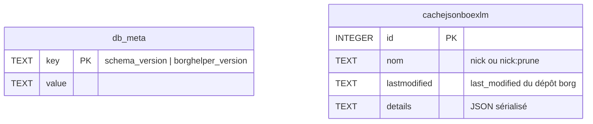
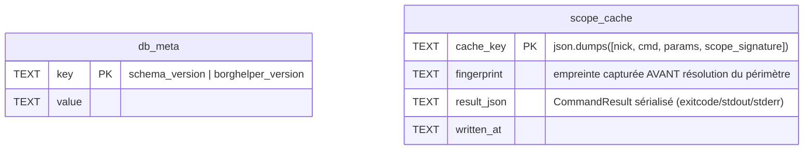
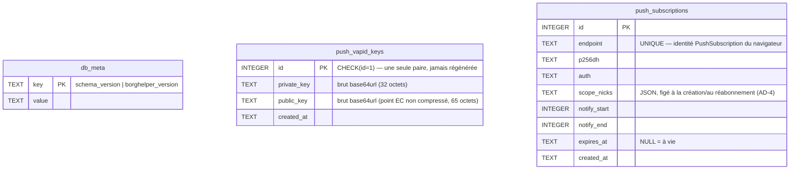

# borgHelper — Fonctionnement technique

Ce document décrit l'architecture interne de borgHelper : fichiers de données, schémas SQLite, indexes, et comportements internes.

→ Usage CLI : [README.md](README.md)  
→ Usage librairie : [LIBRARY.md](LIBRARY.md)

---

## Architecture

borgHelper est structuré en trois couches :

| Classe | Rôle |
|--------|------|
| `BorgHelperDB` | Toutes les opérations SQLite (cache.db + diff.db) |
| `BorgRunner` | Subprocess borg + lecture/écriture borghelperrc |
| `BorgHelper` | Services haut niveau — orchestre DB et Borg |

---

## Fichiers de données

| Fichier | Contenu |
|---------|---------|
| `~/.borghelperrc` | Configuration des dépôts (INI) |
| `~/.cache/borghelper/<conf>-<nick>-cache.db` | Cache des appels `borg info/list` (SQLite) |
| `~/.cache/borghelper/<conf>-<nick>-diff.db` | Index des diffs, snapshots et stats d'archives (SQLite) — entièrement régénérable depuis le dépôt (1.0.139) |
| `~/.cache/borghelper/<conf>-<nick>-history.db` | Mesures NON régénérables (1.0.139) : `repo_stats`, `bkp_status`, `archive_measure`, `archive_chart` (1.0.140) — en clair, sans chemin ; **la seule base à sauvegarder** |
| `~/.cache/borghelper/<conf>-<repo_sanitisé>-priority.lock` | Lock PID posé par `Bkp`/`Restore` — signal d'interruption pour `Index` sur le même dépôt |
| `~/.cache/borghelper/<conf>-<repo_sanitisé>-index-running.lock` | Lock PID posé par `Index` pendant Phase 2 — `Bkp`/`Restore` attendent sa disparition avant `borg create`/`borg extract` |
| `~/.cache/borghelper/<conf>-<nick>-index-pending.lock` | Flag (vide) posé par `Index` quand interrompu par `Bkp`/`Restore` — `Bkp` le détecte en fin d'exécution et relance `Index` complet automatiquement |

- `<conf>` = basename sanitisé du fichier de configuration (ex : `borghelperrc` pour `~/.borghelperrc`)
- `<nick>` = identifiant du dépôt (ou valeur de `DB_NAME` si définie dans la section) — un fichier par dépôt
- Répertoire configurable via `CACHE_DIR` dans la section `[DEFAULT]` du borghelperrc

---

## Base de données `cache.db`

Cache des résultats `borg info` et `borg prune --dry-run`, invalidé automatiquement par `last_modified` du dépôt.

- Purge automatique après `DelBkp` et `Prune`
- Nettoyage manuel : `CacheClean`
- Un seul appel `borg info` par commande grâce au cache partagé (`last_modified`)



Contrainte : `UNIQUE(nom, lastmodified)`.

**Entrées :**
- `nom = nick` → résultat de `borg info --json --glob-archives`
- `nom = nick:prune` → liste des archives à pruner (dry-run)

---

## Base de données `diff.db`

Index des diffs inter-archives, snapshots du dernier état, métadonnées de taille et statistiques des fichiers exclus par les filtres d'indexation.

### Comportement WAL et auto-vacuum

- `PRAGMA journal_mode=WAL` : lectures non-bloquantes pendant les écritures (important pour les diff parallèles)
- `PRAGMA auto_vacuum=INCREMENTAL` : recupération progressive des pages supprimées
- `VACUUM` explicite après `Prune` pour récupérer l'espace immédiatement

### Tables

#### `db_meta`
Métadonnées de versionning du schéma — une ligne par clé.

| Clé | Valeur | Notes |
|-----|--------|-------|
| `schema_version` | entier (ex : `"1"`) | Incrémenté uniquement lors d'un changement de schéma |
| `borghelper_version` | chaîne (ex : `"1.0.41"`) | Écrite seulement si elle diffère de la valeur déjà stockée (Story 1.5, voir ci-dessous) |

Au démarrage : si `schema_version` stockée > constante attendue (`DIFF_DB_SCHEMA_VERSION` / `CACHE_DB_SCHEMA_VERSION`) → erreur + exit. Indique que la DB a été créée par une version plus récente incompatible.

**`_check_set_meta()` n'écrit `db_meta` que si la valeur change (Story 1.5)** : avant, les deux lignes
(`schema_version`, `borghelper_version`) étaient réécrites (`INSERT OR REPLACE`) à **chaque** ouverture
de la DB, même sans le moindre changement — chaque appel `borgHelper` étant un sous-processus distinct,
la fermeture de la connexion SQLite déclenche un checkpoint WAL qui avance la date de modification du
fichier `.db` **même pour un appel en lecture pure**. Désormais, chaque ligne n'est réécrite que si sa
valeur stockée diffère réellement de la nouvelle (la valeur est de toute façon déjà lue pour la
comparaison `stored>schema_version`, aucun coût supplémentaire). Un appel en lecture qui ne modifie
aucune donnée laisse maintenant `cache.db`/`diff.db` bit-pour-bit inchangés, y compris leur date de
modification — condition nécessaire (avec le correctif `ensure_diff_db()` ci-dessous) pour que le
cache SQLite par périmètre de `borgHelperWWW` (Story 1.5, voir README.md) puisse jamais produire un
hit : sa clé d'invalidation inclut ces dates de modification, capturées **avant** l'appel `borgHelper`.

#### `diff_index`
Stocke chaque événement de fichier entre deux archives consécutives.

- Peuplée par `Index` (via `borg diff`) et par `Bkp` (via `--list`)
- `change_type` : `added`, `removed`, `modified`, `C` (permissions/proprio), `B` (lien cassé), `T` (type changé)
- `size_before` / `size_after` : `NULL` selon le type de changement

**Source de vérité pour les chemins supprimés mais récupérables** (`TreeHist`/`TreeFind`, voir
Design Notes ci-dessous) : jamais `archive_snapshot_v`/`archive_snapshot`, purgées indépendamment
selon `IDX_SNAP_KEEP` (fenêtre glissante fixe, sans rapport avec l'existence réelle des archives),
alors qu'une ligne `diff_index` survivante référence toujours une archive encore restaurable
(le rapprochement `_reconcile_archives`, 1.0.140, ne la purge que quand l'archive ancienne ou nouvelle a disparu). Détection d'un
chemin « supprimé » : son événement `diff_index` le PLUS RÉCENT (`archive_new_date`/`id` max) a
un `change_type` de suppression (`_DIFF_REMOVED_TYPES` : `removed`, `removed directory|link|fifo|chrdev|blkdev`)
— un chemin réajouté depuis n'est jamais marqué. **Type réel depuis 1.0.126** : `borg diff --json-lines` (1.2) qualifie
tout ce qui n'est pas un fichier ordinaire par un suffixe (`removed directory`, `removed link`, `removed fifo`…,
vérifié sur un dépôt de test), conservé tel quel dans `change_type` par `parse_diff_line_json()` ;
`_diff_entry_type(change_type, size_before)` en tire le type borg (`-`/`d`/`l`/`p`/`c`/`b`, clés de
`_TREEHIST_GENRES`) — aucune colonne `type` n'est nécessaire, et les lignes déjà indexées en bénéficient sans
réindexation. Avant 1.0.126, seul `change_type='removed'` (fichier ordinaire) était reconnu : répertoires, liens et
fifos supprimés n'apparaissaient **pas du tout** dans `TreeHist`/`TreeFind`, et `removed fifo|chrdev|blkdev`
manquaient à `_DIFF_REMOVED_TYPES` (entrée jamais retirée du snapshot incrémental). Repli conservé : `removed` sans
taille -> répertoire (lignes anciennes/synthétiques ; borg donne toujours une taille à un fichier supprimé). Sockets :
non archivées par borg. Coût (mesuré en 1.0.135, jeu PerfBench 250k) : à la racine, la détection des supprimés de
`TreeFind` représentait ~1,0 s sur ~1,3 s (fenêtrage `ROW_NUMBER() OVER (PARTITION BY path …)` sur tout
`diff_index`). Remplacée par « suppression sans événement plus récent pour ce chemin » (`NOT EXISTS` corrélé sur
`idx_diff_nick_path`, départage par `id` à date égale) : mêmes lignes (12 281, vérifié), requête ~970 → ~360 ms ;
`TreeFind *.log` racine 1,18 → 0,60 s en clair, 1,24 → 0,85 s en chiffré (le reste, en chiffré, est le décodage
des chemins du snapshot, nécessaire pour tester le nom). Sorties identiques à la version précédente (48 cas,
clair/chiffré/dépôt de test).

#### `diff_indexed_pairs`
Sentinelle d'idempotence pour les diffs — une ligne par paire (archive_old, archive_new) indexée.  
Empêche de ré-indexer une paire déjà traitée. Purge des lignes orphelines par `Prune`.

#### `snapshot_file`
Dictionnaire global des chemins de fichiers avec leur taille, mtime, type, droits et propriétaire.  
Contrainte `UNIQUE(nick, path)` — le même chemin n'est stocké qu'une seule fois par nick (déduplication).  
`type` : code borg (`{type}` de `borg list --format`) — `d` répertoire, `-` fichier, `l` lien symbolique,
`p` fifo, `s` socket, `b`/`c` périphérique bloc/caractère.  
`mode` : droits unix ls-style (`{mode}` de `borg list --format`, ex. `drwxr-xr-x`) — dernier état connu.  
`owner` : propriétaire construit depuis `{user}:{group} ({uid}:{gid})` de `borg list --format` (ex.
`root:root (0:0)`) — dernier état connu.  
`NULL` pour les lignes écrites avant l'ajout de ces colonnes (migrations `ALTER TABLE` automatiques dans
`ensure_diff_db()`, ré-indexer pour peupler). Utilisées par `TreeHist` pour les colonnes « genre »/« droits »/« propriétaire ».

#### `archive_snapshot`
Table mince : associe une archive à ses fichiers via `file_id → snapshot_file.id`.  
Réduit la duplication des chaînes de chemin quand le même fichier apparaît dans plusieurs archives consécutives.

#### `archive_snapshot_indexed`
Sentinelle d'idempotence pour les snapshots — une ligne par archive dont le snapshot est complet.

#### `archive_stats`
Métadonnées de taille par archive (original, compressé, dédupliqué, nfiles, durée).  
Peuplée par `Bkp` (depuis le JSON borg) et par `Index` (via `borg info --json`).  
Utilisée par `Report -o` pour produire un rapport complet sans aucun appel borg.

#### `diff_excluded_stats`
Agrégat des fichiers filtrés par `IDX_INCLUDE`/`IDX_EXCLUDE` lors de l'indexation des diffs.  
Une ligne par (nick, archive_old, archive_new, change_type) : `file_count` + `total_size`.  
Peuplée par `Index` et `Bkp` (taille non disponible pour `Bkp` car `--list` ne retourne pas les tailles).  
Permet de savoir combien de fichiers ont été intentionnellement exclus de l'index et quelle taille ils représentent.

#### `snap_excluded_stats`
Agrégat des fichiers filtrés lors de l'indexation du snapshot de la dernière archive.  
Une ligne par (nick, archive) : `file_count` + `total_size`.  
Peuplée par `IndexSnap` (`-S`) et en fin d'`Index` normal.

#### `repo_stats`

> **1.0.139 : déplacée dans `history.db`** (voir « Base de données `history.db` »). Règles d'écriture, de lecture et
> de rétention inchangées ; seul l'emplacement change.

Statistiques globales du dépôt borg dans le temps (niveau cache, pas par archive) — historique, une
ligne par événement (`id INTEGER PRIMARY KEY AUTOINCREMENT`, jamais écrasée).  
Colonnes : `id`, `nick`, `op` (`'bkp'|'prune'|'index'`), `unique_csize` (taille dédupliquée totale du dépôt),
`total_size`, `total_csize`, `updated_at`.  
Peuplée par `Bkp` (`op='bkp'`, depuis `cache.stats` du JSON `borg create --json`, zéro appel borg
supplémentaire) et par `Prune` réel (`op='prune'`, appel léger `borg info --json` fait **après**
`compact --cleanup-commits` — l'étape qui libère réellement l'espace, jamais juste après `prune --stats`,
sinon le delta serait faux/quasi nul ; rien n'est écrit en `--dry-run`), et par `Index` (`op='index'`,
1.0.114, `_refresh_chart_stats` : `borg info --json` du dépôt, métadonnées seulement, ligne ajoutée
**uniquement si** `(unique_csize,total_size,total_csize)` diffère de la dernière — un `Bkp` relance Index
juste après avoir écrit sa propre ligne, identique : pas de doublon).  
`_refresh_chart_stats` complète aussi `archive_stats` (archives sans ligne, `borg info --json
--glob-archives` lancé seulement s'il en manque ; `-F` : toutes) — logique auparavant en fin d'`index()`,
désormais appelée aussi quand `index()` sort tôt (`NOIDX=1`, moins de 2 archives), erreurs `borg info`
signalées au lieu d'être avalées. ⚠️ `deduplicated_size` d'une archive rattrapée ainsi = taille unique
à l'archive au moment de l'Index (`borg info`), pas la donnée ajoutée à sa création (`borg create
--stats`) ; `NOIDX=1` n'empêche plus `index()` de consulter borg (liste + info), et respecte désormais
le verrou prioritaire (Bkp/Restore en cours → Index annulé, sans poser `index_pending`).  
**Correctif 1.0.114 — faux « indexation interrompue »** : le `finally` de la boucle des diffs faisait
`interrupted_event.set()` pour arrêter le thread de surveillance, puis `if interrupted_event.is_set()`
concluait à une interruption — **tout** Index ayant traité au moins une paire renvoyait 1, posait
`index_pending` (le Bkp suivant relançait un Index complet, lui-même « interrompu ») et n'atteignait
jamais `archive_stats`/`indexsnap`/`DIFF_KEEP`. Événement dédié `monitor_stop` pour l'arrêt normal ;
`interrupted_event` ne signale plus qu'une vraie opération prioritaire (vérifié : Index avec paires →
code 0, pas de `index_pending` ; verrou prioritaire posé pendant les diffs → arrêt + `index_pending`).  
`get_repo_stats()` lit la dernière ligne par nick (`ORDER BY id DESC LIMIT 1`, jamais un `SELECT` nu sans
ordre — `updated_at` est à résolution seconde et peut collisionner entre deux événements rapprochés).  
Purge par ancienneté à chaque écriture (même transaction que l'`INSERT`) : lignes plus vieilles que
`STATS_RETENTION_MONTHS` (`.borghelperrc`, 13 mois par défaut, surchargeable par nick).  
Utilisée par `Report -o` pour alimenter la colonne `taille` sans appel borg (dernière ligne, tout `op`
confondu).  
Seules des valeurs brutes renvoyées par borg sont persistées — aucune métrique dérivée (dédup, gain
Prune) : ces calculs se font à la lecture (graphiques `borgHelperWWW`, hors périmètre de ce schéma).

**Exposition JSON (Story 2, spec-charts-evolution-sauvegardes).** `RepoHistory -j` (commande CLI) /
`GET /repohistory?nick=<nick>` (route `borgHelperWWW`, RBAC niveau lecture) exposent l'historique
complet, colonnes brutes, ordonné par `id` croissant : `{'borghelper_version','nick','rows':[{'id',
'op','unique_csize','total_size','total_csize','updated_at'},...]}`. Gabarit exact de `IdxTop -j` :
requête directe `SELECT ... FROM repo_stats WHERE nick=? ORDER BY id`, un seul nick à la fois (`nick=a,b`
ou `ALL` sur plusieurs nicks rejeté par `usage(cmd)`), `{'error':...}` (jamais une exception) si
`diff.db` n'existe pas encore. `archive_stats` a son pendant symétrique : `ArchiveHistory -j` /
`GET /archivehistory?nick=<nick>`, même `SELECT` que `prep_report_from_db()` (`archive,archive_date,
duration,original_size,compressed_size,deduplicated_size,nfiles FROM archive_stats WHERE nick=? ORDER BY
archive_date`). Aucune métrique dérivée dans ces deux commandes/routes — colonnes brutes uniquement, le
calcul (gain Prune, % dédup) reste pour le rendu graphique (Story 3, hors périmètre ici).

### Vue `archive_snapshot_v`

```sql
CREATE VIEW archive_snapshot_v AS
    SELECT s.nick, s.archive, s.archive_date, sf.path, sf.size, sf.mtime, sf.type, sf.mode, sf.owner
    FROM archive_snapshot s
    JOIN snapshot_file sf ON sf.id = s.file_id;
```

Utilisée par `Search`, `FileHist`, `DuIdx`, `Restore` — expose la jointure de façon transparente.

**Recréation conditionnelle, pas systématique (Story 1.5)** : `ensure_diff_db()` exécutait avant
`DROP VIEW IF EXISTS archive_snapshot_v` + `CREATE VIEW archive_snapshot_v AS ...`
**inconditionnellement**, à chaque appel — un DDL qui, comme les écritures `db_meta` ci-dessus, avance
la date de modification de `diff.db` même sans le moindre changement de données. Désormais, ce bloc ne
s'exécute que si la vue n'existe pas déjà (`SELECT name FROM sqlite_master WHERE type='view' AND
name='archive_snapshot_v'` — un simple contrôle d'existence, jamais une comparaison textuelle du SQL
stocké, qui serait fragile face au reformatage propre de SQLite). Une future évolution du `SELECT` de
cette vue devra passer par une migration explicite gated sur `DIFF_DB_SCHEMA_VERSION` (voir
[Migration de schéma](#migration-de-schéma) ci-dessous), comme `_migrate_archive_snapshot` — ce
correctif ne réduit donc pas la garantie d'auto-réparation existante, il l'aligne sur la convention de
migration versionnée déjà suivie par le reste du schéma. Ce correctif est le second des deux
nécessaires (avec `_check_set_meta()` ci-dessus) pour que le cache SQLite par périmètre de
`borgHelperWWW` (Story 1.5) puisse produire un hit en pratique.

**Définition comparée (1.0.131 / borgHelperWWW 1.26.6)** — remplace le simple contrôle d'existence :
`_ARCHIVE_SNAPSHOT_V_SQL` est la définition de référence (source unique) ; `_archive_view_state(conn)` compare le texte
que SQLite stocke **verbatim** dans `sqlite_master.sql` (pas de reformatage : la crainte ci-dessus était infondée),
espaces et casse normalisés (`_sql_norm`) → `ok` | `absent` | `mismatch` | `newer` (schéma de la base > code : rien
à comparer, jamais touchée). `ensure_diff_db` recrée la vue (transaction `_executescript_atomic`) seulement sur
`absent`/`mismatch` : le mtime n'avance toujours pas quand rien ne change (vérifié), et une évolution du `SELECT`
s'applique désormais d'elle-même aux bases existantes. borgHelperWWW, qui tourne en continu, refait le contrôle au
démarrage puis toutes les `BORGHELPERWWW_SCHEMA_CHECK_INTERVAL` secondes (3600 par défaut, min. 60) via
`_schema_watch_pass` (watcher) : `archive_view_check(repair=True)` par nick ; **jamais de réparation si borgHelper a
été mis à jour sur disque depuis le démarrage** (`_borghelper_disk_version` ≠ version en mémoire : le code chargé est
périmé, il réécrirait une définition plus récente avec l'ancienne) — `[WARN] … redémarrer borgHelperWWW` une seule
fois par cause.

### Schéma complet

> Schéma d'avant 1.0.139 : `repo_stats`, `bkp_status` et les colonnes C/E d'`archive_stats` sont depuis dans `history.db`.

```mermaid
erDiagram
    db_meta {
        TEXT key PK "schema_version | borghelper_version"
        TEXT value
    }

    diff_index {
        INTEGER id PK
        TEXT nick
        TEXT archive_old
        TEXT archive_new
        TEXT archive_new_date "ISO datetime"
        TEXT change_type "added|removed|modified|C|B|T"
        TEXT path
        INTEGER size_before "NULL si added"
        INTEGER size_after "NULL si removed"
        TEXT indexed_at
    }

    diff_indexed_pairs {
        INTEGER id PK
        TEXT nick
        TEXT archive_old
        TEXT archive_new "UNIQUE(nick,archive_old,archive_new)"
        INTEGER entry_count
        TEXT indexed_at
    }

    snapshot_file {
        INTEGER id PK
        TEXT nick
        TEXT path "UNIQUE(nick, path)"
        INTEGER size
        TEXT mtime "ISO datetime"
        TEXT type "code borg d/-/l/p/s/b/c, NULL si non réindexé"
        TEXT mode "ls-style ex. drwxr-xr-x, NULL si non réindexé"
        TEXT owner "user:group (uid:gid), NULL si non réindexé"
    }

    archive_snapshot {
        TEXT nick "PK partielle"
        TEXT archive "PK partielle"
        TEXT archive_date
        INTEGER file_id FK
    }

    archive_snapshot_indexed {
        TEXT nick "UNIQUE(nick, archive)"
        TEXT archive
        INTEGER entry_count
        TEXT indexed_at
    }

    archive_stats {
        TEXT nick PK
        TEXT archive PK
        TEXT archive_date
        REAL duration
        INTEGER original_size
        INTEGER compressed_size
        INTEGER deduplicated_size
        INTEGER nfiles
    }

    diff_excluded_stats {
        TEXT nick PK
        TEXT archive_old PK
        TEXT archive_new PK
        TEXT change_type PK
        INTEGER file_count
        INTEGER total_size
    }

    snap_excluded_stats {
        TEXT nick PK
        TEXT archive PK
        INTEGER file_count
        INTEGER total_size
    }

    repo_stats {
        INTEGER id PK "AUTOINCREMENT"
        TEXT nick
        TEXT op "bkp|prune"
        INTEGER unique_csize
        INTEGER total_size
        INTEGER total_csize
        TEXT updated_at
    }

    snapshot_file ||--o{ archive_snapshot : "file_id → id"
```




### Indexes

| Table | Index | Colonnes | Requête cible |
|-------|-------|----------|---------------|
| `diff_index` | `idx_diff_nick_path` | `(nick, path)` | Search, FileHist |
| `diff_index` | `idx_diff_nick_archive` | `(nick, archive_new)` | DiffBkp, Report |
| `diff_index` | `idx_diff_nick_newtype` | `(nick, archive_new, change_type)` | stats Report |
| `diff_index` | `idx_diff_nick_date` | `(nick, archive_new_date)` | filtres plage `-b`/`-B` |
| `diff_indexed_pairs` | `idx_pairs_nick` | `(nick)` | suppressions Prune |
| `snapshot_file` | `idx_snapfile_nick_path` | `(nick, path)` | insertion / lookup |
| `archive_snapshot` | `idx_snap_nick_archive` | `(nick, archive)` | suppressions Prune |
| `archive_stats` | `idx_astats_nick` | `(nick)` | Report -o, suppressions Prune |
| `diff_excluded_stats` | `idx_exclu_nick_arch` | `(nick, archive_new)` | consultation stats exclus |
| `repo_stats` | `idx_rstats_nick` | `(nick, id)` | get_repo_stats (dernière ligne par nick), purge par ancienneté |

---

## Base de données `history.db` (1.0.139)

Mesures prises au Bkp (ou au Prune) qu'aucun appel borg ne redonne ensuite — chantier « reconstruction progressive »,
story 2, spine AD-7/AD-8. Une base par nick (`<conf>-<nick>-history.db`, même nom que `diff.db`), en clair (aucune
colonne de chemin, jamais d'`enc_header`), `0600`, WAL, ouverte sans nick (`_open_db(..., nick=None)` : ni codec ni
avertissement « base non chiffrée »). `DbStatus` l'affiche `plain (aucun chemin, jamais chiffrée)`.

| Table | Contenu | Écrivains | Rétention |
|---|---|---|---|
| `repo_stats` | historique des tailles du dépôt (`op` bkp/prune/index) | Bkp, Prune, refresh d'Index | `STATS_RETENTION_MONTHS` |
| `bkp_status` | cycle de vie des Bkp (watcher push, `Status`) | Bkp seul ; réclamations CAS du watcher | `STATS_RETENTION_MONTHS` |
| `archive_measure` | par `(nick, archive, archive_date)` : taille dédupliquée à la création, C/E | Bkp seul | tant que l'archive existe (retirée par le rapprochement, après figeage) |
| `archive_chart` (1.0.140) | par `(nick, archive, archive_date)` : ligne de graphique figée (`_CHART_FIELDS` + `gone`) | rapprochement de la base servie, `DIFF_KEEP` | `STATS_RETENTION_MONTHS`, que l'archive existe ou non |

- **Lecture** : `history_path(nick)` / `_hist(nick)` ouvrent d'abord `diff.db` (`ensure_diff_db`, sans la créer), ce
  qui migre une base antérieure ; une lecture ne crée jamais `history.db` (fichier absent = aucune mesure : `[]`,
  `None`, `{}`). Les mesures sont lues par une requête à part et fusionnées en Python (jamais d'`ATTACH`, qui
  créerait le fichier). `ArchiveHistory -j` et `Report -o` affichent la taille dédupliquée **mesurée** si elle existe,
  sinon celle d'`archive_stats` (`borg info`) — sorties identiques à avant la migration.
- **Migration automatique** (`_migrate_to_history`, appelée par `ensure_diff_db` à chaque ouverture, détectée par la
  présence des tables ou de C/E non `NULL`) : le verrou d'écriture de `diff.db` (`BEGIN IMMEDIATE`) est tenu de bout
  en bout et l'état relu sous ce verrou — aucun écrivain ne peut écrire entre la copie et le retrait, et un processus
  arrivé en second voit la migration faite (revue : sans cela, « no such table » pris pour une corruption). Ordre des
  verrous : `diff.db` puis `history.db`. Étape 1, copie + marqueur `migrated_from_diff='copied'` dans une transaction
  de `history.db` ; étape 2, `DROP TABLE repo_stats/bkp_status` et `ALTER TABLE archive_stats DROP COLUMN` des C/E
  (SQLite < 3.35 : colonnes vidées, donc plus jamais détectées), puis marqueur `done`. Tuée entre les deux : la relance
  ne fait que l'étape 2. Une `diff.db` d'un schéma plus récent n'est jamais touchée. Une erreur de `history.db` pendant
  la migration n'invite jamais à supprimer `diff.db` (elle porte encore les seules copies).
  Tables réapparues après `done` (un binaire antérieur les recrée : son `ensure_diff_db` exécute le schéma avant de
  refuser la version, et Bkp avale ce refus) : lignes recopiées (`repo_stats` sans imposer d'id), puis retirées. Base
  `migrating` (DbEncrypt/DbDecrypt en cours) : rien. Mesures par archive reprises seulement pour les lignes dont C/E
  n'est pas `NULL` (seule preuve d'un Bkp, ≥ 1.0.117) ; `archive_stats.deduplicated_size` reste dans `diff.db`.
- **Version** : `DIFF_DB_SCHEMA_VERSION` et `DIFF_DB_BASE_SCHEMA_VERSION` passent à 10 (aussi pour les bases en
  clair) : un binaire d'avant refuse une `diff.db` migrée dès qu'il passe par `ensure_diff_db` (Bkp, Index, Report…) ;
  ses lectures directes (`RepoHistory`) répondent « no such table » sans rien écrire. Retour arrière : restaurer une
  copie de `diff.db` faite avant la migration — les mesures écrites depuis dans `history.db` (tailles, suivi des Bkp,
  C/E) sont alors perdues pour cette ancienne version.
- **Limites connues** : une taille dédupliquée reprise comme « mesurée » (lignes avec C/E) a pu être écrasée avant
  1.0.139 par un rattrapage `Index -F` (valeur `borg info`, même C/E conservés) — indiscernable, affichage inchangé.
  Des lignes écrites par un binaire d'avant pendant la migration elle-même peuvent se perdre : arrêter les anciens
  processus (Bkp, borgHelperWWW) avant de mettre à jour.
- **Emplacement et sauvegarde** : `history.db` est dans `CACHE_DIR` (par défaut `~/.cache/borghelper`, souvent exclu
  des sauvegardes). Pour la sauvegarder sans perdre les écritures récentes du WAL, en faire une copie cohérente :
  `python3 -c 'import sqlite3,sys; sqlite3.connect(sys.argv[1]).execute("VACUUM INTO ?",(sys.argv[2],))' <history.db> <copie>`.
- **Lecteurs** : `history_path` absorbe la sortie d'`ensure_diff_db` (base occupée/corrompue, message déjà affiché) —
  un lecteur de mesures (`Status -n ALL`…) continue sur `history.db` telle quelle. Mesures par archive recherchées par
  `(archive, archive_date)` puis par nom seul s'il est unique (date formatée autrement dans une `archive_stats`
  reconstruite). `RepoHistory` sert `history.db` même si `diff.db` a été supprimée. Purge des mesures au nettoyage
  après Prune, aussi pour un nick `NOIDX` ou sans `diff.db`, jamais sur une liste d'archives vide.
- **Cache par périmètre** de borgHelperWWW : la clé inclut la date de modification de `history.db`.
- Vérifié : `CodecSelfTest` (migration, reprise après kill, trois processus concurrents, ancien binaire refusé, tables
  recréées par un ancien binaire, `diff.db` jetée puis reconstruite, lecture sans historique, base chiffrée,
  base `migrating`) ; parité des sorties `RepoHistory -j`, `ArchiveHistory -j`, `Report -o -j` entre 1.0.138 et
  1.0.139 sur des bases construites par de vrais Bkp/Prune (en clair et chiffrée).

**Lignes de graphique figées (1.0.140, story 3, AD-7 amendé)** — les graphiques par archive doivent couvrir
`STATS_RETENTION_MONTHS` même quand les archives vivent moins longtemps. `_reconcile_archives` fige, **avant** de
purger : pour chaque archive disparue, sa ligne telle qu'`ArchiveHistory` l'affichait (`archive_stats`, comptages de
`_diff_stats_for_nick`, mesure prioritaire pour la taille dédupliquée et C/E), `gone=1` ; pour chaque archive restante
dont la paire entrante part, ses seuls comptages, `gone=0`. `_diff_keep_purge` fige de même les comptages des paires
qu'il retire. `freeze_archive_chart` : upsert `COALESCE(nouvelle, ancienne)` (une valeur figée n'est jamais écrasée
par `NULL`), `gone=MAX(...)`, puis purge des lignes plus vieilles que la rétention ; ligne sans date ignorée.
`ArchiveHistory` : archives présentes (valeur vivante non nulle, sinon figée ; correspondance `(archive, date)` puis
nom unique) + lignes `gone` absentes d'`archive_stats`, triées par date, champ `pruned`. `Report`, `TreeHist`,
`FileHist` et la restauration ne lisent jamais `archive_chart`. Table ajoutée par `CREATE TABLE IF NOT EXISTS` :
`HISTORY_DB_SCHEMA_VERSION` reste 1.

### Rapprochement de la liste des archives (1.0.140, story 3, AD-9)

`_reconcile_archives(nick, db_path, current)` — appelé par `index()` juste après `borg list` (avant les branches
`NOIDX` et « moins de 2 archives », aucun appel borg de plus) et par `_cleanup_index_after_prune` (`borg list` +
rapprochement + `_vacuum_db` seulement si des lignes sont parties). Jamais de compactage depuis Index.

1. Archives connues (`_known_archives`) : petites tables lues entières (`archive_stats`, `archive_snapshot_indexed`,
   `snap_excluded_stats`, `diff_indexed_pairs` et `diff_excluded_stats` des deux côtés) + `diff_index.archive_new` et
   `archive_snapshot.archive` par **saut d'index** (CTE récursive de `MIN` successifs sur `(nick, archive_new)` /
   `(nick, archive)` : un accès par archive, jamais un balayage) + noms d'`archive_measure`.
2. Liste vide : rien retiré, avertissement si la base connaît des archives. Aucune disparue et balayage déjà fait :
   retour sans aucune écriture.
3. `priority.lock` d'un autre processus : reporté (un Bkp démarré après `borg list` ferait passer sa nouvelle archive
   pour disparue ; Prune tient le verrou lui-même, l'Index de fin de Bkp passe après l'avoir relâché).
4. Figeage (`archive_chart`, voir plus haut) ; un échec (`sqlite3.Error`) arrête tout, rien n'est purgé.
5. Purge dans une transaction `diff.db` : table temporaire `_gone`, lignes `diff_index` retirées **par paire** (index
   `(nick, archive_new)` : jamais de balayage sur `archive_old`, sans index), puis paires, snapshots, stats, exclus,
   orphelins de `snapshot_file` si des snapshots sont partis. Puis mesures, par liste explicite des disparues (jamais
   `NOT IN` la liste : la mesure d'un Bkp écrite après `borg list` survit).
   Interrompue après le figeage : rejouée au passage suivant, sans doublon (clé primaire d'`archive_chart`).
6. Balayage unique par base (`db_meta.reconcile_sweep`) : lignes `diff_index` héritées sans paire dont une archive a
   disparu (l'ancien nettoyage ne testait qu'`archive_new` : paire retirée, lignes restées). Leurs comptages sont figés
   pour l'archive restante avant retrait. Seul balayage complet de `diff_index`, une fois ; une `diff.db` reconstruite
   le refait (rapide, base neuve). Drapeau par nick (`reconcile_sweep:<nick>`) : plusieurs nicks peuvent partager une
   `diff.db` (`DB_NAME`).

Changement de `GLOB_ARCH` : les archives hors du nouveau motif sont traitées comme disparues (figées puis retirées).
Erreurs (`_RECONCILE_ERRORS` : SQLite, codec — base chiffrée sans clé, mode changé par `DbEncrypt` —, `SystemExit` de
`history.db` illisible) : message, rien retiré, Index continue. Retour : lignes retirées de `diff.db` (le nettoyage
après Prune ne compacte que si ce nombre est non nul). `DIFF_KEEP` passe après le refresh des statistiques (dates
nécessaires au figeage au premier Index d'un dépôt).

## Flux d'indexation

### `Bkp` (indexation automatique)

```
set_priority_lock(nick)                                  → <nick>-priority.lock (PID)
    ↓
borg create --json --stats --list --filter CE   (1.0.117 : --list limité aux statuts C/E)
    ↓
_bkp_file_status() sur stderr → C (modifié pendant la sauvegarde) / E (erreur de lecture)
    → [WARN] résumé stderr + borgHelper_backup_warnings (JSON stdout)
    ↓
store_archive_stats(nick, archive_new, ...)              → diff.db archive_stats (régénérable)
store_archive_measure(nick, archive_new, date, dédup, C, E) → history.db archive_measure (1.0.139)
store_repo_stats(nick, 'bkp', ...)                       → history.db repo_stats
    ↓
clear_priority_lock(nick)                                → priority.lock supprimé (Bkp terminé)
    ↓
index(nick, target_archive=archive_new, set_pending=False) → borg diff réel de la nouvelle paire,
                                                           puis indexsnap (incrémental sur CE diff)
    (première archive : indexsnap seul, snapshot complet)
_pair_file_counts()                                      → borgHelper_file_counts du JSON stdout
    ↓
si index-pending.lock présent → clear + index(nick, set_pending=False)  ← reprise Index externe interrompu
    ↓
finally: clear_priority_lock(nick)                       → no-op (déjà supprimé)
```

**Correctif 1.0.116 — Bkp n'indexe plus depuis `borg create --list`.** Les statuts de `--list` ne
décrivent pas un diff : `d` = répertoire (mappé à `removed` par l'ancien `_BKP_STATUS_MAP` — chaque
répertoire marqué supprimé à chaque Bkp), `C` = fichier modifié PENDANT la sauvegarde (pas un changement
de droits), et aucun fichier supprimé n'y figure. La paire, marquée indexée, était ensuite recalculée
par `index(target_archive=…)` (purge + `borg diff`), mais `indexsnap()` tournait **avant**, sur ces
fausses données : snapshot incrémental privé de tous ses répertoires, fichiers réellement supprimés
conservés, snapshot marqué fait (jamais recalculé), erreur propagée aux snapshots suivants (clonés).
Désormais : `borg create` sans `--list`, `index(target_archive)` d'abord, snapshot ensuite.
`_bkp_parse_list`/`_bkp_is_list_entry`/`_BKP_STATUS_MAP` supprimés. Même version :
`_DIFF_ADDED_TYPES`/`_DIFF_REMOVED_TYPES` (`added|removed` + `directory`/`link`) appliqués par
`_indexsnap_incremental` (un répertoire supprimé restait dans le snapshot) et par
`_diff_stats_for_nick` (comptés ajoutés/supprimés au lieu de modifiés — colonne « Modifs » de Report et
graphique des fichiers modifiés). Réparation des snapshots existants : `Index -S -F` (reconstruit le
dernier snapshot par `borg list` complet ; les suivants repartent de lui). Vérifié sur un dépôt de test
(fichier ajouté/modifié/supprimé, répertoire ajouté/supprimé) : diff, snapshot et compteurs exacts.

### `Index` (indexation manuelle, parallèle)

```
borg list --json
    ↓
_reconcile_archives (1.0.140) : archives disparues figées (history.db.archive_chart) puis retirées
    ↓
Phase 1 : déterminer les paires manquantes (diff_indexed_pairs)
          si force : purge diff_index + diff_indexed_pairs + diff_excluded_stats
    ↓
Phase 2 : ThreadPoolExecutor(IDX_WORKERS) → borg diff par paire en parallèle
          pour chaque ligne : filtre IDX_INCLUDE/IDX_EXCLUDE
          compteurs exclus accumulés en RAM jusqu'à fin du diff
    ↓
Phase 3 : insert groupé (connexion SQLite unique)
          → diff_index + diff_indexed_pairs
          → diff_excluded_stats (count + total_size par change_type)
    ↓
borg info --json (seulement si archive_stats manquantes) → archive_stats
    ↓
DIFF_KEEP : purge des paires au-delà de la limite (comptages figés d'abord, exclus de la paire retirés, 1.0.140)
    ↓
indexsnap() → voir flux IndexSnap ci-dessous
```

### Dépôts externes : filtre d'archives et autorité des opérations (1.0.142, story 5, AD-11/AD-12)

- `glob_args(cfg, form)` est le **seul** lecteur de `GLOB_ARCH` (borgHelper et borgHelperWWW) : `['--glob-archives',
  m]` (form `list`) ou `['--glob-archives=m']` (`eq`), aucun argument si la clé est absente ou vide — sauf
  `archives=True` (appels `borg info`) : motif `*`, car `borg info --json` sans filtre ne rend pas la liste `archives`. Un contrôle de
  `CodecSelfTest` refuse toute lecture directe `cfg['GLOB_ARCH']` dans les deux fichiers.
- `is_external(cfg)` (`EXTERNAL` vrai), `external_ops(cfg, nick)` (défaut `read,restore` ; `read` toujours ; `bkp`
  et valeurs inconnues ignorés avec un avertissement unique), `command_op(cmd)` (`bkp` : Bkp/Init/Login, `restore`,
  `prune`, `delete` : DelBkp ; tout le reste `read`), `op_allowed(cfg, op, nick)` (autorité unique : interne toujours
  vrai, externe jamais `bkp`) et `require_op` (lève `OpNotAllowed`).
- Contrôle au dispatch CLI, juste après l'expansion de `-n ALL` et avant toute commande : nick nommé et refusé → code
  4 ; `-n ALL` → nick écarté (information). Classement : `command_op(cmd)`, sauf `Restore -L` (lecture) ; `Login`
  vise le nick de `-s` quand `-n` manque. borgHelperWWW importera `op_allowed` pour `/access` et ses routes (story 7) ;
  aujourd'hui les routes qui appellent la CLI héritent du refus, mais `/download` (borg direct) et `/bkp` (lancement
  détaché) ne vérifient rien encore.
- `prune()` rend `{'exitcode': 3}` (au lieu de `sys.exit`) pour un nick interne sans `GLOB_ARCH` ou sans aucune
  `KEEP_*` : la boucle `-n ALL` passe au nick suivant.
- `Prune` : nick interne sans `GLOB_ARCH` refusé (code 3). `DelBkp` pose `priority.lock` et appelle `wait_index_idle`.
- `Stats`/`Mount`/`UMount` : `MOUNTPOINT` lu par `cfg.get`, message si absent.

### `Index` par tranches (1.0.141, story 4, AD-1/AD-3/AD-10)

`index(nick, budget=, natures=, period=)` — CLI `-t` / `-T` / `-b` / `-B` ; au moins l'un active la tranche,
incompatible avec `-F`/`-S`/`-A`. Budget compté par nick (`-n ALL -t 1m` : 1 min par nick). Le processus CLI passe
en `nice` 10 + `ionice -c3` (`_lower_priority`, hérité par borg) ; une bibliothèque appelante garde sa priorité.

```
borg list --json → _reconcile_archives
    ↓
stats   : archives sans archive_stats (période), de la plus récente à la plus ancienne,
          un `borg info --json ::archive` par archive = une unité (store_archive_stats)
    ↓
snap    : indexsnap(archives=liste) de la dernière archive — incrémental : borg list des ajouts AVANT toute
          écriture puis une seule transaction (clone + retraits + modifs + ajouts + sentinelle) ; complet : une
          transaction ; lignes sans sentinelle d'un arrêt brutal retirées avant de refaire l'unité
    ↓
diffs   : paires visées (_diff_keep_pairs : les DIFF_KEEP plus récentes, période) non indexées, de la plus récente à
          la plus ancienne, IDX_WORKERS en parallèle ; puis DIFF_KEEP
    ↓
point de taille du dépôt (repo_stats op='index') seulement s'il reste du budget — placé avant les diffs, il
mangeait le budget de chaque tranche et pouvait empêcher toute paire d'aboutir
    ↓
build_state (db_meta, clé 'build_state:<nick>', JSON) : {state: partial|complete, pairs_done, pairs_total,
          archives_total, stats_done, snapshot, updated_at}
```

- Échéance vérifiée entre deux unités et entre les phases SQL (rapprochement, purge) ; à l'échéance, le borg en cours
  est arrêté (`BorgRunner._stop` : SIGTERM puis SIGKILL après 5 s, pour que borg relâche son verrou de dépôt ; ou
  moniteur des diffs) et son unité jetée. `break-lock` seulement pour une opération prioritaire, jamais à
  l'échéance (il casserait aussi les verrous d'un borg mount ou d'un autre hôte). Tranche terminée sans aucune
  progression : avertissement (budget trop court). Un budget plus court que la plus longue unité ne progresse jamais : le choisir au-dessus
  de la durée d'un `borg diff` de deux archives consécutives.
- `complete` = toutes les paires visées indexées, `archive_stats` pour toutes les archives, snapshot de la dernière
  (NOIDX : stats seules). Tranche : `build_state` toujours écrit. Index sans option : mis à jour seulement s'il existe
  et a changé, jamais créé (base sans `build_state` = `complete`, AD-10). `Status -j` : champ `build`.
- **DIFF_KEEP (1.0.141)** : les paires visées sont les N plus récentes dans l'ordre des archives, pour Index sans
  option aussi ; `_diff_keep_purge(archives=)` garde exactement ces paires (sans liste : date d'archive puis nom).
  Avant, chaque Index re-diffait les paires purgées et la purge (tri `indexed_at`, à la seconde) gardait la paire
  indexée en dernier : la paire gardée changeait d'un Index à l'autre.
- Le moteur reçoit `db_path` comme cible (AD-1) : la story 6 lui passera le fichier fantôme.
- Période : `_period_bounds` accepte un nom d'archive de la liste, une date `AAAA-MM-JJ[THH:MM:SS]` ou `ALL` ; toute
  autre valeur ou une période inversée -> erreur (retour 1), jamais une comparaison de chaînes silencieuse.
- `-S` (`index(snap_only=True)`) et `-F` passent par le même tour et la même pause ; `plan['done']` garde les paires
  recalculées dans l'appel : une reprise après pause ne les refait pas, même avec `-F`.
- `BorgRunner._stop` / `_kills` sont propres à chaque thread (`threading.local`).

### `IndexSnap` (snapshot de la dernière archive)

```
Tentative incrémentale (_indexsnap_incremental) — sauf si -F :
    ├── cherche snapshot précédent + diff_indexed_pairs pour la paire prev→new
    ├── si introuvable ou diff absent → fallback borg list complet
    ├── charge diffs (diff_index) : added / removed / modified
    ├── si > 5 000 ajouts → fallback borg list complet
    ├── clone archive_snapshot prev → new (INSERT OR IGNORE)
    ├── removed → DELETE archive_snapshot + _cleanup_snapshot_file_orphans
    ├── modified → UPDATE snapshot_file.size (mtime conservé)
    ├── added   → borg list --format '{size} {isomtime} {path}{NL}' ::<archive> [paths]
    │             → INSERT OR REPLACE snapshot_file + archive_snapshot
    └── INSERT archive_snapshot_indexed ; commit
    Affichage : "(+N -N ~N, incrémental)"

Fallback borg list complet (si force, ou si incrémental échoue) :
    borg list --format '{size} {isomtime} {path}{NL}' ::<archive>
        ↓
    filtre IDX_INCLUDE/IDX_EXCLUDE
        ├── inclus → snapshot_file + archive_snapshot + archive_snapshot_indexed
        └── exclus → snap_excluded_stats
        ↓
    INSERT archive_snapshot_indexed

Purge auto des snapshots anciens :
    _snapurge_check / _snapurge_exec → supprime archives au-delà de IDX_SNAP_KEEP
    IDX_SNAP_KEEP = config, ou sum(KEEP_*), ou 10
    Erreur non bloquante ([WARN])
```

---

## Gestion de la taille de `diff.db`

Pour les dépôts à fort volume (plusieurs GB de diff.db) :

| Levier | Paramètre | Effet |
|--------|-----------|-------|
| Purge automatique diffs | `DIFF_KEEP = N` | Supprime les paires au-delà des N dernières après chaque Index |
| Purge automatique snapshots | `IDX_SNAP_KEEP = N` | Conserve N snapshots max ; purge en fin d'IndexSnap et d'IdxPurge. Défaut : sum(KEEP_*) ou 10 |
| Filtre chemins | `IDX_INCLUDE` / `IDX_EXCLUDE` | Réduit le nombre d'entrées indexées ; stats des exclus dans `diff_excluded_stats` / `snap_excluded_stats` |
| IndexSnap incrémental | automatique | Applique les diffs SQL + `borg list` ciblé sur `added` — évite le `borg list` complet à chaque indexation |
| Vacuum post-prune | automatique | Récupère l'espace après suppression d'archives |
| Auto-vacuum | `PRAGMA auto_vacuum=INCREMENTAL` | Récupération progressive en continu |

---

## Filtres d'indexation : IDX_INCLUDE / IDX_EXCLUDE

### Syntaxe multi-valeurs

Plusieurs patterns sur une ligne séparés par espaces, ou multiligne avec indentation (syntaxe INI standard — continuation par leading whitespace) :

```ini
# Ligne unique
IDX_EXCLUDE = /tmp /proc /sys *.pyc *.o

# Multiligne (indentation obligatoire pour la continuation)
IDX_EXCLUDE = /tmp /proc /sys
    /var/lib/docker
    /home/*/.cache/*
    *.pyc *.o *.log *.bak
```

### Types de patterns

| Syntaxe | Exemple | Mécanisme |
|---------|---------|-----------|
| Préfixe plain | `/home/`, `/etc` | `path.startswith(pattern)` — tout chemin commençant par ce préfixe |
| Pattern glob | `*.bak`, `/home/*/.bash_history` | `fnmatch(path, pattern)` — `*` matche toute séquence **y compris** `/` |

Distinction automatique : présence de `*`, `?` ou `[` → fnmatch ; sinon startswith.

> `fnmatch` traite `*` comme "n'importe quelle séquence **incluant** `/`". `/home/*/.bash_history` matche `/home/user/.bash_history` ET `/home/user/subdir/.bash_history`.
>
> Ce comportement permet les patterns **depth-independent** : `*/.git/*` matche `/projet/.git/HEAD` ET `/srv/app/sous/repo/.git/objects/ab/cd` — quelle que soit la profondeur dans l'arborescence.

### Logique de filtrage

```
Un chemin est indexé si :
    (IDX_INCLUDE absent  OU  chemin matche au moins un INCLUDE)
 ET (IDX_EXCLUDE absent  OU  chemin ne matche aucun EXCLUDE)
```

Les deux clés sont cumulatives — INCLUDE whitelist d'abord, EXCLUDE blacklist ensuite.

### Exemples complets

```ini
# Indexer seulement /etc et /home, sauf les caches et fichiers temporaires
IDX_INCLUDE = /etc /home /root
IDX_EXCLUDE = /home/*/.cache /home/*/.local/share/Trash
    *.pyc *.o *.log *.bak *.tmp *.swp

# Dépôt système : tout sauf les arbo volatiles
IDX_EXCLUDE = /proc /sys /dev /run /tmp
    /var/lib/docker /var/lib/lxc
    /var/log /var/cache
    *.pyc *.o

# Patterns depth-independent : exclure les .git/ à n'importe quelle profondeur
# */.git/*  → tous les fichiers dans n'importe quel .git/
# */.git    → le répertoire .git lui-même s'il apparaît comme entrée
IDX_EXCLUDE = */.git/* */.git
    */__pycache__/* */.tox/*
    */node_modules/*
```

---

## Priorité Bkp/Restore/Prune sur Index

`Bkp`, `Restore` et (depuis `spec-status-cli-etat-rapide`, `borgHelper` 1.0.111) `Prune` sont
prioritaires sur `Index` à tout moment — quelle que soit l'étape en cours. `prune()` ne posait aucun
`priority.lock` jusqu'ici, contrairement à `backup()`/`restore()` — corrigé pour que la commande
`Status` (ci-dessous) puisse détecter un Prune en cours ; même patron exact (`set_priority_lock` avant
tout appel `boex`, `clear_priority_lock` dans un `finally` couvrant tout le corps, y compris
`--dry-run` et le cas d'exception).

### Mécanisme — lock PID

Le lock est keyed sur `BORG_REPO` (sanitisé), pas sur le nick. Tous les nicks pointant le même dépôt borg partagent donc le même fichier de lock — `Bkp` sur `nick-A` interrompt `Index` sur `nick-B` si `BORG_REPO` identique.

```
Bkp / Restore / Prune démarre
    ↓
set_priority_lock(nick)    → <repo>-priority.lock (PID)  ← signal à Index de s'arrêter
    ↓
wait_index_idle(nick)      → poll 1s jusqu'à 120s
    ├── <repo>-index-running.lock absent / PID mort → continue
    └── PID vivant → attente... (Index en cours de s'arrêter)
    ↓
opération borg (create / extract)   ← plus de conflit de verrou borg
    ↓
finally: clear_priority_lock(nick)  → supprime priority.lock
```

### Surveillance croisée : pause et reprise de l'Index (1.0.141, story 4, AD-4 amendé)

Avant 1.0.141, un Index interrompu sortait (`index-pending`) et seul le Bkp suivant le relançait ; le moniteur ne
couvrait que les diffs et `index-running.lock` n'était ni tenu hors diffs ni exclusif.

```
Index — démarrage (_index_turn)
    ↓
index-running.lock ou index-paused.lock tenu par un autre PID vivant → « Index déjà en cours », sortie (rien écrit)
    ↓
demande d'arrêt (priority.lock d'un autre PID, ou report-running.lock) ?
    ├── pause=False (Index de fin de Bkp) → comportement d'avant : index-pending (selon set_pending), return 1
    └── sinon → index-paused.lock (exclusif : un seul Index en attente par dépôt) + attente, sans limite de durée
    ↓
acquire_index_running_lock : os.link d'un fichier temporaire contenant le PID (création atomique, jamais vide ;
repli O_CREAT|O_EXCL sans liens physiques), verrou d'un PID mort mis de côté par rename puis revérifié (jamais
l'unlink d'un verrou repris entre-temps) ; PID d'un autre utilisateur = vivant ; tenu pendant TOUTES les phases
    ↓
passe (_index_pass) : borg list → rapprochement → diffs / stats / snapshot (ou tranche)
    moniteur : BorgRunner._stop (boex : communicate(timeout=0.5) en boucle, borg tué → 'killed': True) pour
    borg list / info / list du snapshot ; thread _priority_monitor pour les diffs (futures annulées, borg tués,
    break-lock) ; unité en cours jetée, unités finies gardées (sentinelles)
    ↓
demande prioritaire vue → index-paused.lock pris AVANT de relâcher index-running.lock → attente
    → plus de demande ET index-running libre → reprise : nouvelle passe complète (borg list, rapprochement,
      unités restantes seulement ; l'archive du Bkp est vue), sans index-pending
```

- Bkp : `acquire_index_running_lock(wait=120)` **avant** `clear_priority_lock`, pour son Index de fin (`index()`
  réentrant : même PID, jamais de pause dans le processus du Bkp) ; relâché après la relance éventuelle d'un
  `index-pending`. L'Index en pause ne reprend qu'après. `index-pending` ne sert plus qu'aux sorties sans pause
  (Index de fin de Bkp interrompu, changement de mode de la base).
- Prune appelle `wait_index_idle` comme Bkp/Restore ; Report s'annonce par `report-running.lock` (déjà vu par le
  moniteur). Tous n'attendent plus que le temps que le moniteur (0,5 s) tue le borg en cours.
- Tranche : la pause compte dans le budget ; échéance pendant la pause → sortie sans `index-pending`.
- Demande d'arrêt aussi vérifiée entre les phases SQL ; une unité arrêtée compte comme une pause même si la demande a
  déjà disparu quand on la relit (`_kill_outcome`). Bkp qui n'obtient pas le tour d'Index en 120 s : `index-pending`.
- DbEncrypt/DbDecrypt/DbRekey refusent aussi de démarrer si un Index est en pause (`_db_locks_busy`).
- kill -9 d'un Index en pause : `index-paused.lock` orphelin, retiré par le prochain Index (PID mort).
- `Index` est incrémental : `diff_indexed_pairs` garde la sentinelle de chaque paire ; une reprise saute les paires
  déjà traitées.

---

## Gestion du volume de `diff_index`

### Diagnostic : `IdxTop`

`IdxTop` parcourt `diff_index` en streaming (batch 50 000 lignes) et regroupe les entrées par préfixe de répertoire en Python. Aucun `GROUP BY` en SQL — la profondeur configurable (-p) permet de voir à n'importe quel niveau d'arborescence.

```
IdxTop -n nick [-N top] [-p profondeur]
    ↓
stream diff_index WHERE nick=?  (fetchmany 50000)
    ↓
get_prefix(path, depth)
    chemin absolu   : '/var/lib/docker/overlay2/abc/diff/usr/...' → depth=3 → '/var/lib/docker'
    chemin relatif  : 'home/_Dockers/example/data/file.gz'        → depth=3 → 'home/_Dockers/example'
    chemin court    : '/etc/nginx/nginx.conf'                      → depth=3 → '/etc/nginx/nginx.conf' (inchangé)
    ↓
defaultdict accumule count + sum(size) par préfixe
    ↓
top N par count (nombre d'entrées, pas le poids) → prettytable
```


### Diagnostic par diff : `DiffTop`

`DiffTop` est comme `IdxTop` mais ciblé sur une seule paire d'archives plutôt que l'ensemble du `diff_index`. Utile pour savoir quelle arborescence a provoqué le plus de changements lors d'un backup précis.

```
DiffTop -n nick [-N top] [-p profondeur] [-b archive-old,archive-new]
    ↓
sans -b : dernière paire de diff_indexed_pairs (ORDER BY indexed_at DESC)
    ↓
stream diff_index WHERE nick=? AND archive_old=? AND archive_new=?  (fetchmany 50000)
    ↓
get_prefix(path, depth)  — même logique que IdxTop
    ↓
defaultdict accumule par préfixe :
    added_n / added_s (size_after)
    removed_n / removed_s (size_before)
    modified_n
    total = added_n + removed_n + modified_n
    ↓
top N par total → prettytable (colonnes : total, +nb, +taille, -nb, -taille, =nb, taille)
```

### Nettoyage rétroactif : `IdxPurge`

Supprime en masse les entrées `diff_index` correspondant à un préfixe ou un glob, puis recalcule `diff_indexed_pairs.entry_count` et compacte le fichier.

```
IdxPurge [-x <pattern>] -n nick [-D]
    ↓
sans -x : lit IDX_EXCLUDE/IDX_INCLUDE du borghelperrc → construit condition SQL
avec -x : pattern explicite (préfixe ou glob)
    ↓
COUNT + SUM sur diff_index (dry-run ou confirmation)
    si -D → affiche volume, s'arrête
    ↓
DELETE FROM diff_index WHERE nick=? AND (path=? OR (path>=? AND path<?))   # préfixe (intervalle 'p/'..'p0')
DELETE FROM diff_index WHERE nick=? AND path GLOB ?                          # glob (plain) ; chiffré : voir « Requêtes sur les chemins »
    ↓
UPDATE diff_indexed_pairs SET entry_count = (SELECT COUNT(*) ...)    # recalcul
    ↓
PRAGMA wal_checkpoint(TRUNCATE) ; PRAGMA data_version → v0
VACUUM INTO 'diff.db.vacuum_tmp'  (même répertoire → évite /tmp saturé)
PRAGMA journal_mode=WAL sur la copie (1.0.137 : VACUUM INTO produit du mode « delete »)
_swap_db('diff.db', 'diff.db.vacuum_tmp')   (1.0.138 : API backup, jamais os.replace)
    ├── opération prioritaire (priority.lock d'un autre processus) → reporté, base intacte
    ├── data_version ≠ v0 (écriture après la copie) → nouvel essai, puis reporté, base intacte
    └── erreur SQLite : entrées supprimées, espace non récupéré, message
```

**Mode WAL conservé (1.0.137).** `VACUUM INTO` produit une base en mode journal `delete` (vérifié sur SQLite
3.37.2 : octets 18-19 de l'en-tête à `01 01`). Avant 1.0.137, `diff.db` restait donc hors WAL après chaque `Prune` ou
`IdxPurge`, et l'ouverture suivante relançait `PRAGMA journal_mode=WAL`. Ce changement de mode exige un accès
exclusif et échoue **immédiatement** (le délai d'attente ne s'y applique pas) dès qu'un autre processus a la base
ouverte : « database is locked ». `ensure_diff_db` l'affichait comme « DB corrompue… Supprimez le fichier », puis
faisait `sys.exit(1)`. Appelé par le watcher de borgHelperWWW, ce `SystemExit` passait au travers du
`except Exception` et arrêtait le serveur. Trois corrections :

- `_vacuum_db` remet la copie en WAL avant de la mettre en place (elle est encore privée, aucun concurrent) et vide
  le WAL avant la copie (un `-wal` resté plein pourrait sinon être rejoué sur la nouvelle base) ;
- `_ensure_wal` (dans `ensure_diff_db`/`ensure_cache_db`) ne demande le passage en WAL que si la base n'y est pas, et
  s'il est refusé pour cause de verrou, garde la base dans son mode courant (utilisable) : le prochain ouvreur sans
  concurrent la repassera en WAL. Ces deux fonctions ouvrent désormais avec `timeout=60` comme les autres sites ;
- `_db_schema_fail` : un verrou (`locked`/`busy`) s'affiche « DB occupée … ne PAS supprimer le fichier », jamais
  comme une corruption (supprimer `diff.db` ferait perdre l'historique mesuré).

Contrôle `CodecSelfTest` dédié (base `delete` + écrivain actif : le `PRAGMA` brut échoue, `ensure_diff_db` passe).

**Bascule `_swap_db` (1.0.138).** Remplacer une base servie par un autre fichier passe par une seule fonction,
`_swap_db(live, new, nick, abort, changed)`, qui utilise l'API backup de SQLite : le contenu de `new` est recopié par
tranches de pages dans `live`, puis `wal_checkpoint(TRUNCATE)`, et `new` est supprimé. Mesures qui ont fixé ce choix
(SQLite 3.37.2, 4 lecteurs dont 2 persistants, 1 écrivain, WAL servi non vide) :

| Méthode | Résultat |
|---|---|
| `os.replace` seul (avant 1.0.138) | les nouvelles connexions rejouent l'ancien `-wal` sur la nouvelle base : environ 286 000 erreurs « no such table », ancien contenu réapparu |
| connexion exclusive puis rename | `database is locked` immédiat dès qu'une autre connexion est ouverte : impossible |
| `os.replace` + suppression `-wal`/`-shm` | pas d'erreur, mais les connexions ouvertes restent sur l'ancien fichier et y perdent leurs écritures |
| API backup | aucune erreur ni mélange, toutes les connexions voient la nouvelle base, écritures conservées |

Les verrous de SQLite font le travail : un lecteur voit l'ancienne base ou la nouvelle, jamais un mélange ; les
écrivains attendent la fin de la copie (100 Mo : 0,3 s de copie + 0,2 s de checkpoint). Pic disque : base servie +
WAL (taille de la nouvelle) + nouvelle base. `abort()` est évalué entre deux tranches (opération prioritaire : la
copie est annulée, la base reste l'ancienne). `changed()` est évalué après la première tranche, quand la copie tient
déjà le verrou d'écriture : s'il est faux, aucune écriture ne peut plus être écrasée. Au moins deux tranches, car
CPython appelle le rappel de progression aussi après la dernière tranche, copie déjà validée. `_vacuum_db` s'en sert
avec `changed` = `PRAGMA data_version` différent de celui relevé avant `VACUUM INTO` ; auparavant, une écriture faite
entre la copie et le remplacement (par exemple `bkp_status` d'un Bkp) était écrasée sans message. Face à un écrivain
continu, le compactage est reporté (mesuré, sans perte). La copie de compactage porte le PID (`.vacuum_tmp.<pid>`) ;
`_vacuum_leftovers` ne supprime que les restes orphelins (processus disparu, ou ancien nom sans PID). `_swap_db`
refuse une copie absente, vide ou d'une seule page (`invalid`, jamais `_open_db` qui la créerait vide). Sa connexion à
la base servie a un délai de 1 s : une tranche bloquée par un écrivain rend la main (`SQLITE_BUSY`), `abort()` est
sondé et l'attente totale bornée (`busy_limit`, 120 s). Rappel de CPython : il passe aussi sur `SQLITE_BUSY` (rien
copié) et sur `SQLITE_DONE` (copie validée) ; seul le premier appel sur une tranche réussie teste `changed()`. Les
`wal_checkpoint(TRUNCATE)` sont lancés avec `busy_timeout=0` : en attente de lecteurs, TRUNCATE bloque les nouveaux
écrivains. `_set_pid_lock` écrit le verrou par fichier temporaire + `os.replace` : lu vide pendant son écriture, il
était pris pour orphelin et supprimé. Contrôles `CodecSelfTest` multi-processus : lecteurs, écrivain pendant 5 compactages, annulation,
compactage sous `priority.lock`, kill -9 au milieu de la copie, base chiffrée.

**`SystemExit` dans borgHelperWWW (1.27.6 / 1.27.7).** borgHelper est aussi importé comme bibliothèque par
borgHelperWWW, et plusieurs de ses fonctions font `sys.exit` (rc invalide, base occupée ou corrompue). Dans le
processus du serveur, un `SystemExit` non intercepté arrête la boucle asyncio (watcher : serveur arrêté) ou rend le
serveur muet (route HTTP). Le watcher intercepte `(Exception, SystemExit)` par nick et dans sa boucle. Les routes
passent par `_ExitGuardRoute` (classe de route FastAPI de `app` et `router`), qui convertit le `SystemExit` en 500
autour du traitement de la route, dépendances comprises. Intercepter plus haut ne marche pas : le middleware http
exécute la route dans une tâche séparée. Toute nouvelle route déclarée sur `app` ou `router` hérite de la
protection ; `push_selftest` vérifie qu'aucune route n'y échappe.

**Pourquoi `VACUUM INTO` et pas `VACUUM` ?** `VACUUM` écrit son fichier temporaire dans `/tmp`, qui peut être sur une partition séparée et pleine même si le filesystem du `diff.db` a de l'espace. `VACUUM INTO chemin` crée la copie compacte dans le même répertoire, utilisant l'espace libre du bon filesystem.

**Préfixe vs glob :**
- Préfixe (pas de `*?[`) : `path = ? OR (path >= 'préfixe/' AND path < 'préfixe0')` — correspondance exacte de répertoire, sensible
  à la casse, `%`/`_` littéraux (un préfixe vide ne cible rien) ; en chiffré, bornes fournies par `PathCodec.prefix_bounds`
- Glob (`*?[` présents) : SQLite `GLOB` — `*` matche tout y compris `/` ; en chiffré, évalué en Python (`_glob_regex`) sur les
  chemins décodés, en réduisant les lignes candidates par l'intervalle du dernier répertoire littéral du motif quand il existe,
  puis `DELETE` par `id`

**Modes de `IdxPurge` :**

| Invocation | Comportement |
|------------|--------------|
| `IdxPurge -x <pattern>` | Purge un pattern explicite (préfixe ou glob) |
| `IdxPurge` (sans `-x`) | Lit `IDX_EXCLUDE`/`IDX_INCLUDE` du borghelperrc, construit la condition SQL dynamiquement, purge tout ce qui serait exclu par les filtres actuels |

Sans `-x`, la condition SQL est construite à partir de tous les patterns de la config :
```
IDX_EXCLUDE seul  → DELETE WHERE nick=? AND (p1 OR p2 OR ...)
IDX_INCLUDE seul  → DELETE WHERE nick=? AND NOT (p1 OR p2 OR ...)
Les deux          → DELETE WHERE nick=? AND (NOT (includes) OR (excludes))
```

**Purge snapshots intégrée :** en fin d'opération (même s'il n'y avait rien à purger dans `diff_index`), `IdxPurge` appelle `_snapurge_check`/`_snapurge_exec` et supprime les snapshots (`archive_snapshot` + `archive_snapshot_indexed` + `snap_excluded_stats`) dont l'archive dépasse `IDX_SNAP_KEEP`. Un seul commit SQLite et un seul VACUUM pour les deux opérations.

**Workflow recommandé :**
```
IdxTop → identifier → modifier IDX_EXCLUDE dans borghelperrc → IdxPurge (sans -x)
```
`IDX_EXCLUDE` empêche les futures indexations d'ingérer ces chemins ; `IdxPurge` purge l'historique déjà en base.

---

## SQLite verrouillé pendant l'indexation

Si `Index` ou `Bkp` tente d'écrire dans `diff.db` alors qu'un autre processus (backup ou restauration sur le même dépôt) tient un verrou SQLite, l'opération attend automatiquement au lieu d'échouer.

```
store_diff_entries / store_archive_stats / store_archive_snapshot
_diff_keep_purge / store_excluded_diff_stats / store_excluded_snap_stats
    ↓
_with_lock_retry(fn, max_wait=300)
    ├── fn() réussit → retour immédiat
    └── OperationalError "database is locked"
            → message "SQLite verrouillé — attente déverrouillage (max 300s)..."  (une seule fois)
            → sleep 2 s → retry fn()
            → ... jusqu'à max_wait secondes
            └── si toujours bloqué après 300 s → re-raise → erreur normale
```

- Chaque tentative ouvre et ferme sa propre connexion (`try/finally conn.close()`) — aucune fuite de connexion entre deux essais
- La valeur `max_wait=300` couvre les backups longs sans attendre indéfiniment

## Report sur dépôt occupé

Si `Report` est lancé pendant un `Bkp`, `Restore` ou `Index`, borgHelper détecte le lock actif et bascule automatiquement en mode base uniquement pour ce nick.

```
Report démarre pour nick N
    ↓
check_priority_lock(N) || check_index_running(N)
    ├── False → prep_report() normal (appels borg)
    └── True  → message "dépôt occupé — rapport depuis la base uniquement"
                 prep_report_from_db() :
                   archive_stats → tailles, durées, dates
                   diff_index    → statistiques +/-/=
                 champs borg-only (taille/unique_csize, récupérable, reste) → vides
```

Chaque nick est évalué indépendamment — un rapport multi-nick peut mixer des données online et offline.

---

## Chiffrement des bases — fondations (1.0.100)

Règle : le code métier ne manipule que des chemins logiques, seul le chemin stocké entre en SQL, et le mode d'une base
(`plain`/`siv1`) est dicté par son `enc_header`, jamais par la config.

**Rien n'est chiffré dans cette version** : toute base reste `plain`, aucun `enc_header` n'est créé en production, et
`DB_ENCRYPT` (défaut activé) n'a aucun effet à l'exécution tant que `DbEncrypt` n'existe pas. La KEK sera dérivée de
`BORG_PASSPHRASE` : une fois le chiffrement en place, changer la passphrase borg exigera un `DbRekey`.

- **`_open_db(db_path, nick=None, role='read', passphrase=None, **kw)`** : seul point d'ouverture SQLite
  (`grep -c 'sqlite3.connect(' borgHelper` = 1). Crée le fichier en `0600` (`os.open`, pas d'`umask`) s'il n'existe
  pas, renvoie une `BhConnection` (`.codec`, `.mode`, `.role`, `.nick`). Si `nick` est fourni et la base non vide, lit
  `db_meta.enc_header` : absent → `plain` ; présent → `path_enc` doit être `siv1`/`migrating` (sinon `DbTamperError`),
  passphrase (argument, sinon config du nick via le lecteur enregistré par `BorgHelperDB` pour son répertoire de cache) → DEK (`DbKeyError` si absente
  ou fausse), mémorisée par processus/base. `nick=None` : jamais de codec (`scopecache.db`, `_vacuum_db` sans nick).
  Les créateurs de base (`ensure_*_db`, `ensure_scope_cache_db`) interceptent `sqlite3.OperationalError` et appellent
  `_db_open_fail` (diagnostic + `sys.exit(1)`, remplace l'ancien `BorgHelperDB._db_connect`, supprimé).
- **`PathCodec`** : chemin normalisé (sans `/` initial/final, segments non vides, UTF-8 `surrogateescape`), par segment
  `tag[i]=HMAC-SHA256(k_path, tag[i-1]‖seg[i])[:12]`, stocké `b64(tag ‖ seg ⊕ SHAKE-256(k_enc‖tag))`, segments joints
  par `/`. b64 sans padding, `+`→`.`, `/`→`-`. Décodage séquentiel strict (tag recalculé, forme canonique, longueur ≢ 1
  mod 4) → `DbCodecError`. `prefix_bounds(prefix)` → `(enc+'/', enc+'0')`.
- **`BlobCodec`** : nonce 16 o, keystream `SHAKE-256`, chiffrer puis `HMAC-SHA256` (clés dérivées de `k_blob`).
- **Enveloppe** : DEK 32 o aléatoire, KEK = KDF(passphrase, sel 16 o) ; `DB_KDF` `light` = PBKDF2 100 000,
  `standard` = scrypt n=2^14, `strong` = scrypt n=2^15 (repli PBKDF2 300 000 / 600 000 sans `hashlib.scrypt`) ;
  paramètres réels stockés dans l'en-tête. Sous-clés `k_path`, `k_enc`, `k_blob`, `k_hdr` = `HMAC(DEK, étiquette)`.
- **`enc_header`** : une ligne JSON `db_meta`, `INSERT … ON CONFLICT DO NOTHING` dans `BEGIN IMMEDIATE` (jamais
  `INSERT OR REPLACE`). Aucun chemin de production n'en crée encore.
- **Permissions** : rc `0600` à la création (`cfgwrite`) ; réécriture **atomique** depuis 1.0.123 (`_atomic_write_rc` :
  temporaire dans le même répertoire, `fsync`, `os.replace`, droits/propriétaire du rc existant repris, cible d'un lien
  symbolique remplacée — un crash ne laisse jamais un rc tronqué, contrôlé par `CodecSelfTest`), avertissement unique à la lecture si groupe/autres y ont accès,
  cache `0700`, `.db` `0600` ; l'existant n'est jamais chmodé.
- **Config** : `db_encrypt_enabled(nick)` (`DB_ENCRYPT`, défaut vrai) et `db_kdf_level(nick)` (`DB_KDF`).

---

## Requêtes sur les chemins (1.0.101, chiffrement story 2)

Toute lecture de chemin est indépendante du mode (`plain`/chiffré) : le code métier manipule des chemins logiques et ne
connaît que ces helpers (section « Accès aux chemins stockés » de `borgHelper`).

| Besoin | Helper | `plain` | chiffré |
|---|---|---|---|
| Descendants d'un préfixe | `_psel_under(conn, préfixe, self_too=False)` | `path>=? AND path<?` avec `'p/'`, `'p0'` | idem avec `PathCodec.prefix_bounds` |
| Préfixe et lui-même | `self_too=True` | `path=? OR (intervalle)` | idem, égalité sur la valeur encodée |
| Racine / préfixe vide | `_path_range` → `None` | aucune condition | aucune condition |
| Égalité | `_psel_eq`, `_path_stored` | valeur telle quelle | `encode` (normalisé) |
| Nom : sous-chaîne | `_psel_like` | `path LIKE ?` | `_like_regex` sur le chemin décodé (ASCII insensible à la casse, `%`/`_` jokers) |
| Nom : glob | `_psel_glob` | `path GLOB ?` | `_glob_regex` sur le chemin décodé |
| Lecture | `_path_decode` | identité | `DbCodec.decode_path` (mémo borné 262 144, `DbCodecError` si altéré) |
| Tri | `_path_sort_key` | ordre octet UTF-8, en Python | idem |

Chaque `_psel_*` renvoie `(condition SQL ou '', paramètres, filtre Python ou None)` ; quand le filtre n'est pas `None`, l'appelant
décode chaque chemin lu et l'applique (jamais de `LIKE`/`GLOB`/`ORDER BY path`/`LIMIT` dépendant du chemin sur une connexion
chiffrée : `CodecSelfTest` le vérifie sur le SQL émis). `PRAGMA case_sensitive_like=ON` n'est posé que sur les connexions
chiffrées (jamais en `plain`, il changerait les `LIKE` de nom qui y restent).

**AD-16** : la comparaison de préfixe est sensible à la casse dans les deux modes ; les préfixes sont littéraux.

**Tris en Python** (ordre octet UTF-8 = tri `BINARY` de SQLite) : `list_files`, `diffbkp` (`path, change_type`), `search`
(`archive_new_date`/`archive`, NULL en premier, puis chemin). `TreeFind` trie déjà par `full_path` en Python.

**Sites convertis** : `_treehist_listing` (dont `_events_for`), `_treefind_listing`, `_duidx_collect`/`_global`/`_raw`, `search`,
`filehist`, `_find_last_archive_with_file`, `list_files`, `diffbkp`, `idxtop`/`difftop` (décodage avant `get_prefix`), `idxpurge`.
`_snap_notin` (égalité entre `diff_index` et la vue, même DEK) et `_migrate_archive_snapshot` sont inchangés.

**Plan d'exécution.** L'intervalle utilise `idx_diff_nick_path` sur `diff_index` et `idx_snapfile_nick_path` sur `snapshot_file`
(contrôlé par `CodecSelfTest` via `EXPLAIN QUERY PLAN`). Le chiffre jetable 170 ms → 1 ms de la version précédente de cette
section (table jetable non reproductible, Story 2) est **remplacé** par une mesure réelle et reproductible, produite par
`PerfBench` sur le même jeu que ses autres mesures (`-c PerfBench`, section « Plan d'exécution » de sa sortie) : sur
`diff_index` (250 000 lignes, `plain`), un `LIKE 'préfixe%'` (plan pré-AD-8) prend **24,5 ms** contre **0,15 ms** pour
l'intervalle d'index actuel (`path>=? AND path<?`) sur le même préfixe et les mêmes lignes trouvées (25) — soit **~163×**,
même ordre de grandeur que le chiffre jetable qu'il remplace, mais reproductible sur les fixtures du projet (rejouable :
`borgHelper -c PerfBench`).
**Constat sur la vue `archive_snapshot_v`** : elle est définie par `archive_snapshot JOIN snapshot_file`, et le plan balaie
`archive_snapshot` par `(nick, archive)` puis filtre le chemin — l'index de chemin n'y est pas utilisé. C'est le comportement
d'avant ; pas de régression, pas de gain promis, plan non réécrit ici.

Correction associée : `_duidx_collect_global` place la plage d'archives avant le `GROUP BY` (elle le suivait, ce qui la
rendait sans effet et regroupait tout sous un seul type).

---

## Mesures PerfBench (1.0.105, chiffrement story 6)

**`PerfBench`** (`-c PerfBench [-n <taille>] [-K]`, section « PerfBench » de `borgHelper`, juste après `CodecSelfTest`)
remplace les estimations qualitatives de la section précédente par des chiffres réels et reproductibles. Comme
`CodecSelfTest`, elle s'exécute **avant** `BorgHelper()` : aucune vraie base ni vrai rc n'est touché. Jeu de données
synthétique construit par `INSERT`/`executemany` directs (`_pb_build_dirs`/`_pb_build_paths`/`_pb_build_db`), **jamais**
via un vrai `borg backup` (bien trop lent pour représenter plusieurs Go en temps de test raisonnable) : arborescence de
profondeur variable (jusqu'à 7 niveaux), noms de fichiers réutilisés dans des répertoires différents, 300 fichiers à la
racine supprimés à la dernière paire d'archives (supprimés récupérables). Snapshot complet uniquement sur la dernière
des 5 archives synthétiques (`pb-a0`..`pb-a4`) ; le churn (`added`/`modified`/`removed`, pondéré 30/55/15%) est réparti
sur les 4 paires. Chaque commande listée dans l'Intent de la story est chronométrée (`time.perf_counter`) en mode
`plain` et `siv1`, sur les DEUX mêmes bases temporaires (nettoyées en `finally`, succès ou échec). `-K` ajoute le coût
KDF par niveau et une mesure `DbEncrypt`/`DbDecrypt` réelle sur le jeu.

**Taille par défaut (`-n`, défaut 250 000 lignes `diff_index` par mode).** Choix pragmatique, pas un chiffre arbitraire :
à cette taille, la base `diff.db` chiffrée mesurée pèse ~204 Mio pour 83 333 chemins snapshotés + 250 000 lignes
`diff_index`, soit ~642 octets/ligne en moyenne tables+index confondus (204 Mio / 333 333 lignes au total ; ~856
octets/ligne si on rapporte le même total à `diff_index` seul, 204 Mio / 250 000 — l'écart vient de ce que `snapshot_file`
et les index ne se répartissent pas proprement par ligne `diff_index` ; ordre de grandeur volontairement approximatif,
pas une décomposition précise par table) — un ordre de grandeur proportionnellement comparable à une base réelle de
plusieurs Go une fois les tables de stats et le WAL comptés, tout en gardant chaque
mesure de cette liste sous la minute (build + 9 commandes × 2 modes + mémo ≈ 37 s au total). Une base réellement à
3 Go impliquerait un jeu ~15× plus gros (≈ 3,7 M lignes `diff_index`) : hors de portée d'une commande de vérification
CI/dev en quelques secondes — `-n` permet de monter à cette échelle à la demande pour une mesure ponctuelle plus longue,
sans que ce soit le défaut. `-K` est testé séparément à une taille réduite (30 000 lignes) : le coût KDF et la migration
ne dépendent pas de la taille de la même façon (un seul appel KDF, une migration linéaire par lot) et n'ont pas besoin
du jeu complet pour donner un chiffre représentatif.

**Résultats mesurés** (défaut, `-n 250000`, 83 333 chemins, 4 166 répertoires ; matériel de développement — ordre de
grandeur, pas une garantie de SLA) :

| Commande | plain | chiffré (siv1) | Seuil (>1 s) dépassé |
|---|---:|---:|---|
| `TreeHist` racine (`-b ALL`) | 872 ms | 5 675 ms *(avant correctif — voir ci-dessous)* | chiffré |
| `TreeHist` sous-répertoire profond (`-b ALL`) | 909 ms | 959 ms | non |
| `TreeFind` motif large racine (`*.log`) | **1 034 ms** | **1 070 ms** | les deux |
| `Search` motif large (`*.log`, `-b ALL`) | 209 ms | 868 ms | non |
| `DuIdx` motif large -R (`*`, `-b ALL`) | **1 317 ms** | **1 497 ms** | les deux |
| `IdxTop` | 874 ms | **1 037 ms** | chiffré |
| `DiffTop` | 310 ms | 357 ms | non |
| `_find_last_archive_with_file` (glob) | 1.9 ms | 1.5 ms | non |
| `IdxPurge -D` motif large (`*.log`) | 50.5 ms | 498 ms | non |

`DbCodec.decode_path` (mémo, 20 000 chemins échantillonnés) : 1re passe (froid) 1 056 ms, 2e passe (mémo chaud, mêmes
chemins) 2.5 ms — **415×**. Confirme la lecture qualitative de la section précédente : le mémo est très efficace pour
un re-décodage répété du même chemin (`TreeHist`/`_events_for`), mais un balayage mono-passe sur motif large
(`DuIdx`/`Search`/`IdxTop`) ne revoit quasiment jamais le même chemin stocké — son cache-hit y est proche de zéro,
la totalité du coût de décodage y est donc payée une fois par ligne, sans économie possible par ce mécanisme.

**Croissance de la base** (Deferred de la spine) : 109 Mio (`plain`) → 204 Mio (`siv1`) sur ce jeu, soit ×1.87 — dans
l'ordre de grandeur estimé (2–2.5×), légèrement en dessous.

**`-K` (jeu réduit, `-n 30000`, pour rester rapide)** :

| Mesure | Valeur |
|---|---:|
| KDF `light` | 19.2 ms/appel |
| KDF `standard` (défaut) | 32.7 ms/appel |
| KDF `strong` | 67.0 ms/appel |
| `DbEncrypt` (lots `_MIGRATE_BATCH=2000`, 40 000 lignes) | 1.7 s |
| `DbDecrypt` (même jeu) | 2.3 s |

Le coût KDF mesuré est directement celui payé à **chaque** requête `borgHelperWWW` sur base chiffrée (Code Map,
`_exec_borghelper`/`run_borghelper` : subprocess par appel, aucune mémoïsation possible entre requêtes) : de l'ordre
de 20 à 70 ms selon le niveau configuré. Le `standard` mesuré (32,7 ms) est ~35% *sous* l'estimation de l'Architecture
Spine (AD-4, ~50 ms) — pas une incohérence : c'est une mesure sur UN matériel de développement précis (dépend fortement
du CPU et de l'implémentation `scrypt` d'OpenSSL disponible), alors que l'estimation d'AD-4 était volontairement prudente
(majorante). Pas de dégradation surprise dans un sens comme dans l'autre. `_MIGRATE_BATCH=2000` : ~85 ms/lot en chiffrement, ~115 ms/lot en
déchiffrement sur ce jeu — taille de lot jugée correcte (pas de blocage long visible par lot), **aucun changement
proposé** ; ce point du Deferred de la spine est levé par cette mesure.

**Sites confirmés problématiques par la mesure (seuil de jugement dépassé, question posée avant tout correctif —
Boundaries de la story) :**
- **`TreeHist` à la racine, base chiffrée — CORRIGÉ** (accord explicite de l'utilisateur). Voir « Correctif :
  `TreeHist` à la racine » ci-dessous pour le diagnostic, le correctif appliqué et les chiffres avant/après.
- **`TreeFind` motif large à la racine** — 1,03–1,07 s dans les deux modes (l'écart plain/chiffré est faible ici,
  contrairement à `TreeHist` : la fenêtre `ROW_NUMBER() OVER (PARTITION BY path ...)` décode tout le sous-arbre avant
  filtrage par motif, coûteuse même en `plain`). **Documenté, différé** (Deferred de l'Architecture Spine) — pas de
  correctif dans cette livraison. **Question ouverte pour une story future** : `_treefind_listing` utilise exactement
  le même motif `ROW_NUMBER() OVER (PARTITION BY path ...)` que celui essayé (et mesuré PLUS LENT que l'original) sur
  `_treehist_listing`/`del_rows` — voir « Correctif : `TreeHist` à la racine » ci-dessous. Rien ne garantit que ce même
  motif soit un bon choix ICI par analogie ; il n'a pas été remis en cause ni re-mesuré isolément dans cette livraison
  (périmètre non couvert par la décision utilisateur), seulement documenté comme un point à vérifier avant toute
  story qui toucherait `TreeFind`.
- **`DuIdx` motif large `-R`** — 1,32–1,50 s dans les deux modes : balayage complet sans agrégation SQL (mode brut par
  conception). **Documenté, différé** — à noter : `-R` est le mode brut explicitement documenté comme "jamais
  groupé" ; le mode agrégé par défaut (`DuIdx` sans `-R`) n'a pas été mesuré séparément dans cette liste et serait
  vraisemblablement plus rapide (agrégation SQL), à vérifier si cette piste est retenue plus tard.
- **`IdxTop`, base chiffrée** — 1,04 s (0,87 s en `plain`, sous le seuil) : même balayage `_duidx_collect` que `DuIdx`,
  coût de décodage supplémentaire en chiffré qui fait juste franchir le seuil. **Documenté, différé.**

`TreeFind`/`DuIdx -R`/`IdxTop` : décision de l'utilisateur — pas de correctif, documentation seule (voir aussi
`ARCHITECTURE-SPINE.md`, section Deferred, qui porte désormais ces trois mêmes chiffres) : un fix réel demanderait un
index de recherche par nom (type FTS) sur les chemins décodés, hors périmètre de cette story.

---

### Correctif : `TreeHist` à la racine (1.0.106)

**Diagnostic réel** (la note qualitative de la Story 2 n'avait identifié qu'une partie du problème). `_treehist_listing`
fait deux lectures pleine-table à la racine (`prefix=''`, où `_psel_under` ne pose aucune borne — AD-8 interdit tout
prédicat sur le nom en SQL, donc aucun filtre de profondeur n'est possible côté SQL sur une valeur chiffrée) :

1. **`snap_rows`** (l'instantané courant) : décode le chemin **complet** de chacun des 83 333 fichiers de l'instantané
   rien que pour en tirer le nom du premier niveau (un fichier profond ne sert qu'à marquer son répertoire de tête
   comme « a un enfant ») — mesuré isolément (même connexion, même jeu, 5 essais, médiane) : **4 835 ms**.
2. **`del_rows`** (les supprimés récupérables) : `SELECT DISTINCT path FROM diff_index WHERE nick=?` sans borne,
   décode **chaque chemin distinct** de tout `diff_index` avant de filtrer les chemins sans `/`, puis une requête par
   candidat survivant (peu nombreux, ~300 sur ce jeu — **jamais** le goulot, contrairement à l'hypothèse initiale)
   pour son dernier événement — mesuré isolément : **4 365 ms** (250k lignes `diff_index`), **16 649 ms** (1M lignes).

**Premier essai, rejeté par la mesure.** Remplacer le `SELECT DISTINCT` + requête par candidat de `del_rows` par une
seule requête fenêtrée `ROW_NUMBER() OVER (PARTITION BY path ...)` (même forme que `_treefind_listing`) a été mesuré
**plus lent** : 1 301 ms (250k) / 5 494 ms (1M) — le tri qu'exige la fenêtre sur tout `diff_index` du périmètre coûte
plus cher que les ~300 requêtes ponctuelles (déjà bon marché, indexées) qu'il économise. Non retenu.

**Correctif retenu pour `del_rows`.** AD-3 ne chiffre pas le séparateur `/` entre segments (« Segments chiffrés joints
par `/` ») : la profondeur/structure d'un chemin est donc directement lisible sur la valeur **stockée**, sans la
décoder — une fuite déjà explicitement acceptée (Deferred de l'Architecture Spine : « structure (profondeur,
longueurs) »). Ni AD-8 ni AD-3 n'interdisent d'exploiter cette structure déjà publique pour éviter un décodage inutile
(AD-8 interdit un *prédicat SQL* sur le nom ; ce correctif ne touche pas le SQL, il évite un appel Python coûteux).
Filtre la valeur stockée (`stored[skip:]`, test `'/' in rest`) **avant** `_path_decode` — seuls les candidats
structurellement enfants directs sont décodés (et interrogés pour leur dernier événement, requête inchangée). Mesuré
isolément : **77,7 ms** (250k) / **285 ms** (1M) — **×56 à ×58** par rapport à l'original, stable à l'échelle (croît
avec le coût du `SELECT DISTINCT`, pas avec le décodage). Ce filtre s'applique de la même façon quel que soit le
préfixe (racine ou non, uniquement conditionné par `conn.codec is not None`) — pas seulement à la racine ; pour un
préfixe non vide il n'a simplement aucun effet mesurable, `_psel_under` bornant déjà le `SELECT DISTINCT` à un petit
sous-arbre avant même ce filtre.

**`snap_rows` : premier correctif tenté, RETIRÉ après revue — régression de sécurité.** Une première version décodait
seulement le premier segment de chaque chemin stocké (nouvelle méthode `decode_first_segment`, un seul HMAC/SHAKE,
jamais proportionnel à la profondeur) — mesurée à 808 ms (250k, ×6 par rapport à l'original), mais qui ne validait
QUE le tag du premier segment : une altération d'un segment à 2 niveaux de profondeur ou plus dans
`snapshot_file.path` serait passée inaperçue en base chiffrée, alors que `TreeHist` à la racine la détectait de façon
fiable avant cette story (même garantie que `Search`, testée par `_tamper_search`). Revue post-implémentation :
régression réelle, pas seulement un trou de couverture de test — **retiré**, `decode_first_segment` supprimé du code.

**Correctif retenu pour `snap_rows`.** Nouvelle méthode `DbCodec.decode_path_verified(stored)` : décode et valide
CHAQUE segment de CHAQUE chemin, comme `PathCodec.decode`/`_path_decode` (même garantie de détection d'altération, à
toute profondeur) — mais mémoïse par **segment partagé** (`(prev_tag, segment_chiffré) -> (segment_clair, tag)`,
borné comme le mémo existant) : des chemins qui partagent un même préfixe de répertoires (le cas courant dans une
arborescence réelle) ne refont pas le travail crypto déjà fait pour ce préfixe. Aucune concession sur la sécurité,
contrairement à la tentative précédente. Mesuré isolément (même connexion/jeu, 5 essais, médiane) : **1 418 ms**
(250k, 83 333 fichiers) — **×3,4** par rapport à l'original (4 835 ms), moins spectaculaire que la tentative retirée
(×6) mais sans compromis de sécurité. Un contrôle `CodecSelfTest` dédié (mirroir de `_tamper_search`) corrompt
spécifiquement le DEUXIÈME segment d'un chemin imbriqué (premier segment intact) et vérifie que `TreeHist` à la
racine échoue proprement (`DbCodecError` attrapée, pas de traceback) — ce contrôle aurait échoué avec
`decode_first_segment`, il passe avec `decode_path_verified`.

**Bout en bout, `TreeHist` à la racine (`PerfBench`, 250k lignes `diff_index`, 3 exécutions complètes du processus —
plus bruitées que les mesures isolées ci-dessus, la construction du jeu et le reste de la commande borg-helper y
contribuent aussi) :**

| | avant correctif | après correctif |
|---|---:|---:|
| `plain` | 872–1 538 ms *(bruit machine, code plain inchangé par ce correctif)* | 883–1 379 ms *(bruit machine, idem)* |
| `siv1` (chiffré) | 5 675–7 607 ms | **1 927–2 182 ms** |

Facteur d'amélioration en chiffré : entre **×2,6** (borne basse avant / borne haute après, 5 675/2 182) et **×4,0**
(borne haute avant / borne basse après, 7 607/1 927) selon les exécutions retenues — une plage, pas un chiffre unique,
la variance d'une exécution complète à l'autre (bruit machine partagé, construction du jeu incluse) étant significative.

**Toujours au-dessus du seuil de jugement après correctif** (~2 s > 1 s). Les deux points corrigés représentent
ensemble ~1 496 ms sur ce jeu (77,7 ms + 1 418 ms) ; le reste (~500 ms) provient d'un coût non touché par cette
livraison : pour chaque répertoire de tête et pour l'entrée `.` elle-même, `_events_for(full_path, recursive=True)`
lance une requête `DISTINCT archive_new, archive_new_date` bornée à son sous-arbre (`_psel_under`) — l'appel pour `.`
(`recursive=True`, préfixe vide) n'a lui-même aucune borne et balaie tout `diff_index` une nouvelle fois. Ce site n'a
pas été mesuré isolément ni corrigé dans cette livraison (hors du périmètre décidé) : **documenté ici, à considérer
séparément** si `TreeHist` à la racine doit repasser sous le seuil. `TreeHist` sous-répertoire profond n'utilise à
aucun moment `snap_rows`-racine ni `decode_path_verified` (branche `else`, `_path_decode` inchangé) et reste sous le
seuil ; seul le filtre structurel de `del_rows` s'y applique aussi (voir ci-dessus), sans effet mesurable.

Aucune régression : `CodecSelfTest` toujours au vert après ce correctif (280/280, dont le nouveau contrôle
d'altération à 2 niveaux de profondeur et la parité `TreeHist` plain/chiffré sur plusieurs préfixes dont la racine).

> **Remplacé en 1.0.121** (« piste 2 », choix explicite de l'utilisateur) : `TreeHist` sur base chiffrée ne vérifie
> plus que le répertoire listé et ses enfants directs — voir « Décodage limité aux enfants directs » ci-dessous. Le
> compromis refusé ici (détection d'une altération profonde repoussée) est désormais accepté, pour `TreeHist` seulement.

**Sites mesurés et non problématiques** (sous le seuil, ou dégradation attendue/modérée) : `TreeHist` sous-répertoire
profond, `Search`, `DiffTop`, `_find_last_archive_with_file`, `IdxPurge -D` (498 ms en chiffré reste sous le seuil,
mais x10 par rapport au `plain` — à re-surveiller si un motif glob large est utilisé sur une base de plusieurs Go, cf.
« Limite connue de cette mesure » ci-dessous : pas de garantie que cet écart reste x10 à plus grande échelle, pas de
correctif proposé ici faute de dépassement du seuil sur le jeu de référence).
Note de mesure : `IdxPurge -D` n'écrit jamais dans la base pendant `PerfBench` — vérifié par lecture du code
(`idxpurge()` : la branche `dryrun` retourne (`conn.close(); return`) avant tout `DELETE`/`UPDATE`/`conn.commit()`) —
son chronométrage n'est donc pas faussé par un coût d'écriture (WAL/journal) qu'un vrai dry-run n'aurait pas non plus.

**Limite connue de cette mesure** : la story demande aussi de signaler « une dégradation qui grandit plus vite que
linéairement avec la taille de la base » — `PerfBench` mesure un seul point de taille par défaut (`-n` en fixe un
autre à la demande) ; établir la classe de complexité réelle demanderait plusieurs tailles chronométrées et comparées,
non automatisé dans cette livraison. `TreeFind`/`DuIdx -R`/`IdxTop` (documentés, différés) et `IdxPurge -D` (sous le
seuil mais à re-surveiller, ci-dessus) sont confirmés/notés par le seuil absolu (>1 s) ou son approche, pas par une
mesure de croissance super-linéaire — `TreeHist` à la racine, elle, a été mesurée à deux tailles (250k et 1M lignes
`diff_index`, voir « Correctif : `TreeHist` à la racine ») et s'y comporte de façon globalement linéaire, avant comme
après correctif.

---

### Accélération du décodage des chemins (1.0.120)

Étude du parcours réel de l'explorateur depuis l'interface web (un sous-processus `borgHelper` par
clic) sur base chiffrée : 90 % du temps passé à décoder les chemins — un répertoire de 15 entrées
(`…/kernel` de la démo) décodait intégralement les 7 484 chemins de son sous-arbre, sans le mémo par
segment réservé jusqu'ici à `TreeHist` racine ; et `_b64d` testait l'alphabet caractère par caractère
en Python (~la moitié du coût). Trois changements, **aucune concession sur la vérification** :

- `DbCodec.decode_path` (utilisé par `_path_decode`, donc par TOUS les sites : TreeHist hors racine,
  TreeFind, Search, DuIdx…) décode ses défauts de mémo par `decode_path_verified` au lieu de
  `PathCodec.decode` : chaque segment reste vérifié (tag), mais le travail des répertoires communs est
  mémorisé par segment. Clé du mémo = `(tag précédent, segment chiffré)` : un segment altéré a une autre
  clé et est vérifié à neuf — contrôle `CodecSelfTest` dédié (altération d'un 3e segment après
  mémorisation du préfixe → `DbCodecError`).
- `_b64d` : alphabet validé par une regex compilée `_B64_RE` (égalité avec `_B64_ALPHABET` contrôlée sur
  les 256 octets).
- `_xor` : XOR par entier (`int.from_bytes`) au lieu d'un générateur d'octets — résultat identique
  (contrôlé : longueurs différentes, octets nuls en tête, vide).

Mesures (sorties identiques clair/chiffré vérifiées) — démo, processus neuf par appel comme depuis le
web : `TreeHist …/kernel -b ALL` **1 203 → 357 ms**, `…/kernel/drivers/net` 489 → 294 ms, racine 514 →
470 ms, `TreeFind *.ko` **1 626 → 543 ms**. `PerfBench` (250k lignes, chiffré, deux exécutions par
version, en alternance sur la même machine — bruit important) : `decode_path` 20 000 chemins à froid
**1 150 → 62 ms** ; `TreeFind *.log` racine **8,5/7,6 s → 1,6/1,9 s** ; `TreeHist` racine 3,0/3,2 s →
2,7/2,4 s ; Search, DuIdx, IdxTop, DiffTop, IdxPurge dans la marge de bruit (plages qui se recouvrent),
aucune régression.

Pistes étudiées : (2) ne décoder que les enfants directs du répertoire listé — **réalisée en 1.0.121**,
section suivante ; (3) processus `borgHelper` persistant interrogé par borgHelperWWW (supprime ~250 ms de
démarrage + KDF par clic, mémo de décodage chaud d'un clic à l'autre) — **non réalisée**.

### Memo de codec de borgHelperWWW indexé sur l'en-tête de chiffrement (borgHelperWWW 1.26.4)

`_NICK_CODEC_MEMO[(nick, empreinte de passphrase)] = (en-tête brut, codec|None|_CACHE_LOCKED)`. À chaque appel de
`_nick_owner_codec`, `_diff_db_header` relit `db_meta.enc_header` en lecture seule (`mode=ro`, sans passphrase ni
KDF, < 1 ms) ; en-tête différent de celui mémorisé → recalcul. Avant : l'entrée était définitive pour la vie du
processus — **après un `DbEncrypt` CLI, un nick mémorisé « en clair » (None) voyait ses lignes `scopecache.db` écrites
en clair** (reproduit sur la version précédente : `_nick_owner_codec` restait « clair » après `DbEncrypt`), et un nick
mémorisé verrouillé le restait après un `DbRekey` réparateur. `DbRekey` garde la DEK : un codec déjà mémorisé restait
valide, seul le cas « verrouillé » était concerné. En-tête illisible → sentinelle unique, donc recalcul (qui conclut
lui-même `_CACHE_LOCKED`). `_DEK_CACHE`/`_CODEC_CACHE` de borgHelper, clés incluant le MAC de l'en-tête, étaient déjà
invalidés par construction.

**Nettoyage (1.26.5).** Quand le codec d'un nick est (re)calculé et qu'il est chiffré, `_scope_cache_purge_plain`
supprime ses lignes `scopecache.db` restées en clair (clé commençant par `["<nick>",`, `result_json` JSON `{…}` au lieu
d'un jeton base64) : couvre les lignes écrites par une version antérieure avant un `DbEncrypt`, y compris après un
redémarrage. Jamais à chaque requête ; erreur SQLite ignorée (pur cache).

### Mémo de décodage : éviction de moitié (1.0.128)

`DbCodec._memo` (chemin complet) et `_seg_memo` (segment) sont bornés à `_DEC_MEMO_MAX` (262 144). À saturation,
`_memo_evict` retire la moitié la plus ancienne (ordre d'insertion des `dict`) au lieu de tout vider : sur un
balayage plus grand que la borne, le vidage complet jetait aussi les préfixes chauds, recalculés aussitôt. Coût
amorti O(1) par insertion ; aucune incidence sur la vérification (une entrée n'est mémorisée qu'après validation).

### Abonnements push : réalignement des hosts (borgHelperWWW 1.27.4 / UI 1.17.2)

Remplace le gel strict d'AD-4 (`scope_nicks` recalculé seulement au réabonnement). `_push_realign_entry(raw, nicks)`
(entrée normalisée par `_prefs_entry`, écrite au format 2) : `scope_nicks = nicks`, réglages conservés pour les hosts
gardés, `{start,success,error: false}` pour un host nouveau. Deux déclencheurs : `POST /push/subscribe/sync`
(`_current_scope_nicks(request)` — mêmes droits que `POST /push/subscribe`, seul moment où les groupes de l'abonné sont
connus), appelé par la page Notifications avant `GET /push/subscriptions` ; et le watcher
(`_push_prune_unknown_nicks`, à la cadence de la purge des expirés) qui retire les nicks absents du rc. Limite : un
abonné qui a perdu des droits sans revenir sur la page reste notifié jusqu'à expiration de l'abonnement.

### `/cacheinfo` / `/cacheclean` et `scopecache.db` (borgHelperWWW 1.27.3)

Les deux routes restent déléguées à borgHelper (`cache.db`), puis borgHelperWWW ajoute au `stdout` la partie
`scopecache.db`, qu'il possède seul : par nick, lignes dont la clé commence par `["<nick>",` (`_scope_cache_key`),
`COUNT(*)`/`MIN(written_at)`, taille du fichier ; `/cacheclean` supprime ces lignes (celles des autres nicks restent).
Partie calculée à chaque appel, hors du cache de réponses de `run_borghelper` (`_with_extra_stdout`). Erreur SQLite :
signalée dans le texte, jamais une erreur HTTP (pur cache).

### Coupe-circuit des notifications push (borgHelperWWW 1.27.2 / UI 1.17.1)

`_push_muted(nick)` → raison ou `None` : `PUSH_DISABLED` (env `BORGHELPERWWW_PUSH_DISABLED`, lue au démarrage,
`[WARN]`), sinon `PUSH_MUTE` du nick (`_cfg_bool` sur `cfgread`, donc `[DEFAULT]` hérité, relu à chaque appel —
aucun redémarrage). Consulté dans `_send_bkp_push` après la réservation CAS de la ligne `bkp_status` (un événement
de pause est donc consommé et jamais rejoué à la reprise — pas de rafale) et, pour le retard, AVANT
`_overdue_claim` : l'alerte n'est pas consommée et part au premier passage après la reprise si le retard persiste.
`POST /push/test` : `503` si suspendu globalement. `/version.push_suspended` → bandeau de la page Notifications.
Sentry n'est jamais concerné (`SENTRY_ALERTS`).

### Badge « base non chiffrée » (1.0.134 / borgHelperWWW 1.27.1 / UI 1.17.0)

`db_plain_anomalies(nick, [(libellé, chemin)], cfg)` : même condition que l'avertissement AD-6 (`_warn_plain_db`) —
`DB_ENCRYPT` effectif vrai et passphrase présente dans la config — et base existante (`_db_has_schema`) sans
`enc_header`, lue en `mode=ro` (rien d'écrit, aucune passphrase ni KDF). Base illisible : ignorée (ce n'est pas « en
clair »). `/access` ajoute `db_plain` (liste des libellés) à chaque nick, vide pour un nick sans droit (rien révélé).
UI : `plainDbBadge(nick)` sur la carte serveur et la page détail (`detailPlainBadge`), à partir de `myAccess`.

### TreeHist -X : changements entre deux archives (1.0.133 / borgHelperWWW 1.27.0 / UI 1.16.0)

`_treehist_changes(n, prefix, conn, archive_from, archive_to)` — source : `diff_index` seul (les paires indexées),
jamais le snapshot (qui ne donne que droits/propriétaire, dernier état connu). Plage `archive_new_date > date(A)` et
`<= date(B)` : A est l'état de départ, ses propres changements (paire qui la produit) sont exclus. `_archive_date` lit
la date de l'archive ELLE-MÊME (archive_stats, sinon diff_index.archive_new, sinon archive_snapshot) — pas
`_diff_archive_filter._date_of`, qui peut renvoyer la date de l'archive suivante (ligne où elle est `archive_old`).
Archive inconnue ou A non antérieure à B : `{'error': …}`.

Mêmes principes que la piste 2 : valeur stockée, `skip = len(préfixe stocké)+1`, `rest = substr(path, skip+1)`. Deux
requêtes : enfants directs (`instr(rest,'/')=0`) avec leurs événements propres (chronologiques), et
`substr(rest,1,instr(rest,'/')-1), archive_new, MIN(date) … GROUP BY 1,2` pour les enfants ayant des changements
plus profonds (événements synthétiques `modified` pour les archives sans événement propre, comme TreeHist). Un
décodage par enfant affiché. Type : snapshot si l'entrée existe encore, sinon `_diff_entry_type` du dernier
événement propre ; `deleted`/`last_seen_archive` si ce dernier événement est une suppression. Parité clair/chiffré
contrôlée par `CodecSelfTest`.

borgHelperWWW : `/treehist?changes=true` → `-X`, `changes` dans la clé du cache par périmètre (le contrôle de
couverture de 1.26.7 l'impose). Filtrage par périmètre inchangé (`_filter_treehist`, sur `full_path`) ; un
répertoire parent du périmètre apparaît en mode changements s'il a eu un changement en dessous (éventuellement hors
périmètre), réduit à une entrée de navigation nue comme en mode normal.

UI : état `browseChanges={from,to}` (exclusif de `browseArchive`), adresse `?depuis=A&jusqua=B` (les deux bornes ou
rien ; prioritaire sur `?archive=`), titre `🗂 nick:/chemin (A → B)`. Archives proposées : clés du `Report` hors
ligne (index, ordre chronologique), en cache par serveur. Tests : routeur Node (39 cas), parcours Chrome headless
(10 contrôles) sur un dépôt borg de test.

### Sentry : erreurs logicielles et alertes opérationnelles seulement (1.0.132 / borgHelperWWW 1.26.8)

`_sentry_init(dsn, release)` (source unique, CLI et borgHelperWWW) : plus de `traces_sample_rate` — le `1.0` précédent
envoyait une transaction de performance à chaque invocation. Restent : l'excepthook (erreurs logicielles ; les
erreurs de base chiffrée sont interceptées avant, voir 1.0.124) et `sentry_alert(kind, nick, message, cfg, extra,
release)` : n'envoie que si `kind` ∈ `_sentry_alert_kinds(cfg)` (`SENTRY_ALERTS`, liste ou `all`, défaut vide) et
qu'un DSN existe ; initialise Sentry s'il ne l'est pas (borgHelperWWW n'a pas de Sentry par ailleurs) ;
`capture_message(level='error')` dans un `push_scope` (étiquettes `alert`/`nick`, empreinte
`['borghelper-alert', kind, nick]` : une issue Sentry par type et serveur), `flush(5)` ; ne lève jamais.

Émetteurs : `backup()` (borgHelper) si `newretC != 0`, même règle que la notification push d'échec ; watcher
borgHelperWWW pour une ligne `bkp_status` jamais terminée au-delà de `BKP_STATUS_TIMEOUT` (AD-7 — un échec ordinaire
est déjà signalé par borgHelper, pas de doublon) ; `_check_overdue` pour `overdue`, réservation propre
`_overdue_claim('<nick>#sentry', archive, niveau)` — même rappel par période, **indépendante** du push (émise même sans
pywebpush ni abonné). Tests : faux transport Sentry (`CodecSelfTest`), `sentry_alert` remplacé par un enregistreur
(`push_selftest`) — aucun envoi réel.

### Contrôles de la clé du cache par périmètre (borgHelperWWW 1.26.7)

`push_selftest` analyse (`ast`) le source de chaque route qui appelle `_scoped_cached_mono`/`_multi` : tout paramètre
de sa signature (hors `request`, `nick`, `x_api_key`, `x_borg_passphrase`, `json_output`) doit apparaître comme clé du
dict `params` (affecté à `params=` ou passé en argument). `json_output` est exempté parce que la branche à périmètre
répond toujours en JSON (`_run_scoped`), le paramètre n'y change rien. Un nouveau paramètre de route non ajouté à la
clé fait échouer le contrôle. Complété par un contrôle comportemental de `_scoped_cached_mono` (miss/hit selon
`params`) et de la dégradation silencieuse quand `SCOPE_CACHE_DB` ne s'ouvre pas.

### Rétention et bornage des historiques (1.0.127 / borgHelperWWW 1.26.3)

`STATS_RETENTION_MONTHS` (13 par défaut, par nick) gouverne désormais trois choses : purge de `repo_stats` à
l'écriture (inchangé) ; **bornage à la lecture** de `RepoHistory` (même borne, pour qu'une valeur abaissée s'applique
dès l'affichage suivant) et d'`ArchiveHistory` (`archive_date >= strftime('%Y-%m-%dT%H:%M:%S','now','-N months')`,
format ISO `T` des dates d'archive ; `archive_date` NULL conservé ; départage `ORDER BY archive_date,archive`) ; purge
de `bkp_status` au démarrage d'un Bkp (`started_at` plus vieux que N mois). **`archive_stats` n'est jamais purgée par
âge** : Report et l'Historique complet en ont besoin tant que l'archive existe (archives mensuelles/annuelles
conservées par `KEEP_*`) ; elle suit déjà la rétention réelle du dépôt (`_cleanup_index_after_prune` supprime les
lignes des archives disparues, rapprochement 1.0.140) — seule la série des graphiques est bornée. Depuis 1.0.140, la
série garde aussi les archives disparues dans la rétention (lignes figées de `history.db.archive_chart`, `pruned=true`). Fixtures `CodecSelfTest` à dates fixes :
`STATS_RETENTION_MONTHS=1200` dans leur rc, pour ne pas devenir fausses avec le temps.

borgHelperWWW : `_push_purge_expired()` (watcher, toutes les `PUSH_PURGE_INTERVAL`=3600 s, première passe au
démarrage) retire du fichier de préférences (qui fait foi) les entrées dont `expires_at` est dépassé, puis leurs
lignes `push.db`. `PUSH_VAPID_SUB` validé au démarrage (`mailto:x@y` ou `https://…`), `[WARN]` jamais bloquant.

### DuIdx groupé : motif honoré composant par composant (1.0.125)

`_duidx_group_spec(pattern)` -> `(sel, depth, match)`, source unique (borgHelperWWW l'importe pour
`_recompute_duidx`, jamais recopiée) : composants non vides du motif ; `sel` = `('under', plus long préfixe
littéral)` (ou `('all',)`) pour borner le SQL ; `depth` = nb de composants - 1 (clé `_duidx_path_key`) ; `match` =
regex ancrée, un composant par rang (`*`→`[^/]*`, `?`→`[^/]`, le reste `re.escape`), suivie de `(?:/.*)?` pour
compter la sous-arborescence dans son groupe — `None` quand le reste du motif est exactement `*` (cas historique
`foo/*`, sortie strictement identique, vérifiée sur 36 combinaisons clair/chiffré × texte/`-j`/`-R`). Mode texte/`-j` :
`key_fn` renvoie `None` hors motif et `_duidx_collect` ignore ces lignes ; `-R` : lignes brutes filtrées par `match`
avant sortie, donc borgHelperWWW ne regroupe que des lignes déjà dans le motif. Le filtre est appliqué en Python
après décodage : même résultat en base chiffrée.

### Erreurs de base chiffrée au niveau CLI (1.0.124)

`DbKeyError`/`DbModeError`/`DbTamperError`/`DbCodecError` ne sont pas des `sqlite3.Error` : les `except
sqlite3.Error` des commandes ne les voyaient pas, et `_open_db` est appelé très tôt (`_is_index_empty`…) — une
passphrase fausse faisait planter toutes les commandes de lecture (trace + événement Sentry par l'excepthook). Filet
unique dans le bloc `__main__` : `[ERREUR] <Type> : <message>`, code 2 (Sentry ne voit plus rien : l'excepthook n'est
pas atteint). `_open_db` préfixe le message par le nick (`DbKeyError`, `DbTamperError` de lecture d'en-tête). Les
traitements par nick existants (`_codec_fail`, Report) restent prioritaires. Limite : avec `-n ALL`, un nick en
erreur arrête la commande (pas de reprise par nick au niveau du filet).

`_enc_header_read` : `sqlite3.DatabaseError` (hors « no such table ») → `DbTamperError` au lieu de `None` — un
fichier illisible n'est plus pris pour une base `plain`. Non traité : une base chiffrée dont la ligne `enc_header`
aurait été supprimée reste indiscernable d'une base `plain` (aucun marqueur indépendant du mode).

`_executescript_atomic(conn, script)` : `BEGIN IMMEDIATE; … COMMIT;` dans le même `executescript`, `ROLLBACK` si
erreur (`executescript` valide sinon chaque instruction séparément). Utilisé par `_migrate_archive_snapshot` et
`_migrate_repo_stats`. `_close_quiet(conn)` : fermeture sur les chemins `except sqlite3.Error` (connexion initialisée à
`None` avant chaque `try`).

### Décodage limité aux enfants directs (`TreeHist`, 1.0.121, piste 2)

**Contrat (choix utilisateur).** Sur base chiffrée, `_treehist_listing` ne décode — donc ne vérifie — que le
répertoire listé (son entrée propre, requête `path=?` sur la valeur stockée) et ses **enfants directs**. Un segment
altéré plus profond n'est détecté qu'en descendant jusqu'à ce qu'il devienne enfant direct, ou par
`TreeFind`/`Search`/`DuIdx`… (inchangés : décodage complet via `decode_path`). Le répertoire listé et ses enfants
restent vérifiés à chaque affichage (préfixe décodé par le mémo par segment, puis un segment par enfant).

**Mécanique.** AD-3 ne chiffre pas le séparateur `/` et l'alphabet stocké est ASCII (`A-Za-z0-9.-` + `/`) :
`substr`/`instr` de SQLite y sont exacts au caractère près. Avec `skip = len(enc(préfixe))+1` (0 à la racine) et
`rest = substr(path, skip+1)`, sous l'intervalle `_psel_under` :

- `instr(rest,'/')=0` → lignes des enfants directs (type/droits/propriétaire), décodées une par une ;
- `SELECT DISTINCT substr(rest,1,instr(rest,'/')-1)` pour `instr(rest,'/')>0` → segment chiffré de chaque enfant
  ayant des descendants (répertoire, même sans ligne propre — ex. `lib` quand seul `/lib/modules` est sauvegardé),
  décodé une fois : `children[nom]=True`.

SQLite fait le tri structurel en C ; Python décode une valeur par entrée affichée au lieu d'une par ligne du
sous-arbre (`…/kernel` de la démo : 6 474 → 15). Base `plain` : boucle Python d'origine, inchangée.

**Mesures.** Sorties JSON identiques (14 cas : 7 préfixes de la racine à `…/drivers/net/ethernet`, avec et sans
`-b ALL`) entre ancienne et nouvelle version, et entre base claire et copie chiffrée de la démo. Listing seul
(profil, `…/kernel/drivers -b ALL`) : ~330 → ~90 ms ; de bout en bout, un processus par appel, le reste est le
démarrage + KDF (piste 3). `PerfBench` 250k, deux paires en ordre alterné (machine bruitée : code clair inchangé
variant de ±30 %) : `TreeHist` racine chiffré **2,85/4,15 s → 1,40/1,64 s**, désormais au niveau du clair
(1,86–2,20 s) ; sous-répertoire profond : clair et chiffré équivalents, le coût restant (requêtes d'événements
`_events_for`) est commun aux deux modes.

**Contrôle.** `CodecSelfTest` « TreeHist chiffré, altération » (remplace le contrôle d'altération profonde à la
racine) : 2e segment de `etc/sub` altéré → racine affichée avec `etc`, `TreeHist etc` en erreur propre ; 1er segment
altéré → racine en erreur propre.

## Écriture des chemins et barrière de migration (1.0.102, chiffrement story 3)

Toute écriture de chemin est, comme les lectures (story 2), indépendante du mode : elle passe par `_path_stored(conn,
path)` (no-op en `plain`) avant le paramètre SQL. **Aucune base réelle n'est chiffrée dans cette version** ; `DbEncrypt`
n'existe pas encore (Story 5).

**4 sites convertis** : `store_diff_entries` (`diff_index.path`), `store_archive_snapshot` (`snapshot_file.path`,
`archive_snapshot` par `path`), `_indexsnap_incremental` (uniquement les chemins **ajoutés** via `borg list` — les
chemins lus depuis `diff_index` pour les `removed`/`modified` sont déjà des valeurs stockées de cette même base : les
réutiliser tels quels pour retrouver la ligne `snapshot_file` correspondante est correct sans réencodage, puisque le
codec est déterministe et partage les mêmes clés au sein d'une base), et le bloc d'écriture inline de `index()`
(`db_conn.executemany INSERT INTO diff_index`, dans la boucle `as_completed`).

**`_write_mode_check(conn)`** : relit `db_meta.enc_header` (`_enc_header_read`/`_enc_header_parse`) dans la transaction
en cours et compare le `path_enc` obtenu à `conn.mode` (mode constaté à l'ouverture, posé une fois par `_open_db`).
Écart → `DbModeError` (AD-11), avant tout `INSERT`/`UPDATE`/`executemany` de chemin du site. **Pas un verrou** : aucun
`BEGIN IMMEDIATE` généralisé n'est introduit ici — une garde de cohérence, posée dans la même connexion/transaction
implicite que l'écriture qui la suit immédiatement. Côté migration (`DbEncrypt`/`DbDecrypt`, Story 5 — voir plus bas) :
la toute première transition `plain -> migrating` n'a rien à comparer (aucun `enc_header` n'existe encore) et passe
par `_enc_header_write` (`INSERT ... ON CONFLICT DO NOTHING`, pas un compare-and-swap) ; seules les transitions
suivantes sur un en-tête déjà présent (`siv1 -> migrating`, avancement du curseur, commit final) utilisent le
`BEGIN IMMEDIATE` compare-and-swap (`_enc_header_cas`/`_enc_header_cas_delete`) — cette barrière s'appuie dessus sans
retoucher ces 4 sites. `DbModeError` n'hérite pas de `sqlite3.Error` (AD-5)
: jamais avalée par un `except sqlite3.Error`, elle remonte jusqu'à ce qu'un appelant l'attrape explicitement.
`_indexsnap_incremental` l'appelle deux fois : une fois à l'ouverture (avant la première phase d'écriture — clonage du
snapshot précédent, application des `removed`/`modified`), une seconde fois juste avant la seconde phase (les
`INSERT`/`executemany` sur les fichiers **ajoutés**), qui suit un appel `borg list` en sous-processus — un mode changé
pendant ce sous-processus ne serait sinon jamais détecté pour cette seconde phase.

**`index()` : interception par paire, une seule fois par run.** Le bloc inline attrape `except DbModeError` **avant**
le `except Exception` générique existant (`printer("[WARN] borg diff échoué : ...")`). Sur la **première**
`DbModeError` d'un run : la paire courante n'est ni marquée indexée ni committée (`_write_mode_check` précède tout
`DELETE`/`INSERT` de la paire, y compris la branche `ok=False` — aucune ligne n'est donc écrite pour cette paire, qu'elle
ait réussi ou échoué côté `borg diff`), `set_index_pending_lock(nick)` est appelée (réutilise le mécanisme
`index_pending` déjà utilisé pour la contention de priorité, ne le duplique pas — nouvelle cause, sans conditionner sur
`set_pending` : contrairement à l'interruption par priorité, ce cas doit toujours reporter l'indexation, y compris
quand `backup()` appelle `index()` avec `set_pending=False`), et un message dédié est imprimé (jamais « borg diff
échoué »). Un drapeau local (`mode_changed`) mémorise cet état pour le reste du run : le mode changé est durable
(rien ne le fait revenir en arrière pendant une même exécution d'`index()`), donc les paires restantes ne re-testent
plus la barrière ni ne tentent d'écrire — évite un `set_index_pending_lock`/message par paire (bruyant et redondant
sur une exécution à dizaines de paires). `index()` retourne comme pour toute exécution partiellement en échec, donc
`Bkp` (qui appelle `index()` dans son propre `try/except Exception` générique) ne peut jamais échouer à cause de
cette seule erreur.

**Ailleurs** (`store_diff_entries`, `store_archive_snapshot`), `DbModeError` n'a pas d'interception dédiée : elle se
propage à l'appelant (jamais avalée en silence, AD-11) — pour les deux appelées depuis `backup()`, elle remonte au
`try/except Exception` générique déjà présent autour de l'indexation post-backup, qui l'affiche et laisse `Bkp` se
terminer normalement. `_indexsnap_incremental` ferme sa connexion avant de la relaisser filer (pas de fallback
`borg list` qui réécrirait aussitôt) ; **`indexsnap()`, elle, l'attrape spécifiquement** (autour de la tentative
incrémentale et du fallback `store_archive_snapshot`) : message dédié, `set_index_pending_lock(nick)`, retour `1` —
nécessaire car l'appel `self.indexsnap(...)` en fin d'`index()` (`Index`/`Index -S` en CLI direct) n'a **aucun**
`try/except` englobant sur ce chemin (contrairement à l'appel équivalent dans `backup()`, protégé par son propre
`except Exception` générique, où une `DbModeError` non attrapée localement n'aurait été que masquée en échec
générique, sans `index_pending` posé) ; sans ce traitement, `DbModeError` remontait en traceback non gérée jusqu'à
l'utilisateur sur ce chemin CLI.

**`ensure_diff_db(db_path, create=True)` / `ensure_cache_db(db_path, create=True)` (AD-12).** `create=False` : si le
fichier n'a pas de schéma (`_db_has_schema`, ci-dessous), la fonction retourne sans rien créer — ni fichier, ni table,
ni `enc_header` — et l'appelant répond « non indexé »/« index vide » comme aujourd'hui pour une base absente. Si le
fichier a déjà un schéma, comportement inchangé (`_check_set_meta`, migrations legacy). Seuls `Index`, `Bkp` et
`indexsnap` (créateurs légitimes) gardent le défaut `create=True` ; **tous** les autres appelants identifiés (lecture,
l'ensemble complet — pas un sous-ensemble) passent `create=False` : `_duidx_collect`/`_global`/`_raw`,
`_find_last_archive_with_file`, `list_backups`, `list_files`, `cache_clean`, `diffbkp`, `search`, `treehist`,
`treefind`, `filehist`, `prep_report_from_db`, `cache_prune_dryrun`, `cacheJsonBoexWithLM`,
`BorgHelperDB.get_cache_rows`.

`cache_prune_dryrun`, `cacheJsonBoexWithLM` et `diffbkp` ne sont pas de purs lecteurs : sur un cache miss confirmé (les
deux premières) ou une paire non indexée (`diffbkp`), elles exécutent `borg` puis écrivent le résultat. Le
`create=False` du début ne couvre que le *lookup* (éviter de créer la base pour répondre « pas en cache »/« pas
indexé ») ; juste avant l'écriture qui suit un miss confirmé, chacune rappelle `ensure_cache_db(db_path)`/
`ensure_diff_db(db_path)` (`create=True`, défaut) pour garantir le schéma. Un oubli ici fait échouer l'`INSERT` avec
`no such table` sur un cache/index jamais créé (régression rencontrée et corrigée pendant cette story, reproduite par
`Report`/`Stats` sur `demo.borghelperrc` avec un cache vide). Le lookup lui-même appelle aussi
`BorgHelperDB.purge_stale_cache(...)` (`role='write'`) avant ce miss confirmé : `_open_db` touche le fichier sur disque
dès l'ouverture, même pour une purge qui ne trouvera rien à supprimer — `cache_prune_dryrun`/`cacheJsonBoexWithLM` ne
l'appellent donc que si `_db_has_schema(db_path)` est déjà vrai (rien à purger, et rien à toucher, pour un cache
jamais écrit).

**`_db_has_schema(db_path)`** — pourquoi ce n'est pas `os.path.exists`. `_open_db` crée toujours le fichier en `0600`
(`os.open(..., O_CREAT)`) dès qu'il est appelé, y compris en simple lecture (`role='read'`) — un comportement
préexistant, hors périmètre de cette story. Un nick jamais indexé peut donc déjà avoir un fichier `.db` de 0 octet
après une première commande de lecture (ex. `TreeHist`), laissé par cette ouverture. `os.path.exists` seul aurait fait
prendre ce fichier vide pour une base réelle dès la commande de lecture suivante, et `ensure_*_db(create=False)`
aurait alors silencieusement recréé tout le schéma — exactement le bug que cette story corrige. `_db_has_schema` teste
`SELECT 1 FROM sqlite_master LIMIT 1` (au moins une table) plutôt que la seule présence du fichier, sur une connexion
`timeout=60` (comme `_open_db` ailleurs dans ce fichier — sans ce délai, un `database is locked` transitoire pendant
une écriture concurrente serait mal interprété comme « pas de schéma »). Par conséquent `list_backups`, `list_files`
et `prep_report_from_db` (qui interrogeaient directement `archive_stats`/`archive_snapshot_v` après un
`ensure_diff_db` auparavant inconditionnel) traitent désormais explicitement `sqlite3.OperationalError: no such
table` comme un index vide plutôt que de laisser l'erreur remonter — **narrowé** à ce message précis (pas un
`except sqlite3.Error` générique) : toute autre erreur SQLite (corruption, disque plein, permissions) continue de
remonter à l'appelant au lieu d'être confondue avec « jamais indexé ». `list_backups`/`prep_report_from_db` ferment
systématiquement leur connexion sur ce chemin (`finally`), y compris quand l'exception est re-levée.

---

## Chiffrement des caches et durcissement Sentry (1.0.103 / WWW 1.15.2, chiffrement story 4)

Dernière brique de chiffrement au repos avant Story 5 (`DbEncrypt`/`DbDecrypt`/`DbRekey`) : les deux caches encore en
clair (`cachejsonboexlm` côté `borgHelper`, `scopecache.db` côté `borgHelperWWW`) et `_RESPONSE_CACHE` (mémoire,
`borgHelperWWW`). **Aucune base réelle n'est chiffrée dans cette version.**

### `cachejsonboexlm.details` (`borgHelper`, AD-9)

`cache_prune_dryrun` et `cacheJsonBoexWithLM` ouvrent déjà la base avec `nick=nick` (donc `conn.codec` est déjà
correct, aucun changement de signature d'ouverture) : le payload JSON (`details`) est chiffré/déchiffré via
`conn.codec.blob.encrypt`/`decrypt` quand `conn.codec is not None`, no-op en `plain`. Seule cette colonne change :
`nom`/`lastmodified` restent en clair (déjà indispensables tels quels pour la contrainte `UNIQUE(nom,lastmodified)`
et le `WHERE` de lookup). Une ligne illisible (`DbCodecError`, ex. MAC de blob invalide après altération ou mauvaise
clé) est capturée au site de lecture et traitée comme un cache miss (`row=None`) — jamais une exception propagée ;
borg est simplement rappelé, comme pour tout autre miss. `CodecSelfTest` exerce ce chemin de bout en bout via
`cacheJsonBoexWithLM` (stub de `boex`/`_boex_last_modified`) : premier appel = miss (borg appelé), second appel
identique = hit chiffré (aucun second appel borg), altération du blob stocké = miss + rappel borg, jamais d'exception.

### `scopecache.db` : chiffrement par ligne avec la DEK du nick propriétaire (`borgHelperWWW`, AD-9)

`scopecache.db` reste elle-même **non chiffrée au niveau fichier** (AD-9/Design Notes du spec 4 : c'est le
chiffrement par ligne, pas le fichier, qui protège le contenu multi-nick — le schéma et l'ouverture `nick=None`
existants ne changent pas). Seule la colonne `result_json` change.

**`_nick_owner_codec(nick)`** (nouveau) : résout le `DbCodec` à utiliser pour chiffrer/déchiffrer la ligne d'**un**
nick réel (jamais une clé combinée multi-nick, cohérent avec `_scope_cache_key`) :

1. Si `<cache_dir>/<prefix>-<nick>-diff.db` n'existe pas (nick jamais indexé) → `None` (pas d'ouverture, AD-12).
2. Sinon, passphrase résolue via `_bh_paths.borg.cfgread(nick)['BORG_PASSPHRASE']` — la même source que toute
   commande `borgHelper` de ce nick (rc serveur), jamais une passphrase de requête HTTP : aucune des routes qui
   utilisent le cache par périmètre (`lstbkpfls`, `diffbkp`, `search`, `filehist`, `treehist`, `treefind`, `duidx`,
   `idxtop`, `difftop`) n'accepte de header `X-Borg-Passphrase`.
3. `_open_db(diff_db, nick=nick, role='read', passphrase=pw)` (point d'ouverture unique, AD-1) : `conn.codec` est
   directement le `DbCodec` cherché (`None` si le `diff.db` est `plain`, un `DbCodec` réel si `siv1` et passphrase
   correcte). Toute exception (`DbKeyError`, `DbTamperError`, `DbCodecError`, `sqlite3.Error`) est capturée et donne
   le sentinel `_CACHE_LOCKED` — nick chiffré mais passphrase absente/incorrecte **pour ce nick**.

Résultat mémoïsé dans `_NICK_CODEC_MEMO` par `(nick, sha256(passphrase ou ''))`, borné à `_NICK_CODEC_MEMO_MAX=256`
entrées (vidage intégral à saturation, même politique que `DbCodec._memo`) — en mémoire du processus WWW uniquement,
jamais persisté sur disque. La dérivation ne se fait qu'à la demande (première ligne à chiffrer/lire pour ce nick),
jamais par avance : une route qui n'écrit jamais dans le cache de ce nick ne paie jamais le coût KDF.

`_scope_cache_get`/`_scope_cache_put` : `codec is _CACHE_LOCKED` dégrade en no-op silencieux (get → `None`, comme
un miss ; put → aucune écriture) — jamais une lecture erronée, jamais une erreur visible pour l'appelant. `codec is
None` : comportement actuel, `result_json` en clair. `codec` réel : `result_json` chiffré/déchiffré via
`codec.blob.encrypt`/`decrypt` ; une ligne illisible (`DbCodecError`) est un cache miss, jamais une exception.

### `_RESPONSE_CACHE` aligné sur AD-13 (`borgHelperWWW`)

La clé de `_RESPONSE_CACHE` inclut désormais un condensé de la passphrase de la requête quand `cacheable=True` et
qu'une passphrase est fournie (`x_borg_passphrase`, ex. route `report -o`) : `_passphrase_digest(passphrase)` =
HMAC-SHA256(`_RESPONSE_CACHE_SALT`, passphrase), où `_RESPONSE_CACHE_SALT` est un `secrets.token_bytes(32)` tiré une
fois par démarrage de processus, jamais persisté — deux passphrases différentes pour le même `(cmd,nick,args)`
produisent deux entrées de cache distinctes, jamais l'une servie à la place de l'autre. **Sans passphrase** (route
non protégée, cas majoritaire), la clé reste `(cmd,nick,args)` telle quelle : comportement inchangé, y compris pour
une base `plain`.

`_is_db_key_error(result)` : `exitcode!=0` et l'un des marqueurs `DbKeyError`/`DbModeError`/`DbTamperError`/
`DbCodecError` présent dans `stdout`+`stderr`. Ces exceptions n'héritent pas de `sqlite3.Error` (AD-5) et ne sont pas
toutes encore converties en JSON structuré côté `borgHelper` à ce jour (par exemple une passphrase absente sur une
base `siv1` remonte aujourd'hui en traceback Python non attrapée depuis `_open_db`, jamais en `{"error": ...}`) — la
détection par sous-chaîne couvre donc aussi bien un futur message structuré qu'un traceback brut, tant que le nom de
la classe apparaît en sortie. `run_borghelper` n'écrit jamais dans `_RESPONSE_CACHE` un résultat qui matche : rejoué
en erreur à chaque appel, jamais servi comme un succès obsolète après correction de la passphrase, ni comme une
erreur périmée après un changement côté serveur.

### Sentry durci (`borgHelper`, AD-15)

`sentry_sdk.init` reçoit `include_local_variables=False` (repli sur `with_locals=False` pour `sentry-sdk` < 1.26 où
l'option portait l'ancien nom — capturé via `except TypeError as e: if 'include_local_variables' not in str(e): raise`,
donc **seule** cette `TypeError` précise déclenche le repli, toute autre remonte) et `before_send=_sentry_before_send`,
qui redacte (remplace par `'[redacted]'`) toute valeur de `event['extra']`, `event['contexts']` et des `vars` de
chaque frame de chaque exception capturée, dès que la clé associée évoque un chemin ou un secret (sous-chaîne
insensible à la casse dans `_SENTRY_SENSITIVE_KEYS` : `passphrase`, `pw`, `dek`, `secret`, `k_path`, `k_enc`,
`k_blob`, `k_hdr`, `wrapped_dek`, `kek`, `derived`, `chemin`, `path`), avec une profondeur de récursion bornée à 6
(au-delà : `'[truncated]'`, jamais la structure brute non scrubbée). `auto_enabling_integrations=False` reste seul
(régression du CHANGELOG 1.0.98 : `default_integrations=False` désactiverait aussi l'excepthook, coupant toute
capture d'exception — `borgHelper` n'appelle jamais `capture_exception()` explicitement).

**Texte libre (1.0.130).** `_sentry_scrub` ne traite que `extra`/`contexts`/les `vars` de frame ; le texte libre —
message d'exception (`exception.values[*].value`, construit par `sentry_sdk` depuis `str(exception)`, ex.
`FileNotFoundError: /home/nick/repo/cache.db`), `message`, `logentry.message|formatted` (`params` remplacés en bloc),
messages des fils d'Ariane (`data` via `_sentry_scrub`) — passe par `_sentry_scrub_text` : toute suite ressemblant à
un chemin (au moins un `/` : absolu, relatif, `~/`, `./`, URL entière comme `ssh://h/dépôt`) → `<chemin>`, valeurs de
`BORG_PASSPHRASE`/`BORGHELPERC_RUNTIME_PASSPHRASE` du processus → `[redacted]`. Heuristique volontairement large :
faux positifs acceptés (« 3/4 », dates « 2026/09/27 »), l'inverse — un chemin qui sort — ne l'est pas. Piège évité :
le dernier segment optionnel est un groupe `(?:SEG)?`, jamais `SEG?` (qui rendrait le `+` de SEG paresseux et
couperait `x.conf` en `x`). Non couvert : les événements de **performance** (`traces_sample_rate=1.0` — une trace par
invocation), qui ne passent pas par `before_send` ; sans intégration automatique, ils ne portent que le nom de la
transaction. `CodecSelfTest` couvre les deux niveaux (clés sensibles, texte libre).

### Vérification manuelle (`borgHelperWWW`, pas de framework de test)

`demo.borghelperrc` ne suffit pas seul (dépôts locaux non chiffrés) ; protocole reproductible avec un `.borghelperrc`
de test et un `diff.db` chiffré construit à la main (résumé, voir aussi `CodecSelfTest` pour l'équivalent côté
`borgHelper`) :

```python
import os,sys
os.environ['BORGHELPERWWW_CFGFILE']='/chemin/vers/test.borghelperrc'  # [nick] BORG_PASSPHRASE=... + CACHE_DIR
sys.path.insert(0,'/chemin/vers/Borg')
import borgHelperWWW as www, borgHelper as bh

p=www._bh_paths.db.get_diff_db('nick')
www._bh_paths.db.ensure_diff_db(p)
hdr,dek=bh._enc_header_build('la-passphrase-du-rc','siv1','light')
c=bh._open_db(p,nick=None,role='admin'); bh._enc_header_write(c,hdr); c.close()

www._scope_cache_put('nick','treehist',{},'*','fp',{'exitcode':0,'stdout':'x','stderr':''})
assert www._scope_cache_get('nick','treehist',{},'*','fp')=={'exitcode':0,'stdout':'x','stderr':''}
# lecture brute de scopecache.db : result_json doit différer du JSON en clair (chiffré au repos)

assert www._passphrase_digest('a')!=www._passphrase_digest('b')
assert www._passphrase_digest(None) is None
assert www._passphrase_digest('') is None  # '' traitée comme absente, par choix délibéré (voir commentaire)

class _FakeResult:
    def __init__(self,exitcode,stdout,stderr): self.exitcode=exitcode; self.stdout=stdout; self.stderr=stderr
assert www._is_db_key_error(_FakeResult(0,'{}','')) is False                                    # succès -> jamais
assert www._is_db_key_error(_FakeResult(1,'','texte sans rapport')) is False                     # échec ordinaire -> pas exclu
assert www._is_db_key_error(_FakeResult(1,'','...DbKeyError: nick: base chiffrée...')) is True   # marqueur -> exclu
```

Pour le verrouillage (passphrase absente/incorrecte pour un nick chiffré) : relancer avec un `.borghelperrc` dont la
`BORG_PASSPHRASE` de ce nick est fausse (fichier distinct, le `db_prefix` de `borgHelperWWW` dérive du nom du fichier
de conf) et vérifier `www._nick_owner_codec('nick') is www._CACHE_LOCKED`, puis que `_scope_cache_put`/`_get`
deviennent des no-op silencieux (aucune ligne écrite, `_scope_cache_get` retourne toujours `None`).

---

## Migration en place : `DbEncrypt`/`DbDecrypt`/`DbRekey`/`DbStatus` (1.0.104, chiffrement story 5)

Dernière pièce du chiffrement des chemins : les Stories 1-4 posaient tout le mécanisme mais aucune base réelle ne
pouvait encore passer en chiffré. Cette story ajoute la migration elle-même, en place, sans copie de sauvegarde
complète (AD-7 — une copie coûterait le double d'espace disque pour une base qui peut atteindre plusieurs Go).

### `path_enc='migrating'` : état partagé par les deux sens, `migrating_dir` pour lever l'ambiguïté

L'en-tête ne porte qu'un seul champ de mode (`path_enc`), et `migrating` est utilisé aussi bien par `DbEncrypt`
(`plain -> migrating -> siv1`) que par `DbDecrypt` (`siv1 -> migrating -> plain`). Sans information supplémentaire,
reprendre une migration interrompue avec la mauvaise commande traiterait les lignes déjà migrées comme si elles ne
l'étaient pas encore (ou l'inverse) — perte ou incohérence silencieuse. Champ ajouté à l'en-tête (extra key JSON,
**hors du MAC** — `_wrap_mac` ne couvre que `path_enc`/`kdf`/`salt`/`nonce`/`ct`, donc `migrating_dir` n'a aucune
valeur de sécurité, seulement d'orchestration) : `migrating_dir` ∈ `{'encrypt','decrypt'}`, présent uniquement
pendant `path_enc='migrating'`, absent avant et après (jamais écrit dans un en-tête `siv1` final, jamais dans un
en-tête supprimé). `_db_migrate_run` refuse (`DbModeError`) de reprendre une migration dont `migrating_dir` ne
correspond pas à la commande invoquée.

**Le MAC de l'enveloppe couvre `path_enc`.** Toute transition qui change `path_enc` (`plain->migrating` excepté,
premier `INSERT`) **reconstruit l'en-tête en entier** via `_enc_header_build(passphrase, nouveau_path_enc, level,
dek=dek_existante)` — même DEK, nouveau sel/nonce, MAC recalculé pour le nouveau `path_enc`. Un simple
`dict(header, path_enc=...)` laisserait un MAC calculé pour l'ANCIEN `path_enc` : la vérification `_enc_header_unlock`
échouerait alors avec `DbKeyError("passphrase incorrecte ou en-tête altéré")` — même passphrase correcte, bug de
migration précis rencontré et corrigé pendant cette story (voir git blame de `_db_migrate_run`).

### Nouvelles primitives d'en-tête

- **`_enc_header_cas(conn, old_raw, new_header)`** : mise à jour compare-and-swap d'un en-tête **déjà présent**
  (`UPDATE db_meta SET value=? WHERE key='enc_header' AND value=old_raw`, dans son propre `BEGIN IMMEDIATE`).
  Distincte de `_enc_header_write` (réservée à la toute première écriture, `INSERT ... ON CONFLICT DO NOTHING`).
  `old_raw` doit avoir été lu (`_enc_header_read`) dans la même section critique juste avant l'appel. Retourne
  `True` si mis à jour, `False` si la valeur a changé entre-temps (rien n'est écrit).
- **`_enc_header_cas_delete(conn, old_raw)`** : suppression compare-and-swap de la ligne `enc_header` — utilisée
  par le commit final de `DbDecrypt` (retour à une base **vraiment** `plain`, sans ligne `enc_header` du tout ;
  AD-2 interdit `path_enc='plain'` en base, donc « redevenir plain » veut dire « ne plus avoir d'en-tête »).
- **`_check_disk_space(db_path, margin=_DB_SPACE_MARGIN)`** (nouveau, aucun précédent) : `True` si
  `shutil.disk_usage(dirname(db_path)).free >= os.path.getsize(db_path) * margin`. `_DB_SPACE_MARGIN=1.20` (120% de
  la taille actuelle) : valeur de départ documentée, **non mesurée** sur une base réelle multi-Go (aucune copie
  complète n'est faite, mais WAL/pages libres temporaires pendant les lots consomment un peu d'espace) — à ajuster
  si l'usage réel montre une marge trop large ou trop juste. Ne bloque jamais si l'espace ne peut pas être mesuré
  (`OSError` → `True`, comme `_check_pid_lock` traite une erreur de lecture comme « pas de verrou »).

### Boucle de migration (`_db_migrate_run`)

Ordre figé (AD-7) : `snapshot_file` puis `diff_index` (`_MIGRATE_TABLES`). `archive_snapshot` n'a pas de colonne
`path` propre (seulement `file_id` vers `snapshot_file`, voir schéma `diff.db`) — rien à y migrer directement ; les
tables de stats (`archive_stats`, `diff_excluded_stats`, `snap_excluded_stats`, `repo_stats`,
`diff_indexed_pairs`, `archive_snapshot_indexed`) n'ont aucune colonne `path`.

Connexion **admin nue** (`_open_db(db_path, nick=None, role='admin')`) : le codec est manipulé à la main
(`DbCodec(dek)` construit une fois, dek unlockée depuis l'en-tête) plutôt que via `conn.codec`, parce qu'une base en
cours de migration contient un MÉLANGE de lignes déjà migrées et de lignes pas encore migrées — `conn.codec` (qui
suppose que TOUTES les valeurs stockées suivent le même mode) casserait sur les lignes pas encore migrées. Chaque
lot : `SELECT id,path FROM <table> WHERE id>? ORDER BY id LIMIT _MIGRATE_BATCH` (2000, `_MIGRATE_BATCH` — valeur de
départ non mesurée sur base réelle, comme la marge d'espace disque ci-dessus), transformation en Python
(`codec.path.encode(_norm_lp(orig))` en chiffrement, `codec.path.decode(orig)` en déchiffrement), `UPDATE ... SET
path=? WHERE id=?` par ligne, puis **dans la même transaction `BEGIN IMMEDIATE`** : vérification que
`db_meta.enc_header` n'a pas changé depuis la dernière lecture (concurrence inattendue → `DbModeError`) et avancement
du curseur (`enc_header.migration_cursor={'table':...,'id':dernier_id_du_lot}`). Un lot est atomique : jamais visible
à moitié, jamais rejoué (le curseur avance avec les données, dans le même commit).

**Reprise.** `_db_migrate_run` relit `migration_cursor` à l'ouverture ; si absent, démarre à `{'table':
_MIGRATE_TABLES[0], 'id':0}`. La DEK est toujours celle de l'en-tête existant, **jamais régénérée** — une base
interrompue en `migrating` relancée avec la même commande reprend exactement là où elle s'est arrêtée, sans
perte (chaque ligne déjà migrée reste lisible avec la DEK courante) ni duplication (le curseur exclut les lignes
déjà traitées via `id>cursor`).

**Validation avant le commit final.** Pendant la boucle, chaque ligne traitée est candidate à l'échantillonnage
(`sample`, plafonné à `_MIGRATE_VALIDATE_SAMPLE=50` tuples `(table,id,orig,new)` — les 50 premières rencontrées dans
CETTE invocation, pas un tirage aléatoire sur toute la base : suffisant pour détecter une régression du codec ou de
la boucle, pas un audit exhaustif). Une fois les deux tables terminées, chaque ligne échantillonnée est **relue**
(`SELECT path FROM <table> WHERE id=?`) et son aller-retour vérifié : `codec.path.decode(got)==_norm_lp(orig)` en
chiffrement, `codec.path.encode(got)==orig` en déchiffrement — une incohérence (valeur relue différente de celle
écrite, ou aller-retour invalide) lève `DbTamperError` et **annule le commit final** (la base reste `migrating`,
investigable, reprenable après correction). Le commit final (`path_enc: migrating -> siv1` ou suppression complète
de l'en-tête pour `-> plain`) n'a lieu **qu'après** cette validation, jamais avant (Design Notes du spec).

### `cache.db` : purge + recréation, pas de migration ligne à ligne

Cohérent avec la Story 4 (le payload de `cachejsonboexlm` est un cache pur, reconstructible par un simple appel
borg) : `_db_migrate_cache` `DELETE FROM cachejsonboexlm` puis écrit l'en-tête cible directement — `_enc_header_write`
(première écriture) en chiffrement, `_enc_header_cas_delete` en déchiffrement. Aucune ligne de `cachejsonboexlm`
n'est jamais migrée individuellement ; sa DEK est indépendante de celle de `diff.db` (chaque base a la sienne, AD-4).

### `DbRekey` : ré-enveloppe seule, jamais un changement de passphrase

`db_rekey` déchiffre la DEK avec la passphrase **courante** de la config, puis rebâtit l'en-tête via
`_enc_header_build(passphrase, 'siv1', level, dek=dek)` (même DEK, nouveau sel/nonce/MAC). Ce n'est **pas** un
mécanisme de rotation de `BORG_PASSPHRASE` : les deux opérations (déverrouiller l'ancienne enveloppe, reconstruire
la nouvelle) utilisent la MÊME passphrase issue de la config — si `BORG_PASSPHRASE` a déjà été changée dans le rc
avant `DbRekey`, le déverrouillage de l'enveloppe existante échoue (`DbKeyError`), puisque celle-ci a été enveloppée
avec l'ANCIENNE passphrase. Changer `BORG_PASSPHRASE` sur une base déjà `siv1` n'est pas supporté par cette story :
il faudrait connaître simultanément l'ancienne et la nouvelle passphrase, hors périmètre (voir aussi Deferred de
l'ARCHITECTURE-SPINE : rotation complète de la DEK hors périmètre). Après un `DbRekey`, l'entrée mémoïsée
`(_DEK_CACHE, _CODEC_CACHE)` de CE processus est purgée par prudence (clé `(realpath, ancien mac, sha256(passphrase))`
— l'ancien MAC ne correspondra plus à rien après le rekey, donc en pratique un processus long-vivant retrouverait
tout seul la nouvelle DEK à la prochaine ouverture ; la purge explicite est une garde, pas une nécessité stricte).

**Limitation connue, documentée et non comblée (Design Notes du spec) :** `borgHelperWWW` n'a aucun canal pour être
notifié d'un `DbRekey` exécuté en CLI (le projet est subprocess-per-call, pas de mécanisme inter-process) — son
`_NICK_CODEC_MEMO` (Story 4) garde l'ancien `DbCodec` mémoïsé jusqu'au redémarrage du process WWW. Comme ce memo est
clé par `(nick, sha256(passphrase))`, et que `DbRekey` ne change pas la passphrase (seulement le sel/nonce de
l'enveloppe), le `DbCodec` mémoïsé reste en fait **fonctionnellement correct** (même DEK) — la limitation réelle est
que `_nick_owner_codec` ne revérifierait pas l'en-tête pour détecter qu'il a changé ; inoffensif pour `DbRekey`
précisément à cause de cette invariance de la DEK, mais à garder en tête si un futur mécanisme touchait la DEK
elle-même (rotation complète, hors périmètre ici).

### Barrière AD-11 étendue à l'ouverture

`_open_db` refuse désormais (`DbModeError`) toute ouverture `nick is not None` avec `role != 'admin'` sur une base
`path_enc='migrating'` : seule la connexion admin nue de `_db_migrate_run`/`_db_migrate_cache` (qui passe `nick=None`
et échappe donc à cette vérification) peut lire/écrire une base en cours de migration. Un lecteur ou écrivain
concurrent (y compris une ouverture par `Bkp`/`Index` déjà entamée avant la migration, qui relira son propre
`conn.mode` via `_write_mode_check` au premier `INSERT`/`UPDATE`, story 3) est refusé net.

### AD-6 : avertissement `plain` activé

`_open_db`, dans la branche `else` (pas d'`enc_header`, base `plain`) : si `db_encrypt_enabled(nick)` et qu'une
passphrase est résolvable, appelle `_warn_plain_db(nick, db_path)` (précédent : `_warn_rc_perms`, une entrée par
`(nick, realpath(db_path))` dans `_PLAIN_WARNED` — une fois par base et par nick, pas une fois pour tout le
processus comme `_warn_rc_perms` qui n'a qu'un seul rc à surveiller). `db_encrypt_enabled`/`_resolve_passphrase`
peuvent lever `SystemExit` sur une config invalide (`DB_ENCRYPT` mal orthographié) : capturé localement (`except
SystemExit: pass`) — ce n'est qu'un avertissement, la commande réelle qui suit lèvera la même erreur à son tour.
`DbStatus` déclenche le même avertissement (même fonction) en lisant l'en-tête directement (`sqlite3.connect`, hors
`_open_db` — seule exception documentée à AD-1 : aucune ligne de chemin/blob n'est lue, le codec n'entre jamais en
jeu, donc DbStatus n'a besoin d'aucune passphrase pour simplement annoncer un mode).

### Limitations connues (acceptées, pas de correctif prévu)

- **`DbDecrypt` et `cache.db` absent au moment de l'appel.** `_db_migrate_cache` ne fait rien si `cache.db` n'existe
  pas encore pour ce nick (rien à purger/recréer). Si `DB_ENCRYPT` reste `true` pour ce nick, le PROCHAIN processus
  qui crée `cache.db` (AD-12 : `Bkp`/`Index`/`indexsnap`) le crée `siv1` d'emblée (comportement de création normal,
  indépendant de `DbDecrypt`) — alors que `diff.db` vient d'être repassé `plain`. Incohérence transitoire
  `diff.db=plain` / `cache.db=siv1` jusqu'à ce que l'opérateur mette `DB_ENCRYPT=false` pour ce nick ou relance
  `DbEncrypt`. Sans conséquence fonctionnelle (chaque base a sa propre DEK et son propre mode, lu indépendamment par
  `_open_db`) — juste une divergence de mode à connaître, visible via `DbStatus`.
- **`_check_disk_space` n'est évalué qu'une fois, avant le début de la boucle de migration**, pas réévalué à chaque
  lot. Un processus externe qui remplit le disque en cours de migration n'est pas spécifiquement détecté comme tel
  — l'écriture SQLite échouera alors avec une erreur sqlite3 générique (`disk I/O error`/`database or disk is
  full`), pas un message dédié « espace disque épuisé en cours de route ». Le mécanisme d'interruption/reprise gère
  ce cas SANS PERTE de données (la reprise recommence au dernier lot committé, comme n'importe quel crash), mais
  sans diagnostic ciblé au moment de l'échec.

### Vérification

`CodecSelfTest` (279 contrôles au total) : `_enc_header_cas`/`_enc_header_cas_delete` (succès/échec périmé,
`sqlite3.OperationalError` convertie en `DbModeError`), `_check_disk_space` (marge simulée), aller simple +
aller-retour `DbEncrypt`→`DbDecrypt` sur base temporaire (chemins ET `TreeHist` identiques avant/après),
interruption simulée à mi-lots (`PathCodec.encode` monkeypatchée pour lever après N appels) puis reprise (aucune
perte ni duplication, validation finale couvrant aussi les lignes migrées AVANT la reprise via l'échantillon
`legacy`), les trois refus de l'I/O matrix (`DB_ENCRYPT=false`, verrou d'opération simulé, espace disque insuffisant
simulé), `-D`/`-y` exclusifs, `DbRekey` (DEK inchangée, enveloppe renouvelée, refus sur base `plain`, échec de CAS
capturé en code 2), `DbStatus` + avertissement AD-6 (une fois par base) + `-n ALL` (CLI, s'étend à tous les nicks
configurés), le refus `DbModeError` de `_open_db` sur une base `migrating` pour tout rôle non-admin, et
`_db_migrate_cache` capturée par le même `except` que `_db_migrate_run` (jamais de traceback non attrapée).

Vérification manuelle réelle sur `demo.borghelperrc` (`demo-modules`, ~15 000 fichiers) : `Bkp` (déclenche
l'avertissement AD-6) → `DbEncrypt -D` (rapport) → `DbEncrypt -y` (~2,4 s) → `TreeHist`/`Search -f '*.ko'` en JSON
identiques octet pour octet à avant chiffrement → `DbDecrypt -y` → mêmes sorties de nouveau identiques (aller-retour
complet) → `DbEncrypt -y` puis `DbRekey -y` → `TreeHist` toujours identique → `DB_ENCRYPT=false` sur un nick refuse
bien `DbEncrypt -y` (code 2, base intacte).

---

## Migration de schéma

### Versionning (`db_meta`)

Chaque DB (`cache.db`, `diff.db`) contient une table `db_meta (key TEXT PK, value TEXT)` avec deux entrées permanentes :

- `schema_version` : entier correspondant aux constantes `DIFF_DB_SCHEMA_VERSION` / `CACHE_DB_SCHEMA_VERSION` du script
- `borghelper_version` : version de borgHelper qui a ouvert la DB en dernier

À chaque ouverture (`ensure_diff_db` / `ensure_cache_db`) :
1. Si `schema_version` DB > constante attendue → erreur + exit (DB d'une version future)
2. Sinon → mise à jour de `borghelper_version` et confirmation de `schema_version`

Depuis 1.0.100 il y a deux notions distinctes : la version **maximale comprise** (constantes `*_SCHEMA_VERSION`,
refus si la base est plus récente) et la version **de base écrite** dans une base `plain`
(`*_BASE_SCHEMA_VERSION`, inchangée). `_check_set_meta(conn, max, db_path, base)` refuse `stored > max`, remonte une
base plus ancienne à `base` et ne réécrit jamais une base `plain` à `max` : un ancien binaire continue de l'ouvrir.
Seule la future `DbEncrypt` écrira `max`, ce qui exclut les anciens binaires des seules bases chiffrées.

La `schema_version` ne change **pas** à chaque release — seulement lors d'un changement structurel du schéma (ajout/suppression de colonne, nouvelle table, etc.).

| Constante | Valeur actuelle |
|-----------|-----------------|
| `DIFF_DB_SCHEMA_VERSION` (maximale comprise) | `6` (base écrite : `DIFF_DB_BASE_SCHEMA_VERSION` = `4`) |
| `CACHE_DB_SCHEMA_VERSION` (maximale comprise) | `2` (base écrite : `CACHE_DB_BASE_SCHEMA_VERSION` = `1`) |
| `SCOPE_CACHE_DB_SCHEMA_VERSION` (borgHelperWWW, maximale comprise) | `2` (base écrite : `SCOPE_CACHE_DB_BASE_SCHEMA_VERSION` = `1`) |

### Migrations diff.db — table de correspondance version ↔ action

Chaque palier de `DIFF_DB_SCHEMA_VERSION` correspond à une ou plusieurs migrations, **auto-détectées par
introspection** (`PRAGMA table_info`, pas seulement par comparaison de `schema_version` — donc rejouables
sans risque même après une migration partielle ou un `schema_version` désynchronisé) et appliquées par
`ensure_diff_db()` avant toute autre opération :

| Version | Migration | Détection | Détail |
|---------|-----------|-----------|--------|
| 1 | — (schéma initial) | — | `diff_index`, `snapshot_file`, `archive_snapshot`, `archive_stats`, ... |
| 2 | Déduplication `archive_snapshot` | colonne `path` présente sur `archive_snapshot` | `_migrate_archive_snapshot()` : colonne `path` directe → `file_id → snapshot_file` |
| 2 | `snapshot_file.type` | colonne `type` absente sur `snapshot_file` | `ALTER TABLE snapshot_file ADD COLUMN type TEXT` — alimente la colonne « genre » de `TreeHist` |
| 3 | `snapshot_file.mode` | colonne `mode` absente sur `snapshot_file` | `ALTER TABLE snapshot_file ADD COLUMN mode TEXT` — droits unix ls-style (`{mode}` de `borg list`), colonne « droits » de `TreeHist` |
| 4 | `snapshot_file.owner` | colonne `owner` absente sur `snapshot_file` | `ALTER TABLE snapshot_file ADD COLUMN owner TEXT` — `{user}:{group} ({uid}:{gid})` de `borg list`, colonne « propriétaire » de `TreeHist` |
| 6 | `repo_stats` historique | colonne `op` absente sur `repo_stats` | `_migrate_repo_stats()` : ligne unique par nick (`INSERT OR REPLACE`) → historique append-only (`id` AUTOINCREMENT, `op`) — la ligne existante devient la première ligne `op='bkp'`, aucune valeur perdue |
| 7 | `bkp_status.start_notified_at` | colonne absente | `ALTER TABLE ADD COLUMN` + backfill (lignes existantes marquées déjà notifiées) |
| 9 | `bkp_status.changed_during_backup` / `read_errors` (1.0.118) | colonnes absentes | `ALTER TABLE ADD COLUMN` — écrites par `store_bkp_status_finish`, relues par `list_pending_bkp_status` : le watcher de borgHelperWWW les joint au payload de la notification de fin (`_send_bkp_push(..., warnings)`) ; NULL (Bkp antérieur) = omis du payload |
| 8 | `archive_stats.changed_during_backup` / `read_errors` (1.0.117) | colonnes absentes | `ALTER TABLE ADD COLUMN` — NULL = inconnu (archives antérieures, ou rattrapées par Index : ces statuts ne sont connus qu'au Bkp). *Depuis 1.0.139 : colonnes retirées (palier 10), mesures dans `history.db` `archive_measure` ; `store_archive_stats` ne porte plus C/E* |
| 10 | mesures → `history.db` (1.0.139) | tables `repo_stats`/`bkp_status` ou C/E non NULL présentes dans `diff.db` | `_migrate_to_history` (voir « Base de données `history.db` ») ; version de schéma **et** version de base à 10 |

`ensure_diff_db()` est désormais garanti appelé (donc les migrations garanties appliquées) avant tout
accès à `diff.db`/`cache.db` depuis **Bkp**, **Index**, **Prune** et tous les autres consommateurs —
`prune()` ne passait par aucun `ensure_*_db()` avant 1.0.90, ce qui pouvait laisser `_cleanup_index_after_prune()`
et `clear_cache_nick()` opérer sur un schéma non migré.

Les lignes `snapshot_file` déjà écrites avant les migrations 2/3/4 gardent `type`/`mode`/`owner` à `NULL` jusqu'à
réindexation du snapshot — `indexsnap()` s'auto-répare au besoin (voir CHANGELOG 1.0.89/1.0.92/1.0.93) : un
`type IS NULL OR mode IS NULL OR owner IS NULL` détecté force un resnapshot complet une fois, sans
intervention manuelle.

---

## Sentry

Intégration optionnelle pour remonter les erreurs.  
DSN lu dans l'ordre :

1. Variable d'environnement `BORGHELPERC_SENTRY_DSN`
2. Fichier pointé par `BORGHELPERC_SENTRY_FILE`
3. Fichier `/usr/local/etc/borghelper-sentry`

`sentry_sdk.init()` est appelé avec `auto_enabling_integrations=False` : évite la découverte
automatique d'intégrations tierces (boto3, frameworks web, etc.) qui coûte ~100-180ms à elle seule
sur chaque invocation CLI, sans rapport avec cet outil. Les intégrations par défaut (`excepthook`,
`logging`, `dedupe`, `atexit`, `modules`, `argv`, `stdlib`, `threading`) restent actives — la capture
des exceptions non gérées n'est pas affectée. **Ne jamais ajouter `default_integrations=False`** à
côté : ça désactive aussi `excepthook`, qui est l'unique mécanisme de capture ici (`borgHelper`
n'appelle jamais `capture_exception()` explicitement).

---

## borgHelperWWW — résolution de la configuration (`BORGHELPERWWW_CONF`)

Trois couches, appliquées dans cet ordre (la première présente pour une clé donnée l'emporte, sans
écraser une couche déjà appliquée) :

1. **Options CLI** (`if __name__=='__main__':` — exécution directe uniquement) : chaque option
   fournie écrit directement la variable d'environnement `BORGHELPERWWW_*` correspondante
   (`os.environ[...]=...`), *avant* que quoi que ce soit d'autre ne s'exécute.
2. **Variables d'environnement déjà présentes** (positionnées par le shell/systemd avant le
   lancement du processus) : jamais écrasées par les couches suivantes.
3. **Fichier de conf** (`BORGHELPERWWW_CONF`, ini, section `[borgHelperWWW]` ou clés en `[DEFAULT]`) :
   lu par un bloc de code au niveau module (donc exécuté aussi bien en exécution directe que sous
   `uvicorn borgHelperWWW:app`, puisqu'il ne dépend que d'une variable d'environnement, pas de
   `sys.argv`). Pour chaque clé de `_CONF_KEYS` (`cfgfile`, `api_key`, `borghelper_bin`, `ui_file`,
   `timeout`, `host`, `port`, `trusted_proxies`), n'écrit `os.environ[BORGHELPERWWW_X]` que si cette
   variable n'existe **pas encore** — donc uniquement pour combler ce que les couches 1 et 2 n'ont pas
   déjà fourni.

Après ces trois couches, la résolution finale (`BORGHELPER_BIN=Path(os.environ.get(...))`,
`CFGFILE=os.environ.get(...)`, etc.) relit simplement `os.environ`, inchangée depuis avant
l'introduction du fichier de conf — la couche 3 n'est qu'un pré-remplissage de l'environnement, jamais
consultée directement par la suite du code.

`--host`/`--port`/`--trusted-proxies` (et leurs équivalents fichier de conf `host`/`port`/
`trusted_proxies`) ne sont consommés que par le bloc `uvicorn.run()` en exécution directe — sans effet
sous `uvicorn borgHelperWWW:app` externe (voir section suivante).

---

## borgHelperWWW — IP client réelle derrière un reverse proxy (`FORWARDED_ALLOW_IPS`)

`borgHelperWWW` se lance de deux façons, chacune avec sa propre mécanique pour faire remonter l'IP
client réelle (`X-Forwarded-For`) dans les logs d'accès et `Request.client.host` plutôt que l'IP TCP
brute du reverse proxy :

### Exécution directe (`python3 borgHelperWWW ...`)

Le code appelle explicitement `uvicorn.run(app, ..., proxy_headers=True, forwarded_allow_ips=...)` —
`forwarded_allow_ips` vient de `os.environ.get('BORGHELPERWWW_TRUSTED_PROXIES', '127.0.0.1')`, lui-même
alimenté par l'option CLI `--trusted-proxies` (voir README.md, section « Derrière un reverse proxy »).
Ce chemin ne lit **pas** la variable `FORWARDED_ALLOW_IPS` native d'uvicorn — c'est
`BORGHELPERWWW_TRUSTED_PROXIES` qui fait foi ici, propre au projet, pour rester cohérent avec le
préfixe `BORGHELPERWWW_*` des autres réglages (`BORGHELPERWWW_HOST`, `BORGHELPERWWW_PORT`, etc.).

### Lancement externe (`uvicorn borgHelperWWW:app ...`)

Ici, uvicorn possède seul `sys.argv` et son propre cycle de vie — le code Python de `borgHelperWWW`
n'a plus la main sur la construction du serveur, donc `BORGHELPERWWW_TRUSTED_PROXIES` est **sans
effet**. C'est le mécanisme natif d'uvicorn qui s'applique directement :

- `proxy_headers` : **activé par défaut** dans uvicorn (`Config.__init__`, paramètre
  `proxy_headers: bool = True`) — pas besoin de le passer explicitement, mais l'option CLI
  `--proxy-headers` / `--no-proxy-headers` permet de l'activer/désactiver explicitement.
- `forwarded_allow_ips` : résolu ainsi par uvicorn (`uvicorn/config.py`, `Config.__init__`) —
  ```python
  if forwarded_allow_ips is None:
      self.forwarded_allow_ips = os.environ.get("FORWARDED_ALLOW_IPS", "127.0.0.1")
  else:
      self.forwarded_allow_ips = forwarded_allow_ips
  ```
  Donc, par ordre de priorité : l'option CLI `--forwarded-allow-ips <ip/cidr[,ip/cidr...]|*>` si
  fournie, sinon la variable d'environnement **native** `FORWARDED_ALLOW_IPS` (sans préfixe
  `BORGHELPERWWW_`), sinon `127.0.0.1` par défaut — le même défaut que le chemin d'exécution directe,
  ce qui rend le comportement identique dans les deux modes de lancement **sans configuration
  supplémentaire** tant que le reverse proxy tourne sur la même machine (le cas le plus courant).
- La connexion TCP brute doit elle-même provenir d'une IP listée dans `forwarded_allow_ips` pour que
  son `X-Forwarded-For` soit pris en compte — sinon l'IP de connexion réelle est conservée telle
  quelle (protection contre l'usurpation d'IP par un client qui forgerait ce header lui-même).

Exemple, reverse proxy sur un hôte distinct :
```bash
export FORWARDED_ALLOW_IPS=10.0.0.5
uvicorn borgHelperWWW:app --host 0.0.0.0 --port 8000 --workers 2
# ou, équivalent, sans variable d'environnement :
uvicorn borgHelperWWW:app --host 0.0.0.0 --port 8000 --workers 2 --forwarded-allow-ips 10.0.0.5
```

---

## borgHelperWWW — préfixe des routes API (`APIRouter`, tiers bootstrap)

Toutes les routes métier (`/stats`, `/lstbkp`, `/download/file`, etc.) sont déclarées avec
`@router.get(...)`/`@router.post(...)`/`@router.delete(...)` sur un `APIRouter()` créé juste après
`app=FastAPI(...)`, puis montées en une seule fois en fin de fichier :

```python
app.include_router(router, prefix=API_PREFIX)
```

`API_PREFIX` (résolu depuis `BORGHELPERWWW_API_PREFIX`, défaut `/api`) est normalisé au moment de sa
résolution — `.rstrip('/')` puis ajout d'un `/` de tête si non vide — de sorte qu'une valeur `/`
devient `''` (aucun préfixe) et qu'une valeur `/api/` devient `/api` : Starlette/FastAPI exigent que
`prefix` soit soit vide, soit commence par `/` et ne se termine jamais par `/` (`include_router` lève
sinon une `AssertionError` au démarrage).

**Trois routes restent déclarées directement sur `app`** (`@app.get(...)`, jamais sur le routeur) —
`/`, `/version`, `/healthz` — délibérément, pour rester **joignables sans connaître `API_PREFIX` à
l'avance** : c'est le problème d'amorçage (bootstrap) résolu ainsi — la page web (`/`) est chargée en
premier, son JavaScript interroge immédiatement `GET /version` (toujours à la racine, jamais préfixé)
qui lui répond notamment `api_prefix`, valeur que le client stocke (`API_PREFIX` côté JS) et préfixe
lui-même à tous ses appels ultérieurs (`apiCall()`, `downloadViaFetch()`) vers le reste de l'API.
`/healthz` reste aussi hors préfixe : un superviseur/orchestrateur (Kubernetes, systemd…) a une sonde
de liveness configurée une fois pour toutes à un chemin fixe, sans notion d'API métier versionnée.
`/docs` et `/openapi.json` (natifs FastAPI, non déclarés dans ce fichier) restent eux aussi à leur
emplacement par défaut — ils listent automatiquement les routes du routeur avec leur préfixe effectif,
sans configuration supplémentaire.

---

## Adresses partageables de l'UI (`borgHelperWWW` 1.26.0 / UI 1.14.0, `spec-ui-deep-links`)

**Serveur.** `ui_deep_link()` renvoie `_UI_HTML` sur `/serveur/{nick}`, `/historique/{nick}`,
`/explorer`, `/explorer/{rest:path}`, `/notifications` — sur `app` comme `/` (sans `X-API-Key`,
`require_user` s'applique via le middleware). Aucune route du routeur ne porte ces noms, même avec
`API_PREFIX` vide (contrôlé par `push_selftest` sur les routes du routeur sans préfixe : aucune ne
commence par `/serveur`, `/historique`, `/explorer`, `/notifications` — collision de motifs incluse). Repli `_ui_fallback_404` (gestionnaire de
`starlette.exceptions.HTTPException`) : sert la page avec un **404** uniquement si aucune route n'a
correspondu (`'endpoint'` absent du scope — un `HTTPException(404)` levé par une route garde son JSON),
méthode `GET` et `Accept` contenant `text/html` (navigation navigateur). Tout autre cas délègue au
gestionnaire FastAPI par défaut : un client API garde `{"detail":"Not Found"}`.

**UI.** Fonctions pures `routePath(état)` (vue → adresse ; `null` pour la connexion, qui n'a pas
d'adresse) et `parseRoute(pathname, search)` (adresse → `{view, nick, path, archive}` ou
`{view:'view-machines', invalid:true}`), segments encodés un à un (`encodeURIComponent`, un `%` mal
formé → invalide). Deux points de synchronisation seulement :

- `showView()` et `loadBrowse()` (partie synchrone, avant tout `await`) appellent `syncUrl()`, qui fait
  `history.pushState` si l'adresse calculée diffère de la courante — pas de doublon quand
  `openBrowse()` passe par les deux.
- `applyRoute()` (démarrage, après `doLogin`, `popstate`) rejoue l'adresse courante. Il attend
  `versionsReady` (promesse de `loadFooterVersions` : `API_PREFIX`, `allowDestructive`, `pushInfo`
  connus avant d'ouvrir quoi que ce soit), charge toujours les droits (`myAccess`, sinon
  `loadMyAccess()` — badges d'en-tête inclus), vérifie le nick (`level!=='none'`, un nick absent =
  inconnu ; droits indisponibles → on laisse l'API trancher), **puis** pose `routeApplying`, qui
  neutralise `syncUrl()` pendant l'appel synchrone de `openMachine`/`openHistory`/`loadBrowse`… :
  rejouer une adresse n'empile jamais d'entrée. Après l'attente, abandon si la clé a disparu (`/access`
  en 401 → `logout()` a réaffiché la connexion) ou si `routeSeq` a bougé — Précédent/Suivant rapides, ou
  navigation de l'utilisateur (`syncUrl()` incrémente `routeSeq` à chaque `pushState`). Refus (inconnu
  ou sans droit, message identique), adresse invalide et `/notifications` sans push disponible →
  `history.replaceState('/')` + liste. En fin d'application, l'adresse est remplacée par sa forme
  canonique (`routePath`) : `/serveur/a%3Ab` et `/serveur/a:b` ne créent pas deux entrées.
  Pendant l'attente, la section de connexion (seule visible par défaut dans le HTML) est masquée.

`doLogin` et `logout` remettent `myAccess` à `null` (droits de la nouvelle clé, jamais ceux de la
précédente) ; `doLogin` appelle `applyRoute()` au lieu d'afficher la liste ; `logout` ne touche pas
l'adresse (la connexion suivante y revient).

**Titre (UI 1.15.0).** Fonction pure `pageTitle(état)` ; `syncUrl()` fixe `document.title` à chaque
synchro, y compris pendant `routeApplying` (rejeu d'une adresse), et **après** `pushState` : posé
avant, il renommerait l'entrée d'historique précédente.

**Limite connue.** Un nick contenant `/` s'encode `%2F`, mais Starlette décode le chemin avant le
routage : `/serveur/a%2Fb` ne correspond pas à `/serveur/{nick}` (repli 404 → liste). Sans objet pour
les nicks réels (noms d'hôtes).

**Vérification.** `push_selftest` (routes, non-masquage, repli 404) ; `borgHelperWWW_ui_test.js`
(versionné, Node sans dépendance ni DOM) : extrait `routePath`/`parseRoute`/`pageTitle` du HTML par appariement
d'accolades et vérifie la matrice — analyse, adresses invalides, aller-retour d'encodage
espace/`é`/`#`/`?`/`&`/`=`/`%`/`:`, archive — code de sortie 1 au moindre échec. Ponctuellement (script
non versionné) : parcours complet dans Chrome headless piloté par CDP, avec `api_prefix` `/api` puis `/v1` (lien sans session → connexion →
répertoire, rechargement, navigation, 4× Précédent + Suivant sans nouvelle entrée, refus, adresses
inconnues, archive encodée, copie du lien, adresse non canonique, `/notifications`,
déconnexion/reconnexion, clé expirée ; UI 1.15.0 : titres de chaque page et après Précédent, clic de
notification via le vrai `borgHelperWWW_sw.js` — onglet existant amené sur `/serveur/<nick>` sans
rechargement, Précédent, serveur hors droits refusé, message vers une autre origine ignoré).

---

## borgHelperWWW — autorisation par groupes (`_check_group_access`)

Appliquée à **toutes** les routes du routeur via `router=APIRouter(dependencies=[Depends(_check_group_access)])`
— une seule déclaration couvre les 26 routes métier, sans toucher à leur signature individuelle
(contrairement à `require_api_key`/`require_destructive_allowed`/`require_downloads_allowed`, appelés
explicitement dans le corps de chaque fonction). `_check_group_access(request: Request)` prend
directement l'objet `Request` de Starlette plutôt que des paramètres typés — c'est ce qui permet à une
seule fonction de s'appliquer uniformément à des endpoints aux signatures très différentes (`nick`
simple, `nick` + `bid`, `nickname`/`servername` pour `Login`…) sans dupliquer la logique.

**No-op immédiat si `GROUPS_HEADER` est `None`** (réglage absent — cas par défaut) : aucune requête
n'est jamais impactée tant que l'administrateur n'a pas explicitement fourni un nom de header.

**Résolution du chemin** : `request.url.path` inclut déjà `API_PREFIX` (Starlette l'a appliqué au
moment du montage via `include_router`) — `_check_group_access` le retranche
(`path[len(API_PREFIX):]`) pour retrouver la clé de `_ROUTE_LEVELS` telle que déclarée sur le routeur
(`/lstbkp`, pas `/api/lstbkp`).

**`_ROUTE_LEVELS`** (dict `route → 1|2|3`) classe chaque route en lecture/écriture/admin ; vérifié
au chargement par un script (routes réellement enregistrées sur `router.routes` comparées aux clés du
dict) pour garantir qu'aucune route n'est oubliée (une route absente du dict serait, par construction,
`required=None → 3`, donc refusée par défaut plutôt que silencieusement laissée passer — mais ne
devrait de toute façon jamais se produire, toutes les routes réelles étant couvertes).

**`_effective_level(user_groups, cfg)`** : `cfg` est la `SectionProxy` retournée par
`BorgRunner.cfgread(nick)` (repli natif sur `[DEFAULT]`, comme n'importe quelle autre clef
`.borghelperrc`) ou le dict `ConfigParser().defaults()` brut (cas `Login` sur un nick inexistant —
pas de section à lire, seule une politique globale `[DEFAULT]` a un sens). Parcourt les niveaux du
plus élevé au plus bas (`GROUPS_ADMIN` puis `GROUPS_WRITE` puis `GROUPS_READ`) et retourne le premier
qui intersecte les groupes de l'utilisateur — implémente directement la hiérarchie admin ⊇ écriture ⊇
lecture sans avoir à dupliquer les noms de groupes dans les trois clefs.

**`_nick_list(nick_param)`** : `'ALL'` ou vide → `_bh_paths.borg.cfgreadnicks()` (tous les nicks
connus) ; sinon `split(',')`. Réutilisé par `_check_group_access` pour vérifier **chacun** des nicks
d'une requête multi-nick (`nick=ALL` ou `nick=a,b,c`) — *fail-closed* : la première insuffisance
rencontrée interrompt la boucle et rejette toute la requête (`403`), jamais de filtrage silencieux
d'une partie de la liste (le sous-processus `borgHelper` reçoit de toute façon la liste complète des
nicks en un seul appel — un filtrage a posteriori du résultat texte/JSON par commande ne serait pas
fiable).

**Cas `Login`** traité en premier dans `_check_group_access`, avant la consultation de
`_ROUTE_LEVELS` : le nick visé (`nickname` si fourni, sinon `servername`, comme la logique CLI/WWW
existante) peut ne pas encore exister — `cfgread` renvoie alors `None`, et le repli se fait sur
`_default_section_groups()` (lecture brute de `[DEFAULT]` depuis `CFGFILE`, indépendamment de
`_bh_paths`) plutôt que d'échouer.

### Périmètre de chemin par groupe (`GROUPS_PATHS`, Story 1.1)

Raffinement **orthogonal** au tier ci-dessus : réduit l'intérieur d'un tier déjà accordé, ne
l'étend jamais et n'en remplace aucune logique — `_check_group_access`/`_effective_level` restent
inchangés. Trois fonctions, dans l'ordre d'appel :

**`_parse_groups_paths(raw)`** : parse la valeur brute `GROUPS_PATHS` (`'groupe:/a|/b,
groupe2:/c'`) en `{groupe: [chemins...]}`. `:` sépare groupe et chemin(s), `|` sépare plusieurs
chemins pour un même groupe, `,` sépare les groupes (`_GP_RESERVED_CHARS`). Lève `ValueError` si
un nom de groupe ou un chemin contient l'un de ces trois caractères — **jamais** un résultat
silencieusement mal découpé. Limite connue et acceptée : si une valeur mal formée contient une
virgule/deux-points/pipe au point que les deux moitiés issues d'un split naïf ressemblent
*chacune* à une entrée `groupe:/chemin` valide, l'erreur peut être manquée (pas de syntaxe
d'échappement — décidé au niveau de `ARCHITECTURE-SPINE.md`, Deferred) ; cas jugé improbable pour
des noms de groupes/chemins réellement choisis par un administrateur.

**`_canonicalize_scope(prefixes)`** : dédoublonne, retire le `/` final, élimine tout préfixe déjà
sous-chemin d'un préfixe plus large gardé. Trie d'abord (`sorted()`) — pour deux chaînes où l'une
est un préfixe de chemin de l'autre, la plus courte trie toujours avant en ordre lexicographique,
ce qui garantit qu'un ancêtre est toujours ajouté à `kept` avant ses descendants. **Racine `/`** :
gérée par une sortie anticipée (`if '/' in cleaned: return ['/']`) plutôt que dans la boucle
générale — `p.startswith(kept+'/')` deviendrait `p.startswith('//')` pour `kept=='/'`, qu'aucun
chemin absolu ne commence jamais par `//`, donc la racine n'absorbait rien (bug trouvé en revue
d'implémentation, iteration 1 : `_canonicalize_scope(['/', '/var/www'])` renvoyait
`['/', '/var/www']` au lieu de `['/']`).

**`_resolve_path_scope(user_groups, cfg)`** : miroir direct de `_effective_level` mais pour le
périmètre — même signature, même provenance de `cfg` (`cfgread(nick)`, repli `[DEFAULT]` natif),
strictement par nick. « Groupes correspondants » = `user_groups ∩ (GROUPS_ADMIN ∪ GROUPS_WRITE ∪
GROUPS_READ)` de ce nick — un groupe de l'appelant qui n'a aucun tier sur ce nick n'a aucune
influence sur son périmètre. Si l'un des groupes correspondants est absent de `GROUPS_PATHS`,
retourne `None` (illimité) immédiatement, quels que soient les autres ; sinon retourne l'union
canonicalisée des préfixes de tous les groupes correspondants scopés.

⚠️ **`None` est ambigu — deux situations distinctes y mènent** : (1) l'appelant n'a **aucun tier**
sur ce nick (`matching` vide, retour anticipé avant même d'appeler `_parse_groups_paths` — la
question du périmètre n'a alors aucun sens, l'accès est déjà refusé ailleurs par le tier), et
(2) l'appelant a un tier **et** un périmètre réellement illimité. Sans risque aujourd'hui dans
`access()` (le `None` y est toujours appairé à `level`, qui gouverne déjà l'accès effectif), mais
tout appelant futur qui réutiliserait `_resolve_path_scope` directement — le filtrage a posteriori
des stories 1.3/1.4, prévu pour la réutiliser telle quelle — **doit vérifier le tier de l'appelant
sur ce nick séparément avant d'interpréter un `None` comme « laisser tout passer »** ; l'ignorer
accorderait par erreur un accès illimité à un appelant sans aucun droit sur le nick.

⚠️ **Un nom de groupe mal orthographié dans `GROUPS_PATHS` résout silencieusement en périmètre
illimité pour le vrai groupe** — conséquence directe, pas un bug, du choix déjà approuvé
« absence de `GROUPS_PATHS` = illimité » (AD-3/AD-4) : si `GROUPS_READ` contient `web-team` mais
que `GROUPS_PATHS` contient une entrée pour `web-tema` (faute de frappe), `_resolve_path_scope`
ne trouve `web-team` scopé nulle part et lui accorde un périmètre illimité, sans avertissement —
exactement comme un groupe qu'on aurait simplement oublié d'ajouter à `GROUPS_PATHS`. Même limite
déjà acceptée aujourd'hui pour un nom mal orthographié dans `GROUPS_ADMIN/WRITE/READ` eux-mêmes
(silencieusement inerte) ; pas de vérification d'existence/cohérence entre les quatre clefs.

⚠️ **Fail-loud à chaque lecture, pas seulement au démarrage — mais uniquement pour un appelant
qui détient déjà un tier sur le nick concerné** — décision explicite (option C du Spec Change Log
de spec-1-1) : `BorgRunner.cfgread()` relit `.borghelperrc` depuis le disque à **chaque** appel
(pas de cache config), donc un opérateur qui édite `GROUPS_PATHS` vers une valeur ambiguë
**pendant que le process tourne** doit voir le prochain appel qui résout un périmètre pour ce nick
échouer bruyamment — *pour un appelant ayant un tier sur ce nick seulement* : le court-circuit
`if not matching: return None` fait qu'un appelant sans aucun tier sur ce nick n'appelle jamais
`_parse_groups_paths` et ne voit donc jamais cette erreur (il reçoit `scope:null` normalement).
`_validate_groups_paths_startup()` (appelée une fois à l'import, juste après l'instanciation de
`_bh_paths`) reste une **courtoisie** — fail-fast pour le cas courant, attrapé avant tout trafic —
mais **n'est pas le seul point d'application** : ni elle ni aucun appelant futur de
`_resolve_path_scope`/`_parse_groups_paths` (le filtrage a posteriori des stories 1.3/1.4) ne
doivent envelopper cet appel dans un `try/except` qui avalerait le `ValueError` — il doit remonter
tel quel en `500` non catché. C'est la seule route du projet où le contrat habituel « `exitcode !=
0` ⇒ 400, sinon 200 » (voir plus bas) ne s'applique pas : une config invalide en cours d'exécution
produit un `500` FastAPI standard (exception non gérée), pas un `CommandResult` avec `exitcode`.

### Scission lecture/restauration du périmètre (`GROUPS_PATHS_RESTORE`, `spec-groups-paths-restore`)

Demande utilisateur directe : `GROUPS_PATHS` (ci-dessus) restreignait un même périmètre pour la
lecture ET la restauration — un seul réglage pour deux besoins distincts. `_resolve_path_scope` gagne
un paramètre `for_restore=False` : si `True`, résout `groups_paths={**_parse_groups_paths(GROUPS_PATHS),
**_parse_groups_paths(GROUPS_PATHS_RESTORE)}` — **override par groupe**, jamais un remplacement
global des deux dicts l'un par l'autre. Un groupe présent dans `GROUPS_PATHS_RESTORE` utilise ce
périmètre-là ; un groupe absent de `GROUPS_PATHS_RESTORE` mais présent dans `GROUPS_PATHS` garde son
entrée lecture (repli rétro-compatible — une config qui n'utilise que `GROUPS_PATHS`, comme avant
cette scission, restreint la restauration de la même façon que la lecture, sans rien changer pour les
déploiements existants).

**Frontière d'implémentation, trouvée par investigation avant tout code** : `require_path_in_scope()`
(garde pré-appel Story 2.1, voir plus bas) n'a que **quatre appelants dans tout `borgHelperWWW`** —
`download_file`, `download_tar`, `restore_perms`, `restore` — et ce sont, sans exception, les quatre
seules routes de restauration/téléchargement du fichier. Aucune route de lecture ne passe par
`require_path_in_scope` (toutes appellent `_resolve_scopes_for_request`/`_resolve_single_scope`/
`_resolve_path_scope` directement). Conséquence : `require_path_in_scope` passe désormais
inconditionnellement `for_restore=True` à `_resolve_scopes_for_request` — **aucun des ~10 call sites
de lecture n'a eu besoin d'être touché**, la frontière existante dans le code correspondait déjà
exactement à la distinction lecture/restauration demandée.

`GET /access` (informationnel) expose désormais `read_scope`/`restore_scope` séparément par nick
(remplace l'ancien champ unique `scope`) — appelle `_resolve_path_scope` deux fois (`for_restore=False`
puis `True`), cohérent avec le reste : `_effective_level`/le tier restent inchangés, seule la
restriction de chemin se scinde.

⚠️ **Aucune permission UNIX de l'host sauvegardé n'entre en jeu, à aucun moment** — investigué à la
demande explicite de l'utilisateur, confirmé par lecture directe du code : `Search`/`TreeFind`/
`FileHist`/`TreeHist` (Story 1.3 ci-dessous) lisent exclusivement `archive_snapshot_v`/`diff_index`
(SQLite, alimenté une fois pour toutes par `Index`) ; `Restore`/`listperms` (`-L`) appellent `borg
list`/`borg extract` contre l'**archive** (`borgHelper:2957` `listperms`, `borgHelper:2973`
`restore` — métadonnées `mode`/`user`/`group` figées au moment du `Bkp`, immuables), jamais un
`os.stat`/`os.access` sur l'host distant ni sur le serveur `borgHelperWWW`. Le RBAC
(`GROUPS_PATHS`/`GROUPS_PATHS_RESTORE`) est le **seul** filtre d'autorisation sur toute cette chaîne.

### Accès direct par périmètre, sans tier (`borgHelperWWW` 1.20.0)

Demande utilisateur : un tier (`GROUPS_ADMIN`/`WRITE`/`READ`) équivaut à un accès racine aux
sauvegardes du nick — devoir en donner un pour ensuite le restreindre par `GROUPS_PATHS` est
l'inverse du moindre privilège. Désormais :

- `_effective_level` : aucun tier trouvé mais groupe de l'appelant présent dans
  `_direct_path_groups(cfg)` (clés de `GROUPS_PATHS` ∪ `GROUPS_PATHS_RESTORE`) → niveau `1`. Jamais
  plus : `POST /restore` (niveau 2), `Bkp`/`Index`/`CacheClean` (2), `Prune`/`DelBkp`/... (3) restent
  refusés par `_check_group_access`. Propagé tel quel à `GET /access` (`level:"read"`) et au périmètre
  des abonnements push (`_scope_nicks_for_groups`).
- `_resolve_path_scope` : `direct = (user_groups − tier_groups) ∩ groupes cités`. Pour ces groupes,
  lecture = `GROUPS_PATHS[g] ∪ GROUPS_PATHS_RESTORE[g]` (on parcourt ce qu'on peut télécharger),
  restauration/téléchargement = `GROUPS_PATHS_RESTORE[g]` **seul, sans repli** sur `GROUPS_PATHS` (le
  repli par groupe reste réservé aux groupes à tier, rétro-compatible). Résultat possiblement `[]`
  (groupe `GROUPS_PATHS` seul, périmètre de téléchargement) — jamais `None`, qui signifierait
  illimité ; `_path_in_scope(…, [])` → `False`. Un groupe à tier non scopé de l'appelant l'emporte
  toujours (illimité) ; sinon union des préfixes à tier et directs.
- Les routes de téléchargement (`/download/file`, `/download/tar`, `/restore/perms`) étant déjà au
  niveau 1 et gardées par `require_path_in_scope(..., for_restore=True)`, aucune logique par route n'a
  été ajoutée : un groupe `GROUPS_PATHS` seul passe le contrôle de niveau puis reçoit la réponse
  synthétique « introuvable » (périmètre `[]`).
- Conséquence : `GROUPS_PATHS(_RESTORE)` est désormais parsé pour tout appelant, même sans tier — une
  valeur rendue ambiguë en cours d'exécution lève (500) pour lui aussi.
- UI 1.11.0 : `downloadInScope(nick,path)` (miroir de `_path_in_scope` sur `restore_scope` de
  `/access`) masque le bouton « Télécharger » de TreeFind et le bouton de confirmation du dialogue de
  téléchargement hors périmètre — confort uniquement, le serveur reste seul juge.

Vérifié : `push_selftest` 48/48 (contrôle dédié), essai HTTP réel sur la démo (groupe `GROUPS_PATHS`
seul : `/access` `read` + `restore_scope:[]`, arborescence via parents, TreeFind borné, téléchargement
0 octet synthétique, `POST /bkp` 403 ; groupe `GROUPS_PATHS_RESTORE` seul : téléchargement réel dans
son périmètre, `POST /restore` 403 ; groupe cité nulle part : 403).

### Répertoires parents du périmètre navigables dans TreeHist (`borgHelperWWW` 1.19.1)

Bug réel rapporté : groupe borné à `/opt/backups/mysql/` → racine de l'arborescence UI vide, `opt` et
`opt/backups` n'étant pas *dans* le périmètre (`_path_in_scope`), seulement ses parents — impossible
de descendre jusqu'au périmètre. `/treehist` (scopé) filtre désormais via `_filter_treehist` au lieu
de `_filter_per_nick_listkey(...,'entries')` : une entrée hors périmètre mais **parent strict** d'un
préfixe (`_path_is_scope_ancestor`, comparaison par segments complets — `op` n'est pas parent de
`opt/...`) est gardée, réduite à une entrée de navigation nue (`name`/`full_path`, `is_dir:true`,
`mode`/`owner` `null`, `events` vide, `scope_ancestor:true`, jamais `deleted`) : ses métadonnées
décrivent un objet hors périmètre et ses `events` agrègent toute sa sous-arborescence. Seule
information supplémentaire exposée : le nom des répertoires parents, déjà implicite dans la config.
Search/TreeFind/FileHist/rapports/restauration inchangés (filtrage strict). Clé du cache par périmètre
de TreeHist enrichie (`'ancestors':1`) pour ne pas resservir une réponse filtrée strictement avant la
mise à jour. UI 1.10.1 : badge « accès partiel », pas de téléchargement au clic droit sur ces entrées.

### Filtrage a posteriori par périmètre — Search/FileHist/LstBkpFls/DiffBkp/TreeHist/TreeFind (Story 1.3)

Applique le périmètre résolu par Story 1.1 (`_resolve_path_scope`) aux six commandes de lecture qui
renvoient des chemins ou des listes indexées par chemin — pas `DuIdx`/`IdxTop`/`DiffTop` (agrégats,
mécanisme distinct, voir Story 1.4 plus bas : recalcul de totaux/top-N, pas un simple retrait de
lignes), pas `Restore`/téléchargements (garde pré-appel, epic séparé). Mécanisme choisi (voir
`ARCHITECTURE-SPINE.md`, AD-2) : **filtrage a posteriori**, jamais un filtrage côté `borgHelper`
lui-même (qui reste totalement ignorant du RBAC) — `borgHelperWWW` appelle `borgHelper` normalement
(avec `-j` forcé en interne dès qu'un périmètre s'applique), reçoit le JSON, retire les lignes hors
périmètre, ré-sérialise.

**`_path_in_scope(path, scope)`** : la fonction de comparaison partagée (AD-7 — un chemin `P` est
dans le périmètre `S` ssi `P==S` ou `P.startswith(S+'/')`, jamais une comparaison de sous-chaîne
brute), mirroir de la logique déjà utilisée par `_canonicalize_scope`. `scope=None` (illimité) ->
toujours `True` ; sinon parcourt chaque préfixe canonicalisé.

⚠️ **Bug trouvé en investigation d'implémentation (avant tout déploiement), pas en revue
adversariale** : `GROUPS_PATHS` s'écrit avec un `/` initial (convention Story 1.1, ex.
`ops-readers:/lib/modules/6.8.0-generic`), mais les chemins que `borgHelper` stocke réellement
(`archive_snapshot_v`/`diff_index`, vérifié contre un dépôt réel `demo.borghelperrc`) n'en ont
**jamais** — `borg create /lib/modules` archive des chemins `lib/modules/...`. Sans normalisation,
`path.startswith(prefix+'/')` échoue toujours (`'lib/modules/x'.startswith('/lib/modules'+'/')` est
`False`), et **tout** appelant scopé obtient un résultat vide, pour **tout** nick — fail-closed
(jamais une fuite), mais un vrai bug fonctionnel qui serait passé inaperçu sans un test contre des
chemins stockés réels. `_path_in_scope` retire le `/` initial de chaque préfixe de `scope`, **et
aussi** de `path` lui-même (`path=(path or '').lstrip('/')`) — nécessaire depuis Story 2.1, dont les
routes (`ftor`/`path`/`prefix`, saisie utilisateur) reçoivent des chemins qui, contrairement aux
chemins stockés par `borgHelper` des Stories 1.3/1.4, portent bien un `/` initial.

**`_resolve_scopes_for_request(request, nicks)`** : résout `{nick: scope|None}` pour une liste de
nicks et l'appelant HTTP courant, via `_resolve_path_scope` par nick (jamais une résolution
fusionnée). Court-circuite en `{n:None for n in nicks}` sans toucher `.borghelperrc` si
`GROUPS_HEADER` est désactivé (chemin rapide, comportement inchangé). N'est appelée que depuis le
corps d'un endpoint du routeur, donc **après** `_check_group_access` (dépendance) — le tier requis
sur chaque nick de `nicks` est déjà garanti à ce stade, ce qui lève l'ambiguïté documentée du `None`
de `_resolve_path_scope` (voir plus haut) : ici, un `None` ne peut plus signifier « aucun tier », il
signifie toujours « périmètre illimité ».

**`_any_scoped(scopes)`** : `True` si au moins un nick de `scopes` porte un périmètre non-`None`.
Décide à la fois (1) de forcer `-j` + le filtrage, et (2) de forcer la réponse en JSON même sans
`?json=` — une requête multi-nick ne peut pas mélanger texte et JSON dans un seul corps HTTP
(`CommandResult.stdout` est une chaîne unique), donc **un seul** nick scopé force tout le corps ; les
nicks non scopés de la même requête restent présents dans le JSON, simplement non filtrés.

**Exécution** : `_exec_borghelper()` (sous-processus brut, factorisé hors de `run_borghelper()`) et
`_run_scoped()` (Story 1.3, jamais de passage par `_RESPONSE_CACHE`) — ajoute `-j` aux `extra_args`
si absent, parse `stdout`, applique une fonction `_filter_*`, ré-sérialise (`json.dumps(...,
ensure_ascii=False, indent=2)`, même formatage que `borgHelper` lui-même). `exitcode!=0` : relayé
tel quel, rien à filtrer (pas de tentative de parser un message d'erreur texte comme du JSON).

**Fonctions `_filter_*`** (une par forme de JSON, jamais une seule fonction générique — les six
commandes ont des formes différentes, voir Design Notes du spec 1.3 pour le détail champ par champ) :

| Fonction | Commande(s) | Forme filtrée |
|---|---|---|
| `_filter_per_nick_list` | Search | `{nick: [{...,'path':...}]}` — filtre chaque ligne sur `path` |
| `_filter_filehist` | FileHist | `{nick: [{...}]}` — **pas** de champ `path` par ligne (implicite : c'est le paramètre `path` de la requête, un seul par nick) ; le nick entier passe ou se vide selon que CE `path` est dans son périmètre |
| `_filter_str_list` | LstBkpFls | `{'files': [chemin,...]}` — mono-nick, liste de chaînes brutes, pas de dict par ligne |
| `_filter_diffbkp` | DiffBkp | `{'entries':[{...,'path':...}], 'n_add','n_rem','n_mod'}` — mono-nick ; filtre `entries` sur `path` PUIS recalcule les trois compteurs depuis les entrées filtrées (même formule que `borgHelper.diffbkp()` : `n_add`=compte `change_type=='added'`, `n_rem`=compte `'removed'`, `n_mod`=reste) — jamais transmis depuis le compte non filtré (Boundaries du spec 1.3, FR8) |
| `_filter_per_nick_listkey` | TreeHist (`list_key='entries'`), TreeFind (`list_key='matches'`) | `{nick: {..., list_key:[{...,'full_path':...}]}}` — filtre sur `full_path`, jamais `name` (simple nom de base) |

Entrées supprimées (`"deleted":true`, source `diff_index` — voir `diff_index` ci-dessus) : aucune
adaptation nécessaire dans `_filter_per_nick_listkey`/`_path_in_scope`, elles portent `full_path`
exactement comme les entrées présentes et sont filtrées automatiquement et identiquement.

⚠️ **FileHist n'a pas de filtrage ligne par ligne** — piège pour un futur lecteur qui verrait
`_filter_per_nick_list` et s'attendrait à la même forme pour FileHist : `FileHist` interroge UN
chemin (paramètre `path` de la requête), donc chaque ligne de son JSON décrit un événement de CE
chemin sans le répéter — filtrer par ligne avec un `path_key` absent viderait silencieusement
**tous** les nicks, même ceux dans le périmètre. `_filter_filehist` teste `path` (le paramètre, pas
un champ de ligne) une fois par nick à la place.

⚠️ **Collision de nom `scope`** (voir aussi Design Notes du spec 1.3) : le JSON de `TreeFind` porte
déjà une clé `'scope'` — le préfixe de recherche demandé, sans aucun rapport avec le périmètre RBAC
de ce même nom. `_filter_per_nick_listkey` ne touche jamais à cette clé (seul `list_key` — `matches`
— est filtré) ; le code appelant nomme ses variables de périmètre RBAC `scope`/`scopes` mais ne les
mélange jamais avec le contenu JSON lui-même.

**Endpoints** (`search`/`filehist`/`treehist`/`treefind` : `nick` peut être une liste séparée par
des virgules, résolue nick par nick, jamais une résolution fusionnée ; `lstbkpfls`/`diffbkp` :
mono-nick, pas de boucle) : chacun calcule `scopes`/`scope`, puis soit `_any_scoped(scopes)` (ou
`scope is not None` pour le cas mono-nick) est vrai -> branche `_run_scoped(...)`, jamais
`cacheable=True` ; soit c'est faux -> branche `run_borghelper(...)` **strictement inchangée**
(mêmes arguments qu'avant cette story, `cacheable=True` comme aujourd'hui) — c'est ce qui garantit
le byte-identical pour un appelant non restreint. Pour `treehist`/`treefind`, le paramètre client
`json=`/`json_output` n'est ajouté à `extra_args` que dans la branche non forcée (`_run_scoped`
ajoute `-j` lui-même, inconditionnellement, dans l'autre branche) — sinon un client qui passerait
`json=false` sur un appel qui se trouve aussi être forcé verrait son intention explicite écraser à
tort le besoin de filtrage.

**Cache** : `_run_scoped()` appelle `_exec_borghelper()` directement, jamais `run_borghelper()` —
`_RESPONSE_CACHE` n'est donc ni lu ni écrit pour un appel dont au moins un nick est scopé, quels que
soient `cmd`/`nick`/`extra_args`. Le cache mémoire reste utilisé exactement comme avant cette story
pour le cas entièrement non restreint. Depuis Story 1.5, l'endpoint enveloppe `_run_scoped()` dans
`_scoped_cached_mono()`/`_scoped_cached_multi()` — un cache SQLite **distinct**, dédié au résultat
filtré — voir [Cache SQLite par périmètre (Story 1.5)](#cache-sqlite-par-périmètre-story-15)
ci-dessous.

### Filtrage a posteriori par périmètre — DuIdx/IdxTop/DiffTop (Story 1.4)

Étend le mécanisme de la Story 1.3 aux trois commandes d'agrégats. Différence de fond avec les six
commandes ci-dessus : `DuIdx`/`IdxTop`/`DiffTop` **groupent/agrègent déjà** (en Python, voire en SQL
pour `DuIdx` — `_duidx_collect_global()` fait un `GROUP BY change_type` côté SQLite) **avant** de
produire leur JSON existant. Filtrer ce JSON après coup serait incorrect : une frontière de
périmètre peut tomber au milieu d'un groupe déjà constitué (ex. un préfixe `lib/modules/*` mélangeant
des chemins en et hors périmètre sous la même clé de regroupement). Le mécanisme de la Story 1.3
(filtrer le JSON existant) est donc structurellement inapplicable ici.

**Mode brut côté `borgHelper`** : chacune des trois commandes gagne un mode ungroupé, une ligne JSON
par chemin sous-jacent, produit **avant** toute agrégation Python/SQL :

- `duidx(..., raw=True)` / CLI `-R` — nouveau flag distinct du `-j` existant de `DuIdx` (qui reste le
  mode groupé historique, texte/JSON inchangés — vérifié `python3 -m py_compile` + diff byte-à-byte
  contre la sortie d'avant cette story). Nouvelle méthode `BorgHelperDB._duidx_collect_raw()` — mêmes
  deux requêtes SQL que `_duidx_collect()` (`diff_index` + `archive_snapshot_v`, même filtre
  sélection de chemins `sel`/`_diff_archive_filter`), sans agrégation par `key_fn` : une ligne
  `{'chemin','type','taille'}` par chemin. `duidx()` calcule `sel` (`('all',)`, `('under',préfixe)`,
  `('like',motif)`) de façon dupliquée (jamais partagée avec les branches groupé/global existantes) pour ne jamais
  risquer d'altérer leur comportement.
- `idxtop(..., as_json=True)` / CLI `-j` — `IdxTop` n'avait aucun mode JSON avant cette story, donc
  pas de format existant à préserver : `-j` **est** directement le mode brut (une ligne
  `{'chemin','taille'}` par ligne de `diff_index`, avant le `stats[pfx]` de la boucle
  `fetchmany(50000)` existante). `-N`/`-p` sont ignorés dans ce mode (le regroupement/top-N se fait
  côté `borgHelperWWW`, sur l'ensemble complet filtré — voir plus bas).
- `difftop(..., as_json=True)` / CLI `-j` — même principe, une ligne
  `{'chemin','type','taille_avant','taille_apres'}` par ligne de `diff_index` pour la paire
  d'archives résolue (`-b` explicite ou dernière paire indexée, même résolution que le mode texte,
  **avant** la branche JSON/texte).

Les trois modes JSON sont volontairement **sans** les figures « Exclus » (`diff_excluded_stats`,
`IDX_EXCLUDE`) ni « Inchangés par archive » (dérivé de `nfiles`) : ce sont des figures **portant sur
le nick entier**, sans colonne de chemin — non filtrables correctement par périmètre (Boundaries du
spec 1.4). `borgHelper` reste RBAC-ignorant (AD-3) : ces modes bruts sont une option de sortie
générique, jamais scope/groupe-aware — c'est `borgHelperWWW` seul qui décide quoi en garder.

**Traitement mono-nick pour le périmètre** — `_resolve_single_scope(request, nick)` : contrairement
à `Search`/`FileHist`/`TreeHist`/`TreeFind` (multi-nick, une clé par nick), `DuIdx`/`IdxTop`/`DiffTop`
sont traitées comme `LstBkpFls`/`DiffBkp` en Story 1.3 — jamais de filtrage/ré-agrégation
inter-nicks construit ici. `nick` (potentiellement `'ALL'` ou une liste `,` — `IdxTop`/`DiffTop` ont
un défaut de route `nick="ALL"`) est d'abord développé via `_nick_list()`, **jamais** un
`cfgread('ALL')` direct (qui reviendrait à tort « illimité », même piège que le Groupe A du Triage
Log de la Story 1.3). Résultat :
- Aucun nick de la liste développée n'est scopé (`_any_scoped` faux) → `(None, None)`, l'appelant
  passe par la branche `run_borghelper(...)` **strictement inchangée**, `nick` transmis tel quel
  (y compris `'ALL'`/liste) — byte-identical.
- Au moins un nick scopé, un seul nick dans la liste développée → `(nick_unique, scope)`, branche
  `_run_scoped_raw(...)`.
- Au moins un nick scopé, **plusieurs** nicks dans la liste développée → `HTTPException(400)`,
  fail-closed, aucune donnée — jamais de tentative de filtrage/regroupement multi-nick.

⚠️ **Angle mort pré-existant, non introduit par cette story** : `_check_group_access` ne vérifie le
tier que si `nick` figure **littéralement** dans la query string (`request.query_params.get('nick')
is None` → retour anticipé, sans lever). Pour `IdxTop`/`DiffTop`, dont le paramètre de route a un
défaut `"ALL"`, un appel **sans aucun `?nick=`** contourne donc entièrement la vérification de tier
grossière — comportement identique avant et après cette story (le défaut `nick="ALL"` de ces deux
routes existait déjà). `_resolve_single_scope()` ne comble cet angle mort que par accident dans le
cas où l'appelant est scopé sur au moins un nick réel (le rejet multi-nick s'applique alors avant
toute lecture) ; un appelant sans **aucun** tier sur aucun nick verrait chaque `_resolve_path_scope`
renvoyer `None` par la voie « aucun tier du tout » (cas 1 documenté dans le docstring de
`_resolve_path_scope`, Story 1.1) — indiscernable ici du cas « tier réel + périmètre illimité » — et
retomberait donc sur la branche non restreinte. Concerne potentiellement aussi `/cacheinfo`,
`/cacheclean`, `/idxpurge` (mêmes défauts `nick="ALL"`), hors périmètre de cette story et de Story
1.3. **Non corrigé ici** (`_check_group_access` est explicitely hors des limites du spec 1.4, et un
correctif partiel limité à `IdxTop`/`DiffTop` serait incohérent avec les autres routes touchées par
le même angle mort) — signalé pour triage humain, voir Review Triage Log du spec 1.4.

**`_run_scoped_raw(cmd, nick, extra_args, raw_flag, filter_fn, passphrase=None)`** : variante de
`_run_scoped()` — force `raw_flag` (`'-R'` pour `DuIdx`, `'-j'` pour `IdxTop`/`DiffTop`) au lieu du
`'-j'` générique de `_run_scoped()` (`DuIdx` a besoin de `-R` spécifiquement, son `-j` existant
restant le mode groupé historique). Même politique fail-closed sur JSON invalide, même non-passage
par `_RESPONSE_CACHE`. Compromis mémoire assumé, non traité ici : pour un appelant scopé, le mode
brut/ungroupé bufferise en mémoire l'intégralité des lignes correspondantes (liste Python +
capture complète du subprocess + `json.loads` complet du document), contrairement au chemin
admin/non-scopé dont l'empreinte mémoire reste bornée par l'agrégat produit par `borgHelper`
lui-même — connu, accepté par ce mécanisme de filtrage de la Story 1.4.

**Fonctions `_recompute_*`** — mirroir ligne-à-ligne de l'algorithme de regroupement de `borgHelper`
au moment de l'écriture (Design Notes du spec 1.4 : garder ce mirroring littéral rend le contrôle de
dérive tractable — diff les deux copies, jamais raisonner sur une équivalence comportementale) :

| Fonction | Commande | Mirroir de | Forme produite |
|---|---|---|---|
| `_recompute_duidx` | DuIdx | `_duidx_path_key`, `_duidx_sort_key`, `_duidx_merge` (mode groupé, `pattern` en `'préfixe/*'`/`'*'`) et l'agrégation par `change_type` de `_duidx_collect_global` (mode global) — mêmes constantes `_DUIDX_TYPE_ORDER`/`_DUIDX_COL_KEYS`/`_DUIDX_COL_NAMES` dupliquées côté WWW | Même forme JSON que `duidx(as_json=True)` (`rows`/`total`, groupé ou global selon `pattern`), plus `borghelper_version` |
| `_recompute_idxtop` | IdxTop | `get_prefix()` + `stats[pfx]` + `sorted(...,key=count,reverse=True)[:topn]` de `idxtop()` | `{'borghelper_version','nick','depth','topn','total_count','total_size','rows':[{'prefix','count','size','pct'}]}` |
| `_recompute_difftop` | DiffTop | `get_prefix()` + `stats[pfx]` + `sorted(...,key=total,reverse=True)[:topn]` de `difftop()` | `{'borghelper_version','nick','archive_old','archive_new','depth','topn','total_count','total_size','rows':[{'prefix','total','pct','added_n','added_size','removed_n','removed_size','modified_n','size'}]}` |

Chaque fonction filtre d'abord les lignes brutes par `_path_in_scope`, **puis** reproduit
l'algorithme de regroupement/tri/top-N — jamais l'inverse (un total/classement recalculé depuis
l'ensemble non filtré puis tronqué serait déjà une fuite de volume). C'est ce qui garantit l'exigence
de l'I/O Matrix du spec 1.4 : `topn` est appliqué sur l'ensemble **complet** filtré, pas sur une
tranche pré-filtrée tronquée avant que le périmètre n'ait été appliqué (`IdxTop`/`DiffTop`
n'envoient jamais `-N`/`-p` à l'appel brut — ces deux paramètres ne s'appliquent que côté WWW, sur
les lignes déjà filtrées). Un `parsed` sans clé `'rows'` (ex. `{'error':...}`, `diff.db` absent, `-b`
malformé, aucune paire indexée) passe inchangé — même convention de passthrough que
`_filter_diffbkp`. Une paire d'archives (`DiffTop`) sans la moindre ligne dans le périmètre après
filtrage produit naturellement `rows=[]`/totaux à `0`, jamais une erreur (I/O Matrix du spec 1.4).

**Endpoints** (`duidx`/`idxtop`/`difftop`) : chacun appelle `_resolve_single_scope(request, nick)` ;
`scoped_nick is not None` → branche `_run_scoped_raw(...)`, jamais `cacheable=True` ; sinon → branche
`run_borghelper(...)` **strictement inchangée** (mêmes arguments qu'avant cette story) — garantit le
byte-identical pour un appelant non restreint (vérifié en direct : diff byte-à-byte du texte et du
JSON groupé `-j` existant de `DuIdx`, seule différence `borghelper_version` après le bump de
version).

**Cache** : même règle que Story 1.3, étendue à ces trois routes — `_run_scoped_raw()` appelle
`_exec_borghelper()` directement, jamais `_RESPONSE_CACHE`. Depuis Story 1.5, l'endpoint enveloppe
`_run_scoped_raw()` dans `_scoped_cached_mono()` (ces trois routes sont mono-nick pour le
périmètre) — voir [Cache SQLite par périmètre (Story 1.5)](#cache-sqlite-par-périmètre-story-15)
ci-dessous.

### Cache SQLite par périmètre (Story 1.5)

`_RESPONSE_CACHE` (mémoire, existant) reste réservé au cas entièrement non restreint (AD-5) — un
appelant scopé le contourne toujours entièrement (voir les deux sections précédentes). Ce nouveau
cache SQLite, **distinct** de `cache.db`/`diff.db` et de `_RESPONSE_CACHE`, stocke le dérivé **déjà
filtré** que produisent `_run_scoped()`/`_run_scoped_raw()`, pour éviter de relancer `borgHelper` et
de refiltrer à chaque requête scopée identique.

**Fichier** : `SCOPE_CACHE_DB` (réglage `BORGHELPERWWW_SCOPE_CACHE_DB`/`--scope-cache-db`, défaut
`<cache_dir>/<db_prefix>-scopecache.db` — sans tiret avant "cache", délibérément : `get_cache_db()`/
`get_diff_db()` produisent toujours `-{nick}-cache.db`/`-{nick}-diff.db`, donc aucun nick ne peut
collisionner avec ce nom —, co-localisé avec `cache.db`/`diff.db`). `ensure_scope_cache_db()`
crée son schéma une fois au démarrage — réutilise `_open_db()`/`_bh_paths.db._check_set_meta()`
(l'instance `BorgHelperDB` déjà utilisée pour `cache.db`/`diff.db`), donc même convention
`db_meta`/`schema_version` (`SCOPE_CACHE_DB_SCHEMA_VERSION`) et même échec bruyant (`SchemaVersionError`
propagée non catchée, `sqlite3.DatabaseError` → `sys.exit`) que les deux autres bases.



**Clé de ligne** (`_scope_cache_key`) : `json.dumps([nick, cmd, params, scope_signature],
sort_keys=True)` — jamais un `','.join` (un chemin peut contenir une virgule). `nick` est toujours
un **nick réel unique** (jamais une liste/`ALL`) : une requête multi-nick produit une ligne **par
nick**, jamais une clé combinée (AD-5). `params` est un dict construit par chaque endpoint avec tout
ce qui, en plus de `nick`/`cmd`/périmètre, fait varier le résultat — y compris des paramètres qui ne
sont **jamais** passés à `borgHelper` en sous-processus et n'existent que pour le recalcul local
(`sort` pour DuIdx, `depth`/`topn` pour IdxTop/DiffTop) : les omettre romprait la correspondance
requête↔ligne de cache (deux `topn` différents partageraient sinon la même ligne, renvoyant un
résultat tronqué à la mauvaise taille).

**`_scope_signature(scope)`** : sérialise le périmètre déjà canonicalisé par `_canonicalize_scope`
(jamais réimplémenté) via `json.dumps(scope, sort_keys=True)` ; sentinel `'*'` pour `scope=None`
(illimité) — un `json.dumps` d'une liste commence toujours par `'['`, donc `'*'` ne peut jamais
entrer en collision avec un périmètre réel. Un nick illimité peut apparaître dans une requête
multi-nick par ailleurs scopée (un autre nick force le passage par ce cache) — sa ligne utilise alors
le sentinel, pas de cas particulier.

**`_capture_fingerprints(nick)`** (AD-5, garde-fou TOCTOU) : **tout premier appel** de chaque
endpoint après `require_api_key`, strictement avant `_resolve_scopes_for_request()`/
`_resolve_single_scope()`. Retourne `{nick_réel: empreinte}` pour chaque nick réel de `nick` (déjà
déplié via `_nick_list()` — simple opération de chaîne, sans logique RBAC, donc sans risque à
appeler avant la résolution de périmètre). Empreinte = `_cache_fingerprint(n)` (mtimes
`cache.db`/`diff.db` de CE nick, même convention que `_RESPONSE_CACHE`) concaténée à la mtime de
`CFGFILE` (`.borghelperrc`) lui-même — un `GROUPS_PATHS` resserré/relâché doit invalider le cache
même s'il ne touche ni `cache.db` ni `diff.db`. Une empreinte par nick réel (pas une empreinte unique
pour toute la requête) : un backup/index sur un seul nick n'invalide que la ligne de CE nick, même à
l'intérieur d'une requête multi-nick.

⚠️ **Dépendance directe sur les deux correctifs `borgHelper` de cette même story** (voir
[Base de données `diff.db`](#base-de-données-diffdb) plus haut, `_check_set_meta()` et la vue
`archive_snapshot_v`) : sans eux, chaque invocation `borgHelper` — même une lecture pure sans le
moindre changement de données — avance la date de modification de `cache.db`/`diff.db` (checkpoint
WAL à la fermeture de la connexion, un sous-processus par appel), ce qui invalide l'empreinte que la
requête suivante devrait retrouver inchangée : un hit ne serait alors quasiment jamais atteint en
pratique, quelle que soit la justesse du mécanisme de cache lui-même. Vérifié en direct (voir
Verification ci-dessous, item mtime) : ces deux correctifs ensemble sont nécessaires et suffisants
pour que `diff.db` reste bit-pour-bit inchangé entre deux appels en lecture identiques.

**`_scoped_cached_mono(cmd, nick, scope, fingerprint, params, run_fn)`** — cinq routes mono-nick
(`LstBkpFls`/`DiffBkp`/`DuIdx`/`IdxTop`/`DiffTop`) : lookup avant d'appeler `run_fn` (le
`_run_scoped()`/`_run_scoped_raw()` déjà construit par l'endpoint, strictement inchangé) ; hit → sert
la ligne sans invoquer `borgHelper` ; miss → exécute `run_fn`, écrit/rafraîchit la ligne si
`exitcode==0`.

**`_scoped_cached_multi(cmd, nick, nicks, scopes, fingerprints, params, run_fn)`** — quatre routes
multi-nick (`Search`/`FileHist`/`TreeHist`/`TreeFind`) : **hit complet** (chaque nick de `nicks` a
une ligne fraîche) → synthétise la réponse `{nick: json.loads(fragment['stdout']), ...}` **sans**
appeler `borgHelper` — chaque fragment stocke la valeur filtrée **propre à ce nick**, jamais
l'enveloppe `{nick:...}` complète, pour que la synthèse soit un simple `json.loads` par nick. **Tout
miss** (même un seul nick) → exécute `run_fn` (l'appel combiné `_run_scoped()` existant, exactement
comme avant cette story — jamais éclaté en N appels), puis écrit/rafraîchit une ligne **par nick** à
partir de ce résultat. N'écrit **aucun** fragment si l'appel combiné échoue ou si son `stdout` ne
parse pas en dict (rien de sensible à découper par nick) — les lignes précédentes, s'il y en a,
restent inchangées ; la requête suivante retombe simplement en miss (jamais pire qu'avant cette
story).

**Garde-fou anti-croissance** : miroir exact de la politique de `_RESPONSE_CACHE` — `DELETE FROM
scope_cache` entièrement dès que la table dépasse 500 lignes (`_scope_cache_put`), pas de LRU.

### `GET /access` — liste des serveurs filtrée aux droits de l'utilisateur

Problème : le *fail-closed* multi-nick de `_check_group_access` (ci-dessus, voulu pour un appel
explicite `nick=a,b,c`) est incompatible avec `nick=ALL` tel qu'utilisé par la liste des serveurs de
l'interface web (`loadMachines()`) — un utilisateur sans aucun droit sur ne serait-ce qu'un seul nick
configuré verrait la requête entière rejetée (`403`), au lieu de simplement ne pas voir ce nick.

**Piste écartée** : faire réécrire `nick=ALL` en une liste filtrée *côté serveur*, dans
`_check_group_access` elle-même, en mutant `request.scope['query_string']` avant que l'endpoint ne lise
ses propres paramètres. Testé et invalidé empiriquement (script `TestClient` autonome, supprimé après
usage) : Starlette a déjà résolu/caché la query string du côté de FastAPI au moment où
`_check_group_access` — une dépendance — s'exécute ; muter `scope['query_string']` après coup n'a
**aucun effet** sur la valeur que reçoit le paramètre typé `nick: str` de l'endpoint (qui continue de
voir `'ALL'` intact). Réécrire proprement aurait exigé de dupliquer la résolution des paramètres dans
la dépendance elle-même — fragile, et contraire au principe d'une dépendance unique agnostique de la
signature de chaque route.

**Solution retenue**, sans toucher à `_check_group_access` pour le cas multi-nick explicite (déjà
correct) : un nouvel endpoint `GET /access`, **spécial-casé en tout premier** dans
`_check_group_access` (avant même le test `GROUPS_HEADER`/le cas `Login`) — `if path=='/access': return`
— pour rester appelable par n'importe quel utilisateur authentifié quels que soient ses groupes,
puisque son unique rôle est justement de les refléter. Renvoie, pour chaque nick connu
(`_nick_list('ALL')`), le niveau effectif de l'appelant (`_effective_level` sur `cfgread(nick)`) **et**,
depuis Story 1.1 (AD-6), son périmètre de chemin résolu (`_resolve_path_scope` sur ce même `cfgread(nick)`)
sous forme `{'groups_auth_enabled': bool, 'nicks': {nick: {'level': 'none'|'read'|'write'|'admin',
'scope': None|list[str]}}}` — `groups_auth_enabled=false` renvoie `{'level':'admin','scope':None}`
pour tous les nicks (aucune restriction par groupes, seuls `allow_destructive`/`allow_downloads`
globaux s'appliquent), pour que le client n'ait qu'une seule forme de réponse à traiter. L'appel à
`_resolve_path_scope` n'est **jamais** enveloppé dans un `try/except` (voir ci-dessus) : une
`GROUPS_PATHS` ambiguë introduite en cours d'exécution fait échouer cette route en `500`, seule
exception au « toujours 200 pour un appel authentifié » que son `summary=` affichait jusqu'ici —
corrigé dans le code pour le mentionner explicitement. **Qualification importante** : cette
exception ne touche que les appelants qui détiennent au moins un tier sur le nick dont la config
est ambiguë — `_resolve_path_scope` retourne `None` via son court-circuit `if not matching: return
None` *avant* d'appeler `_parse_groups_paths` pour un appelant sans aucun accès à ce nick, donc un
tel appelant reçoit un `200` normal avec `scope:null` pour ce nick, sans jamais voir l'erreur.

Le client (`loadMachines()` dans `borgHelperWWW_ui.html`) appelle `/access` **avant** `/report`,
filtre `Object.keys(access.nicks)` à `.level !== 'none'` (bare string jusqu'à Story 1.1, `{level,
scope}` depuis — `applyBadges()`/`loadMachines()` sont les deux seuls autres endroits du frontend
qui lisaient `nicks[nick]`, corrigés dans le même commit pour lire `.level` ; `scope` lui-même
n'est pas encore consommé côté UI, ce sera une story ultérieure), et n'envoie à `/report` qu'une
liste **explicite**
de nicks pré-confirmés accessibles (jamais `nick=ALL` tant que l'autorisation par groupes est active) —
liste vide ⇒ affichage « Aucun serveur accessible... » sans appeler `/report` du tout. Cette liste
passe alors nécessairement la boucle *fail-closed* existante de `_check_group_access` (chaque nick
qu'elle contient a déjà été vérifié individuellement accessible), sans qu'aucune modification de cette
boucle n'ait été nécessaire.

Même endpoint réutilisé côté badges de sécurité (`applyBadges()`) : `myAccess` (résultat de `/access`,
`null` avant connexion) affine les trois badges d'en-tête après connexion, en combinant le niveau
d'accès personnel de l'utilisateur (`userMax` = rang maximal sur tous ses nicks, `allAdmin` = admin sur
la totalité d'entre eux) avec les réglages globaux `allowDestructive`/`allowDownloads` déjà connus via
`/version` — voir [README.md, section Autorisation par
groupes](README.md#autorisation-par-groupes-reverse-proxy-oidcauth_request).

### Garde pré-appel Restore/téléchargements (Story 2.1)

Épic 2 (dernière story) : `Restore`, `Restore -L`/`listperms`, `/download/file`, `/download/tar`
n'avaient aucune conscience du périmètre de chemin (`GROUPS_PATHS`) — contrairement aux commandes de
liste d'Epic 1, elles écrivent sur le disque du serveur ou streament des octets directement
(`/download/*` appelle `borg` en sous-processus, en contournant `borgHelper`), donc un filtrage
a posteriori serait déjà trop tard : au moment où un filtre pourrait s'appliquer, l'extraction a déjà
eu lieu. AD-2 impose un second mécanisme d'application, distinct du filtrage a posteriori d'Epic 1 :
une validation AVANT tout appel.

**`require_path_in_scope(request, nick, path) -> bool`** — nouvelle fonction, placée avec les autres
fonctions de résolution de périmètre d'Epic 1 (juste après `_any_scoped`). Réutilise
`_resolve_scopes_for_request`/`_path_in_scope` telles quelles (jamais réévaluées/réimplémentées) :
`scope=_resolve_scopes_for_request(request,[nick]).get(nick)` puis `_path_in_scope(path,scope)`.
Retourne un **booléen**, jamais une exception — écart délibéré par rapport au pattern
`require_destructive_allowed()`/`require_downloads_allowed()` évoqué par
`ARCHITECTURE-SPINE.md` (qui lèvent toujours la même `HTTPException(403)`) : l'investigation du spec
2.1 (tests en direct contre `demo.borghelperrc`, voir Intent du spec) a montré que les **quatre**
routes doivent répondre avec des **formes différentes** sur le cas hors périmètre pour respecter
FR9/le Prevents d'AD-2 (jamais confirmer l'existence d'un chemin hors périmètre) — un `403` uniforme
permettrait de distinguer « hors périmètre » (403) de « n'existe pas » (200/400, formes ci-dessous)
par le seul code de statut. Chaque endpoint construit donc lui-même sa réponse synthétique sur un
résultat `False`, immédiatement après `require_api_key()`/`require_downloads_allowed()`
(pré-existants, inchangés), avant tout autre traitement.

**Réponses synthétiques** (`_synth_restore_out_of_scope`, `_synth_restore_perms_out_of_scope`,
`_synth_download_file_out_of_scope`, `_synth_download_tar_out_of_scope`, juste après `_stream_proc`) —
chacune imite EXACTEMENT la forme que sa route produit aujourd'hui pour un chemin qui n'existe dans
aucune archive :

| Route | `bid` fourni | Forme synthétique |
|---|---|---|
| `POST /restore` | non | `400`, `CommandResult(exitcode=1, stdout="Archive sélectionnée (dernière) : <dernière archive>\n", stderr="Warning: \"--numeric-owner\" has been deprecated. Use --numeric-ids instead.\nInclude pattern '<ftor>' never matched.\n")` |
| `POST /restore` | oui | `400`, `CommandResult(exitcode=1, stdout="", stderr="Warning: ...\nInclude pattern '<ftor>' never matched.\n")` |
| `GET /restore/perms` | non | `200`, `CommandResult(exitcode=0, stdout="Archive (dernière) : <dernière archive>\n", stderr="")` |
| `GET /restore/perms` | oui | `200`, `CommandResult(exitcode=0, stdout="", stderr="")` |
| `GET /download/file` | — | `200`, corps vide (générateur qui ne produit aucun chunk), `Content-Disposition` dérivé de `path` (`_safe_filename`, inchangée) |
| `GET /download/tar` | — | `200`, tar minimal vide (`_empty_tar_bytes()`), `Content-Disposition` dérivé de `prefix`/`nick` (même logique que la route réelle) |

`_oos_last_archive_line(nick, bid, passphrase, label)` factorise la ligne d'archive commune à
`restore`/`restore/perms` : n'imprime **rien** si `bid` est fourni (miroir exact de
`borgHelper.restore()`/`listperms()`, qui n'impriment cette ligne QUE quand `bid is None`) ; sinon
réutilise `_borg_cfg`/`_borg_env`/`_latest_archive` (helpers déjà utilisés par
`download_file`/`download_tar`, définis juste au-dessus) pour déterminer la dernière archive. Ceci
déclenche un vrai `borg list --short` en sous-processus — **ce n'est pas l'appel que le Boundaries
« jamais d'appel borg/borgHelper » du spec 2.1 interdit** : il ne porte que sur les noms d'archive du
nick (métadonnée déjà accessible à tout appelant qui détient un tier lecture sur ce nick, via
`/lstbkp`), jamais sur le chemin hors périmètre demandé, qui seul est protégé par cette story.
`/download/file`/`/download/tar` n'ont, eux, besoin d'aucun appel borg du tout pour leur réponse
synthétique (le nom de fichier ne dépend que de `path`/`prefix`/`nick`, jamais de l'archive) — « no
call » au sens strict pour ces deux routes.

`_empty_tar_bytes()` construit le tar minimal vide via `tarfile.open(fileobj=io.BytesIO(),
mode='w|')` puis `.close()`, mis en cache (`_EMPTY_TAR_CACHE`, module-level) après le premier appel —
plutôt qu'un blob d'octets codé en dur, pour rester correct si `RECORDSIZE` change un jour côté
bibliothèque standard. Vérifié byte-pour-byte identique (diff direct, voir Verification ci-dessous) à
ce que produit un `borg export-tar` réel sans le moindre membre.

⚠️ **Deux écarts trouvés entre le texte gelé de l'Intent du spec 2.1 (capturé lors de la rédaction du
spec) et le comportement réellement observé en re-vérification live (exigée par les Design Notes du
même spec avant implémentation)** — l'implémentation suit le comportement réellement observé,
consigné dans le Spec Change Log du spec 2.1 :
1. `GET /restore/perms`, cas introuvable sans `bid` : la ligne d'archive est
   `"Archive (dernière) : <dernière archive>"` (l'archive résolue côté serveur, pas le paramètre de
   requête `bid` — absent dans ce cas), jamais `"Archive : <dernière archive>"` — cette dernière forme (sans
   « (dernière) ») ne peut au contraire apparaître QUE lorsque `_find_last_archive_with_file` a
   trouvé le chemin dans l'index (`archive_snapshot_v`/`diff_index`), ce qui par définition n'est
   jamais le cas « introuvable » que cette story doit imiter.
2. `GET /download/tar`, tar minimal vide : **10240 octets**, tous nuls (`RECORDSIZE` — `tarfile`
   bufferise toujours un enregistrement complet en mode stream, même sans membre), jamais 1024
   octets (deux blocs de 512 zéros) comme le texte gelé le décrivait.

**Connu, non corrigé** : `POST /restore`, sur ce dépôt et cette version de `borg` (1.2.6 au moment de
l'implémentation), ajoute systématiquement une ligne `Warning: "--numeric-owner" has been
deprecated...` en tête du `stderr` de tout `borg extract` réel — présente que le chemin soit trouvé
ou non, dans ou hors périmètre (`_borg_extract_args` passe `--numeric-owner` inconditionnellement).
Reproduite ici littéralement (constante `_RESTORE_NUMERIC_OWNER_WARNING`) pour préserver
l'indiscernabilité byte-pour-byte vérifiée en direct, mais ce texte est **couplé à la version de
borg installée** — à re-vérifier si `borg` ou `_borg_extract_args` changent (silencieusement désynchronisé
sinon, dans le sens le moins risqué : le faux deviendrait plus verbeux que le vrai, jamais l'inverse
tant que le vrai continue d'émettre cet avertissement). Un futur nettoyage naturel serait de retirer
`--numeric-owner` de `_borg_extract_args` (déprécié par `borg` lui-même) — hors périmètre de cette
story, non traité ici.

> **Remplacé en borgHelperWWW 1.27.5** (deferred-work, point 8, option D) : plus aucune réponse synthétique ni
> constante recopiée (`_synth_*`, `_oos_last_archive_line`, `_RESTORE_NUMERIC_OWNER_WARNING`, `_empty_tar_bytes`
> supprimés). Hors périmètre, les quatre routes exécutent la vraie commande sur un leurre (`_oos_decoy` : `.bh-absent-`
> + 64 bits aléatoires, `/*` ajouté si le chemin demandé contient un joker, pour emprunter la même branche de
> `_borg_extract_args`), puis `_oos_swap` remplace le leurre par le chemin demandé dans `stdout`/`stderr`
> (téléchargements : nom de fichier toujours tiré du chemin demandé). Indiscernable par construction, temps compris.
> Constat qui l'a motivé : pour un joker, depuis la réparation de 1.0.122, la vraie réponse est code 0 sans
> « never matched », l'imitation code 1 avec — la dérive redoutée ci-dessus s'était produite. Contrôle
> `push_selftest` : vraie réponse d'un chemin absent vs hors périmètre (chemin existant), 4 routes, avec/sans joker.

## `bkp_status` et watcher — détection de fin de sauvegarde (`borgHelper` 1.0.110 / `borgHelperWWW` 1.18.0, Story 1 + Story 2b de `spec-notifications-push`)

Préalable à l'envoi de notifications push (Story 2b, câblée — voir [Envoi push réel](#envoi-push-réel-story-2b) plus bas) :
un signal fiable pour savoir, après coup et quel que soit le déclencheur, si un `Bkp` a réussi ou
échoué. Paradigme retenu (voir `ARCHITECTURE-SPINE.md` de ce spec) : un signal **dédié**, écrit à la
source par `backup()`, jamais un signal existant détourné (`priority.lock` est partagé avec `Restore`
et keyé par dépôt, pas par nick ; `archive_stats` est aussi écrit par `Index` — ni l'un ni l'autre n'a
la précision requise).

### Table `bkp_status` (`history.db` depuis 1.0.139 — `diff.db` avant ; exclusive à `Bkp`)

```sql
CREATE TABLE IF NOT EXISTS bkp_status (
    nick               TEXT NOT NULL,
    run_id             TEXT NOT NULL,
    started_at         TEXT NOT NULL DEFAULT (datetime('now')),
    finished_at        TEXT,
    result             TEXT,
    notified_at        TEXT,
    start_notified_at  TEXT,   -- Story 2b : réclamation de DÉBUT, distincte de notified_at (fin)
    PRIMARY KEY (nick, run_id)
);
CREATE INDEX IF NOT EXISTS idx_bkpstatus_pending ON bkp_status(nick, notified_at, finished_at);
CREATE INDEX IF NOT EXISTS idx_bkpstatus_pending_start ON bkp_status(nick, start_notified_at);
```

Table ajoutée dans `ensure_diff_db()`, additive (`CREATE TABLE IF NOT EXISTS`, comme `archive_stats`/
`diff_excluded_stats` en leur temps) — **pas de bump `DIFF_DB_SCHEMA_VERSION`** pour la table
elle-même : entièrement nouvelle, aucune donnée existante à transformer, un ancien binaire qui
ignorerait cette table continue de fonctionner sans dégradation sur tout le reste. `start_notified_at`
(Story 2b) est en revanche une colonne ajoutée à une table **déjà existante** : même patron
`ALTER TABLE ... ADD COLUMN` (contrôle via `PRAGMA table_info`) que `snapshot_file.type`/`mode`/`owner`
— et, comme pour ceux-ci, **bump `DIFF_DB_SCHEMA_VERSION` 6→7** (palier 7, voir le commentaire
« Historique diff.db » en tête de fichier). Aucune colonne `path` : hors du périmètre du codec de
chiffrement des chemins (`PathCodec`) — écritures/lectures directes, sans `_write_mode_check` ni
`_path_stored`. `run_id` = `uuid.uuid4().hex`, généré par `backup()` à chaque appel.

Jamais écrite par `Restore`/`Index`/`Prune` — exclusive à `backup()`. Sept méthodes `BorgHelperDB`
(toutes acceptent `db_path=None` → `self.get_diff_db(nick)`, même convention que
`store_archive_stats`/`store_repo_stats`) :

- `store_bkp_status_start(nick, run_id, db_path=None)` — `INSERT`, `started_at=datetime('now')`, reste
  `NULL`.
- `store_bkp_status_finish(nick, run_id, result, db_path=None)` — `UPDATE ... SET finished_at=...,
  result=? WHERE nick=? AND run_id=?` : c'est ce `WHERE` qui garantit qu'elle ne touche que la ligne
  créée par ce `backup()` (un seul appelant possible, celui qui a créé cette ligne).
- `store_bkp_status_safety_net(nick, run_id, db_path=None)` — `UPDATE ... WHERE finished_at IS NULL` :
  ne touche **que** si la fin normale n'a pas déjà écrit de résultat (jamais d'écrasement).
- `list_pending_bkp_status(nick, timeout_s, db_path=None)` — lecture seule, `WHERE nick=? AND
  notified_at IS NULL AND (finished_at IS NOT NULL OR started_at < datetime('now','-N seconds'))` ;
  `timeout_s` passé en f-string après `int()` (même idiome que `store_repo_stats`/
  `STATS_RETENTION_MONTHS`, jamais une valeur non castée).
- `claim_bkp_status(nick, run_id, db_path=None)` — écriture CAS, `UPDATE bkp_status SET
  notified_at=datetime('now') WHERE nick=? AND run_id=? AND notified_at IS NULL`, retourne
  `cur.rowcount==1` (`True` = cet appel a gagné).
- `list_pending_bkp_status_start(nick, db_path=None)` — Story 2b, lecture seule, `WHERE nick=? AND
  start_notified_at IS NULL` : **aucun délai à attendre**, contrairement à `list_pending_bkp_status`
  (une ligne est éligible dès son `INSERT`, `started_at` étant toujours posé immédiatement).
- `claim_bkp_status_start(nick, run_id, db_path=None)` — Story 2b, même patron CAS exact que
  `claim_bkp_status`, colonne `start_notified_at` au lieu de `notified_at` : `UPDATE bkp_status SET
  start_notified_at=datetime('now') WHERE nick=? AND run_id=? AND start_notified_at IS NULL`.

### `backup()` — écriture début/fin/filet de sécurité

```
set_priority_lock(nick)
wait_index_idle(nick)
run_id = uuid.uuid4().hex
ensure_diff_db(diff_db)
store_bkp_status_start(nick, run_id, diff_db)     # AVANT tout appel boex()
try:
    ... boex('create', ...) ...
    newretC = 0 ou 2 (inchangé)
    ... indexation post-backup (inchangée) ...
    store_bkp_status_finish(nick, run_id, 'success' if newretC==0 else 'error', diff_db)
    sys.exit(newretC)
finally:
    clear_priority_lock(nick)                      # inchangé
    store_bkp_status_safety_net(nick, run_id, diff_db)   # NOUVEAU
```

Le filet de sécurité dans le `finally` existant (qui relâche déjà `priority.lock`) ferme
immédiatement en `result='error'` toute ligne encore sans `finished_at` — couvre une exception non
gérée depuis `boex()` ou ailleurs dans le corps de `backup()`, **sans attendre** le timeout AD-7 du
watcher ci-dessous. C'est un filet **différent** de celui-là : le timeout AD-7 couvre le cas où le
processus est tué (SIGKILL/OOM) avant même d'atteindre ce `finally` (ex. le kernel OOM-killer ne
laisse jamais un process exécuter son `finally`) — dans ce cas, la ligne `bkp_status` reste
`finished_at IS NULL` en base pour toujours ; c'est au watcher, pas à `backup()`, de la traiter comme
un échec après le délai.

### Watcher (`borgHelperWWW`, premier composant de fond du fichier)

```python
@app.on_event("startup")
async def _start_bkp_status_watcher():
    global _bkp_watcher_task
    _bkp_watcher_task = asyncio.create_task(_bkp_status_watcher())

@app.on_event("shutdown")
async def _stop_bkp_status_watcher():
    _bkp_watcher_task.cancel()
    ...
```

`@app.on_event(...)` plutôt que le paramètre `FastAPI(lifespan=...)` (plus récent) : l'environnement
d'exécution observé embarque FastAPI 0.63 (paquet système `python3-fastapi`, aucune version épinglée
dans ce projet — voir README « `pip install fastapi uvicorn pydantic` », sans contrainte de version),
qui **ne supporte pas** `lifespan=` au constructeur (`TypeError` à l'import, vérifié directement).
`on_event` reste supporté par toutes les versions de FastAPI couramment rencontrées, y compris les
plus récentes (juste dépréciée en faveur de `lifespan`, pas retirée).

Une tâche asyncio par processus **worker** uvicorn (`--workers 2` déjà documenté) — aucune
coordination inter-process nécessaire : chaque worker interroge indépendamment, et la réclamation CAS
de `claim_bkp_status`/`claim_bkp_status_start` garantit qu'un seul gagne par ligne même si plusieurs
l'observent au même balayage. `_bkp_status_watcher_pass()` (fonction synchrone, exécutée via
`asyncio.to_thread` pour ne jamais bloquer la boucle événementielle pendant les appels SQLite) : pour
chaque nick connu (`_nick_list('ALL')`), `ensure_diff_db(db_path, create=False)` (AD-12 : jamais créer
de fichier pour un nick sans historique), puis **deux** passages de réclamation dans le même bloc
`try`/`except` par nick (isolation inchangée, couvre les deux chemins) :

1. Fin (inchangé dans son critère de sélection) : `list_pending_bkp_status`/`claim_bkp_status`.
2. Début (Story 2b, nouveau) : `list_pending_bkp_status_start`/`claim_bkp_status_start` — aucun délai
   à attendre, une ligne fraîchement `INSERT`ée est immédiatement éligible.

Chaque réclamation gagnée journalise (log serveur, `stderr`) `nick`/`run_id`/`result` **et** déclenche
désormais un envoi push réel via `_send_bkp_push(nick, event, result)` (Story 2b, remplace la simple
journalisation de la Story 1 — voir [Envoi push réel](#envoi-push-réel-story-2b) plus bas).

`BORGHELPERWWW_BKP_WATCHER_INTERVAL` (déf. 30s) : période entre deux balayages.
`BORGHELPERWWW_BKP_STATUS_TIMEOUT` (déf. 21600s = 6h, AD-7) : délai au-delà duquel une ligne
`started_at` sans `finished_at` est traitée comme un échec par `list_pending_bkp_status` — **le
résultat en base reste `NULL`** dans ce cas précis (le watcher ne réécrit que `notified_at`, jamais
`finished_at`/`result` d'une ligne qu'il n'a pas lui-même terminée) : le `'error'` de la journalisation
est dérivé en mémoire (`row['result'] if row['finished_at'] else 'error'`), pas persisté — cohérent
avec le texte de la spec (« traitée comme `result='error'` **par le watcher** ») et avec la formule
CAS exacte donnée par `ARCHITECTURE-SPINE.md` (`UPDATE bkp_status SET notified_at=? WHERE run_id=? AND
notified_at IS NULL`, qui ne touche que `notified_at`).

### `POST /bkp` — asynchrone (AD-2, rupture de compatibilité)

`_build_borghelper_argv_env(cmd, nick, extra_args, passphrase)` factorise l'argv/env commun entre
`_exec_borghelper` (attend le résultat, `subprocess.run`) et `_launch_bkp_detached` (ne l'attend
jamais, `subprocess.Popen(..., stdout=DEVNULL, stderr=DEVNULL, stdin=DEVNULL,
start_new_session=True)`). `start_new_session=True` place le sous-processus dans sa propre session
POSIX (équivalent `setsid`) : il survit à un redémarrage/crash de `borgHelperWWW` pendant la
sauvegarde — sans ça, tuer/redémarrer le worker parent enverrait SIGHUP/SIGTERM au groupe de processus
et interromprait le `Bkp` en cours.

La réponse HTTP (`CommandResult(exitcode=0, stdout="Sauvegarde démarrée pour <nick> (pid <pid>) —
...", stderr="")`) est **synthétique** — jamais le `stdout`/`stderr`/`exitcode` réels de `borgHelper`,
qui ne sont plus jamais lus par `borgHelperWWW` pour cette route (`DEVNULL`). Seul échec possible côté
route : `OSError` au `Popen` lui-même (binaire manquant, `ulimit` atteint, etc.) → `HTTPException(500)`
— tout le reste (échec du `Bkp` lui-même une fois lancé) est invisible à cette réponse, capté
uniquement par `bkp_status`.

### Vérification

- `CodecSelfTest` (le nom ne couvre plus que l'historique — convention existante pour toute
  vérification DB de ce projet, voir `AGENTS.md`) : section « bkp_status » — écriture start/finish
  (succès et échec), filet de sécurité (ligne non finie → `error` immédiat ; ligne déjà finie →
  inchangée), `list_pending_bkp_status` (lignes finies + bloquées au-delà du timeout AD-7, jamais les
  récentes), `claim_bkp_status` CAS concurrent (`ThreadPoolExecutor`, deux réclamations simultanées sur
  la même ligne, une seule gagne). Story 2b : migration `ALTER TABLE ADD COLUMN start_notified_at` sur
  une base `bkp_status` créée avec l'ancien schéma (colonne absente, simulée par une table recréée sans
  elle) — colonne ajoutée, ligne existante intacte ; `list_pending_bkp_status_start` (`start_notified_at
  IS NULL` seul, aucun délai) ; `claim_bkp_status_start` CAS concurrent (même patron) — 314/314 `OK`.
- Test réel sur `demo.borghelperrc` (`borgHelperWWW -C demo.borghelperrc -K ... --port 8791`,
  `POST /api/bkp?nick=demo-modules`) : réponse en **~0,1s** (contre la durée complète de la sauvegarde
  auparavant) ; `bkp_status` observée directement en base — ligne `started_at` posée au lancement,
  `finished_at`/`result='success'` à la fin réelle du `Bkp` (~12s plus tard sur ce jeu de données) ;
  log serveur `[watcher] bkp_status (fin) réclamé : nick=demo-modules run_id=... result=success` dans
  le balayage suivant.

## `Status` — état rapide par nick (`borgHelper` 1.0.111, `spec-status-cli-etat-rapide`)

Commande CLI en lecture seule, **100% locale — jamais d'appel `boex`/`borg`** (contrairement à
`LstBkp`/`GetLastBkp`, qui interrogent le dépôt en direct). Trois sources, toutes déjà en base :

1. **Dernier backup connu** : `SELECT archive,archive_date FROM archive_stats WHERE nick=? ORDER BY
   archive_date DESC LIMIT 1` — gabarit exact de `list_files()` (`borgHelper:2735` avant cette story).
2. **Bkp en cours** : `BorgHelperDB.get_running_bkp_status(nick, db_path=None)` (nouvelle méthode,
   voisine de `list_pending_bkp_status`/`claim_bkp_status`, même style) — `SELECT run_id,started_at
   FROM bkp_status WHERE nick=? AND finished_at IS NULL ORDER BY started_at DESC LIMIT 1`. Lecture
   seule, aucune réclamation (`notified_at` intact).
3. **Opération prioritaire en cours** : `check_priority_lock(nick)` (déjà existant, réutilisé tel
   quel) — voir la nouvelle section « Priorité Bkp/Restore/Prune sur Index » ci-dessus pour le
   changement sur `prune()`.

### Ambiguïté Restore/Prune assumée

`priority.lock` ne porte aucune information sur l'opération qui le tient — seulement qu'une opération
prioritaire (Bkp/Restore/Prune) est active. `Status` ne tente donc jamais de distinguer Restore de
Prune : si `check_priority_lock(nick)` est vrai et qu'aucun Bkp n'est détecté par `bkp_status`,
le message est « Opération prioritaire en cours (Restore ou Prune) ». Une seconde table de statut par
opération résoudrait l'ambiguïté mais est hors périmètre (chantier futur si le besoin se confirme).

### Affichage texte vs JSON

En texte, l'opération prioritaire n'est **jamais affichée si un Bkp est aussi détecté** — redondant,
puisque c'est le Bkp lui-même qui tient ce lock. En JSON (`-j`), `priority_op_running` reste le
booléen **brut** de `check_priority_lock(nick)`, indépendamment de `bkp_running` — c'est au
consommateur machine de corréler les deux s'il le souhaite ; la sortie JSON est toujours une **liste**
`[{nick,last_backup,bkp_running,priority_op_running}, ...]`, même à un seul nick, pour une forme
homogène (contrairement à `RepoHistory`/`ArchiveHistory`, qui renvoient un objet unique et rejettent
le multi-nick).

### Vérification

- `CodecSelfTest` : `prune()` pose/relâche bien `priority.lock` (succès et exception, `boex`
  monkeypatché — `check_priority_lock` a une exception self-PID, voir `_check_pid_lock` ci-dessus,
  donc le test lit directement l'existence du fichier de lock plutôt que d'appeler
  `check_priority_lock` depuis le même process) ; `get_running_bkp_status` (aucune ligne / une ligne en
  cours / une ligne déjà terminée exclue) ; `Status` sur un jeu de nicks à états mélangés (dernier
  backup présent/absent, Bkp en cours détecté, opération prioritaire seule simulée via un PID externe
  vivant écrit directement dans le fichier de lock — `set_priority_lock` avec le PID du process de
  test aurait été vu comme « non tenu » par la même exception self-PID) — 317/317 `OK`.
- Vérification manuelle réelle sur `demo.borghelperrc` : `Bkp` réel lancé en arrière-plan, `Status`
  interrogé en boucle depuis un autre process pendant l'exécution — capture « Bkp en cours depuis
  HH:MM (XhYYmin) » pendant la fenêtre d'exécution, dernier backup + âge après coup ; idem avec un
  `Prune` réel — capture « Opération prioritaire en cours (Restore ou Prune) » pendant l'exécution,
  disparu après coup.

## `push.db` — clés VAPID et abonnements push (`borgHelperWWW` 1.17.0 Story 2a / 1.18.0 Story 2b de `spec-notifications-push`)

Story 2a : stocke/expose les clés VAPID et les abonnements. Story 2b (voir [Envoi push
réel](#envoi-push-réel-story-2b) plus bas) câble le watcher `bkp_status` ci-dessus à `pywebpush` pour
un envoi réel. Fichier SQLite **dédié**, jamais `scopecache.db` (AD-6) : contrairement à ce dernier
(cache reconstructible à volonté), `push.db` porte les clés VAPID et les abonnements eux-mêmes — une
perte n'est **pas** récupérable.

`pywebpush` (`borgHelperWWW` 1.18.1, vendoring en 1.18.2) est traitée comme une **dépendance
optionnelle** côté code, même si elle est désormais vendorisée par défaut (voir plus bas) :
`import pywebpush` en tête de fichier est en `try/except ImportError`, absent →
`_PYWEBPUSH_AVAILABLE=False`, `webpush=None`. Ni `push.db` (CRUD des abonnements, `/push/subscribe`)
ni le reste de `borgHelperWWW` n'en dépendent pour démarrer — seul `_send_bkp_push` court-circuite
(`return` immédiat, aucun envoi, aucune exception) tant qu'elle n'est pas disponible. Un `[WARN]` au
démarrage (stderr) le signale.

**Vendoring (`borgHelperWWW` 1.18.2, `spec-push-vendoring`)** : `pywebpush`/`py_vapid`/`http_ece` ne
sont des paquets d'aucun dépôt apt (PyPI-only) — jamais forcément présents sur un hôte de production
qui n'a jamais eu besoin d'installer de dépendances Python hors stdlib pour `borgHelper` (CLI)
lui-même, et l'admin refuse d'imposer `pip`/`venv` aux utilisateurs. Les trois (purs Python, aucune
extension compilée, ~240 Ko) sont copiés **tels quels** (aucune modification, licences MPL-2.0/MIT
préservées) dans `Borg/vendor/` — voir `vendor/README.md`. `sys.path.insert(0,str(Path(__file__)
.resolve().parent/'vendor'))`, ajouté juste avant le `try/except` ci-dessus, fait que l'import trouve
la copie vendorisée en premier, sans jamais toucher à `site-packages`. Leurs propres dépendances
(`aiohttp`, `requests`, `cryptography` — plus lourdes, potentiellement compilées) restent des paquets
apt externes, **jamais vendorisées** (`python3-aiohttp`/`python3-requests`/`python3-cryptography`,
tous dans les dépôts Ubuntu jammy) : le `try/except ImportError` reste donc nécessaire même avec le
vendoring, en défense en profondeur si cet `apt install` n'a pas été fait. Vérifié en masquant
temporairement les trois paquets pip de `site-packages` : import réussi depuis `vendor/` seul,
`push_selftest` 26/26 OK. Mise à jour future du code vendorisé : manuelle, sur CVE/bug rapporté
uniquement — jamais automatique.

Même traitement d'import optionnel pour `py_vapid` (dépendance de `pywebpush`, mais importée
directement dans `_generate_and_store_vapid_keys` — pas garanti co-présent si quelqu'un installe les
deux séparément, désormais vendorisée elle aussi) : `_init_vapid_keys()` (appelée sans garde au niveau
module, `PUSH_VAPID_PRIVATE_KEY,PUSH_VAPID_PUBLIC_KEY=_init_vapid_keys()`) capture `ImportError` et
retourne `None,None`. **Nuance importante** : `_load_or_generate_vapid_keys` relit une paire déjà
stockée dans `push_vapid_keys` (id=1) sans jamais importer `py_vapid` — seule la toute première
génération (aucune ligne encore en base) l'exige. Un serveur qui a déjà démarré une fois avec
`py_vapid` disponible continue donc de fonctionner sans, même si le vendoring venait à disparaître
ensuite (`vendor/` supprimé par erreur, par exemple).

### Fichier et schéma

`PUSH_DB` (réglage `BORGHELPERWWW_PUSH_DB`/`--push-db`, défaut `<cache_dir>/<db_prefix>-push.db`,
co-localisé avec `cache.db`/`diff.db`/`scopecache.db`). `ensure_push_db()` : **même gabarit exact** que
`ensure_scope_cache_db()` (`db_meta`/`_check_set_meta`/`PUSH_DB_SCHEMA_VERSION`(1)/
`PUSH_DB_BASE_SCHEMA_VERSION`(1), `sqlite3.DatabaseError` → message + `sys.exit(1)`) — seul le message
d'erreur diffère délibérément (jamais « supprimez le fichier », toujours « ne pas supprimer, restaurer
une sauvegarde » — AD-6). Appelée une fois au module-level au démarrage.



### Clés VAPID (EC P-256, générées une fois)

`_generate_and_store_vapid_keys(conn)`/`_load_or_generate_vapid_keys(conn)` : génération via
`py_vapid.Vapid().generate_keys()` (dépendance transitive de `pywebpush`, confinée à `borgHelperWWW`
— AD-5, `borgHelper` reste stdlib-only). Format de stockage choisi : **brut base64url**
(`b64urlencode(num_to_bytes(private_value,32))` pour la privée, `b64urlencode(public_bytes(X962,
UncompressedPoint))` pour la publique) plutôt que PEM — compatible tel quel avec
`py_vapid.Vapid.from_string()`/`from_raw()` (Story 2b, signature des requêtes push) **et** avec
`applicationServerKey` côté navigateur pour la clé publique (`PushManager.subscribe()`, Story 2b) :
aucun ré-encodage requis dans un sens comme dans l'autre.

`INSERT INTO push_vapid_keys (id,...) VALUES (1,...) ON CONFLICT(id) DO NOTHING` : filet contre une
course entre deux workers uvicorn démarrant simultanément sur un `push.db` tout neuf — le perdant relit
simplement la ligne gagnante (`CHECK(id=1)` garantit qu'il ne peut jamais y avoir deux paires). Jamais
régénérées ensuite (Non-goal du spec — une rotation invaliderait tous les abonnements existants).
Clé publique exposée sur `GET /version` (déjà public, sans clé API — investigué à l'implémentation :
c'est le point où le futur Service Worker (Story 2b) en a besoin, au chargement de l'UI) :
`{"vapid_public_key": "..."}`.

### Abonnement : `scope_nicks` figé au calcul RBAC courant (AD-4)

`_current_scope_nicks(request)` : même mécanisme que `GET /access`
(`_effective_level`/`_parse_groups`/`_nick_list('ALL')`) — tout nick où l'appelant a au moins un accès
en **lecture** (`eff>=1`). `GROUPS_HEADER` désactivé (autorisation par groupes éteinte) → tous les
nicks connus (cohérent avec `/access`, qui reflète alors `admin`/illimité partout).

`POST /push/subscribe` : `INSERT ... ON CONFLICT(endpoint) DO UPDATE` — un ré-abonnement avec le même
`endpoint` **recalcule** `scope_nicks` (et `p256dh`/`auth`/préférences) plutôt que de créer un doublon
ou de laisser le périmètre figé à la toute première souscription (Design Notes du spec : AD-4 « jamais
recalculé dynamiquement » s'applique **entre deux souscriptions**, pas à un réabonnement explicite —
une personne dont les groupes ont changé doit pouvoir rafraîchir son périmètre sans d'abord se
désabonner). `PATCH /push/subscribe` ne touche en revanche **jamais** `scope_nicks` — seules
`notify_start`/`notify_end`/`expires_at` sont modifiables après création, sur un `endpoint` déjà connu
(404 explicite sinon — jamais de création silencieuse).

### `expires_in_days` — absent/fourni/« à vie »

Distinction cruciale entre **absent** du corps JSON (→ défaut serveur) et **présent, valeur `null`**
(→ « à vie ») : impossible à distinguer avec un simple `Optional[int]=None` côté Pydantic (les deux
donnent `None`). Résolue via `body.__fields_set__` (Pydantic 1.8, présent dans cet environnement) —
peuplé par le nom des clés effectivement présentes dans le JSON reçu, y compris quand leur valeur est
`null` (vérifié : `{}` → `set()`, `{"x": null}` → `{"x"}`, comportement stable sur cette version).
`expires_in_days` absent → `PUSH_DEFAULT_EXPIRY_DAYS` ; présent + `null` → `None` (« à vie ») ; présent
+ entier `<1` → même repli que le défaut serveur (valeur absurde, jamais un crash) ; présent + entier
valide → utilisé tel quel. `_expires_at_expr(days)` traduit ce `days` déjà résolu en fragment SQL
(`NULL` ou `datetime('now','+{N} days')`, `N` toujours un `int()` déjà validé — jamais d'entrée brute
interpolée).

`BORGHELPERWWW_PUSH_DEFAULT_EXPIRY_DAYS` (déf. 30) : env var **seule** (pas de CLI arg ni de clé de
fichier de conf — même patron que `BKP_WATCHER_INTERVAL`/`BKP_STATUS_TIMEOUT`), clampée par
`_clamp_push_default_expiry(raw)` (extrait en fonction pure plutôt qu'un `try/except` inline, pour
rester testable indépendamment par `push_selftest()`) : valeur non numérique ou `<1` → repli sur 30.

### Routes (`_check_group_access` : catalogage inerte par construction)

| Méthode | Route | Rôle |
|---------|-------|------|
| POST | `/push/subscribe` | Créer/rafraîchir (upsert par `endpoint`, `scope_nicks` recalculé) |
| PATCH | `/push/subscribe` | Préférences + expiration seules (404 si `endpoint` inconnu) |
| DELETE | `/push/subscribe?endpoint=...` | Désabonnement — idempotent (`{"deleted": bool}`, jamais 404) |
| GET | `/push/subscriptions?endpoint=...` | Abonnement(s) connus pour cet `endpoint` |

Aucune de ces routes n'a de paramètre de requête `nick` (un abonnement porte **plusieurs** nicks,
figés dans `scope_nicks`, jamais un nick unique en paramètre) — `_check_group_access` (`nick_param is
None: return`, déjà vérifié permissif pour une route sans nick) les laisse donc **toujours** passer
sans jamais consulter `_ROUTE_LEVELS['/push/subscribe']`/`['/push/subscriptions']` : ces deux entrées
existent uniquement pour la cohérence du catalogue, exactement comme `/access` avant elles. La
véritable restriction (RBAC par nick) se fait **à l'intérieur** de la route, via `_current_scope_nicks`
ci-dessus, jamais via ce mécanisme.

`DELETE` : choix délibéré, documenté (README) — un `endpoint` déjà absent renvoie `{"deleted": false}`
avec un `200`, jamais un `404` bruyant (« déjà absent = objectif du désabonnement atteint »).

> Depuis `borgHelperWWW` 1.19.0, les préférences (`scope_nicks`/`notify_*`/`expires_at`) vivent dans
> un fichier JSON, plus dans `push.db` — voir [Préférences push en
> JSON](#préférences-push-en-json--uiservice-worker-borghelperwww-1190--ui-1100-spec-push-ui-prefs-json).
> Le mécanisme ci-dessus (périmètre recalculé au réabonnement, `PATCH` sans `scope_nicks`,
> `expires_in_days` absent/`null`) est inchangé ; seul le stockage a changé (`_expires_at_expr` SQL
> remplacé par `_expires_at_value` Python).

### Envoi push réel (Story 2b)

`_send_bkp_push(nick, event, result)` (`event`: `'start'|'end'`, `result`: `None` pour un début,
`'success'|'error'` pour une fin) — appelée par `_bkp_status_watcher_pass()` à chaque réclamation CAS
gagnée (début **et** fin, voir plus haut). Remplace la simple journalisation de la Story 1.

1. `_push_subscriptions_for(nick, notify_col)` (`notify_col`: `'notify_start'|'notify_end'`) :
   `SELECT * FROM push_subscriptions WHERE {notify_col}=1 AND (expires_at IS NULL OR expires_at >
   datetime('now'))`, puis filtre Python sur `nick in json.loads(scope_nicks)` — `scope_nicks` est du
   JSON, jamais matché de manière fiable en `LIKE` SQL brut sur la chaîne stockée.
2. Payload commun à tous les abonnements matchés (un seul `json.dumps`, pas un par envoi) :
   `{"nick":..., "event":"start"|"end", "result": None|"success"|"error", "timestamp":
   datetime.utcnow().isoformat()+"Z"}`.
3. Pour chaque abonnement : `pywebpush.webpush(subscription_info={"endpoint":..., "keys":
   {"p256dh":..., "auth":...}}, data=payload, vapid_private_key=PUSH_VAPID_PRIVATE_KEY,
   vapid_claims={"sub": PUSH_VAPID_SUB})`. `PUSH_VAPID_PRIVATE_KEY` : la même variable module-level
   chargée par `_init_vapid_keys()` (Story 2a), format brut base64url déjà compatible
   `py_vapid.Vapid.from_string()` en interne (`pywebpush` s'en charge). `PUSH_VAPID_SUB` :
   `BORGHELPERWWW_PUSH_VAPID_SUB` (déf. `mailto:admin@example.invalid`) — contact requis par le
   protocole Web Push (RFC 8292), jamais affiché à la personne abonnée ; aucune valeur "correcte"
   universelle ne peut être devinée pour un déploiement tiers, d'où l'env var dédiée plutôt qu'un crash
   au démarrage (même esprit que la génération aléatoire de `API_KEY` si absente).
4. Gestion d'erreur, par abonnement, **jamais** propagée hors de la boucle (une erreur sur un
   abonnement ne doit jamais empêcher l'envoi aux suivants) :
   - `except WebPushException as e` avec `e.status_code in (404,410)` (abonnement mort côté
     navigateur/service de push) → `_push_delete_endpoint(endpoint)` (même requête SQL exacte que
     `DELETE /push/subscribe`, extraite en fonction commune pour éviter la duplication).
   - `except WebPushException as e` avec un autre `status_code`, ou `except Exception` (réseau, timeout,
     etc.) → journalisé seul (`[watcher] push: ...`, `stderr`), abonnement **conservé**, **aucun
     retry** : la ligne `bkp_status` est déjà réclamée par CAS, elle ne sera plus jamais revisitée par
     aucun watcher, quel que soit le sort de cet envoi précis (limitation assumée — voir Design Notes
     du spec : concevoir un retry par abonnement déplacerait le CAS du niveau ligne-événement au niveau
     ligne-événement-×-abonnement, changement architectural hors périmètre de cette story).

### Vérification

`push_selftest()` (`borgHelperWWW --selftest`, équivalent de `CodecSelfTest` adapté : la logique
testée — `push.db`, `py_vapid`, `pywebpush` — est confinée à `borgHelperWWW`, AD-5, donc ne peut pas
vivre dans `codec_selftest()` de `borgHelper` sans violer le stdlib-only de ce dernier) : génération
VAPID (une fois, jamais régénérée), CRUD abonnement (création, mise à jour des préférences avec
`scope_nicks` intact, suppression), calcul `expires_at` (fournie/absente=défaut/« à vie »), clamp de
`BORGHELPERWWW_PUSH_DEFAULT_EXPIRY_DAYS` (négatif, non numérique, zéro, valide). Story 2b : `PUSH_DB`
module-level monkeypatché vers le fichier temporaire (restauré en `finally`) le temps de tester
`_send_bkp_push` avec `pywebpush.webpush` mocké (`unittest.mock.patch`, jamais de vrai envoi réseau
dans ce test) — envoi tenté uniquement pour les abonnements matchés (type actif, périmètre, non
expiré), payload JSON (`nick`/`event`/`result`/`timestamp`), `WebPushException(status_code=410)` →
désabonnement automatique, `status_code=500` ou exception réseau (`ConnectionError`) → abonnement
conservé, jamais de retry, filtrage `notify_start`/`notify_end` correct. Le tout opère sur un fichier
SQLite temporaire dédié, jamais le `PUSH_DB` réel — 26/26 `OK`.

⚠️ Isolation partielle par rapport à `codec_selftest()` : ce fichier s'initialise entièrement à
l'import (pas de dispatch de commande précoce comme `-c CodecSelfTest`), donc le `PUSH_DB` réel du
`-C`/`--cfgfile` fourni est déjà créé/ouvert (clés VAPID générées si absentes) avant que `--selftest`
ne soit lu dans le bloc `__main__` — sans conséquence pratique (idempotent, jamais destructif), mais à
garder en tête : ce n'est pas un self-test qui s'exécute avant toute I/O réelle.

Test manuel réel sur `demo.borghelperrc` (`borgHelperWWW -C demo.borghelperrc -K testkey --push-db
/tmp/.../push.db --port 8991`) : `POST /push/subscribe` sans `expires_in_days` → `expires_at` à +30
jours, `scope_nicks` = tous les nicks connus (`GROUPS_HEADER` désactivé dans `demo.borghelperrc`) ;
`GET /push/subscriptions?endpoint=...` retrouve la ligne ; `PATCH` avec `expires_in_days:null` bascule
`expires_at` à `null` (« à vie ») sans toucher `scope_nicks` ; `PATCH` sur un `endpoint` inconnu → 404 ;
réabonnement sur le même `endpoint` met à jour la ligne existante (même `id`, pas de doublon) ; `DELETE`
puis `DELETE` à nouveau sur le même `endpoint` → `{"deleted":true}` puis `{"deleted":false}`, jamais
d'erreur. `GET /version` expose bien `vapid_public_key`.

**Test manuel réel Story 2b (envoi effectif)** — aucun navigateur disponible dans cet environnement
d'implémentation, procédure documentée pour tout serveur avec accès réseau sortant : deux clés
`p256dh`/`auth` valides mais factices générées via `cryptography`/`py_vapid`
(`ec.generate_private_key(SECP256R1()).public_key().public_bytes(X962, UncompressedPoint)` pour
`p256dh`, 16 octets aléatoires pour `auth` — nécessaire pour que le chiffrement Web Push interne à
`pywebpush` réussisse et que la requête HTTP sortante soit réellement émise, plutôt qu'une erreur de
chiffrement avant tout envoi réseau). Deux abonnements créés (`POST /push/subscribe`,
`notify_start`/`notify_end` tous deux `true`) sur des `endpoint` de test contrôlés qui renvoient un
code HTTP fixe sans jamais afficher/interpréter le contenu (`https://httpbin.org/status/410` et
`.../status/500`) — capture directe du comportement réel de `pywebpush` face à une vraie réponse HTTP,
sans mocker `webpush` lui-même. `borgHelperWWW` démarré sur `demo.borghelperrc`
(`BORGHELPERWWW_BKP_WATCHER_INTERVAL=3` pour un balayage rapide), `POST /bkp?nick=demo-modules` réel :

```
[watcher] bkp_status (début) réclamé : nick=demo-modules run_id=...
[watcher] push: abonnement mort désabonné (status=410) nick=demo-modules event=start
[watcher] push: échec envoi (status=500) nick=demo-modules event=start : WebPushException: Push failed: 500 INTERNAL SERVER ERROR...
[watcher] bkp_status (fin) réclamé : nick=demo-modules run_id=... result=success
[watcher] push: échec envoi (status=500) nick=demo-modules event=end : WebPushException: Push failed: 500 INTERNAL SERVER ERROR...
```

`GET /push/subscriptions?endpoint=.../status/410` → `{"subscriptions":[]}` (désabonné automatiquement
après le premier envoi, début) ; `.../status/500` → toujours présent après début **et** fin (jamais
désabonné, jamais retenté au-delà de l'unique tentative par événement). Confirme, sur un vrai aller-
retour réseau `pywebpush`, l'ensemble du chemin : réclamation CAS début+fin, envoi réel, désabonnement
410, conservation+non-retry sur 500.

## Préférences push en JSON + UI/Service Worker (`borgHelperWWW` 1.19.0 / UI 1.10.0, `spec-push-ui-prefs-json`)

**Source de vérité des préférences** : `PUSH_PREFS_FILE` (`BORGHELPERWWW_PUSH_PREFS`/`--push-prefs`/
clé `push_prefs`, défaut `<dirname(PUSH_DB)>/<db_prefix>-push-prefs.json`). `push.db` ne porte plus
que les clés VAPID et les clés de chiffrement par navigateur (`endpoint`/`p256dh`/`auth`, `created_at`) ;
ses colonnes `scope_nicks`/`notify_start`/`notify_end`/`expires_at` restent dans le schéma (aucune
migration de schéma, `PUSH_DB_SCHEMA_VERSION` inchangé) mais ne sont plus jamais lues — `POST` y écrit
des valeurs de remplissage (`scope_nicks='[]'`).

Format : `{"version":1,"subscriptions":{<endpoint>:{"scope_nicks":[...],"notify_start":bool,
"notify_end":bool,"expires_at":"AAAA-MM-JJ HH:MM:SS"|null,"updated_at":"..."}}}`, `sort_keys`+`indent=2`
(diffs lisibles, édition à la main). Horodatages UTC au même format que `datetime('now')` SQLite —
comparaison d'expiration par simple comparaison de chaînes (`expires_at > _utc_now_str()`).

| Fonction | Rôle |
|---|---|
| `_push_prefs_locked()` | `fcntl.flock(LOCK_EX)` sur `<fichier>.lock` (plusieurs workers uvicorn) — jamais sur le fichier lui-même, remplacé par `os.replace` à chaque écriture |
| `_push_prefs_load()` | Lecture **sans verrou** (l'écriture étant atomique, un lecteur voit toujours l'ancien ou le nouveau fichier complet) ; absent → structure vide ; JSON invalide / structure inattendue → `PushPrefsError` |
| `_push_prefs_save(data)` | `mkstemp` dans le même répertoire (mode `0600`) + `fsync` + `os.replace` — jamais de fichier tronqué |
| `_push_prefs_update(fn)` | Verrou → load → `fn(subs)` → save **seulement si `fn` renvoie vrai** ; exception dans `fn` → rien d'écrit |
| `_prefs_entry(raw)` | Normalisation **fail-closed** à la lecture : `scope_nicks` non-liste/entrées non-str → ignorées, `notify_*` non-bool → `False`, `expires_at` illisible → `'1970-01-01 00:00:00'` (expiré, jamais « à vie » par accident) |
| `_migrate_push_prefs_from_db()` | Une fois, au démarrage : si le fichier JSON est absent, recopie les préférences des lignes `push.db` existantes (colonnes historiques). Fichier présent → jamais rejoué. Erreur → `[WARN]`, démarrage poursuivi |

**Fichier corrompu** : jamais écrasé (toute écriture passe par `_push_prefs_update`, qui échoue au
load). Routes `/push/*` → `500` explicite via `_prefs_or_500` ; `_send_bkp_push` → journalisé, rien
envoyé. Correction manuelle du fichier = reprise immédiate, sans redémarrage.

**Cohérence DB/JSON** : `POST` écrit la ligne DB (clés) puis l'entrée JSON ; `DELETE` et le
désabonnement 404/410 suppriment les deux (`_push_delete_endpoint`). Endpoint présent en DB mais absent
du JSON → aucune notification, `prefs_missing:true` dans `GET /push/subscriptions`, `PATCH` → `409`
(se réabonner). Entrée JSON sans ligne DB → ignorée à l'envoi (pas de clés de chiffrement).
`_push_subscriptions_for(nick, notify_col)` filtre désormais sur le JSON puis charge les clés par
`SELECT * ... WHERE endpoint IN (...)`.

**`POST /push/test?endpoint=...`** (`_ROUTE_LEVELS` 1) : un envoi `{"event":"test"}` à ce seul
abonnement — `503` push indisponible (`pywebpush`/`py_vapid`/clés absents), `404` inconnu, `410` mort
(désabonné DB+JSON), `502` autre échec du service push, sinon `{"sent":true}`. Contrôle d'accès :
connaissance de l'`endpoint` (URL secrète non devinable), comme les autres routes `/push/*`.

**Service Worker** : `borgHelperWWW_sw.js` (à côté de `_UI_FILE`, lu une fois au démarrage, `[WARN]` si
absent), servi sur `GET /sw.js` **sur `app`** (sans préfixe API, sans `X-API-Key` — un navigateur
n'envoie aucun en-tête personnalisé à l'enregistrement d'un Service Worker), `Cache-Control: no-cache`,
`Service-Worker-Allowed: /`. Contenu : `push` → `showNotification` (tag `bkp-<nick>`, une fin remplace
le début), `notificationclick` → `onNotificationClick` (SW 1.3.0) : adresse `targetUrl(data)` =
`/serveur/<nick encodé>` (ou `/` sans nick) ; onglet existant (focalisé de préférence, contrôlé ou non)
→ `postMessage({type:'navigate',url})` puis `focus()` (échec de focus avalé : l'adresse est déjà
transmise) ; aucun onglet → `openWindow(url)`. Côté UI (1.15.0), écouteur `message` de
`navigator.serviceWorker` (+ `startMessages()`, pour une page non contrôlée) : chemin local uniquement
(`/…`, jamais `//…`), `pushState` + `routeSeq++`, puis `applyRoute()` — donc droits vérifiés et
connexion d'abord comme un lien partagé. Pas de `WindowClient.navigate()` : il recharge la page et
échoue sur un onglet non contrôlé. Aucun cache hors-ligne.

**Réglages par host (1.21.0, format 2)** : entrée `{"scope_nicks":[...],"hosts":{nick:{"start","success",
"error"}},"expires_at","updated_at"}`. `_prefs_entry` ne garde `hosts` que pour les nicks de
`scope_nicks` (AD-4 : un host ajouté à la main hors périmètre est ignoré) ; host absent/valeur non
booléenne → `False`. Entrée format 1 (sans clé `hosts`) convertie à la lecture (start=`notify_start`,
success=error=`notify_end`) — aucune migration de fichier, réécrite au format 2 à la prochaine
modification. `_push_subscriptions_for(nick, kind)` (`kind` ∈ `_PUSH_KINDS`) teste
`hosts[nick][kind]` ; `_send_bkp_push` : `start` si début, `success` si `result=='success'`, sinon
`error` (erreur, timeout AD-7). `POST` : `defaults` (sinon `_PUSH_DEFAULT_HOST` = succès+échec, ou
champs hérités `notify_*`) appliqués aux hosts du périmètre absents de `hosts` ; hosts hors périmètre
ignorés. `PATCH` : hosts fournis remplacés, hors périmètre → 422 levé dans la fonction de mise à jour
(aucune écriture) ; `notify_*` hérités appliqués à tous les hosts. UI 1.12.0 : tableau host ×
{Début, Succès, Échec} + ligne « Tous » (indéterminée si colonne mixte) ; formulaire redessiné
seulement à l'ouverture/après enregistrement (`renderNotifForm`), jamais par un message de statut.
Vérifié : `push_selftest` 54/54 ; essai réel (Bkp réussi sur un host « échec seul » → rien ; Bkp en
échec forcé → push `result:error` reçu et déchiffré).

**Sauvegarde en retard (1.24.0)** : `_check_overdue(nick, db_path)`, appelé par
`_bkp_status_watcher_pass` pour chaque nick après les réclamations début/fin. Dernière archive via
`BorgHelperDB.last_archive_stat` (borgHelper 1.0.119 : `archive_stats`, plus récente `archive_date`,
jamais de création de base), âge via `_archive_age_hours` (heure locale naïve, comme `d2DateNSince` de
Report), seuil `_max_age_bkp(cfg)` (`MAX_AGE_BKP`, défaut 25, illisible/≤0 → 25). Silence si : envoi push
indisponible, aucune archive, âge ≤ seuil, Bkp en cours (`bkp_running` : ligne `bkp_status` non finie de
moins de `BKP_STATUS_TIMEOUT`), aucun abonné aux échecs de ce host (`_push_subscriptions_for(nick,'error')`)
— l'alerte n'est alors pas consommée. Sinon `level = int(age // seuil)` et réservation
`_overdue_claim` : `INSERT … ON CONFLICT(nick) DO UPDATE … WHERE last_archive != excluded OR level <
excluded` — une seule instruction SQLite, `rowcount==1` = gagné (plusieurs workers : un seul envoi). Une
nouvelle archive change `last_archive` : le compteur repart à 1 au prochain retard. Envoi
`_send_bkp_push(nick,'overdue','error',{age_hours,max_age_hours,last_backup,reminder})`, type `error`
pour le filtrage par host. `push.db` : `PUSH_DB_SCHEMA_VERSION` 2 (table `overdue_alerts`, `CREATE TABLE
IF NOT EXISTS`, base 1 inchangée). Service Worker 1.2.0 : « ⏰ Sauvegarde en retard » / « ⏰ Toujours
aucune sauvegarde » (rappel). `push_selftest` 63/63 ; essai réel (démo, `MAX_AGE_BKP = 0.5`) : une
notification reçue et déchiffrée sur ~5 passages du watcher, aucun doublon.

**Journal des requêtes, identité, IP du navigateur (1.25.0)** : middleware HTTP
`_access_log_and_user_guard`, une ligne `[req] <ip> <user|-> "<méthode> <chemin>" <statut> <ms>ms` par
requête (dans un `finally` : statut 500 journalisé si une exception remonte). IP : `_client_ip(peer,
xff, nets)` — `X-Forwarded-For` n'est lu que si l'IP de connexion est dans `_TRUSTED_PROXY_NETS`
(`_parse_trusted_proxies`, IP/CIDR via `ipaddress`, `*` = toutes, entrée invalide → refus de démarrer),
parcouru de droite à gauche en sautant les proxies de confiance. Lu par borgHelperWWW lui-même :
effectif sous uvicorn externe (auparavant seul `forwarded_allow_ips` d'uvicorn, en exécution directe).
En exécution directe, uvicorn a déjà remplacé `request.client` par l'IP du navigateur (non fiable) → prise
telle quelle. `access_log=False` en exécution directe (pas de doublon). Chemin : `_loggable_path` masque
les valeurs des paramètres dont le nom contient pass/secret/token/key/pwd (`/login?repo_passphrase=`
apparaissait en clair dans le journal d'uvicorn). Identité : `USER_HEADER` (validé comme
`GROUPS_HEADER`), `_clean_user` (non imprimables retirés, 256 max) ; `REQUIRE_USER` → 403 avant routage
sauf `/healthz` ; `REQUIRE_USER` sans `USER_HEADER` → refus de démarrer. Préférences push : champ `user`
(`_prefs_entry`), écrit par `POST` (conservé si absent au réabonnement) et `PATCH`, exposé dans les
réponses `/push/*`. `push_selftest` 69/69 ; essai réel dans les deux modes de lancement (403 sans
identité, `/healthz` 200, IP `X-Forwarded-For` et utilisateur journalisés, passphrase masquée).

**Fichiers statiques (1.22.0)** : `/static/chart.umd.min.js` — `vendor/chartjs/chart.umd.min.js` lu
une fois au démarrage (`_CHARTJS`, `[WARN]` si absent → 404), `Cache-Control: public, max-age=86400` ;
l'UI le charge avec `integrity` (même SRI que le CDN) et `onerror` → injection de la balise CDN.
`/favicon.ico` — `_FAVICON_CANDIDATES` (à côté de l'UI, puis de `borgHelperWWW`), relu à chaque requête
(pas de cache mémoire : dépôt/retrait sans redémarrage), `image/x-icon`, 404 sinon. Tous deux sur `app`
(sans préfixe API ni `X-API-Key` : balises `<script>`/requête d'icône implicite du navigateur).
`push_selftest` 56/56 (deux contrôles `TestClient` dédiés, favicon testé dans un dossier temporaire).

**Envoi (1.20.2)** : `webpush(..., timeout=PUSH_SEND_TIMEOUT, ttl=...)` — sans `timeout`, pywebpush
transmet `timeout=None` à `requests` (attente infinie si le service push est injoignable : bouton de
test sans réponse) ; sans `ttl`, il envoie `TTL: 0`, le service push acceptant (201) puis jetant le
message si le navigateur n'est pas connecté à cet instant. `PUSH_SEND_TIMEOUT=10` s, `PUSH_TTL_BKP=24 h`,
`PUSH_TTL_TEST=5 min`. `/push/test` : erreur réseau → 502 nommant l'hôte du service push. UI 1.11.1 :
« Tester l'affichage local » (`registration.showNotification` direct) pour séparer affichage et
acheminement.

**`GET /version`** ajoute `push_available` (`pywebpush` + clé VAPID + Service Worker chargés),
`push_default_expiry_days`, `push_max_expiry_days` — l'UI n'affiche le bouton 🔔 que si
`push_available`.

**UI** (`#view-notifications`) : enregistre `/sw.js`, lit `pushManager.getSubscription()` puis
`GET /push/subscriptions` ; s'abonner = `Notification.requestPermission()` → `pushManager.subscribe`
(`applicationServerKey` = `vapid_public_key`, ré-essai après désabonnement si la clé serveur a changé)
→ `POST /push/subscribe` ; enregistrer = `PATCH` (option « ne pas changer » l'expiration) ; test =
`POST /push/test` ; se désabonner = `DELETE` serveur puis `unsubscribe()` navigateur.

**Vérification** : `push_selftest` 46/46 OK (migration unique, mode `0600`, CRUD JSON, rollback sur
exception, normalisation fail-closed, fichier corrompu jamais écrasé, 410 → DB+JSON nettoyés, routes
via `TestClient` : POST/PATCH/GET/409/DELETE/500 fichier corrompu, `/sw.js`, `/version`, `/push/test`).
Test réel : uvicorn + faux service push local déchiffrant le payload (`http_ece`) — abonnement, `PATCH`,
`POST /push/test` reçu et déchiffré, `Bkp` réel avec `notify_start=false` → seule la fin reçue, édition
manuelle du JSON (`notify_start=true`) prise en compte à chaud (début + fin reçus), `DELETE` nettoie le
JSON. Affichage navigateur (UI, Service Worker) non vérifié dans cet environnement (aucun navigateur) —
comportement du SW vérifié sous Node avec `self`/`registration` simulés.
