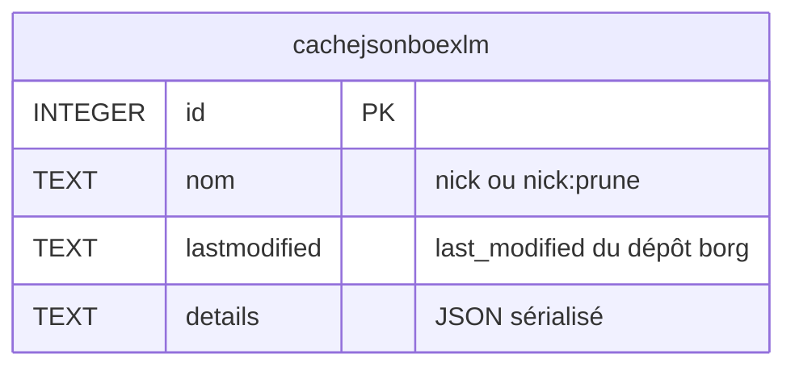
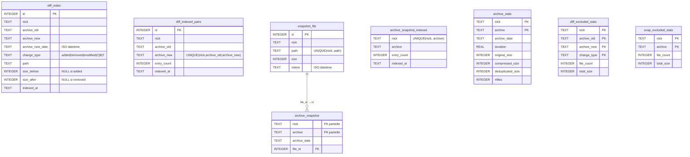

# borgHelper — Fonctionnement technique

Ce document décrit l'architecture interne de borgHelper : fichiers de données, schémas SQLite, indexes, et comportements internes.

→ Usage CLI : [README.md](README.md)  
→ Usage librairie : [LIBRARY.md](LIBRARY.md)

---

## Architecture

borgHelper est structuré en trois couches :

| Classe | Rôle |
|--------|------|
| `BorgHelperDB` | Toutes les opérations SQLite (cache.db + diff.db) |
| `BorgRunner` | Subprocess borg + lecture/écriture borghelperrc |
| `BorgHelper` | Services haut niveau — orchestre DB et Borg |

---

## Fichiers de données

| Fichier | Contenu |
|---------|---------|
| `~/.borghelperrc` | Configuration des dépôts (INI) |
| `~/.cache/borghelper/<conf>-<nick>-cache.db` | Cache des appels `borg info/list` (SQLite) |
| `~/.cache/borghelper/<conf>-<nick>-diff.db` | Index des diffs, snapshots et stats d'archives (SQLite) |
| `~/.cache/borghelper/<conf>-<repo_sanitisé>-priority.lock` | Lock PID posé par `Bkp`/`Restore` — signal d'interruption pour `Index` sur le même dépôt |
| `~/.cache/borghelper/<conf>-<repo_sanitisé>-index-running.lock` | Lock PID posé par `Index` pendant Phase 2 — `Bkp`/`Restore` attendent sa disparition avant `borg create`/`borg extract` |

- `<conf>` = basename sanitisé du fichier de configuration (ex : `borghelperrc` pour `~/.borghelperrc`)
- `<nick>` = identifiant du dépôt (ou valeur de `DB_NAME` si définie dans la section) — un fichier par dépôt
- Répertoire configurable via `CACHE_DIR` dans la section `[DEFAULT]` du borghelperrc

---

## Base de données `cache.db`

Cache des résultats `borg info` et `borg prune --dry-run`, invalidé automatiquement par `last_modified` du dépôt.

- Purge automatique après `DelBkp` et `Prune`
- Nettoyage manuel : `CacheClean`
- Un seul appel `borg info` par commande grâce au cache partagé (`last_modified`)



Contrainte : `UNIQUE(nom, lastmodified)`.

**Entrées :**
- `nom = nick` → résultat de `borg info --json --glob-archives`
- `nom = nick:prune` → liste des archives à pruner (dry-run)

---

## Base de données `diff.db`

Index des diffs inter-archives, snapshots du dernier état, métadonnées de taille et statistiques des fichiers exclus par les filtres d'indexation.

### Comportement WAL et auto-vacuum

- `PRAGMA journal_mode=WAL` : lectures non-bloquantes pendant les écritures (important pour les diff parallèles)
- `PRAGMA auto_vacuum=INCREMENTAL` : recupération progressive des pages supprimées
- `VACUUM` explicite après `Prune` pour récupérer l'espace immédiatement

### Tables

#### `diff_index`
Stocke chaque événement de fichier entre deux archives consécutives.

- Peuplée par `Index` (via `borg diff`) et par `Bkp` (via `--list`)
- `change_type` : `added`, `removed`, `modified`, `C` (permissions/proprio), `B` (lien cassé), `T` (type changé)
- `size_before` / `size_after` : `NULL` selon le type de changement

#### `diff_indexed_pairs`
Sentinelle d'idempotence pour les diffs — une ligne par paire (archive_old, archive_new) indexée.  
Empêche de ré-indexer une paire déjà traitée. Purge des lignes orphelines par `Prune`.

#### `snapshot_file`
Dictionnaire global des chemins de fichiers avec leur taille et mtime.  
Contrainte `UNIQUE(nick, path)` — le même chemin n'est stocké qu'une seule fois par nick (déduplication).

#### `archive_snapshot`
Table mince : associe une archive à ses fichiers via `file_id → snapshot_file.id`.  
Réduit la duplication des chaînes de chemin quand le même fichier apparaît dans plusieurs archives consécutives.

#### `archive_snapshot_indexed`
Sentinelle d'idempotence pour les snapshots — une ligne par archive dont le snapshot est complet.

#### `archive_stats`
Métadonnées de taille par archive (original, compressé, dédupliqué, nfiles, durée).  
Peuplée par `Bkp` (depuis le JSON borg) et par `Index` (via `borg info --json`).  
Utilisée par `Report -o` pour produire un rapport complet sans aucun appel borg.

#### `diff_excluded_stats`
Agrégat des fichiers filtrés par `IDX_INCLUDE`/`IDX_EXCLUDE` lors de l'indexation des diffs.  
Une ligne par (nick, archive_old, archive_new, change_type) : `file_count` + `total_size`.  
Peuplée par `Index` et `Bkp` (taille non disponible pour `Bkp` car `--list` ne retourne pas les tailles).  
Permet de savoir combien de fichiers ont été intentionnellement exclus de l'index et quelle taille ils représentent.

#### `snap_excluded_stats`
Agrégat des fichiers filtrés lors de l'indexation du snapshot de la dernière archive.  
Une ligne par (nick, archive) : `file_count` + `total_size`.  
Peuplée par `IndexSnap` (`-S`) et en fin d'`Index` normal.

### Vue `archive_snapshot_v`

```sql
CREATE VIEW archive_snapshot_v AS
    SELECT s.nick, s.archive, s.archive_date, sf.path, sf.size, sf.mtime
    FROM archive_snapshot s
    JOIN snapshot_file sf ON sf.id = s.file_id;
```

Utilisée par `Search`, `FileHist`, `DuIdx`, `Restore` — expose la jointure de façon transparente.

### Schéma complet



### Indexes

| Table | Index | Colonnes | Requête cible |
|-------|-------|----------|---------------|
| `diff_index` | `idx_diff_nick_path` | `(nick, path)` | Search, FileHist |
| `diff_index` | `idx_diff_nick_archive` | `(nick, archive_new)` | DiffBkp, Report |
| `diff_index` | `idx_diff_nick_newtype` | `(nick, archive_new, change_type)` | stats Report |
| `diff_index` | `idx_diff_nick_date` | `(nick, archive_new_date)` | filtres plage `-b`/`-B` |
| `diff_indexed_pairs` | `idx_pairs_nick` | `(nick)` | suppressions Prune |
| `snapshot_file` | `idx_snapfile_nick_path` | `(nick, path)` | insertion / lookup |
| `archive_snapshot` | `idx_snap_nick_archive` | `(nick, archive)` | suppressions Prune |
| `archive_stats` | `idx_astats_nick` | `(nick)` | Report -o, suppressions Prune |
| `diff_excluded_stats` | `idx_exclu_nick_arch` | `(nick, archive_new)` | consultation stats exclus |

---

## Flux d'indexation

### `Bkp` (indexation automatique)

```
set_priority_lock(nick)                                  → <nick>-priority.lock (PID)
    ↓
borg create --list --filter AMCBTd
    ↓
stderr parsé → _bkp_parse_list() → entrées de type added/modified/removed/C/B/T
    ↓
filtre IDX_INCLUDE/IDX_EXCLUDE par fichier (en RAM)
    ├── inclus  → store_diff_entries()       → diff_index + diff_indexed_pairs
    └── exclus  → store_excluded_diff_stats() → diff_excluded_stats (count seul, taille = 0)
store_archive_stats(nick, archive_new, ...)              → archive_stats
indexsnap(nick)                                          → snapshot_file + archive_snapshot
                                                            + snap_excluded_stats
    ↓
finally: clear_priority_lock(nick)                       → supprime le lock
```

### `Index` (indexation manuelle, parallèle)

```
borg list --json
    ↓
Phase 1 : déterminer les paires manquantes (diff_indexed_pairs)
          si force : purge diff_index + diff_indexed_pairs + diff_excluded_stats
    ↓
Phase 2 : ThreadPoolExecutor(IDX_WORKERS) → borg diff par paire en parallèle
          pour chaque ligne : filtre IDX_INCLUDE/IDX_EXCLUDE
          compteurs exclus accumulés en RAM jusqu'à fin du diff
    ↓
Phase 3 : insert groupé (connexion SQLite unique)
          → diff_index + diff_indexed_pairs
          → diff_excluded_stats (count + total_size par change_type)
    ↓
DIFF_KEEP : purge des paires au-delà de la limite
    ↓
borg info --json (seulement si archive_stats manquantes) → archive_stats
    ↓
indexsnap() → snapshot_file + archive_snapshot + snap_excluded_stats
```

---

## Gestion de la taille de `diff.db`

Pour les dépôts à fort volume (plusieurs GB de diff.db) :

| Levier | Paramètre | Effet |
|--------|-----------|-------|
| Purge automatique | `DIFF_KEEP = N` | Supprime les paires au-delà des N dernières après chaque Index |
| Filtre chemins | `IDX_INCLUDE` / `IDX_EXCLUDE` | Réduit le nombre d'entrées indexées ; stats des exclus dans `diff_excluded_stats` / `snap_excluded_stats` |
| Vacuum post-prune | automatique | Récupère l'espace après suppression d'archives |
| Auto-vacuum | `PRAGMA auto_vacuum=INCREMENTAL` | Récupération progressive en continu |

---

## Filtres d'indexation : IDX_INCLUDE / IDX_EXCLUDE

### Syntaxe multi-valeurs

Plusieurs patterns sur une ligne séparés par espaces, ou multiligne avec indentation (syntaxe INI standard — continuation par leading whitespace) :

```ini
# Ligne unique
IDX_EXCLUDE = /tmp /proc /sys *.pyc *.o

# Multiligne (indentation obligatoire pour la continuation)
IDX_EXCLUDE = /tmp /proc /sys
    /var/lib/docker
    /home/*/.cache/*
    *.pyc *.o *.log *.bak
```

### Types de patterns

| Syntaxe | Exemple | Mécanisme |
|---------|---------|-----------|
| Préfixe plain | `/home/`, `/etc` | `path.startswith(pattern)` — tout chemin commençant par ce préfixe |
| Pattern glob | `*.bak`, `/home/*/.bash_history` | `fnmatch(path, pattern)` — `*` matche toute séquence **y compris** `/` |

Distinction automatique : présence de `*`, `?` ou `[` → fnmatch ; sinon startswith.

> `fnmatch` traite `*` comme "n'importe quelle séquence **incluant** `/`". `/home/*/.bash_history` matche `/home/user/.bash_history` ET `/home/user/subdir/.bash_history`.
>
> Ce comportement permet les patterns **depth-independent** : `*/.git/*` matche `/projet/.git/HEAD` ET `/srv/app/sous/repo/.git/objects/ab/cd` — quelle que soit la profondeur dans l'arborescence.

### Logique de filtrage

```
Un chemin est indexé si :
    (IDX_INCLUDE absent  OU  chemin matche au moins un INCLUDE)
 ET (IDX_EXCLUDE absent  OU  chemin ne matche aucun EXCLUDE)
```

Les deux clés sont cumulatives — INCLUDE whitelist d'abord, EXCLUDE blacklist ensuite.

### Exemples complets

```ini
# Indexer seulement /etc et /home, sauf les caches et fichiers temporaires
IDX_INCLUDE = /etc /home /root
IDX_EXCLUDE = /home/*/.cache /home/*/.local/share/Trash
    *.pyc *.o *.log *.bak *.tmp *.swp

# Dépôt système : tout sauf les arbo volatiles
IDX_EXCLUDE = /proc /sys /dev /run /tmp
    /var/lib/docker /var/lib/lxc
    /var/log /var/cache
    *.pyc *.o

# Patterns depth-independent : exclure les .git/ à n'importe quelle profondeur
# */.git/*  → tous les fichiers dans n'importe quel .git/
# */.git    → le répertoire .git lui-même s'il apparaît comme entrée
IDX_EXCLUDE = */.git/* */.git
    */__pycache__/* */.tox/*
    */node_modules/*
```

---

## Priorité Bkp/Restore sur Index

`Bkp` et `Restore` sont prioritaires sur `Index` — si une indexation tourne en parallèle sur le même dépôt, elle s'interrompt proprement.

### Mécanisme — lock PID

Le lock est keyed sur `BORG_REPO` (sanitisé), pas sur le nick. Tous les nicks pointant le même dépôt borg partagent donc le même fichier de lock — `Bkp` sur `nick-A` interrompt `Index` sur `nick-B` si `BORG_REPO` identique.

```
Bkp / Restore démarre
    ↓
set_priority_lock(nick)    → <repo>-priority.lock (PID)  ← signal à Index de s'arrêter
    ↓
wait_index_idle(nick)      → poll 1s jusqu'à 120s
    ├── <repo>-index-running.lock absent / PID mort → continue
    └── PID vivant → attente... (Index en cours de terminer ses diffs actifs)
    ↓
opération borg (create / extract)   ← plus de conflit de verrou borg
    ↓
finally: clear_priority_lock(nick)  → supprime priority.lock
```

```
Index Phase 2
    ↓
set_index_running_lock(nick)  → <repo>-index-running.lock (PID)
    ↓
ThreadPoolExecutor — borg diff en parallèle (Popen direct, running_procs dict)
    thread moniteur daemon (_priority_monitor) — poll 0.5 s
    ├── priority lock absent  → continue à surveiller
    └── priority lock détecté → interrupted_event.set()
                                 cancel() futures en attente
                                 ps.kill() (SIGKILL) sur chaque Popen actif
                                 poll running_procs jusqu'à vide (zombies reapés, PIDs disparus)
                                 borg break-lock <BORG_REPO> → supprime les stale lock files
                                 retour en ≤ 0.5 s quelle que soit la charge
    as_completed() collecte les résultats (CancelledError ignoré)
    ↓
finally: interrupted_event.set() → arrête le moniteur
         monitor.join(timeout=2)
         clear_index_running_lock(nick)  → <repo>-index-running.lock supprimé
         ← Bkp/Restore débloqué ici (wait_index_idle retourne)
    ↓
Phase 3 : commit des résultats (paires annulées/terminées non commitées → reprises au prochain Index)
```

### Reprise transparente

`Index` est incrémental : `diff_indexed_pairs` garde la sentinelle de chaque paire indexée. Après interruption, relancer `Index` saute les paires déjà traitées et reprend les suivantes.

---

## Gestion du volume de `diff_index`

### Diagnostic : `IdxTop`

`IdxTop` parcourt `diff_index` en streaming (batch 50 000 lignes) et regroupe les entrées par préfixe de répertoire en Python. Aucun `GROUP BY` en SQL — la profondeur configurable (-p) permet de voir à n'importe quel niveau d'arborescence.

```
IdxTop -n nick [-N top] [-p profondeur]
    ↓
stream diff_index WHERE nick=?  (fetchmany 50000)
    ↓
get_prefix(path, depth)
    chemin absolu   : '/var/lib/docker/overlay2/abc/diff/usr/...' → depth=3 → '/var/lib/docker'
    chemin relatif  : 'home/_Dockers/example/data/file.gz'        → depth=3 → 'home/_Dockers/example'
    chemin court    : '/etc/nginx/nginx.conf'                      → depth=3 → '/etc/nginx/nginx.conf' (inchangé)
    ↓
defaultdict accumule count + sum(size) par préfixe
    ↓
top N par count (nombre d'entrées, pas le poids) → prettytable
```


### Diagnostic par diff : `DiffTop`

`DiffTop` est comme `IdxTop` mais ciblé sur une seule paire d'archives plutôt que l'ensemble du `diff_index`. Utile pour savoir quelle arborescence a provoqué le plus de changements lors d'un backup précis.

```
DiffTop -n nick [-N top] [-p profondeur] [-b archive-old,archive-new]
    ↓
sans -b : dernière paire de diff_indexed_pairs (ORDER BY indexed_at DESC)
    ↓
stream diff_index WHERE nick=? AND archive_old=? AND archive_new=?  (fetchmany 50000)
    ↓
get_prefix(path, depth)  — même logique que IdxTop
    ↓
defaultdict accumule par préfixe :
    added_n / added_s (size_after)
    removed_n / removed_s (size_before)
    modified_n
    total = added_n + removed_n + modified_n
    ↓
top N par total → prettytable (colonnes : total, +nb, +taille, -nb, -taille, =nb, taille)
```

### Nettoyage rétroactif : `IdxPurge`

Supprime en masse les entrées `diff_index` correspondant à un préfixe ou un glob, puis recalcule `diff_indexed_pairs.entry_count` et compacte le fichier.

```
IdxPurge [-x <pattern>] -n nick [-D]
    ↓
sans -x : lit IDX_EXCLUDE/IDX_INCLUDE du borghelperrc → construit condition SQL
avec -x : pattern explicite (préfixe ou glob)
    ↓
COUNT + SUM sur diff_index (dry-run ou confirmation)
    si -D → affiche volume, s'arrête
    ↓
DELETE FROM diff_index WHERE nick=? AND (path=? OR path LIKE ?/%)   # préfixe
DELETE FROM diff_index WHERE nick=? AND path GLOB ?                  # glob
    ↓
UPDATE diff_indexed_pairs SET entry_count = (SELECT COUNT(*) ...)    # recalcul
    ↓
VACUUM INTO 'diff.db.vacuum_tmp'  (même répertoire → évite /tmp saturé)
os.replace('diff.db.vacuum_tmp', 'diff.db')
    └── si échec : entrées supprimées, message avec commande manuelle
```

**Pourquoi `VACUUM INTO` et pas `VACUUM` ?** `VACUUM` écrit son fichier temporaire dans `/tmp`, qui peut être sur une partition séparée et pleine même si le filesystem du `diff.db` a de l'espace. `VACUUM INTO chemin` crée la copie compacte dans le même répertoire, utilisant l'espace libre du bon filesystem.

**Préfixe vs glob :**
- Préfixe (pas de `*?[`) : `path = ? OR path LIKE préfixe/%` — correspondance exacte de répertoire, sans faux positifs
- Glob (`*?[` présents) : SQLite `GLOB` — `*` matche tout y compris `/`

**Modes de `IdxPurge` :**

| Invocation | Comportement |
|------------|--------------|
| `IdxPurge -x <pattern>` | Purge un pattern explicite (préfixe ou glob) |
| `IdxPurge` (sans `-x`) | Lit `IDX_EXCLUDE`/`IDX_INCLUDE` du borghelperrc, construit la condition SQL dynamiquement, purge tout ce qui serait exclu par les filtres actuels |

Sans `-x`, la condition SQL est construite à partir de tous les patterns de la config :
```
IDX_EXCLUDE seul  → DELETE WHERE nick=? AND (p1 OR p2 OR ...)
IDX_INCLUDE seul  → DELETE WHERE nick=? AND NOT (p1 OR p2 OR ...)
Les deux          → DELETE WHERE nick=? AND (NOT (includes) OR (excludes))
```

**Workflow recommandé :**
```
IdxTop → identifier → modifier IDX_EXCLUDE dans borghelperrc → IdxPurge (sans -x)
```
`IDX_EXCLUDE` empêche les futures indexations d'ingérer ces chemins ; `IdxPurge` purge l'historique déjà en base.

---

## SQLite verrouillé pendant l'indexation

Si `Index` ou `Bkp` tente d'écrire dans `diff.db` alors qu'un autre processus (backup ou restauration sur le même dépôt) tient un verrou SQLite, l'opération attend automatiquement au lieu d'échouer.

```
store_diff_entries / store_archive_stats / store_archive_snapshot
_diff_keep_purge / store_excluded_diff_stats / store_excluded_snap_stats
    ↓
_with_lock_retry(fn, max_wait=300)
    ├── fn() réussit → retour immédiat
    └── OperationalError "database is locked"
            → message "SQLite verrouillé — attente déverrouillage (max 300s)..."  (une seule fois)
            → sleep 2 s → retry fn()
            → ... jusqu'à max_wait secondes
            └── si toujours bloqué après 300 s → re-raise → erreur normale
```

- Chaque tentative ouvre et ferme sa propre connexion (`try/finally conn.close()`) — aucune fuite de connexion entre deux essais
- La valeur `max_wait=300` couvre les backups longs sans attendre indéfiniment

## Report sur dépôt occupé

Si `Report` est lancé pendant un `Bkp`, `Restore` ou `Index`, borgHelper détecte le lock actif et bascule automatiquement en mode base uniquement pour ce nick.

```
Report démarre pour nick N
    ↓
check_priority_lock(N) || check_index_running(N)
    ├── False → prep_report() normal (appels borg)
    └── True  → message "dépôt occupé — rapport depuis la base uniquement"
                 prep_report_from_db() :
                   archive_stats → tailles, durées, dates
                   diff_index    → statistiques +/-/=
                 champs borg-only (taille/unique_csize, récupérable, reste) → vides
```

Chaque nick est évalué indépendamment — un rapport multi-nick peut mixer des données online et offline.

---

## Migration de schéma

`ensure_diff_db()` détecte automatiquement l'ancien schéma de `archive_snapshot` (colonne `path` directe) et migre vers le schéma déduplication (`file_id → snapshot_file`) au premier lancement après mise à jour.

---

## Sentry

Intégration optionnelle pour remonter les erreurs.  
DSN lu dans l'ordre :

1. Variable d'environnement `BORGHELPERC_SENTRY_DSN`
2. Fichier pointé par `BORGHELPERC_SENTRY_FILE`
3. Fichier `/usr/local/etc/borghelper-sentry`
