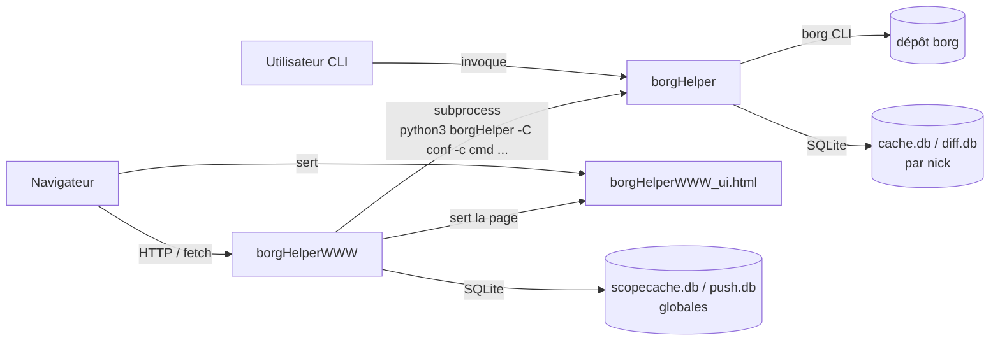

# Documentation technique — architecture, bases, API

Vue de référence structurée. Pour le détail mécanique fin (algorithmes de chiffrement, CAS,
migrations de schéma...), voir `TECHNICAL.md` (racine du dépôt) — ce document n'en duplique jamais le
contenu, il y renvoie. Pour l'installation, voir [DEPLOIEMENT.md](DEPLOIEMENT.md) ; pour l'usage
courant, [USAGE.md](USAGE.md).

## 1. Architecture — interaction des fichiers

Trois fichiers, trois rôles :

- **`borgHelper`** — CLI mono-fichier, stdlib-only. Toute la logique métier (backup, restauration,
  indexation, recherche, chiffrement des bases) vit ici. Manipule `borg` en sous-processus et les
  bases SQLite directement.
- **`borgHelperWWW`** — wrapper FastAPI. N'a **aucun accès direct** aux classes Python de
  `borgHelper` : chaque route HTTP lance `python3 borgHelper -C <conf> -c <commande> ...` en
  sous-processus et relaie stdout/stderr/code de sortie. Donc **aucun changement de comportement**
  entre CLI et HTTP — une commande se comporte identiquement des deux côtés. Gère en plus, lui-même
  (sans passer par `borgHelper`) : l'authentification (`X-API-Key`, RBAC par groupes), le cache de
  réponses filtrées par périmètre (`scopecache.db`), les abonnements et l'envoi des notifications push
  (`push.db`).
- **`borgHelperWWW_ui.html`** — SPA (JavaScript pur, un seul fichier), servie telle quelle par
  `borgHelperWWW` sur `GET /`. Consomme l'API HTTP côté client (pas de rendu serveur).

## 2. Les 4 bases SQLite

Chiffrement optionnel des **chemins et certaines valeurs** stockés (pas de l'archive borg
elle-même, déjà chiffrée côté dépôt) — réglage `DB_ENCRYPT`/`DB_KDF` par nick, commandes
`DbEncrypt`/`DbDecrypt`/`DbRekey`/`DbStatus`. Détail de la mécanique (AD-1 à AD-16) : voir
`TECHNICAL.md`, section chiffrement.

### `cache.db` — un fichier **par nick**

Fichier : `<CACHE_DIR>/<db_prefix>-<nick>-cache.db`. Cache des appels `borg info`/`borg list` coûteux
(évite un aller-retour réseau/dépôt à chaque commande). Aucun chemin de fichier stocké — jamais
concerné par le chiffrement.

| Table | Rôle |
|---|---|
| `db_meta` | version de schéma (clé/valeur) |
| `cachejsonboexlm` | résultat JSON d'un appel `borg` en cache, clé = (nom d'appel, `Last-Modified`) |

### `diff.db` — un fichier **par nick**

Fichier : `<CACHE_DIR>/<db_prefix>-<nick>-diff.db`. Le cœur de l'indexation : historique des diffs
entre archives, snapshot courant, statistiques. Alimente `Search`/`TreeFind`/`TreeHist`/`FileHist`/
`Status`/`Report`.

| Table | Rôle |
|---|---|
| `db_meta` | version de schéma |
| `diff_index` | chaque changement (ajouté/modifié/supprimé) détecté entre deux archives consécutives, par chemin |
| `diff_indexed_pairs` | quelles paires d'archives ont déjà été indexées (évite de refaire `borg diff`) |
| `snapshot_file` | référentiel dédupliqué des chemins connus (taille/mtime/type/mode/propriétaire) |
| `archive_snapshot` | association (nick, archive, fichier) — contenu complet d'une archive donnée, par référence à `snapshot_file` |
| `archive_snapshot_indexed` | quelles archives ont déjà un snapshot complet indexé |
| `archive_snapshot_v` | **vue** combinant `archive_snapshot`+`snapshot_file` — table logique consultée par `Search`/`TreeFind`/`TreeHist` |
| `archive_stats` | statistiques par archive (durée, tailles originale/compressée/dédupliquée, nb fichiers) — source de `Status`/`Report` |
| `bkp_status` | suivi d'un `Bkp` en cours/terminé (CAS pour les notifications push début/fin) — voir `TECHNICAL.md` pour le mécanisme de réclamation |
| `diff_excluded_stats` / `snap_excluded_stats` | volumétrie de ce qui a été exclu (`EXCLUDE`), par paire d'archives / par archive |
| `repo_stats` | historique du gain d'espace (`unique_csize`/`total_size`/`total_csize`), notamment après `Prune` — alimente les graphiques d'évolution |

### `scopecache.db` — un fichier **global** (borgHelperWWW uniquement)

Fichier : réglage `scope_cache_db`/`BORGHELPERWWW_SCOPE_CACHE_DB` (défaut co-localisé avec
`cache.db`/`diff.db`). Cache de réponses HTTP déjà filtrées par périmètre RBAC (`GROUPS_PATHS`) —
entièrement **reconstructible** (perte sans conséquence, juste un cache froid au redémarrage).

| Table | Rôle |
|---|---|
| `db_meta` | version de schéma |
| `scope_cache` | réponse JSON en cache, clé = empreinte de la requête + périmètre de l'appelant |

### `push.db` — un fichier **global** (borgHelperWWW uniquement, notifications push)

Fichier : réglage `push_db`/`BORGHELPERWWW_PUSH_DB`. **Non reconstructible** — porte les clés VAPID
(générées une seule fois, jamais régénérées automatiquement) et les abonnements push eux-mêmes. Une
perte de ce fichier invalide tous les abonnements navigateur existants : à sauvegarder comme une
vraie donnée, contrairement à `scopecache.db`.

| Table | Rôle |
|---|---|
| `db_meta` | version de schéma |
| `push_vapid_keys` | la paire de clés VAPID du serveur (une seule ligne, `id=1`) |
| `push_subscriptions` | un abonnement par endpoint navigateur : clés de chiffrement `p256dh`/`auth` (les anciennes colonnes de préférences ne sont plus lues depuis 1.19.0) |

### `<prefixe>-push-prefs.json` — préférences de notification (borgHelperWWW ≥ 1.19.0)

Fichier : réglage `push_prefs`/`BORGHELPERWWW_PUSH_PREFS`, défaut à côté de `push.db`. Un objet par
endpoint : nicks suivis (figés à l'abonnement), `notify_start`/`notify_end`, `expires_at` (`null` = à
vie). Réglé depuis la vue 🔔 Notifications de l'UI, **éditable à la main** (pris en compte à chaud).
Écritures atomiques sous verrou, mode `0600` ; un fichier corrompu n'est jamais écrasé (les routes
`/push/*` répondent 500 tant qu'il n'est pas corrigé). À sauvegarder avec `push.db`.

## 3. API HTTP (borgHelperWWW)

Toutes les commandes CLI sont exposées **sauf `Mount`/`UMount`** (accès FUSE local, sans objet en
HTTP). Préfixe par défaut `/api` (réglable, `/`, `/version`, `/healthz` et `/docs` toujours
accessibles sans préfixe).

### Auth

- **`X-API-Key`** (header) — obligatoire sur toute route protégée, comparaison à temps constant.
- **RBAC par groupes** (optionnel, `groups_header`) — un reverse proxy (OIDC/`auth_request`) injecte
  un header listant les groupes de l'appelant ; chaque nick porte `GROUPS_ADMIN`/`GROUPS_WRITE`/
  `GROUPS_READ` (niveaux hiérarchiques) et optionnellement un périmètre de chemin, orthogonal au
  niveau (jamais un tier de plus), **scindé lecture/restauration** (`spec-groups-paths-restore`) :
  `GROUPS_PATHS` pour la lecture (`Search`/`TreeFind`/`FileHist`/`TreeHist`/`Report`/`DiffBkp`/
  `DuIdx`/`IdxTop`/`DiffTop`), `GROUPS_PATHS_RESTORE` pour la restauration/téléchargement
  (`Restore`/`RestorePerms`/`DownloadFile`/`DownloadTar`) — un groupe sans entrée dans
  `GROUPS_PATHS_RESTORE` reprend son entrée `GROUPS_PATHS` (repli rétro-compatible). **Accès direct
  (≥ 1.20.0)** : un groupe sans aucun tier mais cité dans `GROUPS_PATHS` obtient la lecture de ses
  chemins (sans téléchargement) ; cité dans `GROUPS_PATHS_RESTORE`, lecture + téléchargement de ces
  chemins — jamais `POST /restore`/`Bkp`/`Prune`, qui exigent un tier. Exemple complet
  (un groupe borné à un seul répertoire, un groupe borné à plusieurs répertoires à la fois, deux
  groupes distincts partageant le même répertoire, un groupe avec lecture large et restauration
  restreinte) : [`docs/borghelperrc.example`](borghelperrc.example) et
  [DEPLOIEMENT.md §7](DEPLOIEMENT.md#7-rbac-par-groupes--restreindre-laccès-à-un-répertoire-ex-restaurations).
  Mécanique complète et avertissement de sécurité (le header est forgeable si le reverse proxy n'est
  pas la seule voie d'accès) : voir `TECHNICAL.md` et `README.md`, section RBAC.
- **Aucune permission UNIX de l'host sauvegardé n'intervient jamais dans ces décisions** — vérifié
  directement dans le code : `Search`/`TreeFind`/`FileHist`/`TreeHist` lisent exclusivement l'index
  SQLite (`archive_snapshot_v`/`diff_index`, alimenté une fois pour toutes par `Index`, jamais un
  accès live à l'host) ; `Restore`/`RestorePerms` (`-L`) appellent `borg list`/`borg extract` contre
  l'**archive** (métadonnées `mode`/`user`/`group` figées au moment du `Bkp`, immuables), jamais un
  `os.stat`/`os.access` sur l'host distant ou sur le serveur `borgHelperWWW`. Être dans le périmètre
  RBAC (`GROUPS_PATHS`/`GROUPS_PATHS_RESTORE`) suffit strictement — aucun droit supplémentaire requis
  sur quelque machine que ce soit pour voir ou restaurer ce qui est dans son périmètre.
- `groups_header` (et les autres réglages `borgHelperWWW`) se configurent par CLI, variable
  d'environnement, `borghelperwww.conf` (`--conf`), ou — depuis 1.18.4 — une section
  `[_borgHelperWWW]` du `.borghelperrc` lui-même (déploiement à fichier unique, voir
  [DEPLOIEMENT.md §5](DEPLOIEMENT.md#5-configurer-et-lancer-borghelperwww-optionnel)). Une clé
  `BORGHELPERWWW_*` posée nue dans `[DEFAULT]` (au lieu de cette section dédiée) est silencieusement
  ignorée — `borgHelperWWW` avertit (`[WARN]`) au démarrage si ça arrive.

### Routes principales

| Méthode | Route | Rôle | Notes |
|---|---|---|---|
| GET | `/` | Sert la SPA (`borgHelperWWW_ui.html`) | Non protégé |
| GET | `/version` | Versions + postures de sécurité au démarrage | Non protégé |
| GET | `/healthz` | Liveness (process répond, rien de plus) | Non protégé |
| GET | `/access` | Niveau d'accès + périmètre de l'appelant, par nick | |
| GET | `/stats` | Équivalent `Stats` | |
| POST | `/login` | Écrit la passphrase fournie en clair dans le `.borghelperrc` | admin — provisioning uniquement |
| GET | `/lstbkp` | Liste les archives disponibles | |
| GET | `/lstbkpfls` | Liste les fichiers d'une archive | |
| GET | `/report` | Rapport tailles/fraîcheur/mouvements | |
| GET | `/diffbkp` | Mouvements entre une archive et la dernière | |
| GET | `/restore/perms` | Droits d'un fichier, sans restaurer | |
| POST | `/restore` | Restaure sur le disque du serveur | mutation |
| DELETE | `/delbkp` | Supprime une archive — irréversible | mutation, ⚡ destructif |
| POST | `/init` | Initialise un dépôt borg | mutation |
| POST | `/bkp` | Lance un backup | mutation, asynchrone (voir `TECHNICAL.md`) |
| GET | `/key` | Exporte la clé du dépôt (format papier) | |
| POST | `/prune` | Purge selon `KEEP_*` — irréversible | mutation, ⚡ destructif, requiert `--allow-destructive` |
| POST | `/index` | Indexe les diffs | mutation |
| GET | `/search` | Recherche par motif de chemin | |
| GET | `/filehist` | Historique d'un chemin exact | |
| GET | `/treehist` | Contenu direct d'un préfixe | |
| GET | `/treefind` | Recherche récursive par nom (insensible à la casse) | |
| GET | `/duidx` | Usage disque par sous-arbre | |
| GET | `/cacheinfo` | État du cache | |
| GET | `/repohistory` / `/archivehistory` | Historique brut pour les graphiques | |
| POST | `/cacheclean` | Vide le cache | mutation |
| GET | `/idxtop` / `/difftop` | Tops par volumétrie | |
| POST | `/idxpurge` | Purge rétroactive de `diff_index` | mutation, ⚡ destructif |
| GET | `/download/file` / `/download/tar` | Téléchargement en vue d'une restauration | requiert `allow_downloads` |
| POST/PATCH/GET/DELETE | `/push/subscribe`, `/push/subscriptions` | Gestion des abonnements push | voir `push.db` et fichier JSON ci-dessus |
| POST | `/push/test` | Envoie une notification de test à un abonnement | |
| GET | `/sw.js` | Service Worker des notifications | Non protégé (contrainte navigateur) |

Format de réponse : la plupart des routes GET/POST retournent un `CommandResult` (JSON structuré,
même schéma qu'une commande CLI `-j`) — la commande sous-jacente exacte et son mapping vers l'option
CLI sont dans `README.md`, section HTTP API (tableau route ↔ commande CLI ↔ payload).

Il n'existe **pas** de route `/status` — `Status` (voir [USAGE.md](USAGE.md)) est une commande CLI
100% locale, conçue pour rester rapide sans dépendre du réseau ; l'exposer en HTTP n'a pas été fait
(voir [SUGGESTIONS.md](SUGGESTIONS.md)).

## Voir aussi

- `TECHNICAL.md` (racine) — mécanique détaillée : algorithmes de chiffrement (AD-1..16), CAS
  `bkp_status`, migrations de schéma, cache de réponses par périmètre, watcher push.
- `README.md` (racine) — référence exhaustive commande par commande (CLI et HTTP).
