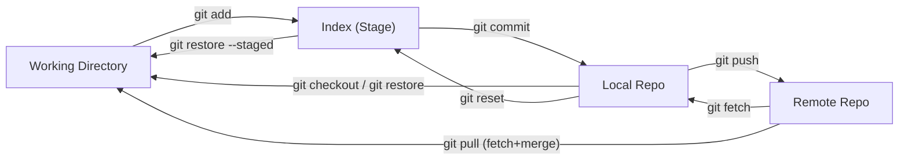

# Git — Cheat Sheet

## Flux Git




## Remotes

```bash
git remote add <nom> <url>          # ajouter un remote
git remote remove <nom>             # supprimer un remote (nettoie aussi les refs)
git remote -v                       # lister les remotes
```

## Fetch / Push

```bash
git fetch <remote>                  # récupérer sans merger
git push <remote> <branche>         # push vers un remote
git push <remote> <branche> --force # force push (écrase l'historique remote)
```

## Upstream — ne plus préciser la cible à chaque push

```bash
git branch --set-upstream-to=<remote>/<branche> <branche>
# ex : git branch --set-upstream-to=AdlpGiteaMisc/main main
# ensuite : git push   suffit
```

## Historiques sans ancêtre commun

Si deux dépôts ont des historiques distincts (remote initialisé séparément) :

```bash
# Option A — local gagne (destructif pour le remote)
git push <remote> <branche> --force

# Option B — conserver les deux histoires
git merge <remote>/<branche> --allow-unrelated-histories
git push <remote> <branche>
```

## Tmux — sélection souris vers clipboard X11

Maintenir **Shift** pendant la sélection souris.  
Tmux laisse passer les events au terminal, la sélection va dans le clipboard X11 (pas dans le buffer tmux).
